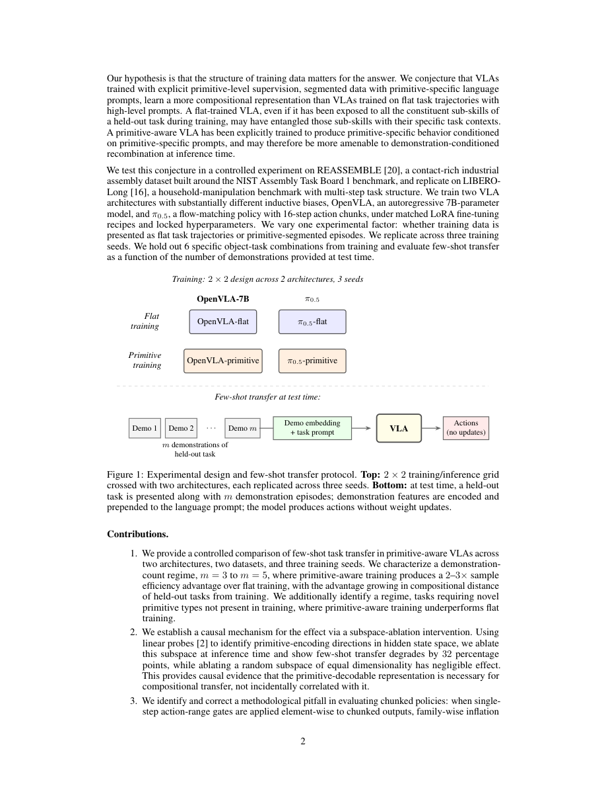
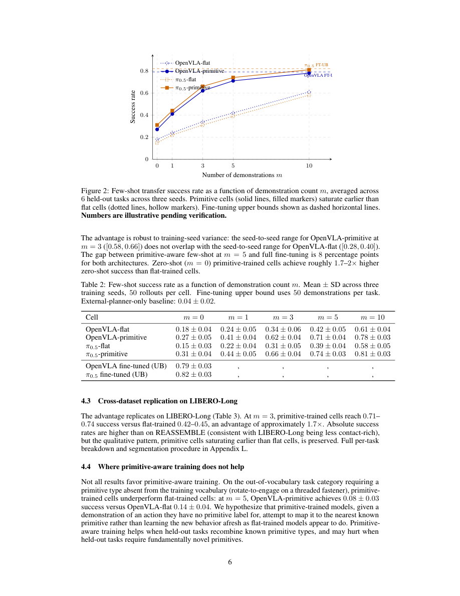

# Primitive Subspaces Mediate Few-Shot Transfer in VLAs

#

# 基本信息

- arXiv: 2605.30695
- Authors: Anya Singh, Cabrel Happi, Jai Relan, Varun Nair, Vidyut Baradwaj
- Categories: cs.RO
- 一句话结论：Primitive-aware 训练通过诱导隐藏状态中的 primitive 可解码子空间，使 VLA 在测试时仅凭少量示范即可实现无需权重更新的任务迁移，样本效率较 flat 训练提升约 2–3 倍。

#

# 研究问题

当前视觉-语言-动作（VLA）策略在工业部署中面临高昂的新任务适配成本：每遇到一个新任务，通常需要收集数十条示范并执行完整的微调周期。本文针对这一痛点，探究一个核心问题——**是否仅通过改变训练数据的结构化标注，就能让 VLA 在推理时像“组合工具箱”一样，根据少量新任务示范重组已学子技能，而无需任何权重更新？** 这一问题直接关联到具身智能（Embodied AI）中的组合泛化（compositional generalization）与上下文学习（in-context learning），也与 World Model 学习可复用、可解释的隐变量表征密切相关。

#

# 任务与挑战

本文在 REASSEMBLE（接触式工业装配）和 LIBERO-Long（家庭操作）两个基准上展开对照实验。具体设定如下：

- **输入**：当前视觉观测、高级语言任务描述，以及 $m \in \{0,1,3,5,10\}$ 条留出任务（held-out task）的示范片段。
- **输出**：动作序列。测试时模型**不更新任何权重**，仅将示范嵌入拼接至语言提示前缀作为条件。
- **训练**：采用完全一致的 LoRA 微调配方（rank $32$, $\alpha=64$, learning rate $5\times 10^{-5}$, $30$k steps, batch size $32$），仅改变一个实验因素——数据视角是 flat 轨迹还是 primitive 分段。

已有方法的主要不足在于：flat-trained VLA 即使训练时接触过所有子技能，也容易将子技能与特定任务上下文纠缠（entanglement），导致测试时无法灵活重组；而显式层次化方法（如 RT-H、HYDRA）则需在架构或规划器中引入复杂归纳偏置。此外，分块动作策略（chunked policy）的评估存在方法学陷阱，传统单步动作门会导致假失败率数量级膨胀。

#

# 核心 Insight

本文的核心假设是：**训练数据的结构本身即是一种强归纳偏置。** 将长程轨迹按原始动作（primitive）切分，并配以 primitive-specific 语言提示（如 “pick the round peg” 而非 “pick and insert the round peg”），相当于在训练阶段为模型提供了显式的“路由信号”。这种监督会促使 VLA 在隐藏状态中学习到一个低维、线性可解码的 primitive 子空间（primitive-decodable subspace）。在推理时，少量新任务示范即可激活该子空间中的对应方向，驱动模型重组已知子技能以完成全新任务组合。

这一机制的关键在于**无需修改模型架构或引入外部规划器**。无论是自回归的 OpenVLA-7B 还是流匹配的 $\pi_{0.5}$，只要接受 primitive-aware 数据训练，就能在隐藏状态中层 16–24 附近涌现出清晰的 primitive 表征结构。这暗示了 VLA 的组合能力可以通过纯粹的数据视角工程（data-centric perspective engineering）诱导产生。



#

# 方法与公式

#

## 实验设计

训练阶段采用 $2\times 2$ 网格：
- **架构**：OpenVLA-7B（自回归，离散动作 token）与 $\pi_{0.5}$（流匹配，原生 16 步动作块）。
- **数据视角**：Flat（完整任务轨迹 + 高级语言提示） vs. Primitive（按 primitive 切分片段 + primitive-specific 提示）。

两种视角源自同一批 REASSEMBLE 原始演示，确保数据量受控。留出任务通过移除特定的 (object, primitive) 对构造，覆盖 1–3 个 held-out pair 的组合距离。

#

## 推理流程

测试时，对每条示范采样 4 个均匀关键帧，提取视觉编码器特征并做 mean-pooling；将 $m$ 条示范的嵌入向量拼接后前置到语言提示中。模型据此直接输出动作，不做梯度更新。

#

## 关键公式

**1. 修正的 chunked-policy 评估门（Element-level Gate）**

传统方法将单步 $3\sigma$ 动作范围门逐元素应用于分块输出时，会因 family-wise inflation 产生结构性假失败。本文提出元素级校准门：

```math
v_{\mathrm{model}}
=
\frac{1}{NDK}
\sum_{i,d,k}
\mathbb{1}\!\left[
\left| a^{(i)}_{d,k} - \mu_d \right| > 3\sigma_d
\right]
\tag{1}
```

其中 $N$ 为测试块数，$D$ 为动作维度，$K$ 为每块步长（chunk size），$a^{(i)}_{d,k}$ 为第 $i$ 个块在第 $d$ 维第 $k$ 步的动作值，$\mu_d$ 与 $\sigma_d$ 为训练集第 $d$ 维的均值与标准差。模型通过的条件为 $|v_{\mathrm{model}} - v_{\mathrm{ref}}| \le \tau$（取 $\tau=0.01$），$v_{\mathrm{ref}}$ 为在留出参考批次上计算的同等统计量。该修正使单步策略与分块策略处于平等评估 footing。

**2. 子空间消融干预（Subspace Ablation）**

为验证 primitive 表征的因果必要性，本文先用线性探针在 layer 24 的隐藏状态上训练 4 类 primitive 分类器，得到权重矩阵 $W \in \mathbb{R}^{4 \times d}$，其行向量张成 primitive 子空间。推理时通过正交投影将该分量移除：

```math
P = W^{\top} (W W^{\top})^{-1} W
\tag{2}
```

```math
P^{\perp} = I - P
\tag{3}
```

```math
h' = P^{\perp} h
\tag{4}
```

其中 $P$ 为到 primitive 子空间的正交投影矩阵，$P^{\perp}$ 为到正交补的投影矩阵，$h$ 为 layer 24 的原始隐藏状态，$h'$ 为消融后的隐藏状态。控制组则消融同等维度的随机子空间。

#

# 贡献拆解

**1. 受控的 primitive-aware 少样本迁移对比**
- **做了什么**：在 2 种架构、2 个数据集、3 个训练种子上，仅改变数据视角（flat vs primitive），系统量化少样本迁移的样本效率差距。
- **为什么有效**：primitive-specific 语言提示充当了“路由信号”，迫使模型将子技能表征与具体任务上下文解耦。
- **与已有方法的差别**：不同于 RT-H、HYDRA 等显式在架构中构建层次化规划的方法，本文证明仅通过训练数据的结构化标注即可诱导组合能力，无需修改模型结构或引入外部规划器。

**2. 因果机制验证：primitive 子空间的必要性**
- **做了什么**：利用线性探针定位隐藏状态中的 primitive 编码方向，并通过正交投影消融进行因果干预。
- **为什么有效**：消融 primitive 子空间使少样本成功率下降 32 个百分点，而消融随机子空间几乎无影响，证明该表征是因果必要（causally necessary）而非与迁移成功偶然相关。
- **与已有方法的差别**：将 LLM 可解释性中的子空间消融技术（Nullspace Projection / LEACE）首次系统应用于 VLA 策略的隐藏状态，为机器人策略的表征解释提供了因果证据。

**3. 修正 chunked policy 评估的方法学陷阱**
- **做了什么**：识别出“单步动作门逐元素应用于分块输出”导致的 family-wise inflation，并提出元素级校准门。
- **为什么有效**：对于 $\pi_{0.5}$ 的 16 步动作块，传统门会使完美模仿器也产生约 42% 的假失败率；修正后该比率降至与单步策略同一量级。
- **与已有方法的差别**：为后续 VLA 及 World Model 策略的公平评估提供了可靠基准，避免因评估方式不当而错误否定分块策略。

#

# 关键图表解读

**Figure 1（实验设计与少样本迁移协议）**


该图上半部分展示 $2\times 2$ 训练网格：两种架构（OpenVLA-7B 与 $\pi_{0.5}$）交叉两种训练条件（Flat 与 Primitive），并在 3 个种子上独立重复。下半部分展示测试时的少样本协议：留出任务的 $m$ 条示范经编码后拼接到语言提示前缀，VLA 直接输出动作且不做权重更新。读图时应注意，**实验仅改变一个因素（数据视角）**，其余如 LoRA 配方、超参数、示范编码方式全部锁定，从而确保观测到的差异可归因于 primitive-aware 训练本身。

**Figure 2 与 Table 2（少样本迁移主结果）**



该图展示 6 个留出任务在 3 个种子上的平均成功率随示范数 $m$ 的变化曲线。Primitive 细胞（实线、实心标记）显著早于 flat 细胞（虚线、空心标记）饱和：在 $m=3$ 时，primitive 训练已达 0.62–0.66 的成功率，而 flat 训练仅 0.31–0.34；primitive 在 $m=3$ 的表现甚至超过 flat 在 $m=10$ 的表现（0.61–0.58），等效节省约 7 条示范。两条水平虚线表示微调上限（FT-UB），显示 $m=5$ 的 primitive 少样本已逼近该上限（差距仅约 8 个百分点）。读图时需留意图中标注的 “Numbers are illustrative pending verification”，提示数值尚待最终验证；但种子间方差范围（如 OpenVLA-primitive 在 $m=3$ 时为 $[0.58, 0.66]$，OpenVLA-flat 为 $[0.28, 0.40]$）互不重叠，表明效应具有稳健性。

#

# 实验与消融

**数据集与设定**：主实验在 REASSEMBLE（17 物体、4 种 primitive、4,551 条演示）上进行；跨数据集复现在 LIBERO-Long 上完成，后者无原生 primitive 分段，作者通过子任务结构（move-to / grasp / transport / place）人工构造边界。

**基线**：包括 Zero-shot primitive sequencing（外部规划器分解，无示范）、Flat-trained few-shot（同协议应用于 flat 模型）、Octo-style demonstration-conditioned baseline（端到端示范条件训练，无 primitive 分段）、Diffusion Policy（非 VLA 基线），以及 Full fine-tuning upper bound（50 条示范 LoRA 微调）。

**主结果**：
- REASSEMBLE：$m=3$ 时 primitive 细胞成功率 0.62–0.66，flat 细胞仅 0.31–0.34，优势约 $2\times$；$m=5$ 时 primitive 达 0.71–0.74，距微调上限（0.79–0.82）仅 8 个百分点。
- LIBERO-Long：$m=3$ 时 primitive 0.71–0.74 vs flat 0.42–0.45，优势约 $1.7\times$，定性模式复现。

**消融与因果实验**：
- **子空间消融**（$m=3$）：OpenVLA-primitive 从 0.62 降至 0.30（$-32$ pp）；$\pi_{0.5}$-primitive 从 0.66 降至 0.34；随机子空间消融仅下降约 2 pp，与基线无显著差异。
- **探针分析**：primitive 训练模型在 layer 24 的 primitive identity macro-F1 达 0.79–0.81，flat 训练仅 0.48–0.52；跨物体同 primitive 的余弦相似度在 primitive 细胞中为 0.71，flat 细胞仅 0.43。
- **示范编码消融**：mean-pool 主实验（0.62）与 cross-attention 条件（0.65）接近，说明结果对编码方式不敏感。
- **组合距离分解**：primitive 优势随留出任务与训练分布的组合距离增加而扩大；flat 细胞在 3 个 held-out pair 的任务上成功率几乎归零，而 primitive 细胞仍保持 0.42–0.45。

**最强证据**：跨架构、跨数据集、多种子复现的 2–3 倍样本效率优势，以及子空间消融带来的 32 个百分点因果效应。

**最存疑证据**：Figure 2 与消融图均标注 “Numbers are illustrative pending verification”，最终数值尚未完全锁定；此外，所有实验仅在仿真中进行，未经过真实机器人验证，且失败归因分类器在部分留出数据上性能骤降（macro-F1 从 0.81 降至 0.42）。

#

# 局限性

1. **种子数量与统计效力**：仅 3 个训练种子，尽管效应稳健，但种子间标准差达 0.03–0.06，应视为效应量的不确定下限。
2. **仿真到现实的鸿沟**：全部实验在仿真中完成，未测试 sim-to-real 迁移；工业部署中的接触动力学与视觉域偏移可能削弱该优势。
3. **架构覆盖有限**：虽涵盖自回归与流匹配两种代表性架构，但更强的一般性声明需在更多 backbone（如扩散策略 VLA）上验证。
4. **留出任务的选择偏差**：留出任务由现有物体重新组合构成，未测试对全新物体的泛化；且当任务需要训练词汇表外的新型 primitive（如 rotate-to-engage）时，primitive-aware 训练反而劣于 flat 训练（$m=5$ 时 0.08 vs 0.14），表明 primitive 库的覆盖范围至关重要。
5. **规划器对称性**：$\pi_{0.5}$ 公开 API 不暴露文本生成，实验使用外部任务-to-primitive 查找表对称地服务于两种架构，这可能引入与真实端到端推理的差异。
6. **因果干预的边界**：子空间消融证明了 primitive 子空间在推理时的必要性，但并未证明 primitive 监督是训练阶段产生该子空间的唯一途径。
7. **评估标注可靠性**：失败归因分类器在 USB 留出数据上 macro-F1 仅 0.42，导致相关恢复时间分析被省略，限制了失败模式分析的完整性。

#

# 个人研究判断

面向 **“World Models assisting Embodied AI downstream tasks”** 的研究方向，**本文值得继续追踪**。

理由如下：
1. **因果表征的证据**：本文首次以因果干预方式证明 VLA 隐藏状态中存在专门介导组合迁移的 primitive 子空间。这为 World Model 学习可组合、可解释的隐变量（latent variables）提供了直接经验证据——若 World Model 能在潜空间中显式分离 primitive 方向，或许能进一步提升预测精度与规划效率。
2. **数据视角工程的启发**：相较于修改架构或引入复杂规划器，仅通过数据结构化标注即可诱导组合能力，这对工业落地极具吸引力。对于需要持续应对新产品变体和工艺步骤的场景，这意味着可能以 5 条示范替代 50 条示范加完整微调周期，显著改变部署成本结构。
3. **方法学修正的价值**：对 chunked policy 评估门的修正具有跨论文的方法学意义。后续任何涉及分块动作输出的 VLA 或 World Model 策略研究，都应采用类似的元素级校准，以避免结构性假失败。
4. **明确的前沿方向**：论文的局限性恰好指出了高价值后续工作——真实机器人验证、更大规模 primitive 词汇表的 scaling law、以及将子空间干预与 World Model 的潜空间规划（latent planning）相结合，探索是否能在预测模型中显式维护并更新 primitive 子空间以辅助下游任务迁移。
