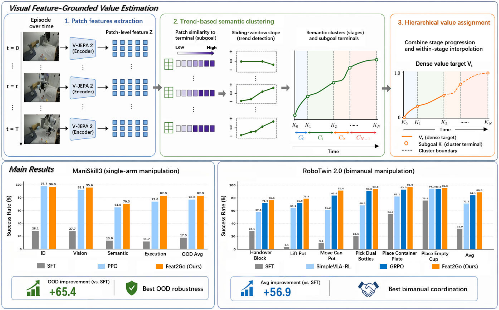
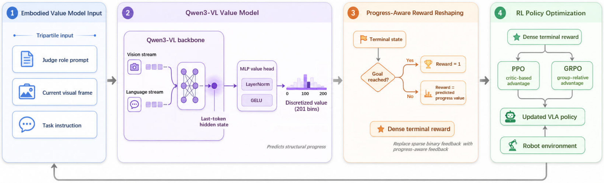
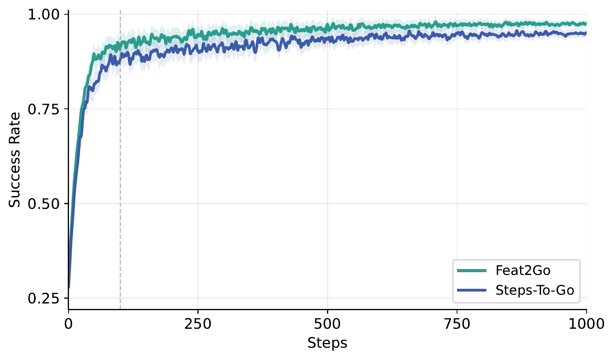

# Feat2Go: Visual Feature-Grounded Value Estimation for Embodied Reinforcement Learning

#

# 基本信息

- **arXiv:** 2605.30795
- **Authors:** Junyang Shu, Zhiwei Lin, Bingqing Wei, Yongtao Wang
- **Categories:** cs.RO
- **一句话结论:** 基于预训练视觉世界模型（V-JEPA 2）提取细粒度语义进度信号，通过 Qwen3-VL 价值模型重塑终端奖励，在不依赖手工奖励设计的前提下，显著提升 VLA 策略在单臂与双臂长程操作中的 OOD 泛化能力与训练稳定性。

#

# 研究问题

本文致力于解决视觉-语言-动作（VLA）模型在后训练阶段如何高效利用强化学习（RL）的核心瓶颈。当前 VLA 模型主要依赖大规模模仿学习，数据收集成本极高；而 RL 虽能通过环境交互降低对标注数据的依赖，却在长程机器人操作中面临稀疏奖励与信用分配（credit assignment）的双重困境。现有 VLA-RL 框架多依赖稀疏二元终端反馈或手工设计的启发式奖励，缺乏可扩展的中间监督信号，导致策略优化效率低下、泛化能力不足。本文的核心科学问题是：**能否将预训练视觉世界模型蕴含的结构化表征自动转化为细粒度、语义感知的进度监督信号，从而桥接视觉表征流形与下游 RL 策略优化？**

#

# 任务与挑战

**任务设定：** 在单臂（ManiSkill3，8-DoF WidowX-250S）与双臂（RoboTwin 2.0，Agilex Piper）仿真环境中，基于视觉观测和语言指令完成长程操作任务。输入为当前视觉帧与任务指令，输出为动作序列；训练分为两阶段：先利用成功轨迹预训练并微调一个具身价值模型，再将其集成至 PPO 或 GRPO 流程中对 VLA 策略进行 RL 微调。

**核心挑战：**
1. **奖励稀疏性：** 传统二元终端奖励（成功/失败）无法为长程轨迹提供中间梯度，导致信用分配困难。
2. **奖励设计不可扩展：** 针对不同任务手工设计密集代理奖励（proxy reward）在拓扑多样、物理复杂的真实场景中难以泛化。
3. **表征接口缺失：** 现有 VLA-RL 方法缺乏将预训练视觉表征显式转化为进度感知的 RL 监督信号的机制，导致价值估计过于粗糙（如仅依赖剩余步数）。

#

# 核心 Insight

Feat2Go 的核心思想是：**利用预训练视觉世界模型 V-JEPA 2 的 patch 级特征空间，自动发现 episode 中的语义子目标（subgoal），并据此构建层次化的密集价值目标，从而替代手工奖励工程。**

具体而言，作者观察到，同一 episode 内不同帧在特征空间中与子目标的相似度变化并非线性，而是呈现阶段性趋势突变。通过滑动窗口线性拟合检测这些突变点，可将完整 episode 划分为若干语义阶段（semantic clusters）。在此基础上，价值目标由“宏观阶段进度”与“微观帧间插值”双粒度组合而成，既保证了跨阶段的单调递增性，又提供了阶段内的细粒度连续监督。这一表征驱动的价值估计框架，将视觉世界模型的结构化先验显式注入 RL 优化流程。



#

# 方法与公式

#

## 1. Patch 特征提取与相似度度量

首先使用 V-JEPA 2 编码器将原始视频帧 $\mathcal{V} = \{v_0, \dots, v_{T-1}\}$ 映射为 patch 级特征序列 $\mathbf{Z}_t \in \mathbb{R}^{P \times D}$，其中 $P$ 为 patch 数量，$D$ 为特征维度。为了同时捕捉特征向量的方向与幅度差异，定义帧级复合相似度：

```math
S(\mathbf{Z}_t, \mathbf{Z}_{K}) = \frac{1}{P} \sum_{p=1}^{P} \left( \frac{\mathbf{z}_{t,p} \cdot \mathbf{z}_{K,p}}{\|\mathbf{z}_{t,p}\|_2 \|\mathbf{z}_{K,p}\|_2} \cdot \exp \left( -\beta \|\mathbf{z}_{t,p} - \mathbf{z}_{K,p}\|_1 \right) \right)
\tag{1}
```

其中 $\mathbf{z}_{t,p}, \mathbf{z}_{K,p} \in \mathbb{R}^D$ 分别表示时刻 $t$ 与终端帧 $K$ 的第 $p$ 个 patch 特征；$\beta > 0$ 为控制幅度差异敏感度的缩放超参数。该式将余弦相似度与指数衰减的 $\beta$-正则化曼哈顿距离相乘，确保在表征空间中既关注语义方向对齐，又惩罚过大的特征幅度偏差。

#

## 2. 趋势语义聚类（阶段划分）

为自动发现语义子目标，算法从终端帧反向迭代，通过滑动窗口线性回归检测相似度趋势的突变。对候选帧 $t$ 取窗口长度 $W$，计算局部相似度序列 $\{y_\tau = S(\mathbf{Z}_{t+\tau}, \mathbf{Z}_K)\}_{\tau=0}^{W-1}$ 的最优斜率：

```math
w = \frac{\sum_{\tau=0}^{W-1} (\tau - \bar{\tau})(y_\tau - \bar{y})}{\sum_{\tau=0}^{W-1} (\tau - \bar{\tau})^2}
\tag{2}
```

若 $w > \alpha$（突变阈值），则将帧 $t$ 判定为阶段边界。该过程将 episode 划分为 $N$ 个语义簇 $\mathcal{C}_0, \dots, \mathcal{C}_{N-1}$。

#

## 3. 层次化价值赋值

对每个状态 $t \in \mathcal{C}_n$，综合宏观阶段进度与微观帧间插值，构建结构化价值目标：

```math
V_t = \underbrace{\frac{1}{N} \sum_{i=0}^{N-1} i \cdot \mathbb{I}(t \in \mathcal{C}_i)}_{\text{Macroscopic Progression}} + \underbrace{\frac{1}{N} \cdot S_{\mathrm{norm}}(\mathbf{Z}_t, \mathbf{Z}_{K_n})}_{\text{Microscopic Interpolation}}
\tag{3}
```

其中 $K_n = \max(\mathcal{C}_n)$ 为第 $n$ 阶段的局部子目标终端，$S_{\mathrm{norm}}(\cdot) \in [0,1]$ 为 min-max 归一化后的特征相似度。宏观项保证跨阶段的离散跃迁，微观项提供阶段内的连续密集引导，二者共同构成单调递增的细粒度价值景观。

#

## 4. 具身价值模型

基于 Qwen3-VL-4B-Instruct 构建价值模型，输入为三元组：（1）Judge role prompt；（2）当前视觉帧；（3）任务指令。提取最后一个生成 token 的隐状态，经 LayerNorm、GELU 与 MLP 价值头输出离散分布。受 $\pi_{0.6}^*$ 启发，将连续价值区间 $[0,1]$ 均匀离散化为 $B=201$ 个 bin，以规避标量回归的不稳定性。

#

## 5. 进度感知奖励重塑与策略优化

将参数化的价值模型 $V_\theta(\cdot)$ 部署为奖励重塑器。对于终端状态 $\mathbf{s}_T$，定义密集结构化奖励：

```math
R_{\mathrm{dense}}(\mathbf{s}_T) = \mathbb{I}(\mathbf{s}_T \in \mathcal{S}_{\mathrm{goal}}) + \Big( 1 - \mathbb{I}(\mathbf{s}_T \in \mathcal{S}_{\mathrm{goal}}) \Big) \cdot V_\theta(\mathbf{s}_T)
\tag{4}
```

若任务成功则奖励为 1；若失败，则以模型预测的进度值作为替代监督，避免零信号导致的梯度消失。

**PPO 集成：** 采用 GAE 估计优势函数，中间步奖励为零，仅终端步获得 $R_{\mathrm{dense}}$：

```math
\hat{A}_t = \sum_{l=1}^{T-t} (\gamma \lambda)^{l-1} \delta_{t+l}, \quad \delta_{t+l} = r_{t+l} + \gamma V_\phi(\mathbf{s}_{t+l}) - V_\phi(\mathbf{s}_{t+l-1})
\tag{5}
```

策略通过裁剪代理目标优化：

```math
\mathcal{L}_{\mathrm{PPO}}(\omega) = - \mathbb{E}_{\tau} \left[ \sum_{t=0}^{T-1} \min \Big( \rho_t(\omega) \hat{A}_t, \; \mathrm{clip}\big(\rho_t(\omega), 1 - \epsilon_{\mathrm{low}}, 1 + \epsilon_{\mathrm{high}}\big) \hat{A}_t \Big) \right]
\tag{6}
```

其中 $\rho_t(\omega)$ 为重要性采样比。

**GRPO 集成：** 无需显式 critic，对每组 $G$ 条轨迹进行组内标准化：

```math
\tilde{A}^{(i)} = \frac{R_{\mathrm{dense}}^{(i)} - \mu}{\sigma + \delta}
\tag{7}
```

步级优势为 $\hat{A}_t^{(i)} = \gamma^{T-t}\tilde{A}^{(i)}$，策略损失为：

```math
\mathcal{L}_{\mathrm{GRPO}}(\omega) = - \mathbb{E}_{\{\tau^{(i)}\}} \left[ \frac{1}{G} \sum_{i=1}^G \sum_{t=0}^{T-1} \min \Big( \rho_t^{(i)}(\omega) \hat{A}_t^{(i)}, \; \mathrm{clip}\big(\rho_t^{(i)}(\omega), 1 - \epsilon_{\mathrm{low}}, 1 + \epsilon_{\mathrm{high}}\big) \hat{A}_t^{(i)} \Big) \right]
\tag{8}
```



#

# 贡献拆解

1. **基于视觉世界模型的细粒度结构化价值估计。** 通过 V-JEPA 2 patch 特征相似度与趋势突变检测，自动划分 episode 语义阶段并构建层次化价值目标。与 Steps-To-Go 等仅依赖时序距离的基线相比，该方法在表征空间中捕捉了真实的子目标结构，为 RL 提供了更具语义一致性的密集监督。
2. **兼容现有 VLA-RL 流水线的具身价值模型。** 基于 Qwen3-VL 训练价值预测器，将连续价值离散化为 201 bins，通过进度感知奖励重塑机制无缝接入 PPO/GRPO，无需手工奖励工程，降低了长程操作任务的 RL 调参门槛。
3. **在单臂与双臂复杂操作中的强泛化实证。** 在 ManiSkill3 的 Vision、Semantic、Execution 三类 OOD 设置上均取得 SOTA；在 RoboTwin 2.0 的域随机化双臂任务中达到 88.8% 平均成功率，验证了视觉表征流形向 RL 监督信号转化的有效性。

#

# 关键图表解读

**图 1（视觉特征 grounded 价值估计流程与主实验结果汇总图）：** 上半部分清晰展示了 Feat2Go 的三阶段流水线：V-JEPA 2 提取 patch 特征 → 基于滑动窗口斜率检测的趋势语义聚类 → 融合阶段进度与帧间插值的层次化价值赋值。下半部分的主实验结果以柱状图形式呈现，左侧 ManiSkill3 显示 Feat2Go（橙色）在 OOD Avg 上达到 82.9%，远超 SFT（17.5%）与标准 PPO（76.8%）；右侧 RoboTwin 2.0 显示其在六个双臂任务上全面领先，Avg 达 88.8%。读图时应注意，灰色/浅蓝/深蓝分别代表不同基线，橙色始终代表 Feat2Go，且其在需要高精度空间同步的任务（如 Place Container Plate）上优势尤为明显。

**图 2（Feat2Go 与强化学习训练管道的集成架构图）：** 该图将方法拆解为四个模块。（1）具身价值模型输入：Judge prompt、当前视觉帧、任务指令；（2）Qwen3-VL 价值模型：视觉流与语言流融合，经 MLP 头输出 201-bin 离散价值；（3）进度感知奖励重塑：以“是否达到目标”为分支，成功则奖励为 1，失败则为预测进度值；（4）RL 策略优化：将密集终端奖励输入 PPO（基于 critic 的优势估计）或 GRPO（组相对优势），更新 VLA 策略。该图的关键在于说明 Feat2Go 是一个即插即用的奖励重塑模块，不改动底层策略网络架构。

**图 3（Feat2Go 与 Steps-To-Go 的消融实验训练曲线对比）：** 横轴为 RL 训练步数，纵轴为成功率。Feat2Go（绿色）在约 100 步后迅速超越 Steps-To-Go（蓝色），且最终收敛至更高的渐近性能（约 97% vs 约 94%），同时波动更小。该图直接支撑了“基于语义特征进度的价值估计优于纯时序距离”的核心论点，说明 Feat2Go 提供的结构化归纳偏置能有效降低 rollout 方差、加速策略收敛。



#

# 实验与消融

**数据集与环境：** 单臂实验在 ManiSkill3 上进行，评估 ID 与三类 OOD（Vision、Semantic、Execution）性能；双臂实验在 RoboTwin 2.0 的域随机化设置下进行，涵盖动态光照、背景纹理、干扰物与多样化语言指令。价值模型预训练使用 DROID 数据集，任务微调使用各 1K 条成功轨迹。

**基线：** 包括 SFT、$\pi_0$ + SFT、OpenVLA-OFT + PPO、OpenVLA-OFT + GRPO、SimpleVLA-RL、Flow-SDE/Noise，以及 Steps-To-Go。

**主结果：**
- **ManiSkill3：** OpenVLA-OFT + Feat2Go 达到 ID 成功率 96.9%，OOD 平均 82.9%，相较 SFT 基线（17.5%）实现 **+65.4%** 的绝对提升，且在 Vision（95.6%）、Semantic（70.3%）、Execution（82.9%）三项上均为最优。
- **RoboTwin 2.0：** 在六个双臂任务上平均成功率达 **88.8%**，相较 SFT 基线（31.9%）提升 **+56.9%**。在 Move Can Pot（91.4%）与 Place Container Plate（96.9%）等需要高精度双手机协调的任务上表现尤为突出。

**消融实验：** 与 Steps-To-Go 对比（见表 3 与图 3），Feat2Go 在 Execution 维度带来 **+6.5%** 的绝对增益（82.9% vs 76.4%），且训练收敛更快、渐近性能更高。这表明基于视觉语义特征的状态价值嵌入，比纯时序距离更能捕捉复杂空间动态。

**最强证据：** ManiSkill3 上 OOD 平均成功率从 17.5% 跃升至 82.9%，且同时保持 96.9% 的 ID 性能，说明方法在大幅提升泛化性的同时有效抑制了灾难性遗忘。

**最存疑证据：** 双臂任务中 KL penalty 被显式设为 0，虽然论文报告了优异性能，但缺乏对策略与 SFT 基线分布偏移程度的定量分析；此外，价值模型的训练仅依赖成功 episode，对失败轨迹中潜在信息的利用不足。

#

# 局限性

1. **仿真到现实的鸿沟：** 实验仅在仿真环境中进行，未在真实机器人硬件上验证。V-JEPA 2 特征空间在真实视觉分布偏移下的鲁棒性、以及价值模型的 sim-to-real 迁移能力尚不明确。
2. **对成功轨迹的依赖：** 价值模型的预训练与任务微调均依赖成功 episode，未能充分利用失败轨迹中蕴含的“何种状态不可达”等负样本信息。
3. **计算资源门槛：** RL 阶段使用 8×NVIDIA A100，价值模型预训练亦需多卡并行，对学术小团队的复现构成一定门槛。
4. **超参数敏感性：** 趋势检测中的窗口大小 $W$、最大帧数 $fpc_{\max}$、突变阈值 $\alpha$ 等超参数可能需要针对不同任务拓扑进行调优，方法的自动化程度仍有提升空间。
5. **视觉不可见子目标的局限：** 方法假设任务进度可通过视觉 patch 特征相似度有效度量，对于高度抽象或视觉不可见的子目标（如内部状态变化），当前特征 grounding 机制可能失效。

#

# 个人研究判断

面向“World Models assisting Embodied AI downstream tasks”的研究方向，**本文值得持续追踪**。

理由如下：Feat2Go 建立了一条从预训练视觉世界模型（V-JEPA 2）到下游 RL 策略优化的显式接口，将视觉表征流形转化为结构化、语义感知的进度监督信号。这一范式与当前 World Model 研究高度契合——不仅利用世界模型进行未来预测，更进一步将其作为 RL 价值估计的“免费”监督源。方法模块化程度高，兼容 PPO/GRPO 等主流 VLA-RL 流水线，具备较强的工程可迁移性。

然而，后续需重点关注三个方向：（1）**真实世界验证：** 仿真中的域随机化是否足以支撑 sim-to-real 迁移？（2）**失败样本利用：** 能否通过对比学习或逆强化学习从失败轨迹中挖掘价值信号？（3）**在线自适应：** 当前价值模型在任务微调后固定，未来可探索在 RL  rollout 中在线更新价值模型，以适配策略迭代带来的分布漂移。总体而言，Feat2Go 为世界模型辅助的实体智能下游任务提供了一条可扩展的 RL 后训练路径，具有较强的启发意义。
