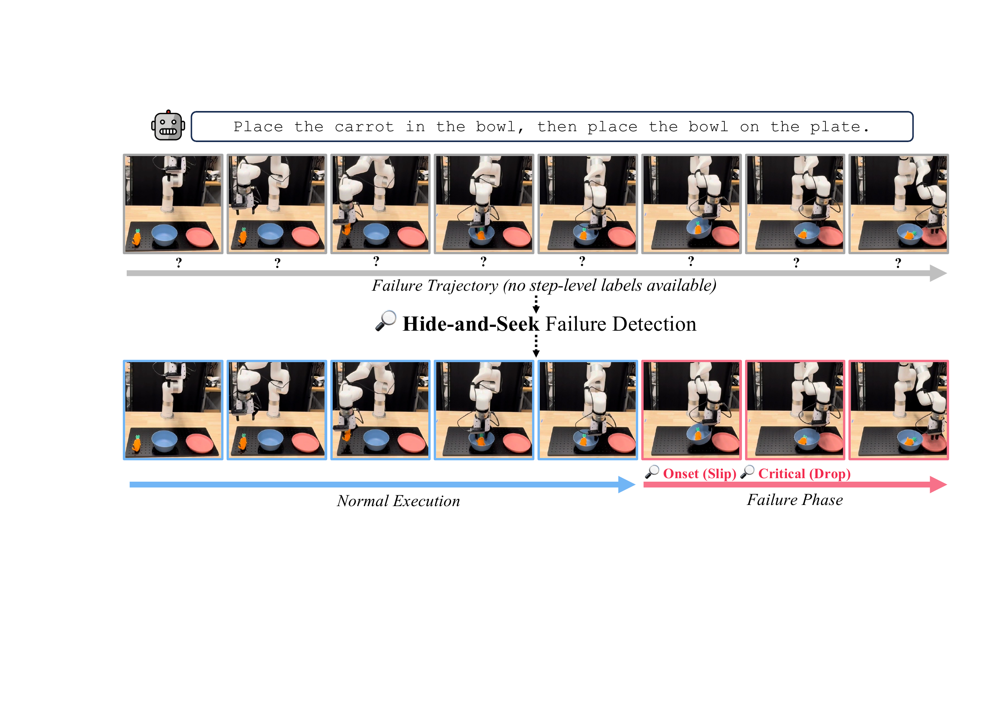

# Hide-and-Seek in Trajectories: Discovering Failure Signals for VLA Runtime Monitoring

#

# 基本信息

- **arXiv:** 2605.30834
- **Authors:** Seongheon Park, Wendi Li, Changdae Oh, Samuel Yeh, Zsolt Kira, Michael Hagenow, Sharon Li
- **Categories:** cs.RO, cs.AI
- **一句话结论:** 本文提出 Hide-and-Seek 框架，首次将 VLA 运行时故障检测形式化为粗监督学习问题，仅利用轨迹级成功/失败标签，通过轨迹间与轨迹内双重对比目标自适应地挖掘隐藏在正常行为中的局部故障信号，在仿真与真实机器人平台上均取得 SOTA 检测性能，且推理速度比 VLM 监控快 2000 倍以上。

#

# 研究问题

论文要解决的核心问题是：**如何在仅有轨迹级监督、没有任何单步时间标注的前提下，为 Vision-Language-Action (VLA) 策略实现轻量级、及时且细粒度的运行时故障检测？**

这与 VLA、具身智能和机器人控制密切相关。当前 VLA 模型虽能遵循自然语言指令完成多样长程操作任务，但在真实部署中仍频繁遭遇执行故障（如抓取滑脱、碰撞、目标错放等）。若无法及时检测，微小错误会级联为灾难性后果。现有方法要么依赖昂贵的动作重采样或外部 VLM 裁判，计算开销巨大、实时性差；要么将轨迹级标签均匀传播到每个时间步，导致大量正常动作被误标为故障，淹没了真正关键的局部故障信号。因此，在粗粒度监督下“寻找”隐藏的故障信号，是提升具身系统可靠性与安全性的关键瓶颈。

#

# 任务与挑战

**具体任务设定：** 在时刻 $t$，VLA 策略接收观测 $o_t$（含 RGB 图像、语言指令、机器人状态）并输出动作 $a_t$。本文从模型的动作 token 或动作头中提取内部动作嵌入 $h_t \in \mathbb{R}^d$，构成轨迹前缀 $\tau_{\leq t} = (h_1, \dots, h_t)$。训练时仅能获得轨迹级二元标签 $y(\tau) \in \{0,1\}$（$1$ 表示失败），**没有任何步骤级标注**。目标是学习一个故障检测器 $f_\phi$，在运行时对任意轨迹前缀输出二元决策 $G(\tau_{\leq t})$，判断是否将最终导致任务失败。

**核心挑战：**
1. **监督粒度不匹配：** 轨迹级标签无法直接告诉模型“哪一步”出错。均匀传播标签会引入严重标签噪声，因为失败轨迹中通常包含大量正常执行的前置步骤。
2. **计算实用性：** 基于动作重采样（如 ACE、STAC）或外部 VLM 裁判的方法推理延迟过高，难以满足实时部署需求。
3. **跨任务泛化：** 多数现有方法针对特定任务或固定策略设计，难以适应现代通用 VLA 策略面临的开放世界多任务场景。

#

# 核心 Insight

本文的核心思想是将故障检测重新定义为**粗监督学习（coarsely supervised learning）**问题：失败轨迹中的故障信号并非均匀分布，而是“隐藏”在大量正常动作之中。检测器必须像“捉迷藏”一样，仅凭借轨迹最终成败这一线索，把最具指示性的故障动作“找”出来。

为此，作者设计了两个互补的对比目标：
- **轨迹间对比（inter-trajectory）**：在失败轨迹与成功轨迹之间进行对比，确保失败轨迹中最“像故障”的那一步，其得分显著高于成功轨迹中最“像故障”的难负样本（例如短暂的犹豫或尴尬姿态）。这使得模型聚焦于真正显著的故障特征，而非被均匀标签稀释。
- **轨迹内对比（intra-trajectory）**：在单条失败轨迹内部，以失败分数的**最大跃升点**作为代理故障起点（onset），强制要求起点之后的平均分数高于起点之前。这无需任何时间标注即可诱导出具有时序结构的故障信号，自然地将轨迹划分为“正常执行”与“故障阶段”。



上图直观展示了这一洞察：上方为仅含轨迹级标签的原始失败轨迹，所有步骤都打上问号；下方经过 Hide-and-Seek 处理后，成功分离出蓝色的正常执行段与红色的故障阶段，并定位到 Onset（如滑脱）和 Critical（如掉落）时刻。

#

# 方法与公式

**整体架构。** 给定轨迹前缀 $\tau_{\leq t} = (h_1, \dots, h_t)$，检测器 $f_\phi$（默认采用单层 LSTM）输出标量故障分数 $s_t = f_\phi(\tau_{\leq t}) \in [0,1]$。训练仅依赖成功轨迹集 $\mathcal{D}_s$ 与失败轨迹集 $\mathcal{D}_f$。

**1. 轨迹间对比损失（Inter-trajectory Contrastive Loss）。** 该损失不要求预先知道故障发生的位置，而是自适应地发现最显著的故障信号。对于失败-成功轨迹对 $(\tau_f, \tau_s)$，它要求失败轨迹中的最大分数高于成功轨迹中的最大分数，并保留边距 $m_r$：

```math
\mathcal{L}_{\mathrm{inter}}
=
\frac{1}{|\mathcal{D}_f|\,|\mathcal{D}_s|}
\sum_{\tau_f \in \mathcal{D}_f}
\sum_{\tau_s \in \mathcal{D}_s}
\left[
\max\left(0,\;
m_r
- \max_{1 \leq t \leq N_{\tau_f}} s_t
+ \max_{1 \leq t \leq N_{\tau_s}} s_t
\right)
\right]
\tag{1}
```

其中 $N_{\tau_f}, N_{\tau_s}$ 为两条轨迹的长度，$m_r > 0$ 为边距超参数。该式通过最大化-最大化（max-over-max）结构，让模型关注“最难区分”的样本对，从而避免均匀标签带来的噪声。

**2. 轨迹内对比损失（Intra-trajectory Contrastive Loss）。** 仅使用 $\mathcal{L}_{\mathrm{inter}}$ 只能优化单个峰值，缺乏时序结构。作者引入代理故障起点：

```math
t_{\mathrm{onset}} = \arg\max_t \bigl(s_t - s_{t-1}\bigr)
\tag{2}
```

该起点在计算时施加 stop-gradient（即不通过索引选择回传梯度），仅作为锚点使用。随后，损失强制要求失败起点后的平均分数超过起点前的平均分数，边距为 $m_o$：

```math
\mathcal{L}_{\mathrm{intra}}
=
\frac{1}{|\mathcal{D}_f|}
\sum_{\tau_f \in \mathcal{D}_f}
\left[
\max\left(0,\;
m_o
- \frac{1}{N_{\tau_f} - t_{\mathrm{onset}} + 1}
\sum_{t \geq t_{\mathrm{onset}}} s_t
+ \frac{1}{t_{\mathrm{onset}} - 1}
\sum_{t < t_{\mathrm{onset}}} s_t
\right)
\right]
\tag{3}
```

**3. 总训练目标。** 将上述两项损失加权组合：

```math
\mathcal{L}
= \mathcal{L}_{\mathrm{inter}}
+ \lambda\, \mathcal{L}_{\mathrm{intra}}
\tag{4}
```

其中 $\lambda$ 控制两项的相对权重。$\mathcal{L}_{\mathrm{inter}}$ 负责在轨迹间“寻找”隐藏信号，$\mathcal{L}_{\mathrm{intra}}$ 则在轨迹内锐化正常执行与故障阶段的时间边界。

**4. 运行时监控：函数型共形预测（Functional Conformal Prediction）。** 推理阶段，检测器在每个时间步输出 $s_t$。为了将分数转化为二元报警，并兼顾准确率与及时性，作者采用 functional conformal prediction 构建时变阈值 $\zeta_t = \mu_t + b_t$。具体地，在保留的成功轨迹校准集上估计逐时步均值 $\mu_t$ 与带宽 $b_t$，使得对于新的成功轨迹，轨迹级误报率被控制在用户指定的显著性水平 $\alpha$ 以内。当 $s_t \geq \zeta_t$ 时，系统立即报警。

#

# 贡献拆解

1. **粗监督学习范式在 VLA 故障检测中的首次系统应用。** 论文将故障检测从昂贵的单步标注需求中解放出来，仅利用轨迹级成败标签即可训练。与 SAFE 等均匀传播标签的方法相比，该范式通过对比学习自动定位故障指示性动作，显著降低了标注成本，同时保持了检测的细粒度。
   
2. **双重对比目标实现时序结构化故障信号发现。** 轨迹间对比损失聚焦最具判别性的故障特征，轨迹内对比损失则利用得分跃升点作为代理 onset，将粗监督转化为带时间结构的故障分数曲线。两者结合比单一损失或均匀标签提供了更强的结构正则性。

3. **跨架构、跨任务、跨虚实平台的全面验证。** 方法在自回归（OpenVLA）与流匹配（$\pi_0$、$\pi_{0.5}$）两种 VLA 范式上均有效，并在 LIBERO-10、VLABench 及真实 UFactory xArm 6 上取得 SOTA。特别地，其推理延迟仅 $0.001$ 秒/步，比 Qwen3-VL 在线监控快 2000 倍以上，具备实际部署价值。

#

# 关键图表解读

**图 1：Hide-and-Seek 框架概念图（`figures/figure-009-fig1-3.png`）**

该图位于论文 teaser 位置，直接阐释了核心动机。上方展示了一条仅含轨迹级失败标签的原始轨迹：机器人执行“将胡萝卜放入碗中，再将碗放到盘子上”的任务，每一步都因缺乏标注而显示为“？”。下方展示经过 Hide-and-Seek 处理后的结果：蓝色框标记出正常的执行阶段，红色框标记出故障阶段，并进一步区分了 Onset（滑脱）与 Critical（掉落）两个关键时刻。**读图要点：** 注意正常执行段在失败轨迹中占据显著比例，这正是均匀标签传播会引入噪声的原因；方法无需人工标注即可自动完成这种切分。

**图 2：$\pi_0$ 策略的细粒度嵌入可视化（`figures/figure-002-finegrained-pi0.png`）**

该图展示了 $\pi_0$ 策略动作嵌入经降维后的分布，蓝色点为成功样本，红色点为失败样本。可以观察到成功与失败样本形成了可分离的聚类结构，但红色失败点并非均匀散布，而是呈现局部聚集。**支撑论点：** 这说明 VLA 内部动作嵌入确实蕴含故障判别信息，但需要通过细粒度方法（如 Hide-and-Seek）才能将其从正常行为的背景中“打捞”出来，验证了对比学习目标诱导判别性表示的有效性。

**图 3：OpenVLA 策略的定性检测结果（`figures/figure-008-collision-openvla.png`）**

图中展示了两个 OpenVLA 真实任务案例：左为“将字母汤和番茄酱放入篮子”（失败类型：Mis-target → Stalled），右为“将白色马克杯放到盘子上并将巧克力布丁放到盘子右侧”（失败类型：Collision → Stuck）。每个案例上方为关键帧，下方为故障分数 $s_t$ 随时间步变化的曲线，绿色区域为共形预测给出的时变阈值 $\zeta_t$。**读图要点：** 红色曲线在正常执行阶段贴近 0，在故障起点处陡升并突破阈值；蓝色箭头指向 Onset，粉色箭头指向 Critical，说明方法不仅能检测故障，还能在时序上逼近故障的真正起点，且对不同类型的失败（错抓、碰撞、卡住）均适用。

**图 4：$\pi_0$ 策略的定性检测结果（`figures/figure-010-collision-pi0.png`）**

该图展示了 $\pi_0$ 策略上的两个案例：左为抓取滑脱导致碰撞（Slip → Collision），右为书本放置错位导致漂移（Misplace → Drift）。与 OpenVLA 类似，故障分数曲线均在 Onset 处出现明显跃升。**支撑论点：** 这证明了 Hide-and-Seek 的跨模型泛化能力——无论是自回归还是流匹配策略，其动作嵌入空间中的故障信号都能被统一框架有效捕获。

#

# 实验与消融

**数据集与设定。** 实验覆盖 LIBERO-10（长程多任务仿真）、VLABench（多样化操作仿真）以及真实 UFactory xArm 6 平台（CUBE 与 KITCHEN 两组共 8 个任务）。测试策略包括自回归的 OpenVLA 与流匹配的 $\pi_0$、$\pi_{0.5}$。采用已见/未见任务拆分（seen/unseen tasks）评估泛化性。

**基线与指标。** 对比 12 个基线，涵盖 OOD 检测（Mahalanobis、Cosine $k$-NN 等）、多采样不确定性（Cluster Entropy、EigenScore、ACE 等）、分类器（SAFE-LSTM、SAFE-MLP）以及 Token 不确定性（Entropy、NLL）。主要指标为平衡准确率（bACC）、加权准确率（wACC）和兼顾及时性的时间加权准确率（TWA）。

**主结果。** 
- **LIBERO-10 + OpenVLA（未见任务）：** Hide-and-Seek 达到 $83.4\%$ bACC 与 $66.3\%$ TWA，显著优于最强基线 SAFE-MLP。
- **VLABench + $\pi_{0.5}$（已见任务）：** bACC 达 $85.6\%$，较 SAFE-MLP 提升 $+6.8\%$，TWA 提升 $+8.1\%$。
- **真实机器人 + $\pi_{0.5}$（未见 CUBE 任务）：** 较 SAFE-MLP 提升 $+11.7\%$ bACC 与 $+15.0\%$ TWA。

**最强证据：** 在真实机器人未见任务上，方法依然保持 SOTA，说明从轨迹级监督中发现的故障信号具有良好的跨域迁移能力；同时推理延迟仅 $0.001$ 秒/步，实用性极强。

**最存疑证据：** 真实机器人实验的任务总量相对有限（8 个任务，每类 4 个），且未见拆分仅保留 1 个任务，统计代表性略弱于大规模仿真。

**消融实验。**
- **损失组件（表 Component analysis）：** 单独使用 $\mathcal{L}_{\mathrm{inter}}$ 已能取得强劲性能（OpenVLA 上 $82.5\%$ bACC），但加入 $\mathcal{L}_{\mathrm{intra}}$ 后进一步提升（$84.3\%$），证明两者互补。
- **与均匀标签对比：** Hide-and-Seek 比均匀轨迹级标签传播在 OpenVLA 上提升 $+19.4\%$ bACC，在 $\pi_0$ 上提升 $+18.6\%$，直观证明了避免标签噪声的重要性。
- **架构选择（表 Architecture）：** LSTM（$84.3\%$）优于 GRU（$83.4\%$）、Transformer（$80.4\%$）和 MLP（$76.5\%$），说明有限数据下循环结构的归纳偏置更适合序列故障检测。
- **检测及时性：** 在 GPT-5.2 辅助标注的故障起点对比下，Hide-and-Seek 的报警时刻平均略早于真实故障起点（$\Delta t > 0$），而 SAFE-MLP 在多个设定下出现明显延迟（$\Delta t < 0$）。
- **超参数鲁棒性：** 对边距 $m_r, m_o$ 和窗口大小 $w$ 的扫描显示，性能在较大范围内保持稳定（bACC 波动 $<4\%$）。

#

# 局限性

1. **嵌入可获取性假设。** 方法依赖从 VLA 内部提取动作嵌入 $h_t$。对于完全黑盒或仅提供 API 的策略，无法直接应用。
2. **共形预测的分布假设。** 函数型共形预测假设校准集与测试轨迹可交换。在未见任务上，该假设仅近似成立，尽管实验表明阈值迁移效果良好，但理论上缺乏严格保证。
3. **真实实验规模有限。** 真实机器人实验仅包含 8 个任务（分两组），未见任务每类仅 1 个，任务多样性不如仿真环境充分。
4. **故障起点标注的参考标准主观性。** 论文使用 GPT-5.2 标注故障起点用于分析，虽经人工验证（$90.7\%$ 一致率），但仍存在主观偏差，且未探讨对检测指标的直接影响。
5. **未涉及闭环恢复。** 本文聚焦于“检测”而非“修复”。检测到故障后如何触发重试、重规划或人机交接，尚未在框架内讨论。

#

# 个人研究判断

面向“World Models assisting Embodied AI downstream tasks”的研究方向，**本文值得继续追踪**。

理由如下：
1. **监控层的世界模型接口价值。** Hide-and-Seek 证明了 VLA 内部动作嵌入蕴含丰富的故障判别信息，且可通过轻量级对比学习挖掘。这为 World Model 辅助具身智能提供了关键切入点：World Model 可进一步利用这些故障信号进行未来状态预测与反事实推演，实现从“事后检测”到“事前预警”的跃迁。
2. **粗监督范式的可扩展性。** 轨迹级标签易于大规模收集（任何策略 rollout 的成败都可自动记录），而单步标注成本高昂。该框架为构建大规模 VLA 可靠性数据集提供了可行路径。
3. **架构无关与即插即用。** 方法不绑定特定 VLA 架构，可无缝集成到现有自回归或扩散/流匹配策略的部署管线中，作为安全监控模块。对于关注 VLA 可靠性与世界模型辅助机器人控制的读者，其在动作嵌入时序对比建模上的技术思路具有直接借鉴意义。

后续可关注的方向包括：将 Hide-and-Seek 的故障分数作为 World Model 的辅助输入，进行预测性故障避免；探索在更复杂的接触-rich 任务与多机协作场景中的检测极限；以及将检测器与在线恢复策略闭环结合，构建“检测-诊断-修复”一体化系统。
