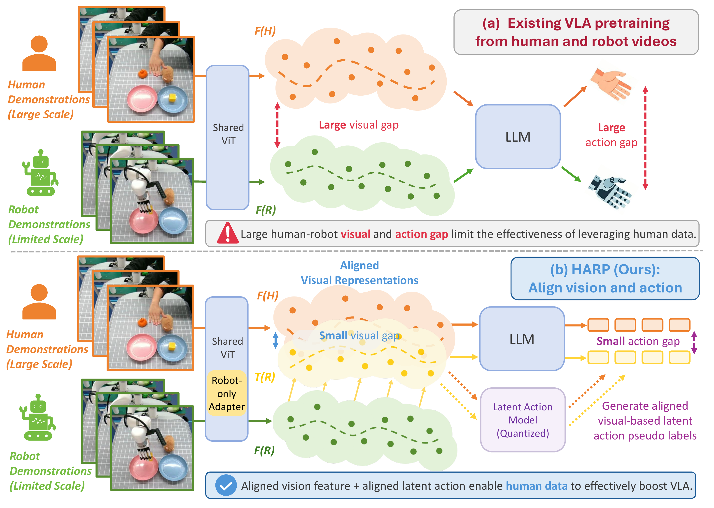
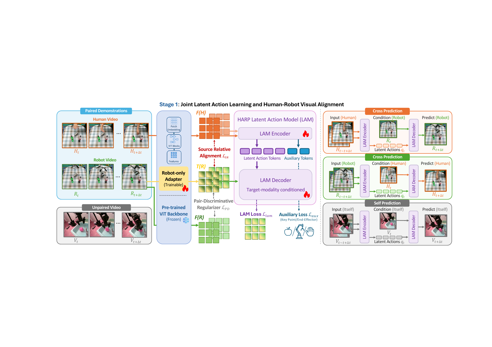
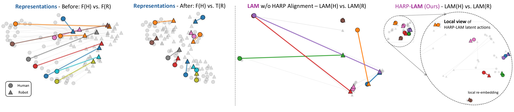
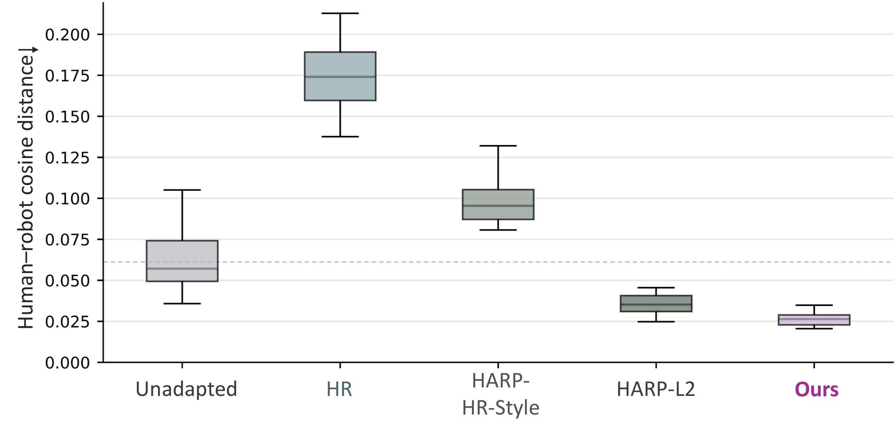

# HARP-VLA: Human-Robot Aligned Representation Learning for Vision-Language-Action Model

#

# 基本信息

- arXiv: [2605.31234](http://arxiv.org/abs/2605.31234v1)
- Authors: Xiang Zhu, Puzhen Yuan, Yichen Liu, Jianyu Chen
- Categories: cs.RO

#

# 研究问题

联合对齐视觉与潜动作的跨本体VLA预训练框架

#

# 任务与挑战

本文针对从大规模人类视频预训练视觉-语言-动作（VLA）模型时存在的跨本体差异问题，提出了HARP-VLA框架。现有方法虽然通过潜在动作模型（LAM）缓解了动作执行差距，但由于人类与机器人视觉表征不对齐，导致策略输入不一致并产生依赖于领域的潜在动作，阻碍了人类视频与机器人数据的有效联合训练。为此，HARP利用有限的人类-机器人配对演示作为跨本体桥梁，并结合大量未配对视频作为可扩展的动态监督，训练机器人自适应视觉编码器和潜在动作模型。其核心方法包括：以物体关键点和腕部/末端执行器轨迹为中心的辅助线索监督，以及源相对配对判别对齐损失（Source-Relative Pair-Discriminative alignment loss），在将机器人表征向人类语义对齐的同时保持配对级判别性。框架采用三阶段训练：第一阶段联合学习对齐的视觉编码器与潜在动作模型；第二阶段用潜在动作标签预训练VLA策略；第三阶段通过轻量级动作头将潜在动作映射为可执行的真实动作，并用少量机器人数据微调。

实验从表征对齐、模拟策略学习及真实世界操作三个层面验证了HARP的有效性。在表征层面，HARP-SRPD在双向跨本体检索（H2R/R2H）上的平均Recall@1从43.55提升至78.50，显著优于HR-Align；在RLBench的18项任务上，使用冻结HARP视觉编码器的策略平均成功率从37.56%提升至46.59%。在策略层面，HARP-VLA在CALVIN ABC→D长程任务上平均完成长度达到4.481，超越π0.5（3.875）和OpenVLA-OFT（3.917）；在真实世界Xarm7+Robotera XHand平台的四项操作任务上，平均成功率达到76.3%，较最强基线提升7.1个百分点。

该研究的意义在于提供了一套系统性的跨本体视觉-动作对齐方案，使大规模人类视频能够更有效地服务于VLA预训练。其提出的源相对配对判别损失在避免表征坍塌的同时实现了强对齐，对后续基于人类视频的机器人学习与跨本体迁移研究具有重要参考价值。此外，代码与演示已公开，有助于社区复现与进一步扩展。

#

# 核心 Insight

这篇论文的核心价值需要结合原文继续复查。当前 fallback 笔记保留了日报分析、DeepResearch 草稿和已筛选图表，避免自动流程中断。

#

# 方法与公式

DeepResearch 未生成；请回看论文正文中的方法章节与关键公式。

#

# 贡献拆解

- 关键术语：Vision-Language-Action, Latent Action Model, Cross-Embodiment Alignment, Source-Relative Pair-Discriminative Loss, Robot Manipulation
- 加权评分：4.15/5.0

#

# 关键图表解读

*主图清晰对比了现有VLA预训练在人机视觉与动作上的双重鸿沟，以及HARP通过对齐视觉和潜在动作来弥合鸿沟的核心insight，是理解论文动机和整体框架的关键。*

*详细展示了Stage 1的联合潜在动作学习与视觉对齐架构，包括配对/非配对数据流、机器人专属Adapter、LAM编解码器、交叉预测与自预测机制，是论文核心方法的技术实现。*

*通过UMAP可视化直观验证了HARP在表示空间和潜在动作空间的对齐效果，展示了Before/After以及有无HARP对齐的对比，直接支撑论文关于人机对齐的核心结论。*

*箱线图定量比较了不同基线与HARP在人类-机器人余弦距离上的表现，Ours显著降低，为主实验结果提供了关键的量化证据。*

#

# 实验与消融

请优先核对主结果表、消融实验和真实/仿真任务设置；若图表已选中，应结合上方图片逐项复查。

#

# 局限性

当前自动精读未能成功调用完整图文生成模型，因此局限性需要结合原文实验设置进一步人工确认。

#

# 个人研究判断

若该论文与 World Models assisting Embodied AI、VLA、robot policy 或 sim-to-real 强相关，建议进入人工精读队列。
