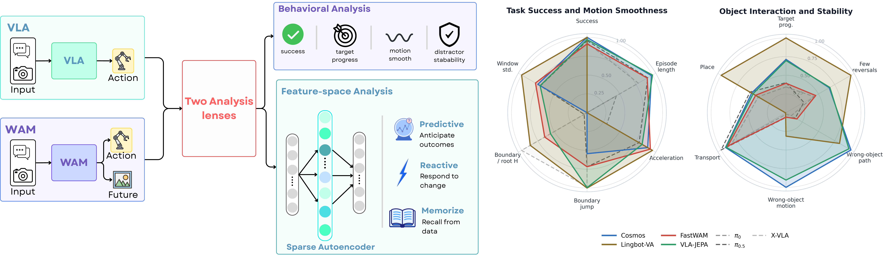
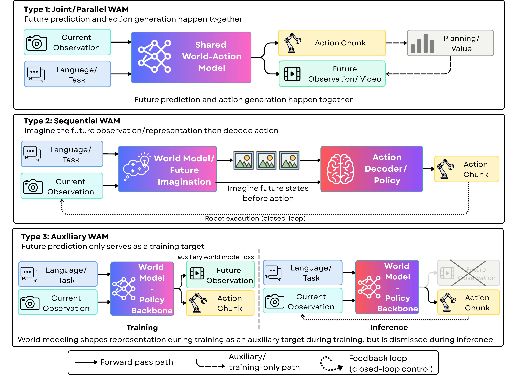
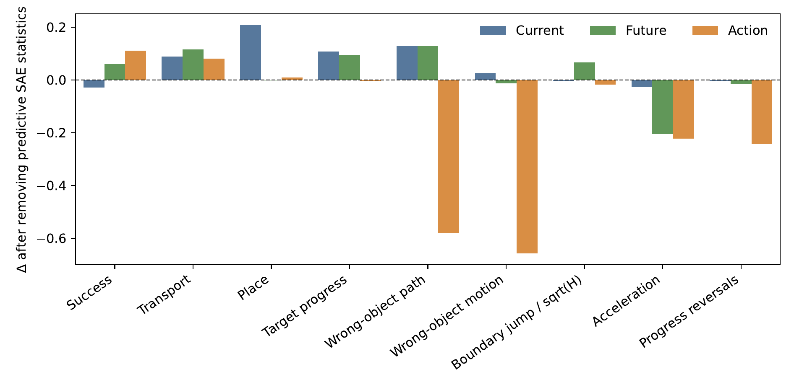

# Beyond Task Success: Behavioral and Representational Diagnostics for WAM and VLA

#

# 基本信息

- arXiv: [2606.01095](http://arxiv.org/abs/2606.01095v1)
- Authors: Hung Mai, Bin Zhu, Tuan Do
- Categories: cs.RO, cs.AI

#

# 研究问题

WAM与VLA的行为表征诊断框架

#

# 任务与挑战

现有机器人操控研究过度依赖任务成功率作为唯一评估指标，导致World-Action Models（WAM）与Vision-Language-Action（VLA）策略之间的深层差异被掩盖。尽管WAM通过引入未来预测有望提升策略的连贯性与物体交互能力，但尚不清楚这种未来建模是否真正转化为行为层面的可感知改进，抑或仅增加了计算开销。本文针对这一评估空白，提出了一套模型无关的诊断框架，旨在揭示不同架构在行为动态与内部表征上的本质区别。

该框架从两个互补维度展开：行为层面与表征层面。行为诊断协议不仅测量标准成功率，还量化动作动态一致性（如delta、加速度、jerk、chunk边界跳变）、目标物体推进进度、干扰物扰动、操作阶段完成率及推理时延。表征诊断协议则利用稀疏自编码器（SAE）对当前视觉潜变量、未来想象潜变量及动作潜变量进行解构，提出未来一致性分数（FCS）、时域稳定性（HS）与动作预测性（AP）三项面向WAM的新指标，将特征分类为记忆型、反应型或预测型，从而判断模型是否编码了面向未来的结构。

在LIBERO与RoboTwin2.0上，作者对7种策略（包括直接VLA基线与联合、序列、辅助三类WAM）进行了系统评估。结果显示，成功率相近时，WAM在物体级行为上通常更优：动作更平滑、目标推进更显著、干扰物扰动更小。然而，这些收益伴随显著的推理成本，尤其是序列式WAM（如LingBot-VA）。SAE分析进一步揭示，序列WAM的未来流中预测型特征占比最高（53.2%），而联合WAM（Cosmos）的未来信息高度纠缠，辅助WAM（FastWAM）则压缩了未来信号，VLA基线几乎不含预测型特征。

本文的核心价值在于重新界定了WAM的评估标准：未来预测不应仅以视觉合理性或最终成功率衡量，而应考察其是否产生了可解释的行为改进与可操作的预测表征。研究指出，有效的WAM设计需在显式未来建模与推理效率之间取得平衡，保留轻量级的推理时想象能力，而非仅将未来预测作为辅助训练信号。该框架为后续世界模型与VLA架构的迭代提供了细粒度的诊断工具和明确的设计方向。

#

# 核心 Insight

这篇论文的核心价值需要结合原文继续复查。当前 fallback 笔记保留了日报分析、DeepResearch 草稿和已筛选图表，避免自动流程中断。

#

# 方法与公式

DeepResearch 未生成；请回看论文正文中的方法章节与关键公式。

#

# 贡献拆解

- 关键术语：World-Action Model, Vision-Language-Action, Sparse Autoencoder, Behavioral Rollout Analysis, Predictive Representation
- 加权评分：4.05/5.0

#

# 关键图表解读

*该图同时呈现了论文的核心方法框架（VLA与WAM对比、行为分析与特征空间分析双视角）以及关键多维实验结果（雷达图），是理解全文脉络与核心结论的首选概览图。*

*清晰定义了三种WAM架构范式（Joint/Parallel、Sequential、Auxiliary）的流程与区别，是后续所有行为与表征差异分析的方法论基础，属于必读的方法架构图。*

*通过移除预测性SAE特征后观察行为指标的变化，直接建立内部表征与外部行为的因果联系，是支撑“表征诊断具有行为意义”这一核心结论的关键消融实验。*

#

# 实验与消融

请优先核对主结果表、消融实验和真实/仿真任务设置；若图表已选中，应结合上方图片逐项复查。

#

# 局限性

当前自动精读未能成功调用完整图文生成模型，因此局限性需要结合原文实验设置进一步人工确认。

#

# 个人研究判断

若该论文与 World Models assisting Embodied AI、VLA、robot policy 或 sim-to-real 强相关，建议进入人工精读队列。
