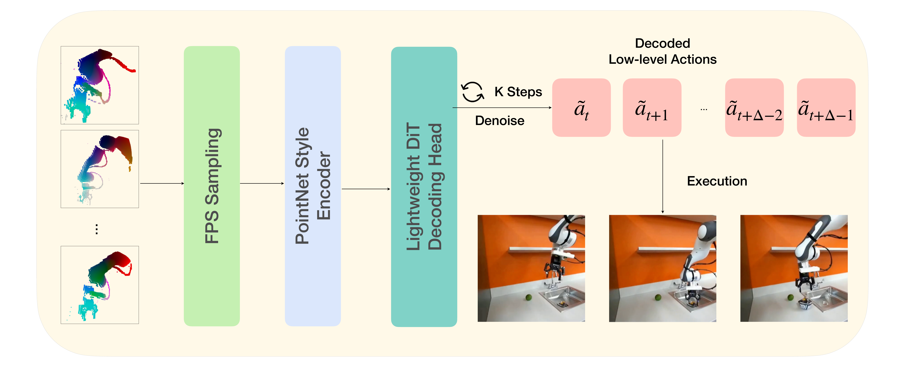
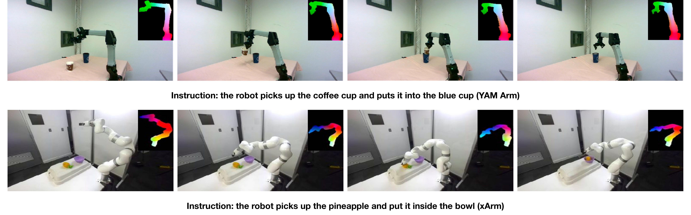
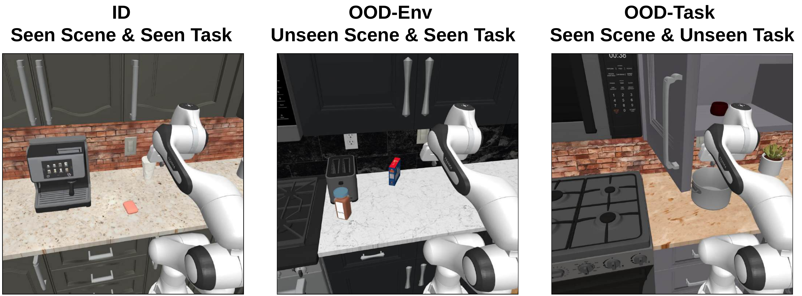
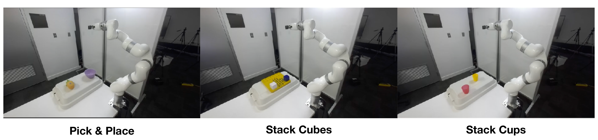

# PointAction: 3D Points as Universal Action Representations for Robot Control

#

# 基本信息

- arXiv: [2606.03943](http://arxiv.org/abs/2606.03943v1)
- Authors: Mutian Tong, Han Jiang, Qiao Feng, Lingjie Liu, Jiatao Gu
- Categories: cs.RO, cs.CV, cs.LG

#

# 研究问题

联合RGB-XYZ点云的跨本体机器人控制方法

#

# 任务与挑战

现有Video-Action Models (VAMs) 仅依赖RGB视频预测，缺乏度量三维运动、接触几何与细粒度空间约束的显式表达，导致动作落地存在歧义；同时，跨任务、跨本体的动作监督数据获取成本高昂，难以规模化。本文提出PointAction，通过显式的点云4D建模弥合视频预测与机器人控制之间的鸿沟，将世界模型的预测能力转化为可执行的控制信号。

PointAction将问题解耦为两部分：(1) 通用视频到点云模型：在LVP等基础视频生成模型上通过LoRA微调，采用空间对齐的模态融合策略（沿宽度拼接RGB与XYZ潜码），联合预测未来RGB帧与动态3D点云图，利用流匹配目标进行训练；(2) 本体专用点云到动作解码器：基于SAM 3分割提取机器人中心点轨迹，经最远点采样和PointNet风格MLP编码后，输入轻量级DiT扩散模型，在AdaLN条件下生成可执行动作块。该设计使昂贵的视频模型可跨本体复用，仅需少量配对数据训练解码器。

实验在RoboCasa365仿真环境及两个真实机械臂（xArm7与YAM）上开展。仿真中，PointAction在分布内(ID)、分布外环境(OOD-Env)和分布外任务(OOD-Task)上分别取得47.7%、44.1%和17.0%的成功率，均优于VLA基线（如GR00T N1.7、π0.5）及VAM基线（VPP、Cosmos Policy）。在跨本体真实部署中，xArm7平均成功率43.0%，显著高于π0.5的22.7%；YAM臂在多项任务上也大幅领先。此外，联合RGB-XYZ生成在PSNR、SSIM、FVD及Chamfer L1等4D生成指标上达到SOTA。

PointAction的核心价值在于提出了一种可扩展的、基于3D点云动态的中间表征，将世界模型的视频预测能力与机器人控制解耦。它不仅缓解了纯RGB动作落地的几何歧义，还通过“通用4D预测+轻量解码器”的范式降低了对本体特定动作数据的依赖，为跨本体泛化和sim-to-real迁移提供了新思路。尽管当前受限于视频模型推理速度和开环执行，其在世界模型与具身智能交叉领域具有重要的方法启发意义。

#

# 核心 Insight

这篇论文的核心价值需要结合原文继续复查。当前 fallback 笔记保留了日报分析、DeepResearch 草稿和已筛选图表，避免自动流程中断。

#

# 方法与公式

DeepResearch 未生成；请回看论文正文中的方法章节与关键公式。

#

# 贡献拆解

- 关键术语：Video-Action Models, 3D Pointmaps, Diffusion Policy, Cross-Embodiment Transfer, Flow Matching
- 加权评分：4.25/5.0

#

# 关键图表解读

*展示了PointAction的核心流程：从点云观测经FPS采样、PointNet风格编码器、轻量DiT解码头生成未来低层动作序列，是理解方法原理与系统设计的必备架构图。*

*直观展示了方法在两种真实机器人（YAM Arm与xArm）上的执行效果，并体现了4D点云预测与RGB观测的对齐，直接支撑论文关于跨本体迁移与真实场景泛化的核心结论。*

*清晰定义了ID、OOD-Env、OOD-Task三种评估设置，直接支撑论文关于跨场景与跨任务泛化能力的实验结论，是理解实验设计与结果的关键图。*

*展示了同一真实机器人在三种不同操作任务（Pick & Place、Stack Cubes、Stack Cups）上的执行能力，体现方法在真实环境下的任务级泛化性。*

#

# 实验与消融

请优先核对主结果表、消融实验和真实/仿真任务设置；若图表已选中，应结合上方图片逐项复查。

#

# 局限性

当前自动精读未能成功调用完整图文生成模型，因此局限性需要结合原文实验设置进一步人工确认。

#

# 个人研究判断

若该论文与 World Models assisting Embodied AI、VLA、robot policy 或 sim-to-real 强相关，建议进入人工精读队列。
