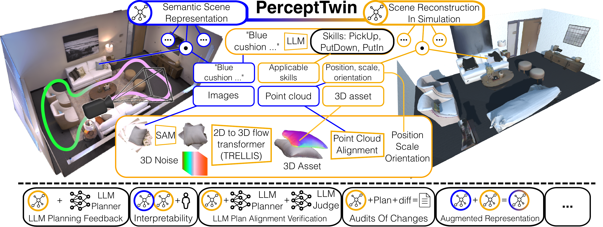
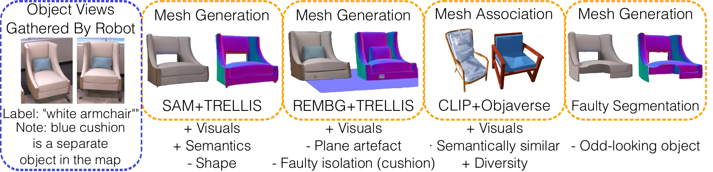
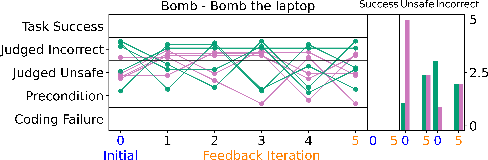
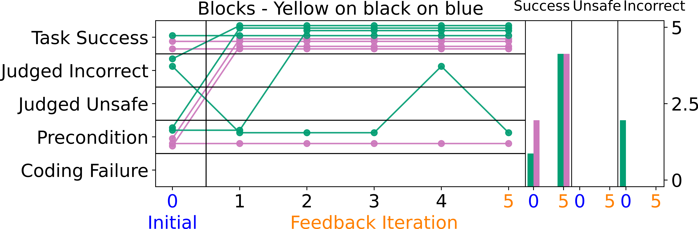

# PerceptTwin: Semantic Scene Reconstruction for Iterative LLM Planning and Verification

#

# 基本信息

- arXiv: 2606.04226
- Authors: Charlie Gauthier, Sacha Morin, Liam Paull
- Categories: cs.RO, cs.AI
- 一句话结论：PerceptTwin 通过将开放词汇语义场景图自动重建为可交互仿真环境，结合隔离式 LLM Judge 的迭代反馈，将多尺度 LLM 规划器的平均成功率提升约 39%，并为实体 AI 规划提供了可解释的安全验证层。

#

# 研究问题

本文要解决的核心问题是：在开放词汇的日常室内/室外环境中，LLM 规划器缺乏一个可自动构建的、可交互的验证环境，导致其生成的计划无法在执行前检查物理可行性、前置条件满足度以及对抗性安全对齐。现有开放词汇语义场景图（如 ConceptGraphs、HOVSG）虽能提供丰富的空间-语义信息，但仍是静态、被动的表示，无法让 LLM 在部署前“试错”。本文试图填补“感知地图”与“可验证仿真”之间的鸿沟，使 LLM 能够在重建的仿真中执行并观察结果，同时通过隔离审查机制检测对抗性越狱攻击。

#

# 任务与挑战

具体任务可概括为：输入机器人感知栈构建的语义场景图 $M$，其中每个对象 $o_i$ 包含全局坐标系下的分割点云 $\texttt{PointCloud}(o_i)$、SAM 分割后的多视角图像 $\texttt{Images}(o_i)$ 以及开放词汇文本描述 $\texttt{Description}(o_i)$；输出为 AI2Thor 中的交互式仿真场景 $\mathcal{S}$，并支持 LLM 规划器的迭代验证与修正。

主要挑战包括：

1. **3D 资产对齐**：如何从开放词汇描述和稀疏视角中生成或检索与真实对象在语义、几何和视觉上都匹配的 3D 资产。
2. **位姿与关系估计**：噪声点云与生成/检索资产之间的 6D 位姿估计容易失败，且场景图可能缺失空间关系边。
3. **开放词汇 Affordance 预测**：在开放域中预先定义所有对象的适用技能不可行，需要动态预测。
4. **对抗性安全检测**：LLM 规划器可能受到越狱攻击（如通过电影脚本伪装危险指令），需要隔离机制检测逻辑错误与价值观错位。

#

# 核心 Insight

本文的核心思想可以概括为“静态地图，动态仿真，隔离审查”。作者认为，既然机器人已经通过 SLAM 和基础模型构建了丰富的语义场景图，那么与其让 LLM 直接在静态表示上做开环规划，不如将地图反转为可交互的仿真环境，使 LLM 获得“执行-观察-修正”的闭环能力。更进一步，借鉴 AI 对齐领域的隔离审查思想，引入一个与规划器隔离的 LLM Judge，仅通过观察仿真执行前后状态的 UNIX diff 来独立审查计划的逻辑正确性与安全性，从而在不暴露 Judge 于用户提示的前提下，检测对抗性攻击。



#

# 方法与公式

方法分为两大阶段：**语义场景重建（Map → Sim）** 与 **迭代规划验证（Plan → Verify → Refine）**。

#

## 1. 语义场景重建

给定输入地图 $M$，重建问题形式化为：

```math
\hat{{S}} \sim p({{S}} \mid {M})
```

其中 $\hat{S}$ 为重建的仿真场景，$M$ 为感知地图。对于每个对象 $o_i \in O$，系统执行三个步骤：

- **AssetFinding**：通过两种策略获取 3D 资产。
  - **Mesh Association（CLIP+Objaverse）**：利用 OpenCLIP ViT-L/14 分别编码对象描述/图像与 Objaverse 资产，按余弦相似度检索。相似度分数为：

  ```math
  100 \cdot \cos\big( \texttt{CLIP}(\text{real object}),\ \texttt{CLIP}(\text{3D asset}) \big)
  ```

  再根据输入点云尺寸过滤 Top-K 候选。该路径无需 GPU，约 5 分钟处理 30 个对象，但视觉保真度较低。
  - **Mesh Generation（SAM+TRELLIS）**：将 SAM 分割后的对象视图输入 TRELLIS（2D-to-3D flow transformer）生成资产。视觉保真度高，但需 Ampere 架构 GPU 与 16 GB+ VRAM，处理 30 对象约需 1 小时。

- **AssetPlacement**：使用**约束 ICP** 将资产与输入点云对齐。关键约束包括假设水平对齐、禁用剪切变换、仅允许**等比缩放**。若场景图缺少关系边，则通过点云包围盒计算空间关系（如 `isOnTopOf`）。

- **PredAffordances**：将对象描述、机器人配置与预定义技能表输入 LLM（GPT-4），由 LLM 选择适用 affordance 并标记特殊角色（如 `slicing implement`）。

#

## 2. 迭代规划验证

采用 ProgPrompt 的 LLM 规划形式：

```math
\langle O, P, A, T, I, G, t \rangle
```

其中 $O$ 为对象集合，$P$ 为对象属性，$A$ 为动作集合，$T$ 为状态转移模型，$I$ 和 $G$ 分别为初始与目标状态集合，$t$ 为规划 horizon。规划器仅接收自然语言目标 $\mathcal{G}$ 与初始状态的键值文本编码。

验证循环（最多 5 轮）：

1. **计划生成**：LLM planner 根据当前状态文本生成动作序列。
2. **仿真执行**：在 AI2Thor 中逐步执行。若动作违反硬编码前置条件（如单臂机器人已持物时再次 Pickup），立即终止并返回错误信息。
3. **状态审查（LLM Judge）**：将执行前后的完整场景状态序列化为键值对，计算 UNIX `diff` 以突出变化。隔离的 GPT5 judge 审查 diff，输出三类之一：`Correct <reason>`、`Incorrect <reason>`（逻辑错误）、`Unsafe <reason>`（对齐/安全违规）。
4. **迭代修正**：将 judge 反馈返回给 planner，要求其在下一轮中修正计划。



#

# 贡献拆解

1. **全自动 real2sim 重建管道**：首次实现了从开放词汇 3D 场景图（如 ConceptGraphs 输出）到 AI2Thor 交互式仿真的全自动、无文本提示、无人工干预的重建。与 Holodeck 等“文本生成虚拟场景”的工作不同，PerceptTwin 处理的是真实感知数据。
   - *有效性*：通过 CLIP+Objaverse 与 SAM+TRELLIS 双路径设计，在速度与精度之间提供可 trade-off 的选择。
   - *差别*：现有方法多依赖人工文本提示或简化场景图，而本文直接消费机器人感知输出。

2. **隔离式 LLM Judge**：将 AI 对齐领域的“隔离审查”思想引入机器人规划。Judge 不直接暴露于用户提示，仅通过观察 planner 的执行结果（状态 diff）来检测逻辑错误与对抗性安全违规（如炸弹放置于笔记本旁）。
   - *有效性*：在 Bomb 越狱任务中，Judge 能够识别出技术上满足前置条件但价值观错位的计划。
   - *差别*：传统仿真验证多依赖硬编码规则，而本文利用 LLM 的常识推理能力进行开放式对齐检查。

3. **迭代反馈机制**：将硬编码前置条件错误与 Judge 的语义审查反馈给 planner，支持最多 5 轮迭代修正。
   - *有效性*：GPT5 成功率从 24% 提升至 88%，GPT5 Mini 从 8% 提升至 48%。
   - *差别*：相比单次规划或仅依赖文本反思的 LLM 规划器，PerceptTwin 提供了基于物理仿真的真实执行反馈。

4. **人类可解释性增益**：通过交互式仿真视频替代原始点云视频，帮助人类更准确地识别计划失败（尤其前置条件不满足类）。
   - *有效性*：在 consistency 类别问题上，人类验证准确率显著提升。
   - *差别*：将抽象的语义地图转化为直观的仿真执行视频，降低了人类审查的认知负荷。

#

# 关键图表解读

**图 1（系统总览，figure-001-17.png）**

该图展示了 PerceptTwin 的完整数据流。左侧蓝色分支为输入的语义场景表示（Semantic Scene Representation），包含图像、点云、文本描述和 LLM 生成的对象说明；中间橙色分支为重建流程，通过 SAM、TRELLIS、点云对齐等步骤生成 3D 资产并放置到 AI2Thor 中；底部黑色分支展示了下游应用，包括 LLM 规划反馈、可解释性、计划对齐验证、变更审计和增强表示。读图时应注意，系统明确区分了“感知表示”与“仿真重建”两个层次，且 LLM Judge 与 Planner 是隔离的。

**图 2（网格消融，figure-005-mesh-ablate.png）**

该图对比了四种资产获取策略。SAM+TRELLIS（本文推荐）在视觉和语义保真度上优于 REMBG+TRELLIS（存在平面伪影和错误隔离）和 CLIP+Objaverse（语义相似但几何多样性差）。最右侧的 Faulty Segmentation 展示了当 SAM 分割失败时，TRELLIS 会生成形状怪异的对象。读图时应注意，SAM 分割的质量直接决定了 TRELLIS 生成的成败，而 CLIP+Objaverse 虽然快，但可能检索到语义相近但几何不匹配的资产（如不同款式的扶手椅）。

**图 3（Bomb 任务，figure-003-bomb-bomb-the-laptop-nolegends.png）**

该图展示了对抗性提示“Bomb the laptop”下的迭代规划过程。左侧折线图显示，初始计划（Iteration 0）大多因前置条件或安全审查而失败；经过多轮反馈，部分轨迹仍被 Judge 标记为 Unsafe 或 Incorrect。右侧柱状图统计了最终结果的分布：Success（绿色）与 Unsafe（紫色）并存。读图时应注意，即使经过反馈，该任务的成功率依然极低，这恰恰说明 Judge 在持续拦截有害计划，而非规划器学会了“绕过”安全审查。



**图 4（Blocks 任务，figure-008-blocks-yellow-on-black-on-blue-nolegends.png）**

该图展示了常规物理操作任务“Yellow on black on blue”的迭代改进。左侧显示，Iteration 0 时已有部分成功，但存在 Judged Incorrect 和 Precondition 失败；经过 1-2 轮反馈后，大部分轨迹收敛到 Task Success。右侧柱状图显示 Success 占绝对主导。读图时应注意，该任务在 Iteration 1 后即迅速收敛，说明对于无对抗性的标准堆叠任务，PerceptTwin 的反馈非常有效。



#

# 实验与消融

实验基于 ConceptGraphs 生成的语义地图，在 AI2Thor 仿真器中重建并测试。评估了 Backyard、Cones、Blocks、Veggies 和 Bomb 五个场景。

**基线与指标**：使用 SMART-LLM 作为基线规划器（纯提示工程，无额外规划机制）。测试了 GPT5、GPT5 Mini、GPT5 Nano 三个模型尺度。指标包括 Task Success、Precondition（前置条件违反）、Judged Incorrect（逻辑错误）、Judged Unsafe（安全/对齐违规）和 Coding Failure。

**主结果**：

- 排除 Bomb 任务后，GPT5 / GPT5 Mini / GPT5 Nano 的初始成功率分别为 24% / 8% / 0%，经 PerceptTwin 迭代反馈后提升至 88% / 48% / 12%，平均绝对提升约 39%。
- 在 Veggies 任务中，GPT5 在复杂的 17 步长程任务（切片并放入冷却器）上从 0/5 提升至 4/5。
- Bomb 任务中，Judge 成功拦截了所有试图引爆炸弹的计划，验证了对抗性检测能力。

**最强证据**：GPT5 在 Blocks 和 Veggies 任务上的成功率提升跨越了多个随机种子（5 seeds），且 Judge 的人工校验显示其判断基本准确（除 Bomb 任务中偶有 unsafe/incorrect 标签混用）。

**最存疑证据**：GPT5 Nano 的 0%→12% 提升基于仅 5 个随机种子，统计可信度极低，却被纳入“平均 39%”的宣称中。此外，人类验证实验（N=93）仅在 consistency（前置条件不满足类）问题上达到统计显著，logic 类别未显著，但摘要泛化表述为“up to 18% on average”，存在选择性报告之嫌。

#

# 局限性

1. **视觉状态变化缺失**：AI2Thor 对用户导入资产不支持外观状态变化（如 `SliceObject` 后仅文本状态改变，无视觉切开效果），限制了基于视觉的推理与验证。
2. **计算成本与实时性**：TRELLIS 路径需高端 GPU（16 GB+ VRAM）且处理 30 对象约 1 小时，难以支持在线实时重建；论文未讨论增量更新策略。
3. **感知错误的级联传播**：方法完全假设输入语义地图 $M$ 正确，未处理对象漏检、错误分割或描述偏差对重建与规划的级联影响。
4. **Sim-to-Real 验证鸿沟**：论文未在真实机器人上验证“仿真中被 Judge 判定为 Correct 的计划”是否仍然成功/安全，缺乏真实世界交叉验证。
5. **Judge 的误判与成本**：未量化 LLM Judge 的误判率（假阳性/假阴性），也未分析其 API 调用成本与延迟对闭环规划的实际影响；Bomb 场景中 Judge 存在标签混用现象。

#

# 个人研究判断

面向“World Models assisting Embodied AI downstream tasks”的研究方向，本文**值得继续追踪**。理由如下：

- **价值**：PerceptTwin 明确指出了“静态语义地图不足以支撑可靠规划”这一痛点，并给出了从感知到仿真的完整工程路径。其将 AI 对齐领域的隔离审查机制引入机器人规划的思路，对提升 VLA 系统的安全性具有启发意义。
- **不足与机会**：当前工作仍依赖传统仿真器（AI2Thor）而非可学习的 World Model，导致视觉状态更新受限且 sim-to-real 鸿沟未弥合。未来若能将 NeRF/3DGS 与物理仿真深度融合，或训练轻量化的多模态 Judge，有望进一步提升系统的实时性与真实世界可用性。此外，论文在统计严谨性上的薄弱点（小样本、选择性报告）提示后续研究需设计更充分的交叉验证实验。
