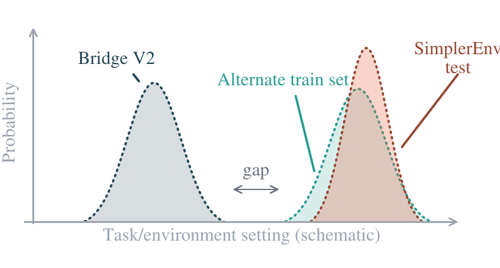
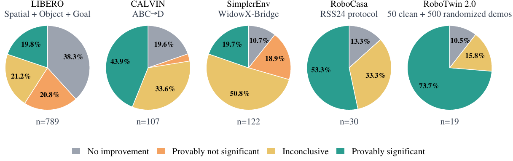
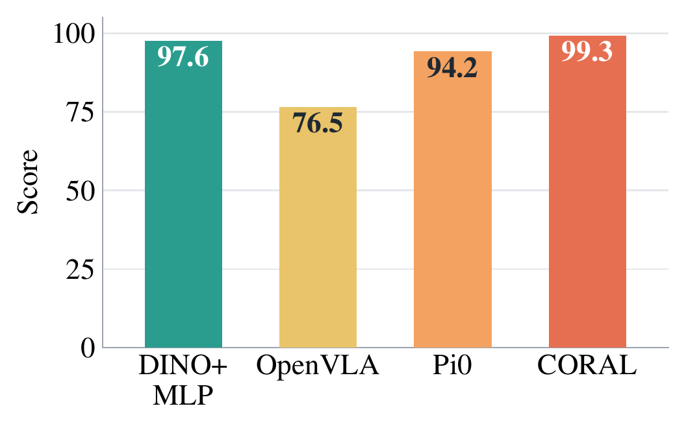
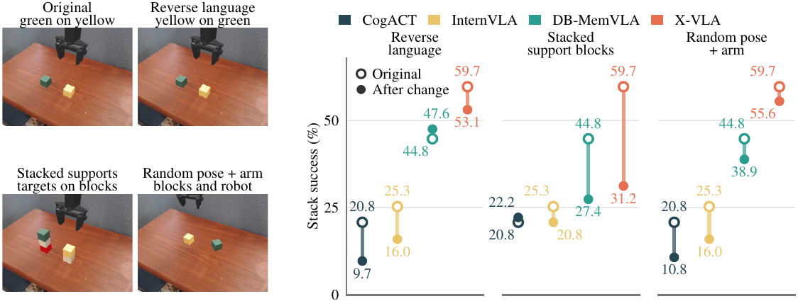

# What Are We Actually Benchmarking in Robot Manipulation?

#

# 基本信息

- arXiv: 2606.04233
- Authors: Tianchong Jiang, Xiangshan Tan, Samuel Wheeler, Luzhe Sun, Tewodros W. Ayalew, Matthew Walter
- Categories: cs.RO
- 一句话结论：主流机器人操作基准测试存在系统性失效风险，单一高分不能自动等同于通用操作能力；作者提出四种诊断工具并审计了五大基准，揭示出 LIBERO 与 CALVIN 在捷径可解性、统计显著性与渐进式过拟合上问题尤为严重。

#

# 研究问题

论文追问：当 VLA（Vision-Language-Action）模型与通用操作策略在 LIBERO、CALVIN 等基准上不断刷新 SOTA 时，这些数字究竟在多大程度上反映了真实的通用操作能力？在 Embodied AI 领域，基准分数被广泛当作能力代理指标（proxy），但本文指出，固定评估设置下的聚合成功率可能因四种失效模式而与真实泛化能力脱钩。这对当前以 World Model 与 VLA 为核心的机器人学习研究具有直接警示意义：如果基准本身不可信，基于这些基准训练与验证的 World Model 下游任务评估也将建立在流沙之上。

#

# 任务与挑战

具体任务是对五个最常被引用的操作基准（LIBERO、CALVIN、SimplerEnv、RoboCasa、RoboTwin 2.0）进行有效性审计。输入是各基准的官方协议与已发表策略的聚合分数，输出是四种诊断下的失效报告。

已有方法的问题在于：

1. **Shortcut solvability**：基准测试的指令集固定且公开，策略可能通过任务 ID 查表而非语言理解来取得高分。
2. **统计显著性缺失**：大多数论文仅报告平均成功率，缺乏任务级与样本级的不确定性量化，导致微小提升被宣称为 SOTA。
3. **Creeping overfitting**：测试分布可能是训练分布的狭窄切片，策略可能过拟合到固定的测试位姿或场景，而非习得鲁棒技能。
4. **Data-source dependence**：当训练数据与测试数据之间存在分布间隙（gap）且训练数据来源不受限时，高分可能来自"消除间隙"而非"跨越间隙"的泛化。



上图直观展示了数据源依赖的核心风险：Bridge V2 的真实世界演示分布与 SimplerEnv 的仿真测试分布之间存在显著 gap。若训练数据来源不受限，策略可以通过在测试邻近区域采集数据来"绕过"泛化挑战，使基准分数失去对真实能力的鉴别力。

#

# 核心 Insight

本文的核心思想是：基准分数只是对固定测试分布的 empirical average，它只有在满足一系列结构性假设时才能成为通用能力的有效代理。作者系统性地识别并操作化了四种使代理失效的机制，并为每种机制提供了可复现的诊断工具。

具体而言，作者指出当前社区存在一种"分数即能力"的推理谬误。一个策略在 LIBERO 上达到 99% 的成功率，并不证明它理解了自然语言指令或具备大规模预训练带来的泛化能力——因为一个没有语言编码器、仅有 0.09B 参数的 DINOv2+MLP 探针也能达到同等水平。同样，一个策略在 CALVIN 上刷新了 ATC（Average Tasks Completed）记录，其提升幅度可能落在统计噪声范围内；而它在官方测试网格上的高分，也可能在仅重采样方块位姿后就大幅崩塌。这些诊断共同指向一个结论：未来可信的基准设计必须同时拓宽测试分布、强制统计显著性标准，并限制训练数据的邻近性。

#

# 方法与公式

论文为四种失效模式分别设计了诊断方法，其中统计显著性诊断涉及可复现的假设检验框架。

#

## 1. Shortcut Solvability 诊断

构建一个极简探针：DINOv2 图像编码器 + 小型 MLP 头，参数量约 0.09B。该探针**不包含**语言编码器、扩散头或动作分词器，且仅在 LIBERO/CALVIN 等基准上使用 learned per-task embedding（通过任务索引查表，而非读取文本指令）。若该探针在官方协议下达到或逼近 SOTA，则证明基准存在捷径。

#

## 2. Statistical Significance 诊断

考虑两个策略 $A$ 与 $B$ 在 $T$ 个任务、每任务 $S$ 个配对样本上的比较。设任务 $t$ 与样本 $i$ 上的观测结果为 $Y_{A,t,i}, Y_{B,t,i} \in \{0,\dots,R\}$，定义配对差异：

```math
\delta_{t,i} = Y_{B,t,i} - Y_{A,t,i}, \quad d_t = \sum_{i=1}^S \delta_{t,i}, \quad s_t = \sum_{i=1}^S \delta_{t,i}^2
\tag{1}
```

检验 $H_0: \Delta \le 0$ 对 $H_1: \Delta > 0$ 的配对分层 Wald 统计量为：

```math
Z = \frac{TS(\widehat\mu_B - \widehat\mu_A)}{\sqrt{\frac{S}{S-1}\sum_{t=1}^T\left(s_t - \frac{d_t^2}{S}\right)}}
\tag{2}
```

其中 $\widehat\mu_A, \widehat\mu_B$ 为两个策略的聚合平均分，$\Delta$ 为基准层面的真实平均提升。

由于论文通常仅报告聚合分数，作者推导了两个仅依赖 top-line metrics 的截断值：

- **Rejection-feasibility threshold** $\delta_{\exists}(\widehat\mu_A; T,S,R,\alpha)$：若报告的经验差距 $\widehat\Delta < \delta_{\exists}$，则**没有任何**与聚合分数兼容的配对结果表能拒绝 $H_0$。
- **Rejection-guarantee threshold** $\delta_{\forall}(\widehat\mu_A; T,S,R,\alpha)$：若 $\widehat\Delta \ge \delta_{\forall}$，则**所有**兼容的配对结果表都拒绝 $H_0$。

两者之间的区域称为 **inconclusive**（无法判定）。

对于独立采样（非配对）评估，上述截断值仍可作为保守边界使用，但不再 sharp。

#

## 3. Creeping Overfitting 诊断

区分两种过拟合：

- **Distribution overfitting**：在训练分布支持内重采样测试条件（如 CALVIN 的方块位姿、SimplerEnv 的语言指令与支撑结构），观察性能下降。
- **Sample overfitting**：使用相同生成器重新抽取测试样本（如 LIBERO 的 init-state、CALVIN 的 sequence manifest），观察性能变化。

置信区间计算采用 Newcombe–Wilson 区间。对于比例差 $p_c - p_a$，先分别构建 Wilson 区间 $[L_c, U_c]$ 与 $[L_a, U_a]$：

```math
\text{center} = \frac{p + z^2/(2n)}{1 + z^2/n}, \quad \text{half} = \frac{z\sqrt{p(1-p)/n + z^2/(4n^2)}}{1 + z^2/n}
\tag{3}
```

```math
[L, U] = [\text{center} - \text{half},\ \text{center} + \text{half}]
\tag{4}
```

进而得到差异的 Newcombe 区间：

```math
\text{lower} = \text{drop} - \sqrt{(p_c - L_c)^2 + (U_a - p_a)^2}, \quad \text{upper} = \text{drop} + \sqrt{(U_c - p_c)^2 + (p_a - L_a)^2}
\tag{5}
```

对于 CALVIN 的配对序列数据，使用配对 Wald 区间：

```math
\text{CI} = \text{drop} \pm z \frac{\mathrm{sd}(d_i)}{\sqrt{1000}}
\tag{6}
```

#

## 4. Data-Source Dependence 诊断

针对 SimplerEnv 等训练-测试存在显著 gap 且训练数据来源不受限的基准，在测试邻近区域采集脚本演示数据（scripted demonstrations），训练小型策略。若该策略能逼近大规模 VLA 的分数，则证明高分不能区分"消除 gap"与"跨越 gap"。



上图展示了统计显著性审计的结果。在 LIBERO 与 SimplerEnv 上，"Provably significant"（可证明显著）的改进占比不足两成，而 RoboCasa 与 RoboTwin 2.0 的显著性比例明显更高——部分原因是后两者报告结果较少，分数间距更大。

#

# 贡献拆解

1. **提出了四种可操作的基准失效诊断工具**
   - 做了什么：将计算机视觉与 NLP 领域的基准审计经验系统迁移到机器人操作领域，针对 shortcut solvability、统计显著性、渐进式过拟合和数据源依赖各设计了一套可复现的诊断协议与参考实现。
   - 为什么有效：每种诊断都对应一种具体的"分数-能力"脱钩机制，且不需要重新训练所有 SOTA 模型即可执行。
   - 和已有方法差别：不同于 LIBERO-Pro/Plus 等通过构造 OOD 测试来暴露弱点，本文的 creeping overfitting 诊断刻意保持在训练分布内部重采样，从而区分"过拟合"与"弱泛化"。

2. **推导了基于有界分数 Wald 检验的 top-line 显著性截断值**
   - 做了什么：在仅已知聚合平均分的场景下，推导了拒绝可行性阈值 $\delta_{\exists}$ 与拒绝保证阈值 $\delta_{\forall}$ 的精确（sharp）边界。
   - 为什么有效：使得审稿人与读者无需原始配对结果表即可判断报告的提升是否可能显著。
   - 和已有方法差别：传统做法依赖作者自行报告标准差或进行配对检验，本文的截断值允许从公开分数直接进行保守审计。

3. **通过极简探针暴露 LIBERO 与 CALVIN 的捷径可解性**
   - 做了什么：用 0.09B 参数的 DINO+MLP 探针（无语言编码器、无机器人预训练）在 LIBERO 三个套件上达到或逼近 SOTA。
   - 为什么有效：证明这些基准的高分不是语言理解或大规模预训练的必要证据。
   - 和已有方法差别：以往工作通过构造更难的 OOD 基准来推动领域进步，本文则反向证明现有基准的"及格线"过低。

4. **量化了渐进式过拟合在主流基准上的普遍程度**
   - 做了什么：在 CALVIN 上仅重采样训练范围内的方块位姿，即导致 X-VLA 的 ATC 从 4.17 降至 3.14；在 SimplerEnv 上通过反转语言、堆叠支撑块、随机位姿等分布内变体，暴露策略对固定测试条件的过拟合。
   - 为什么有效：这些变体在训练数据中出现的频率与官方条件相当，因此性能下降只能归因于对狭窄测试分布的过拟合。
   - 和已有方法差别： prior work 通常通过跨域迁移测试来评估泛化，本文则通过在训练分布内部"扰动"来隔离过拟合效应。

#

# 关键图表解读

**图 1：数据源依赖示意图（figure-002-teaser-data-source-dependence.png）**

该图以概率分布曲线示意了 Bridge V2 训练集与 SimplerEnv 测试集之间的分布 gap。左侧的 Bridge V2 分布与右侧的 SimplerEnv 测试分布之间存在明显间隔，标注为"gap"。图中还示意了"Alternate train set"——即在测试集附近采集的替代训练数据。该图支撑了论文关于 data-source dependence 的核心论点：当基准不限制训练数据来源时，高分可能仅仅反映训练数据与测试数据的邻近性，而非策略的跨域泛化能力。读图时应注意，这是一个概念性示意图（schematic），而非真实数据分布的核密度估计。

**图 2：SimplerEnv 渐进式过拟合实验（figure-001-creeping-overfitting-simplerenv-dumbbell.png）**

左侧展示了四种场景变体的渲染图：Original（green on yellow）、Reverse language（yellow on green）、Stacked support blocks、Random pose + arm。右侧的哑铃图（dumbbell plot）展示了四种策略（CogACT、InternVLA、DB-MemVLA、X-VLA）在原始条件（空心圆）与修改后条件（实心圆）下的堆叠成功率。该图是 creeping overfitting 诊断的核心证据。关键读图要点：X-VLA 在 Reverse language 上保持 59.7%→53.1%，但在 Stacked support blocks 上骤降至 31.2%；而 DB-MemVLA 在 Reverse language 上甚至略有上升（44.8%→47.6%），却在 Stacked support 上降至 27.4%。这表明不同策略对分布内变体的脆弱性模式不一致，且高基线分数可能建立在对特定视觉-语言条件的隐性过拟合之上。

**图 3：统计显著性审计饼图（figure-003-statistical-significance-pies.png）**

五个饼图分别对应 LIBERO、CALVIN、SimplerEnv、RoboCasa 和 RoboTwin 2.0，将报告的提升分为四类：No improvement（无改进）、Provably not significant（可证明不显著）、Inconclusive（无法判定）、Provably significant（可证明显著）。该图直接支撑了"大多数报告收益缺乏统计显著性"的结论。读图时应注意两点：第一，LIBERO 与 SimplerEnv 的"Provably significant"占比分别仅为 19.8% 和 19.7%；第二，RoboTwin 2.0 的显著性比例高达 73.7%，但样本量极小（$n=19$），因此其高比例部分源于报告结果稀疏导致的分数间距大，而非该基准天然更易产生显著差异。

**图 4：LIBERO 极简探针与 VLA 对比（figure-007-teaser-minimum-reproduce.png）**

柱状图对比了 DINO+MLP（97.6）、OpenVLA（76.5）、Pi0（94.2）与 CORAL（99.3）在 LIBERO 上的得分。该图是 shortcut solvability 诊断中最有力的视觉证据。读图关键：一个 0.09B 参数、无语言编码器的探针不仅超越了 7B 参数的 OpenVLA，还逼近甚至超过了许多大规模 VLA 模型。这并不意味着 DINO+MLP 是更好的操作策略，而是说明 LIBERO 的测试协议允许通过视觉特征 + 任务索引查表的方式达到高分，从而削弱了该基准作为"通用操作能力"代理的效度。

#

# 实验与消融

**数据集与设定**：审计覆盖 LIBERO（4 个 suite）、CALVIN（3 个 protocol）、SimplerEnv（WidowX 任务）、RoboCasa（RSS24 protocol）和 RoboTwin 2.0（50 clean + 500 randomized demos）。

**Shortcut Solvability 结果**：

- LIBERO：DINO+MLP 探针在 Spatial、Object、Goal 三个套件上分别达到 99.0%、100.0%、98.8%，与最佳报告结果（如 $\pi_0$+T-MEE、MoLA）差距在 1 个百分点以内；仅在 Long 套件上差距较大（92.4% vs 98.8%）。
- CALVIN：探针在 D→D 达到 3.123 ATC，ABC→D 达到 3.242，与早期基础 VLA（如 RoboFlamingo 2.48）相当，但低于当前最佳（MMaDA-VLA 4.78）。
- SimplerEnv：探针在标准 BridgeData V2 上训练后得分为 0.0%，说明该基准在此诊断下未暴露捷径。
- RoboCasa 与 RoboTwin 2.0：探针分别仅得 18.8% 与约 60%，远低于 SOTA，表明这两个基准的捷径可解性较低。



**统计显著性结果**：

- LIBERO：在 789 次前后最佳比较中，仅 19.8% 可证明显著，38.3% 无改进，21.2% 无法判定。
- CALVIN：107 次比较中 43.9% 可证明显著，33.6% 无法判定。
- SimplerEnv：122 次比较中仅 19.7% 可证明显著，50.8% 无法判定。
- RoboCasa 与 RoboTwin 2.0：显著性比例分别为 53.3%（$n=30$）和 73.7%（$n=19$）。

**Creeping Overfitting 结果**：

- CALVIN（ABC→D）：在官方 1000-sequence manifest 上，X-VLA 的 ATC 为 4.165；仅在训练范围内重采样方块位姿后降至 3.138（drop 1.027，95% CI $[+0.890, +1.164]$）。5/5 chain success 从 70.9% 降至 45.9%（drop 25.0%）。GR-1 与 RoboFlamingo 也出现显著下降。
- SimplerEnv：四种策略在 Reverse language、Stacked support、Random pose+arm 三种变体下均出现不同程度的性能下降（见表）。值得注意的是，X-VLA 在 Stacked support 上下降最剧烈（28.47 个百分点），暗示其可能依赖"方块置于桌面"的隐性假设。
- LIBERO 与 CALVIN 的 Sample overfitting：重新抽取 init state 或 sequence manifest 后，性能波动均小于 1 个百分点，表明固定样本过拟合的风险相对可控，而分布过拟合是更主要的威胁。



**Data-Source Dependence 结果**：

在 SimplerEnv 上，使用 22M 参数的 DINOv2-S + MLP 策略，仅在测试网格附近采集 120 条脚本演示数据 per task，即可达到 94.8%（91/96），逼近 0.9B X-VLA 的 95.8%（92/96）。

**最强证据**：DINO+MLP 探针在 LIBERO 上逼近 SOTA（图 4），以及 CALVIN 上仅重采样位姿就导致 X-VLA 的 ATC 下降超过 1 分（约 25% 相对下降），这两个实验最直接地挑战了"高分=高能力"的默认假设。

**最存疑证据**：RoboTwin 2.0 的统计显著性比例（73.7%）可能给读者留下"该基准更可靠"的印象，但其样本量仅 $n=19$，远小于 LIBERO 的 $n=789$。作者也在文中承认，RoboCasa 和 RoboTwin 2.0 的显著性比例较高"partly because ... fewer reported results, so the scores sit further apart"。因此，不宜直接跨基准比较该比例的绝对高低。

#

# 局限性

1. **理想测试的不可行性**：作者承认，最理想的审计应是在共享训练数据上训练所有策略，并在大规模真实世界任务上评估排名相关性，但这在实践中不可行。四种诊断只是实用替代，而非充分必要条件。

2. **策略可复现性受限**：对于 creeping overfitting 等诊断，需要开源权重与评估脚本才能复现。大多数策略并未同时公开两者，导致审计样本受限（如 CALVIN 仅测试了 3 个策略，SimplerEnv 仅 4 个）。

3. **探针调参与测试集选择**：DINO+MLP 探针在 LIBERO 上使用了多个 checkpoint 并在测试集上选择最佳（test-set checkpoint selection），这本身是乐观的。但作者指出，这是基准协议允许的弱点，而非探针的作弊。尽管如此，这仍可能高估探针的真实性能。

4. **统计显著性截断值的保守性**：对于独立采样评估（非配对），使用的 paired envelopes 是保守的，可能导致一些实际显著的提升被归类为 inconclusive。

5. **bitwise 非确定性**：闭环评估中，不同硬件（CPU/GPU）可能导致仿真状态、像素、动作和成功标签的逐位差异，这给跨硬件复现带来了额外噪声。

6. **SimplerEnv 数据源依赖的极端性**：在测试附近采集脚本演示是一种极端情况，旨在证明"可能性"而非进行公平比较。作者明确声明这不代表小型策略优于 X-VLA，仅说明分数本身无法区分两种解释。

#

# 个人研究判断

面向"World Models assisting Embodied AI downstream tasks"的研究方向，这篇论文**非常值得继续追踪**。

理由如下：

- **基准效度是世界模型研究的先决条件**：如果 World Model 的下游操作任务评估建立在 LIBERO、CALVIN 等失效基准上，那么世界模型对动作预测、物理推理和长期规划的贡献将被噪声掩盖。本文提供的诊断工具可直接用于世界模型论文的投稿前自审。
- **对 VLA 与 World Model 结合路线的警示**：当前许多 VLA 工作（如 OpenVLA、$\pi_0$、GR-1）依赖这些基准进行预训练与微调。论文表明，在 LIBERO 上刷点可能只需视觉特征 + 任务嵌入，这对声称"语言理解"或"世界知识"带来增益的 VLA-World Model 混合架构提出了更高的举证要求。
- **推动更宽分布与自适应评估**：论文在 Discussion 中提到的 Item Response Theory（IRT）与自适应测试（CAT）方向，与 World Model 研究高度契合——World Model 的核心优势在于生成与推理能力，而固定窄分布的基准无法体现这种优势。未来若出现基于 World Model 生成难度自适应测试实例的基准，将同时解决 creeping overfitting 与统计功效不足的问题。
- **可复现性与社区治理价值**：论文开源了诊断工具与引用追踪器，这种元科学（meta-science）工作对 Embodied AI 社区的健康发展具有长期价值，尤其适合作为审稿时的参照标准。

综上，本文不仅是一篇基准审计，更是一份关于如何正确测量具身智能的方法论宣言。对于任何在 World Model 与机器人操作交叉领域工作的研究者，理解其诊断逻辑并将其纳入实验设计流程，是避免无效优化与错误结论的必要步骤。
