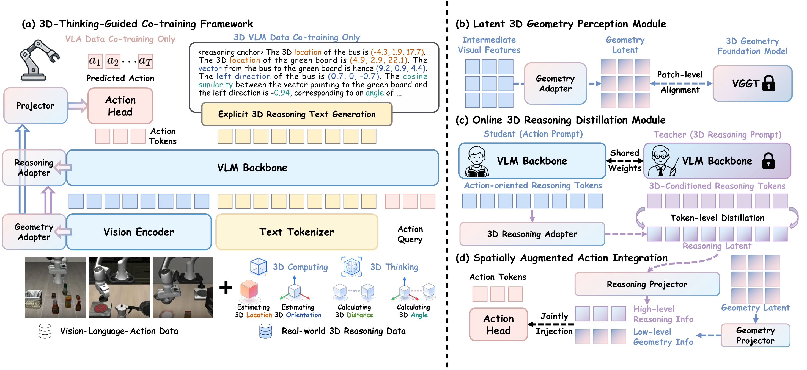
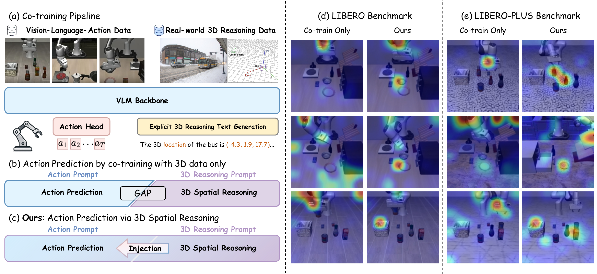
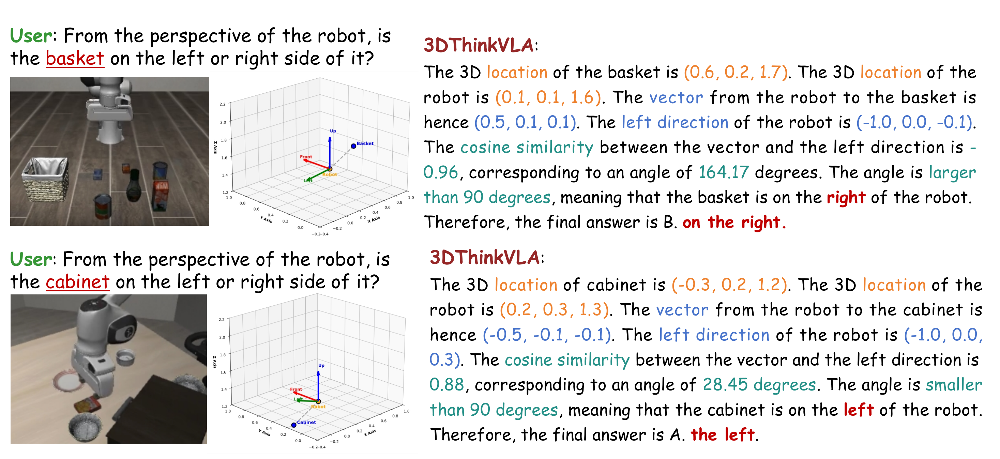
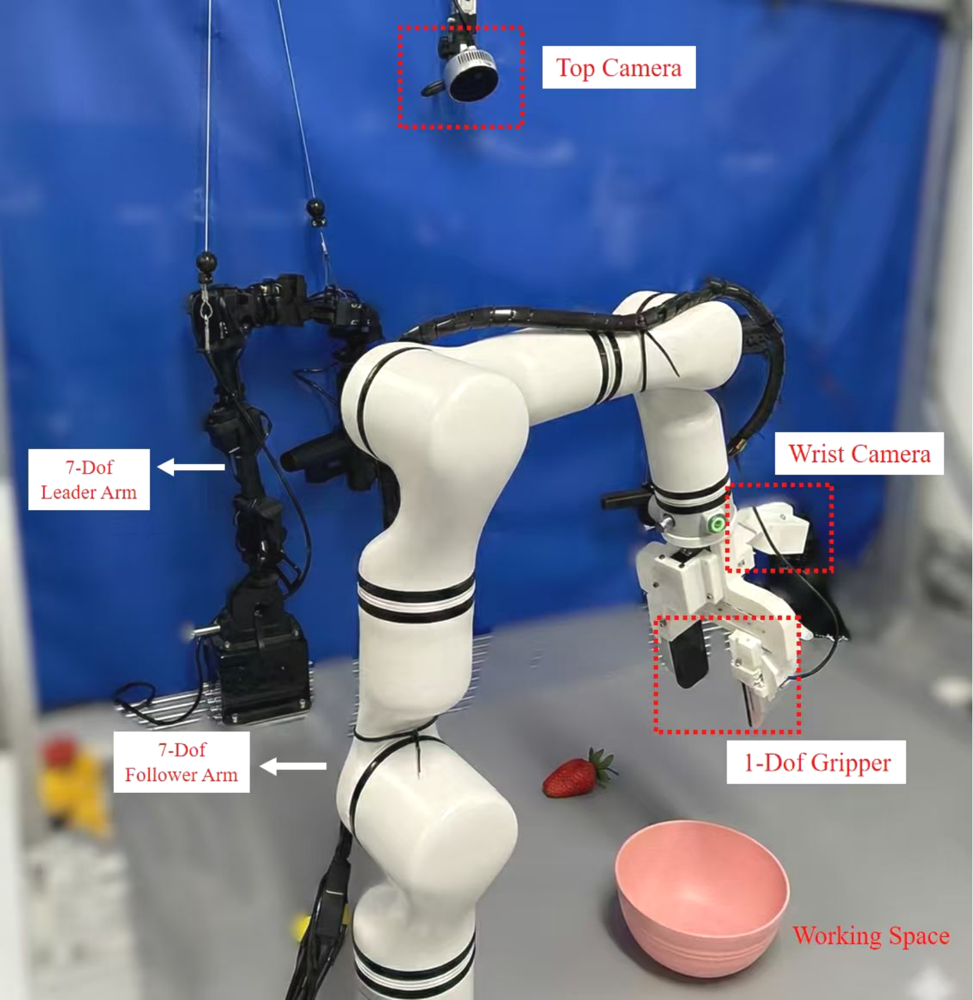

# 3DThinkVLA: Endowing Vision-Language-Action Models with Latent 3D Priors via 3D-Thinking-Guided Co-training

#

# 基本信息

- arXiv: [2606.04436](http://arxiv.org/abs/2606.04436v1)
- Authors: Jiaxin Shi, Xidong Zhang, Fucai Zhu, Zhe Li, Siyu Zhu, Weihao Yuan
- Categories: cs.CV, cs.RO

#

# 研究问题

3DThinkVLA: Endowing Vision-Language-Action Models with Latent 3D Priors via 3D-Thinking-Guided Co-training

#

# 任务与挑战

We propose a 3D-thinking-guided co-training framework that enables vision-language-action (VLA) models to perform 3D spatial reasoning implicitly during action prediction. Our core insight is that 3D geometry perception and 3D spatial reasoning are distinct capabilities that can be disentangled and injected at different feature hierarchies. During training, three tightly coupled components work in concert primarily within the latent space: (1) To gain geometric priors, a latent 3D geometry perception module aligns intermediate visual features with a 3D foundation model, acquiring low-level geometric cues without architectural modifications to the VLM backbone. (2) Complementing this, an online 3D reasoning distillation module mitigates the prompt-induced reasoning gap via a shared reasoning anchor token. During 3D VLM co-training, this anchor is emitted as the first output token to robustly encode spatial priors. During VLA training, it serves as an input token inserted between the task and action instructions, transferring high-level spatial thinking from explicit teacher reasoning prompts to student action prompts without chain-of-thought text generation. (3) These disentangled geometric and reasoning features are then united by a spatially augmented action integration, which jointly injects them into the action-query tokens as hierarchical spatial conditions to prevent action shortcuts. At deployment, our method retains only its lightweight adapters to perform implicit 3D reasoning, discarding the 3D foundation model and the teacher branch used for supervision. Consequently, it operates purely on 2D images without 3D sensors, external models, or explicit text generation while preventing catastrophic forgetting of the pretrained VLM, achieving state-of-the-art performance on LIBERO, LIBERO-PLUS, SimplerEnv, and real-world manipulation tasks.

#

# 核心 Insight

这篇论文的核心价值需要结合原文继续复查。当前 fallback 笔记保留了日报分析、DeepResearch 草稿和已筛选图表，避免自动流程中断。

#

# 方法与公式

DeepResearch 未生成；请回看论文正文中的方法章节与关键公式。

#

# 贡献拆解

- 关键术语：未提取
- 加权评分：3.0/5.0

#

# 关键图表解读

*完整展示了3DThinkVLA的四大核心模块（协同训练框架、潜在3D几何感知、在线3D推理蒸馏、空间增强动作集成），是理解方法细节的最关键架构图。*

*同时涵盖方法动机（简单co-training存在GAP vs 本文Injection机制）和LIBERO/LIBERO-PLUS上的注意力可视化对比，能直观展示引入3D空间推理后模型关注区域的改进。*

*直接呈现模型在具身问答中进行显式3D推理的完整思维链（3D坐标、向量计算、余弦相似度、角度判断），最能体现论文“3D-Thinking”这一核心创新点。*

*展示真实世界实验的硬件平台（7-DoF主从臂、腕部/顶部相机、1-DoF夹爪），支撑论文在真实场景下验证方法有效性的实验结论。*

#

# 实验与消融

请优先核对主结果表、消融实验和真实/仿真任务设置；若图表已选中，应结合上方图片逐项复查。

#

# 局限性

当前自动精读未能成功调用完整图文生成模型，因此局限性需要结合原文实验设置进一步人工确认。

#

# 个人研究判断

若该论文与 World Models assisting Embodied AI、VLA、robot policy 或 sim-to-real 强相关，建议进入人工精读队列。
