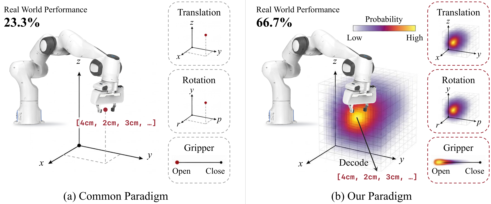
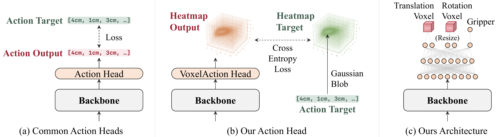
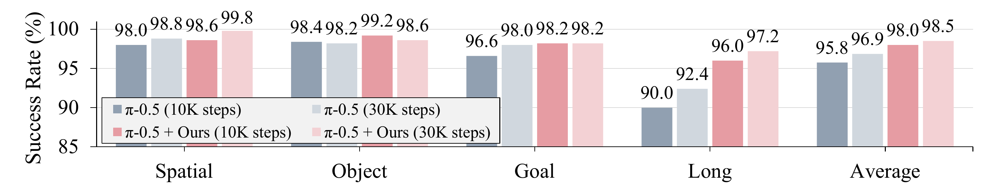
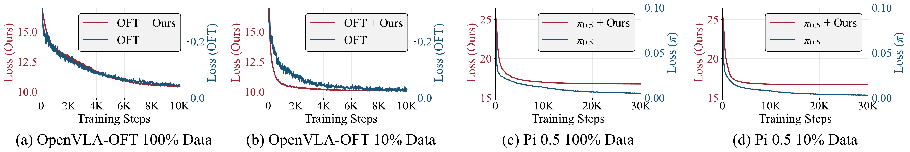

# ActionMap: Robot Policy Learning via Voxel Action Heatmap

#

# 基本信息

- arXiv: 2606.06904
- Authors: Pei Yang, Hai Ci, Yanzhe Chen, Qi Lv, Han Cai, Mike Zheng Shou
- Categories: cs.RO, cs.CV
- 一句话结论：通过将VLA的动作解码器替换为体素热力图预测头，在不修改骨干网络的前提下，显著提升了策略的数据效率、收敛速度与末端执行器定位精度。

#

# 研究问题

当前视觉-语言-动作（VLA）模型的动作解码器长期停滞于单点预测范式（如L1回归、自回归分桶或流匹配去噪），将连续动作空间视为无结构向量，忽略了相邻动作在几何与物理上的邻近性。这导致训练信号稀疏、数据效率低下，且难以捕捉多模态示教中的分布信息，从而限制了末端执行器的定位精度与策略收敛速度。本文旨在解决：如何在不改动VLA骨干网络的前提下，设计一种能够显式利用动作空间几何结构的动作表示与解码机制。

#

# 任务与挑战

具体任务为指令跟随的机器人操作（Instruction-Following Manipulation），输入为视觉观测与语言指令，输出为7维末端执行器动作（3维平移、3维旋转、1维夹爪）。训练采用行为克隆（Behavior Cloning）框架，在LIBERO仿真四套件（Spatial, Object, Goal, Long）及真实Franka机器人三项任务（Pick, Sweep, Insert）上评测。

已有方法的核心不足在于：

1. **单点预测的稀疏监督**：L1回归仅对单一坐标施加监督，邻近动作值即使物理相似也获得零梯度；
2. **动作空间结构缺失**：自回归token或流匹配将动作维度独立处理，未显式编码平移/旋转空间中的局部几何关系；
3. **数据效率瓶颈**：在低数据场景下，单点估计器容易过拟合或崩溃，而结构化分布预测可通过软标签利用更多训练信号。

#

# 核心 Insight

本文的核心观察是：末端执行器动作空间具有天然的几何结构，相邻动作在物理意义上高度相关。因此，动作预测不应被简化为对单个连续向量的点估计，而应被重新定义为在离散化动作空间上的**空间结构化分类**问题——即预测一个体素热力图概率分布。



如图所示，传统范式（a）直接在连续空间中预测单点动作（如 $[4\mathrm{cm}, 2\mathrm{cm}, 3\mathrm{cm}, \dots]$），真实世界性能受限（23.3%）。本文范式（b）将动作空间离散化为体素网格，预测每个动作取值的概率热力图，再通过解码恢复连续动作。这种分布式表示允许模型在训练阶段通过高斯软标签向邻近体素传播梯度，在推理阶段通过概率加权平均获得亚体素精度的连续动作，从而将动作空间的几何邻近性转化为可学习的归纳偏置。

#

# 方法与公式

#

## 模型架构

ActionMap是一个即插即用（drop-in）的Action Head，直接替换现有VLA的原生解码器，而保留骨干网络、视觉-语言编码器及训练配方不变。



如图（c）所示，网络结构包含：

- **共享MLP Trunk**：接收骨干网络输出的动作token隐状态 $\mathbf{h}$；
- **三分支并行输出**：
  - Translation Head：输出 $N_x \times N_y \times N_z$ 的3D体素网格Logits；
  - Rotation Head：输出 $N_\phi \times N_\theta \times N_\psi$ 的3D体素网格Logits；
  - Gripper Head：输出2维Logits（Open/Close）。

#

## 训练目标：高斯软标签与交叉熵

对于每个动作分量，将Ground-Truth动作坐标映射到对应体素网格位置，构建以该坐标为中心的Gaussian Blob目标分布。设分支 $c$ 的Ground-Truth动作为 $\mathbf{a}^*_c$，体素网格为 $\mathcal{B}_c$，网格中心为 $b$，则软标签目标为：

```math
q_\sigma(b;\,\mathbf{a}^*_c)
=
\frac{\exp\!\left(-\left\lVert b - \mathbf{a}^*_c \right\rVert^2 / 2\sigma^2\right)}
{\sum_{b' \in \mathcal{B}_c} \exp\!\left(-\left\lVert b' - \mathbf{a}^*_c \right\rVert^2 / 2\sigma^2\right)}
\tag{1}
```

其中 $\sigma$ 控制高斯 blob 的宽度，邻近体素获得非零软标签，显式编码动作空间的几何邻近性。

训练损失为预测Softmax分布与Gaussian Blob目标之间的交叉熵，对平移、旋转、夹爪三分支求和：

```math
\mathcal{L}
=
-\sum_{c \in \{\mathrm{trans},\,\mathrm{rot},\,\mathrm{grip}\}}
\sum_{b \in \mathcal{B}_c}
q_\sigma(b;\,\mathbf{a}^*_c)
\log p_\theta^{(c)}(b \mid \mathbf{h})
\tag{2}
```

这里 $p_\theta^{(c)}(\cdot \mid \mathbf{h})$ 表示给定隐状态 $\mathbf{h}$ 时分支 $c$ 的预测Softmax概率。夹爪分支是退化情形，$|\mathcal{B}_{\mathrm{grip}}|=2$，目标退化为One-Hot向量。总损失还需对Chunked Prediction的 $T$ 个动作槽位求和。

#

## 推理：Top-$k$ Soft-Argmax 解码

推理时需从热力图中恢复连续动作值。对于Logits $z$，先选取概率最高的 $k$ 个体素，经Temperature Softmax归一化后做概率加权平均：

```math
\hat{a}
=
\sum_{b \in \mathrm{TopK}_k(z)}
\widetilde{\mathrm{softmax}}(z / T)_b \cdot b
\tag{3}
```

其中 $\widetilde{\mathrm{softmax}}$ 表示仅在保留的 $k$ 个体素上重新归一化的Softmax，$T$ 为温度系数。默认设置 $k=10$，$T=1.0$。该解码方式可微且比硬Argmax更稳定，能实现亚体素（sub-voxel）精度的连续动作恢复。夹爪命令直接取2维Argmax。

#

# 贡献拆解

1. **体素热力图动作头（Voxel Heatmap Action Head）**
   - **做了什么**：提出首个可即插即用于大规模预训练VLA的三维体素热力图动作解码器，将动作预测从单点回归转化为空间分布分类。
   - **为什么有效**：通过Gaussian Blob软标签，将动作空间的几何结构显式注入监督信号，使邻近动作共享梯度，缓解了单点监督的稀疏性。
   - **和已有方法差别**：不同于PerAct等在小规模专用骨干上的体素预测，ActionMap可直接替换OpenVLA-OFT、$\pi_{0.5}$等现代VLA的解码器，无需改动骨干网络。

2. **跨骨干网络的普适性验证**
   - **做了什么**：在架构迥异的OpenVLA-OFT（L1回归）与 $\pi_{0.5}$（流匹配）上均替换原生动作头，验证了性能提升的一致性。
   - **为什么有效**：证明动作表示本身是与骨干网络规模、训练配方独立的性能杠杆，而非特定架构的耦合产物。
   - **和已有方法差别**：以往空间动作头（如RVT-2）与特定多视图CNN或Perceiver-IO紧密耦合，本文展示了在大规模预训练VLA上的通用性。

3. **数据效率与收敛速度提升**
   - **做了什么**：在LIBERO-Spatial的10%数据量下，相比OpenVLA-OFT提升26.0%（93.2% vs 67.2%）；在多个设置下收敛速度显著快于基线。
   - **为什么有效**：分布式监督使每个演示样本向整个动作邻域传播信号，而非仅监督单一坐标，从而在低数据场景下更充分地利用有限样本。
   - **和已有方法差别**：传统L1回归在数据量下降时迅速崩溃，而热力图监督通过软标签保持了稳定的梯度流。

4. **真实世界精度量化**
   - **做了什么**：在Franka机器人三项任务上，将末端执行器抓取定位误差缩小2–3倍（4.8 mm vs 约15 mm），并在全数据设置下以20/30对7/30完胜OpenVLA-OFT。
   - **为什么有效**：热力图的空间归纳偏置迫使模型在离散网格上做出空间一致的概率承诺，减少了流匹配或回归中因多模态平均导致的方差膨胀。
   - **和已有方法差别**：提供了毫米级的真实世界定位误差分析，补充了仿真成功率指标。

#

# 关键图表解读

#

## 图1：传统范式 vs. ActionMap范式


该图以左右对比方式直观呈现了论文的核心动机。左侧（Common Paradigm）展示传统单点预测：动作头输出单一连续向量（如 $[4\mathrm{cm}, 2\mathrm{cm}, 3\mathrm{cm}, \dots]$），真实世界成功率仅23.3%。右侧（Our Paradigm）展示ActionMap的分布式预测：在离散化的平移、旋转、夹爪空间上分别预测概率热力图（颜色越亮概率越高），再通过Decode恢复动作，真实世界成功率提升至66.7%。读图时需注意：热力图被可视化在末端执行器坐标系中，且平移与旋转分别使用独立的3D网格，夹爪使用1D概率分布。

#

## 图2：方法架构与训练流程


该图包含三个子图，是理解方法设计的核心：

- **(a) Common Action Heads**：传统L1回归头直接输出动作向量，与Ground-Truth计算L1 Loss。
- **(b) Our Action Head**：VoxelAction Head输出体素热力图，Ground-Truth动作被转换为Gaussian Blob作为软标签，两者计算Cross Entropy Loss。
- **(c) Ours Architecture**：具体网络实现，共享Backbone输出的隐状态经过共享Trunk后，分化为Translation Voxel、Rotation Voxel和Gripper三个分支。其中Translation和Rotation为体素输出，Gripper为二值输出。读图时需注意Translation与Rotation网格在输入MLP前被展平，输出后Reshape为3D网格。

#

## 图3：LIBERO主实验结果



该图展示了OpenVLA-OFT与 $\pi_{0.5}$ 在LIBERO四套件上的成功率。每组四个柱状图分别对应不同训练步数与配置：

- 蓝色系：基线 $\pi$-0.5 在10K/30K步数；
- 红色系：$\pi$-0.5 + Ours 在10K/30K步数。

关键读图要点：

- 在Spatial、Object、Goal三个套件上，各方法已接近饱和，但ActionMap仍带来稳定增益；
- **在Long套件上差距最大**：基线10K步数时成功率仅90.0%，而ActionMap在10K步数时达96.0%，在30K步数时达97.2%，直接支撑了“热力图头对长程任务最有益”的论点；
- Average列显示，ActionMap在30K步数时达到98.5%，相比基线96.9%提升1.6%，而在OpenVLA-OFT上提升更显著（+8.2%）。

#

## 图4：训练损失收敛曲线



该图包含四个子图，分别对应OpenVLA-OFT与 $\pi_{0.5}$ 在100%和10%数据下的训练损失。红色曲线（Ours）与蓝色曲线（Baseline）使用不同损失函数，因此绝对值不可比，但**收敛速率**可比：

- **(b) OpenVLA-OFT 10% Data**：最显著的差异。基线损失在整个10K步内持续下降未饱和，而ActionMap在约2K步即达到平台期，解释了其低数据下的巨大优势；
- **(d) Pi 0.5 10% Data**：ActionMap损失曲线同样更快进入平台，且最终值更低；
- **(a)(c) 100% Data**：两者收敛速度相当或ActionMap略快，且ActionMap的损失曲线显著更平滑，暗示更稳定的学习动态。

#

# 实验与消融

#

## 主实验结果

- **LIBERO仿真**：在OpenVLA-OFT上，ActionMap将四套件平均成功率从89.1%提升至97.3%（+8.2%），其中最难的Long套件提升+26.6%。在 $\pi_{0.5}$ 上，平均提升+1.6%（98.5% vs 96.9%），Long套件提升+4.8%。
- **真实世界Franka**：三项任务（Pick, Sweep, Insert）全数据下，ActionMap以20/30对7/30完胜OpenVLA-OFT。Pick任务中，抓取时刻末端执行器定位误差从约15 mm降至4.8 mm（全数据），从更大误差降至15 mm（50演示数据），精度提升2–3倍。
- **数据效率**：在LIBERO-Spatial的10%数据（约43条演示）下，OpenVLA-OFT基线崩溃至67.2%，ActionMap保持93.2%（+26.0%）；在50%数据时，ActionMap已超过基线全数据表现。$\pi_{0.5}$ 上各数据比例均保持小幅领先。

#

## 消融实验

1. **解码策略消融（11种变体）**：在OpenVLA-OFT上测试了硬Argmax、全网格Softmax（不同Temperature）、Top-100/1000平均等11种解码策略。结果显示四套件平均差异<1%，Long套件最大差异3.2%。这表明ActionMap的性能主要来源于训练阶段的热力图监督，而非特定的解码技巧；同时也暗示预测分布往往单峰尖锐，多模态潜力尚未释放。
2. **网格分辨率与 $\sigma$ 消融**：测试了3种网格分辨率（Translation从 $32^3$ 到 $64^3$ 级别）与4种 $\sigma$（0.05, 0.10, 0.15, 0.20）的组合。12组配置性能差异在6.4%以内，$\sigma=0.10$ 时达到全局最优。说明方法对超参具有较宽的鲁棒区间，但过粗或过细的网格均会轻微损害性能。

#

## 最强证据与最存疑证据

- **最强证据**：OpenVLA-OFT在10% LIBERO-Spatial数据下的+26.0%差距，直接证明了结构化动作监督在低数据场景下的决定性优势；真实世界Pick任务的毫米级定位误差缩小（2–3倍）提供了难以通过仿真成功率伪造的物理证据。
- **最存疑证据**：在 $\pi_{0.5}$ 上提升仅+1.6%，且在真实世界全数据下与流匹配基线打平（36/45），说明当基线已采用强生成式建模（flow matching）或数据充足时，热力图的空间归纳偏置优势被显著压缩。此外，11种解码策略差异<1%与论文“利用邻近动作几何结构”的动机之间存在张力——若几何结构真被充分利用，不同解码器鲁棒性应表现出更显著差异，这暗示热力图在实际训练中可能仍趋向单峰。

#

# 局限性

1. **网格分辨率与计算开销**：体素网格参数量随分辨率立方增长。文中使用的 $48 \times 48 \times 24$（OpenVLA-OFT）或 $64 \times 64 \times 64$（$\pi_{0.5}$）已接近实用边界，更细粒度需要自适应网格或非均匀采样，否则内存与计算成本高昂。
2. **Gripper处理的粗糙性**：夹爪仍采用二维One-Hot分类，与平移/旋转独立优化。真实世界中最主要的残余失败模式恰是夹爪释放时机错误（时序/二值问题），而非空间定位。论文附录也指出，15 Hz控制率下单步误差对应67 ms窗口，足以导致可见的误抓取。
3. **强基线下的增益压缩**：在 $\pi_{0.5}$（flow matching）上的提升幅度显著小于OpenVLA-OFT（L1回归），且真实世界全数据下与flow matching打平。作者未深入解释为何flow matching比L1回归更难被超越，这暗示ActionMap的优势在基线已具备强分布建模能力时可能被稀释。
4. **多模态与时序潜力未释放**：消融显示11种解码策略差异极小，说明热力图分布通常单峰尖锐，论文展望的多模态采样（如从多个有效抓取角度采样）和时序连贯性（chunked prediction间的跨帧约束）尚未在实验中体现。
5. **绝对坐标与Delta动作的局限**：当前网格布局在Delta动作空间（每步速度）上，虽与近期VLA惯例一致，但丧失了绝对工作空间的固定几何语义，且需处理不同机器人可达性边界的问题。

#

# 个人研究判断

面向“World Models assisting Embodied AI downstream tasks”的研究方向，这篇论文**值得继续追踪**，理由如下：

1. **动作表示的独立杠杆价值**：ActionMap证明了在VLA中，动作解码器是与骨干网络、数据规模正交的独立优化维度。对于世界模型辅助的具身智能，当前World Action Models（WAMs）的动作分支仍普遍采用单点预测（回归、自回归token或去噪）。将ActionMap的空间分布式输出引入WAMs，可在保留视频预测分支的同时，为世界模型提供更丰富的动作空间结构信号，这是论文明确展望且可直接落地的架构升级路径。

2. **Sim-to-Real与数据效率的契合**：世界模型往往需要在有限真实数据上快速适配。ActionMap在低数据场景下（10%数据+26.0%）的压倒性优势，恰好对应世界模型在真实机器人上冷启动时的数据稀缺困境。其即插即用特性允许在不改动预训练世界模型骨干的前提下，仅替换动作头即可提升策略的样本效率与空间精度。

3. **未解决问题的研究空间**：论文指出的自适应分辨率、绝对坐标网格、多模态/时序解码等局限，恰恰为后续研究提供了明确的切入点。特别是将热力图动作头与视频预测分支联合训练，探索“预测未来帧”与“预测未来动作分布”之间的互补性，是World Model领域尚未充分开垦的方向。

4. **需注意的边界条件**：若下游任务已采用强生成式基线（如flow matching）且数据充足，ActionMap的边际收益可能有限。因此，在追踪时应重点关注其在**低数据迁移**、**长程任务**和**世界模型联合训练**场景下的表现，而非单纯在充分训练的高性能基线上追求百分点提升。

综上，ActionMap不仅是一个有效的工程改进，更为“如何用结构化动作表示连接世界模型与机器人控制”提供了可复现的基线与清晰的扩展路线图。
