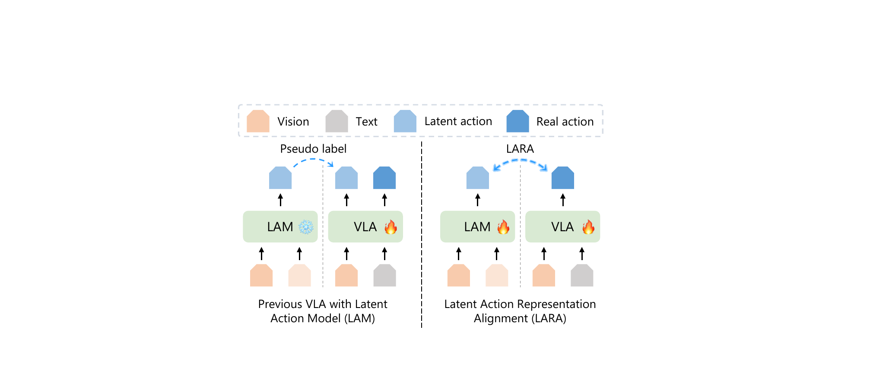
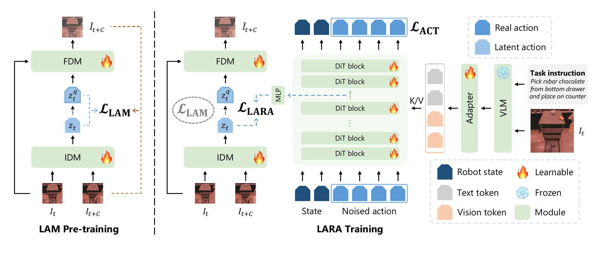
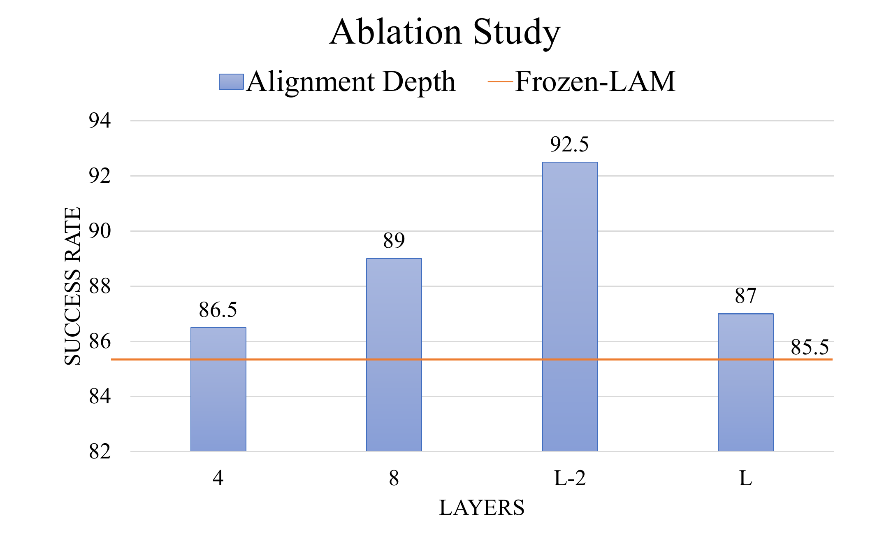
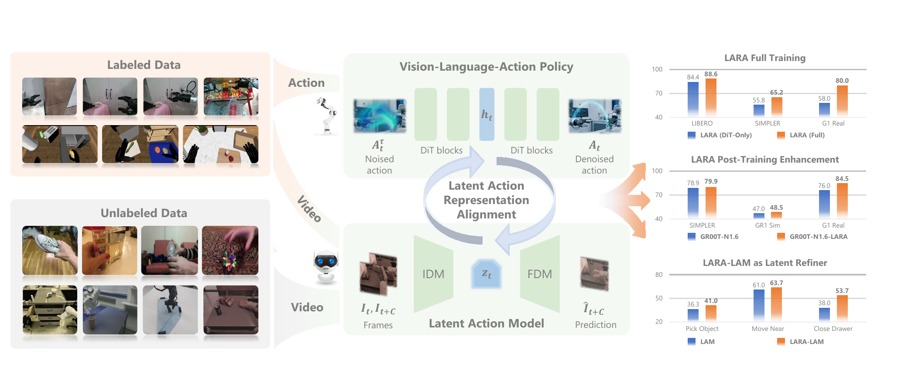

# LARA: Latent Action Representation Alignment for Vision-Language-Action Models

#

# 基本信息

- **arXiv**: 2606.07100
- **Authors**: Mengya Liu, Baoxiong Jia, Jiangyong Huang, Jingze Zhang, Siyuan Huang
- **Categories**: cs.CV, cs.RO
- **一句话结论**: LARA 通过轻量级的潜在动作表示对齐，首次实现了世界模型（LAM）与扩散 VLA 策略的端到端联合演化，在仿真与真实机器人任务上分别带来约 10%、5% 和 15% 的性能提升。

#

# 研究问题

视觉-语言-动作（VLA）模型虽能直接从观测与语言指令预测机器人动作，但其性能高度依赖大规模高质量标注数据，而真实机器人动作数据稀缺且成本高昂。现有研究利用潜在动作模型（LAM）从无标注视频中学习视觉动态的潜在表示，为 VLA 提供额外监督。然而，LAM 与 VLA 通常分阶段独立训练：LAM 在 VLA 训练期间保持冻结，导致其缺乏真实动作轨迹的 grounding，容易学习到背景、光照等与控制无关的虚假视觉变化；同时 VLA 也被限制在固定的 LAM 表示中，无法利用前向动态先验来约束动作生成。本文要解决的核心问题是：**如何通过表示对齐机制，让 LAM 与 VLA 在训练中相互受益，从而缓解数据瓶颈并提升策略的物理一致性。**

#

# 任务与挑战

具体任务涵盖单臂与双臂机器人操作，包括 LIBERO（4 个子集）、SIMPLER-ENV（3 类任务）、GR1-Sim-24(30) 以及 Unitree G1 真实人形机器人上的复合操作（抓取-放置、倾倒）。

输入输出与设定：在时刻 $t$，模型接收视觉观测 $I_t$、语言指令 $L$ 和本体状态 $s_t$，输出未来 $C$ 步的动作块 $\mathbf{A}_{t:t+C}$。训练数据分为无标注视频（用于 LAM）与带动作标签的机器人演示（用于 VLA）。

核心挑战包括：
1. **异构数据融合**：无标注视频与标注机器人数据时空分布不一致，如何联合利用；
2. **虚假视觉干扰**：LAM 仅通过视觉重建学习，易编码背景、光照等非因果变化；
3. **轨迹幻觉**：VLA 基于行为克隆，缺乏对动作物理后果的显式建模，易产生运动学合理但功能无效的轨迹；
4. **跨 embodiment 泛化**：不同机器人形态的本体状态与动作空间差异大。

#

# 核心 Insight

传统范式将 LAM 作为静态的伪标签生成器或预训练权重，在 VLA 训练期间保持冻结（如图左所示）。这导致 LAM 的潜在空间固化，无法适应真实动作分布；VLA 也只能单向接收固定监督，难以注入物理动态先验。



LARA 的核心思想是**打破冻结边界，实现双向在线对齐**。具体而言，将 LAM 量化前的连续潜在动作 $\mathbf{z}_t$ 与扩散 VLA 模型 DiT 的中间层隐藏状态 $\mathbf{h}_t^\theta$ 通过可学习的投影头进行余弦相似度对齐。这一机制产生双向正则化效应：一方面，LAM 在真实动作轨迹监督下被正则化，抑制非因果视觉干扰，学习更专注于末端执行器与交互目标的逆动态表示；另一方面，VLA 通过 LAM 蕴含的前向动态先验，减少物理上不可行或功能无效的动作轨迹幻觉。对齐损失仅作用于表示层面，无需修改 LAM 或 VLA 的骨干架构，因此具有极强的通用性与即插即用性。

#

# 方法与公式

#

## LAM 架构

LAM 采用类 Moto-GPT 的 VQ-VAE 结构，负责从视觉动态中提取潜在动作：

- **视觉编码**：使用**冻结的预训练 ViT** 分别编码当前帧 $I_t$ 与未来帧 $I_{t+C}$，将得到的 patch embedding 拼接为统一视觉特征序列。
- **运动提取（M-Former）**：4 层 Transformer Encoder 配备 8 个可学习 query，通过自注意力将视觉变化蒸馏为连续潜在动作表示 $\mathbf{z}_t$。
- **量化**：采用 VQ 码本（词汇量 128）将 $\mathbf{z}_t$ 离散化为 $\mathbf{z}_t^q$。
- **重建**：12 层 ViT 解码器（隐藏维度 768）以 $I_t$ 和 $\mathbf{z}_t^q$ 为条件重建未来帧 $\hat{I}_{t+C}$。

LAM 的训练目标为标准 VQ-VAE 损失：

```math
\mathcal{L}_{\mathrm{LAM}}(\varphi) = \left\lVert \mathbf{I}_{t+C} - \hat{\mathbf{I}}_{t+C} \right\rVert_2^2 + \left\lVert \mathrm{sg}[\mathbf{z}_t^q] - \mathbf{z}_t \right\rVert_2^2 + \beta \left\lVert \mathbf{z}_t^q - \mathrm{sg}[\mathbf{z}_t] \right\rVert_2^2
\tag{1}
```

其中 $\mathrm{sg}[\cdot]$ 表示 stop-gradient 操作，$\beta$ 为 commitment 损失权重；三项分别为重建损失、码本损失与 commitment 损失。

#

## 扩散 VLA 架构

VLA 采用基于流匹配（Flow Matching）的扩散策略：

- **视觉-语言编码**：冻结的 Eagle-2 VLM 提取任务相关的视觉-语言 token，经可学习的自注意力 Adapter 精炼。
- **状态与动作编码**：针对异构机器人 embodiment，使用独立的 MLP 编码器将本体状态 $\mathbf{s}_t$ 和加噪动作 $\mathbf{A}_t^\tau$ 投影到共享嵌入空间。
- **DiT 去噪网络**：$L=16$ 层 Diffusion Transformer，交替执行自注意力与交叉注意力（条件为 VLM 输出），预测速度场 $v_\theta$。

流匹配训练目标为：

```math
\mathcal{L}_{\mathrm{ACT}}(\theta) = \mathbb{E}_{\tau, \boldsymbol{\epsilon}} \left[ \left\lVert v_\theta(\mathbf{A}_t^{\tau}, \mathbf{c}_t) - (\mathbf{A}_t - \boldsymbol{\epsilon}) \right\rVert_2^2 \right]
\tag{2}
```

其中 $\mathbf{c}_t = \{\mathbf{s}_t, \mathbf{f}_t^{\mathrm{vl}}\}$ 为条件向量，$\mathbf{A}_t^{\tau} = \tau \mathbf{A}_t + (1-\tau)\boldsymbol{\epsilon}$ 为按流时间步 $\tau \in [0,1]$ 插值的加噪动作，$\boldsymbol{\epsilon} \sim \mathcal{N}(\mathbf{0}, \mathbf{I})$ 为高斯噪声。

#

## LARA 对齐机制

LARA 将 DiT 视为编码器-解码器结构 $E_\theta \circ D_\theta$，在第 $L-2$ 层（倒数第二层）提取中间隐藏状态 $\mathbf{h}_t^\theta$。论文特别指出，选取对应动作块**最终时间步**（$t+C$）的 hidden token 进行对齐，以强制策略对完整动作轨迹的表示与 LAM 预测的视觉效应匹配。

对齐损失计算 LAM 的**连续潜在动作** $\mathbf{z}_t$（量化前）与投影后的 DiT 特征之间的余弦相似度：

```math
\mathcal{L}_{\mathrm{LARA}}(\theta, \varphi, \psi) = -\mathbb{E}_{\mathbf{A}_t, \boldsymbol{\epsilon}, \tau} \left[ \mathrm{CosSim}\left( \mathbf{z}_t^\varphi, f_\psi(\mathbf{h}_t^\theta) \right) \right]
\tag{3}
```

其中 $\mathbf{z}_t^\varphi = \mathbf{z}_t$ 为 LAM 量化前的连续潜在动作，$f_\psi(\cdot)$ 为可学习的投影头（MLP）。

联合优化目标为：

```math
\mathcal{L}(\theta, \varphi, \psi) = \mathcal{L}_{\mathrm{ACT}}(\theta) + w_1 \mathcal{L}_{\mathrm{LARA}}(\theta, \varphi, \psi) + w_2 \mathcal{L}_{\mathrm{LAM}}(\varphi)
\tag{4}
```

默认权重 $w_1 = 0.01,\; w_2 = 0.01$。

#

## 三阶段训练流程

- **阶段 1（LAM 预训练）**：在 OXE 子集的无标签视频上训练 LAM，时域跨度 $C=5$，步数 350k。
- **阶段 2（LARA 联合预训练）**：加载阶段 1 的 LAM，在带动作标签的机器人数据上联合训练 DiT 与 LAM，时域跨度 $C=16$ 以匹配动作块长度，步数 200k。
- **阶段 3（LARA 联合后训练）**：在目标任务数据上微调全部参数。



#

# 贡献拆解

1. **双向表示对齐机制**：提出 LARA 框架，首次通过在线表示对齐实现 LAM 与扩散 VLA 的端到端联合优化。与 REPA 等图像生成对齐工作不同，LARA 将"冻结的预训练表示"替换为"在线可更新的 LAM 潜在动作"，使表示空间双向演化，而非单向蒸馏。

2. **双向正则化效应**：联合训练不仅提升 VLA 策略性能，还反向精炼 LAM 的潜在动作质量。LAM 获得逆动力学正则化（抑制背景干扰，注意力更聚焦于末端执行器与交互目标），VLA 获得前向动力学接地（减少无效轨迹幻觉）。注意力可视化实验为这一机制提供了定性证据。

3. **即插即用的三种范式**：验证 LARA 可作为完整训练管线（~10% 提升）、后训练增强模块（~5% 提升）和 LAM 精炼器（~15% 提升），兼容 GR00T-N1.6、$\pi_{0.5}$ 等现有大规模预训练模型，无需重新预训练即可获得稳定增益。

4. **跨 embodiment 的泛化验证**：在训练时未见过的 GR1 双足仿真 embodiment 和 Unitree G1 真实人形机器人上验证有效，证明对齐学习到的表示具有 embodiment-agnostic 特性，支持快速迁移。

#

# 关键图表解读

#

## 图 1：方法架构总览（figure-004-method-3.png）

该图完整展示了 LAM 预训练与 LARA 训练的管线。左侧为 LAM：IDM 从 $I_t$ 与 $I_{t+C}$ 提取 $\mathbf{z}_t$，经 VQ 量化后由 FDM 重建 $\hat{I}_{t+C}$，监督信号为 $\mathcal{L}_{\mathrm{LAM}}$。右侧为 VLA：冻结 VLM 经 Adapter 输出条件，状态与加噪动作块输入 16 层 DiT，预测去噪速度场；LARA 通过 MLP 投影头将 DiT 第 $L-2$ 层特征与 LAM 的连续 $\mathbf{z}_t$ 对齐，监督信号为 $\mathcal{L}_{\mathrm{LARA}}$。图例中火图标表示可学习模块，雪花表示冻结模块，清晰区分了各阶段的训练范围。

#

## 图 2：范式对比（figure-006-vla-paradigm-2.png）

左图展示传统 VLA+LAM 范式：LAM 冻结，仅作为伪标签生成器向 VLA 提供离散潜在动作，信息流单向。右图展示 LARA 范式：LAM 与 VLA 双向联合优化，潜在动作与策略中间表示在线对齐。此图直接支撑论文核心论点——表示对齐打破了"冻结伪标签"的瓶颈，使世界模型与策略能够共同演化。

#

## 图 3：对齐深度消融（figure-007-ablation-study-layers.png）



该图在 LIBERO-Long 上测试不同对齐深度的影响。Frozen-LAM 基线（橙色横线）为 85.5%；对齐深度为 4 层时 86.5%，8 层时 89.0%，$L-2$ 层时达到最优 92.5%，而直接对齐最终层 $L$ 时降至 87.0%。读图关键：过浅层缺乏语义抽象，最终层过于专门化，$L-2$ 层在高层语义与动作预测之间取得最佳平衡。值得注意的是，该最优层是架构相关的——在 $\pi_{0.5}$ 上实验显示最终层 $L$ 反而最优。

#

## 图 4：实验总览（figure-000-teaser-2.png）

该图右侧三组柱状图分别对应 LARA 的三种应用范式。第一组"LARA Full Training"显示，在 LIBERO、SIMPLER、G1 Real 上，LARA (Full) 均显著优于 LARA (DiT-Only)。第二组"Post-Training Enhancement"显示，GR00T-N1.6-LARA 在 SIMPLER 和 G1 Real 上相对基线均有提升。第三组"LARA-LAM as Latent Refiner"显示，在 Pick Object、Move Near、Close Drawer 任务上，经 LARA 精炼的 LAM（LARA-LAM）均优于 vanilla LAM，其中 Close Drawer 相对提升达 41.3%（38.0% → 53.7%）。读图时需注意各组基准不同，不宜直接跨组比较绝对数值，但可确认 LARA 在三种范式下均有效。

#

# 实验与消融

**数据集与设定**：实验在 LIBERO（4 子集）、SIMPLER-ENV（3 类任务）、GR1-Sim-24(30) 及 Unitree G1 真机（G1-Real，2 个复合任务，各 50 次演示）上展开。采用 OXE-Constrained 与 Unconstrained 双设置，前者隔离模型设计本身贡献，后者对比大规模预训练 SOTA。

**主结果（OXE-Constrained）**：
- LIBERO 平均：LARA (full) 达到 88.6%，较 LARA (DiT-only) 的 84.4% 提升 5.0%，超越 LAPA（65.7%）等方法。
- SIMPLER-ENV 平均：65.2% vs 55.8%（+16.8%），但在 Drawer 任务上（29.5%）仍显著低于 Moto-GPT（43.1%）。

**后训练增强（Unconstrained）**：
- GR00T-N1.6-LARA 在 LIBERO 平均提升 0.6%（95.0% → 95.6%），在 G1-Real 平均提升 5.56%（72.0% → 76.0%）。
- $\pi_{0.5}$-LARA 在 LIBERO 平均提升 0.9%（96.9% → 97.8%），且最优对齐层为最终层 $L$，与 GR00T-N1.6 的 $L-2$ 不同。

**LAM 精炼**：
- 将 LARA-LAM 作为伪标签用于 Moto-GPT 训练，在 SIMPLER 上较 vanilla LAM 平均提升 15.7%（42.8% → 49.5%）。
- 注意力可视化显示 LARA-LAM 更聚焦于末端执行器与交互目标，而非背景干扰。

**消融实验**：
- **对齐深度**：$L-2$ 层最优（92.5%），验证了深层对齐的有效性。
- **联合优化 vs 冻结 LAM**：联合优化显著优于冻结基线（85.5%），证明双向信息流动至关重要。
- **损失权重**：$w_1=0.01, w_2=0.01$ 最优；当权重增大至 0.1 或 1.0 时，对齐损失主导训练，性能明显下降。

**最强证据**：跨仿真与真实机器人、从头训练与后训练均带来稳定增益，且 LARA-LAM 的注意力可视化提供了定性支撑，证明对齐确实精炼了潜在动作的因果性。

**最存疑证据**：SIMPLER-ENV Drawer 任务中 LARA (full) 仅 29.5%，仍显著低于 Moto-GPT 的 43.1%，说明复杂接触动力学仍是瓶颈；GR00T-N1.6-LARA 在 LIBERO-Spatial 上下降 1.0%（97.5% → 96.5%），且在 G1-Real 的 Grasp-Right 子任务上下降 4.0%，提示对齐过程在某些特定任务或 embodiment 上可能存在负迁移风险；此外，真实世界每个任务仅 50 次试验，统计置信度有限。

#

# 局限性

1. **真实世界实验规模有限**：G1-Real 仅基于每个任务 50 次演示训练和 50 次测试，样本量小，统计显著性存疑，且任务仅有两个，难以支撑广泛泛化结论。
2. **对齐深度依赖启发式选择**：最优对齐层在 GR00T-N1.6 中为 $L-2$，在 $\pi_{0.5}$ 中则为最终层 $L$，缺乏自动选择机制或理论指导，增加了实际部署的调参负担。
3. **特定任务上的性能波动**：在需要复杂接触动力学的 SIMPLER Drawer 任务上表现不佳，部分子任务出现负迁移，论文未深入分析这些任务失败的具体机理（如是否源于接触动力学建模不足或对齐权重敏感）。
4. **计算约束下的数据上限**：由于计算限制，预训练仅使用 OXE 子集，作者承认与 GR00T-N1.6 等大规模预训练模型仍有差距，未能在全量数据上验证 LARA 的绝对上限。

#

# 个人研究判断

面向"World Models assisting Embodied AI downstream tasks"的研究方向，**这篇论文值得继续追踪**。

理由如下：
1. **问题定义精准且方案极简**：LARA 抓住了 LAM 与 VLA"分训脱节"这一关键瓶颈，仅通过一个余弦相似度对齐损失与轻量投影头，便实现了世界模型与策略在表示层面的端到端联合演化，具有很强的启发性与可扩展性。
2. **范式兼容性强，落地门槛低**：即插即用特性使其不仅能作为独立训练管线，还可直接增强现有 SOTA 模型（如 GR00T-N1.6、$\pi_{0.5}$），无需从头预训练，为利用互联网规模无标注视频提供了高效且可扩展的技术路线。
3. **为 World Model 与 Policy 的深度融合提供新范式**：LARA 本质上是将 LAM（一种轻量世界模型）与策略在表示层面桥接，验证了"双向正则化"的有效性。后续可沿此方向探索与更强大的视频扩散世界模型（如视频生成中的扩散 Transformer）的联合训练，以及自适应对齐层选择机制，进一步释放世界模型在具身智能中的潜力。

## 关键图表解读



*两条语言指令对应的真实机器人操作帧序列，展示从语言标注到动作执行的完整过程。*
