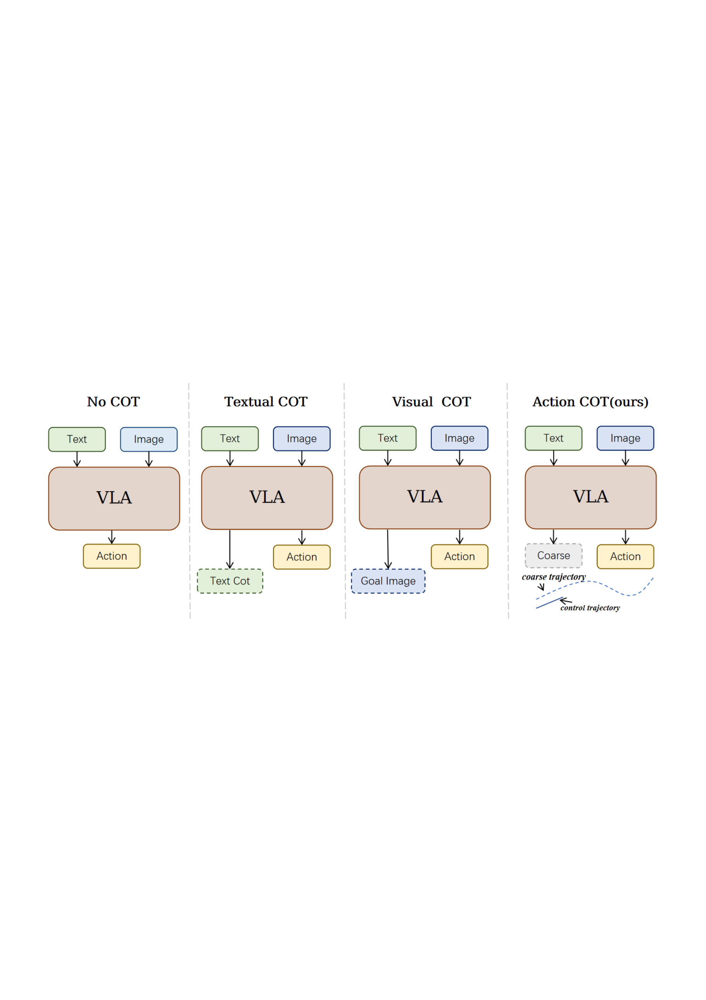
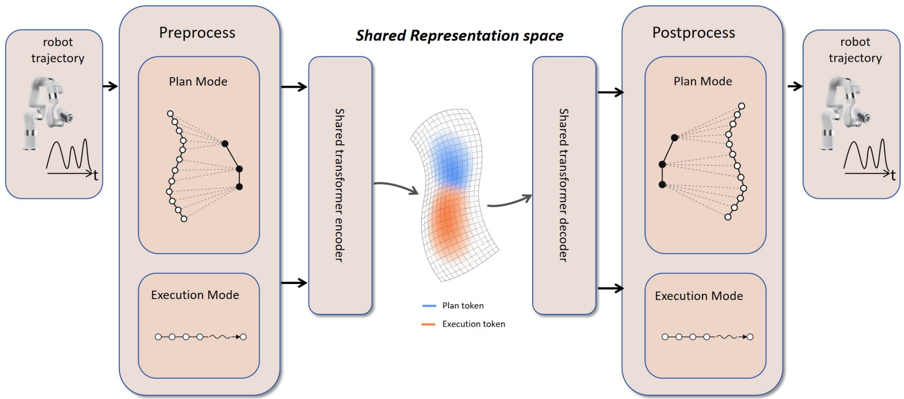
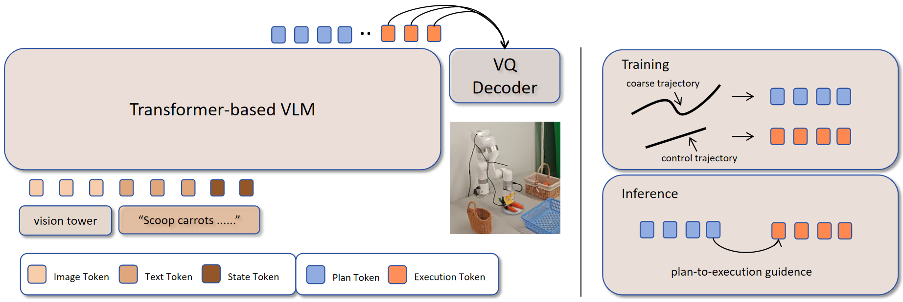
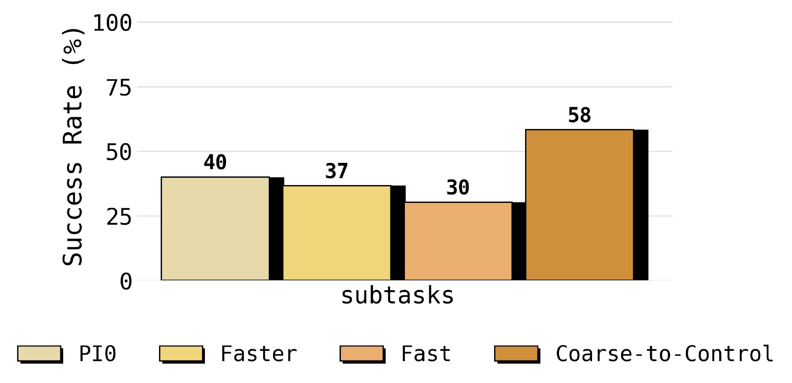

# Coarse-to-Control: Action-Token Planning for Vision-Language-Action Models

#

# 基本信息

- **arXiv**: 2606.07107
- **Authors**: Jinhao Wu, Shiduo Zhang, Yicheng Liu, Xiaopeng Yu, Sixian Li, Siyin Wang, Hang Zhao, Jing Huo, Yang Gao, Jingjing Gong, Xipeng Qiu, Yu-Gang Jiang
- **Categories**: cs.RO
- **一句话结论**: 通过在动作令牌空间内引入粗粒度规划令牌作为可执行令牌的内部前缀，Coarse-to-Control 显著提升了 VLA 模型在长程多阶段任务上的鲁棒性与成功率，且规划与执行共享离散动作词汇表是性能增益的关键。

#

# 研究问题

当前视觉-语言-动作（VLA）模型大多采用“观测→动作”的直接映射范式，将高层语义目标与低层电机命令的解析压缩为单步前向传播。这在短程任务中尚可工作，但在长程多阶段操作中，早期微小误差会沿时间轴不断累积，导致后续阶段偏离目标。尽管近期研究尝试通过文本推理链（Textual CoT）或视觉子目标（Visual CoT）引入中间层，但这些表示停留在语义或感知层面，与底层运动控制之间存在抽象层级错配：策略仍需隐式推断空间轨迹、手腕朝向和抓取姿态等运动细节。本文要解决的核心问题是：**能否在动作空间内部构建一种紧凑的、可直接指导控制的规划表示，以桥接高层意图与低层执行，同时避免跨模态翻译损耗？**

#

# 任务与挑战

**输入输出**：在时刻 $t$，策略接收多模态上下文 $x_t=(o_t,l,s_t)$，其中 $o_t$ 为视觉观测，$l$ 为语言指令，$s_t$ 为本体状态；输出为短程可执行动作序列 $A_{t:t+H_e-1}$。

**训练设定**：基于演示数据，以自回归 next-token prediction 目标端到端训练。Tokenizer 在混合机器人数据上预训练后固定，VLA 主干在下游任务数据上微调。

**评测设定**：覆盖 LIBERO（Spatial / Object / Goal / Long 四个套件，每任务 50 trials）、SimplerEnv-WidowX（4 个跨域任务，每任务 24 trials）以及真实世界操作（4 个物理任务，每任务 50 演示、20 trials）。

**已有方法的不足**：
- **无 CoT 基线**（如 $\pi_0$-FAST、OpenVLA-OFT）：直接生成动作，长程鲁棒性差。
- **文本 CoT**（如 ThinkAct、$\pi_{0.5}$）：提供语义分解，但对低层电机行为约束微弱。
- **视觉 CoT**（如 CoT-VLA、DreamVLA）：提供空间结构，但需生成冗长的非可执行视觉前缀，且仍存在“图像→动作”的翻译鸿沟。

#

# 核心 Insight

本文的核心论点是：**动作空间本身是比文本或图像更自然的中间运动意图表示介质**。人类运动控制系统并非将语义目标直接映射为肌肉收缩，而是先形成粗粒度的运动意图（方向、构型、阶段目标），再细化为低层电机命令。Coarse-to-Control 将这一层次结构嵌入 VLA：策略先自回归地预测一组粗粒度未来轨迹令牌（plan tokens），再在该前缀条件下生成细粒度可执行令牌（exec tokens）。由于规划与执行共享同一个离散动作词汇表，规划令牌始终贴近控制流形（control manifold），提供可直接执行的引导，而非需要二次翻译的抽象提示。



为实现这一点，作者设计了一个**联合 plan-execute 分词器（joint plan-execute tokenizer）**。如图中所示，机器人轨迹在预处理阶段被拆分为两种模式：Plan Mode 将长程轨迹稀疏化为保留阶段级意图的粗轨迹；Execution Mode 保留短程可执行动作。两者通过共享的 Transformer 编解码器映射到统一的离散表示空间（蓝色 Plan token 与橙色 Execution token），最终在 Postprocess 阶段还原为可执行轨迹。



#

# 方法与公式

#

## 1. 粗粒度动作压缩（Coarse Action Sub-resolution）

为获得规划用的粗轨迹，模型将长程未来动作序列 $A_{t:t+H_p-1}$ 压缩为 $K$ 步粗规划轨迹 $\bar{A}_t$，块大小 $c=H_p/K$。具体地：

```math
\bar{a}^{\mathrm{motion}}_{t+i} = \sum_{j=0}^{c-1} a^{\mathrm{motion}}_{t+ic+j}, \quad \forall i \in \{0,\ldots,K-1\}
```

```math
\bar{a}^{\mathrm{gripper}}_{t+i} = a^{\mathrm{gripper}}_{t+(i+1)c-1}, \quad \forall i \in \{0,\ldots,K-1\}
```

**变量解释**：
- $H_p$：规划源窗口长度（主实验中为 160 步）。
- $K$：粗规划步数（主实验中为 20 步）。
- $c$：压缩块大小。
- $\bar{a}^{\mathrm{motion}}$：对块内相对位移求和，保留净运动方向与阶段级位移。
- $\bar{a}^{\mathrm{gripper}}$：取块末夹爪状态，保留阶段末的开合意图。

该压缩丢弃高频控制细节，保留“接近→抓取→运输→放置”等阶段级结构。

#

## 2. 联合双粒度残差 VQ Tokenizer

Tokenizer 包含两种模式，通过 mode embedding 区分，但共享同一组残差 VQ 码本（3 层，每层 4096 条目）：

```math
z_t^{\mathrm{plan}} = Q(\bar{A}_t, m=1)
```

```math
z_t^{\mathrm{exec}} = Q(A_{t:t+H_e-1}, m=0)
```

其中 $Q(\cdot,m)$ 为模式条件编码器，$m=1$ 对应规划模式，$m=0$ 对应执行模式。令 $X_t^m$ 为模式 $m$ 下的预处理目标，$\hat{X}_t^m$ 为重构输出，则重构损失为：

```math
\mathcal{L}_{\mathrm{rec}}^m = \left\lVert X_t^m - \hat{X}_t^m \right\rVert_1
```

残差 VQ 正则化包含 commitment loss 与 codebook loss。设 $e_t^{m,r}$ 为进入第 $r$ 个码本的编码器残差，$q_t^{m,r}$ 为选中的码向量，$R_m$ 为码本数，$\mathrm{sg}(\cdot)$ 为停梯度算子：

```math
\mathcal{L}_{\mathrm{commit}}^m = \frac{1}{R_m}\sum_{r=1}^{R_m}\left\lVert e_t^{m,r}-\mathrm{sg}(q_t^{m,r})\right\rVert_2^2
```

```math
\mathcal{L}_{\mathrm{codebook}}^m = \frac{1}{R_m}\sum_{r=1}^{R_m}\left\lVert \mathrm{sg}(e_t^{m,r})-q_t^{m,r}\right\rVert_2^2
```

总 tokenizer 目标为：

```math
\mathcal{L}_{\mathrm{tok}} = \mathcal{L}_{\mathrm{rec}}^m + \mathcal{L}_{\mathrm{codebook}}^m + \beta\mathcal{L}_{\mathrm{commit}}^m
\tag{1}
```

其中 $\beta=0.25$。该目标迫使粗粒度规划与细粒度执行处于同一动作语义流形，降低跨粒度翻译损耗。

#

## 3. Plan-Execute 自回归 VLA

策略主干为基于 PaliGemma-3B 的 VLA。给定上下文 $x_t=(o_t,l,s_t)$，模型对拼接后缀 $z_t = [z_t^{\mathrm{plan}}, z_t^{\mathrm{exec}}]$ 进行自回归分解：

```math
p(z_t \mid o_t,l,s_t)= \prod_i p(z_{t,i}^{\mathrm{plan}} \mid x_t,z_{t,<i}^{\mathrm{plan}}) \prod_j p(z_{t,j}^{\mathrm{exec}} \mid x_t,z_t^{\mathrm{plan}},z_{t,<j}^{\mathrm{exec}})
\tag{2}
```

训练采用 teacher forcing，目标为标准 next-token prediction 的负对数似然：

```math
\mathcal{L}_{\mathrm{VLA}} = -\sum_k \log p_\theta(z_{t,k}\mid x_t,z_{t,<k})
\tag{3}
```

**推理流程**：模型先自回归生成规划令牌 $z_t^{\mathrm{plan}}$，再在其条件下生成执行令牌 $z_t^{\mathrm{exec}}$。最终仅将 $z_t^{\mathrm{exec}}$ 通过 VQ Decoder 解码为连续机器人动作；$z_t^{\mathrm{plan}}$ 仅作为内部上下文，不引入额外的规划器-控制器接口。



#

# 贡献拆解

**贡献 1：Action-Token CoT——将推理链嵌入动作令牌空间**
- **做了什么**：以粗粒度未来轨迹令牌作为规划介质，替代文本或视觉中间表示。
- **为什么有效**：动作令牌直接编码运动时空结构（位移、夹爪时序），比语义描述更贴近控制流形。
- **与已有方法差别**：文本/视觉 CoT 停留在语义/感知层，仍需策略完成“抽象→电机”的二次翻译；Action-Token CoT 让推理发生在可执行空间内部。

**贡献 2：联合双粒度残差 VQ Tokenizer**
- **做了什么**：通过 mode conditioning 使粗粒度规划与细粒度执行共享同一离散动作词汇表（3 层残差 VQ，每层 4096 码本）。
- **为什么有效**：共享词表确保规划令牌与执行令牌处于同一动作语义流形，执行分支可直接利用规划前缀进行条件生成，无需跨词表翻译。
- **与已有方法差别**：传统方法多为执行单路 tokenization；本文首次将规划与执行统一进共享动作词表，并通过消融证明独立词表（Separate）显著弱于共享词表（Joint-mode）。

**贡献 3：端到端自回归 plan-then-execute 训练与轻量推理**
- **做了什么**：以标准 next-token prediction 联合训练规划前缀与执行后缀；推理时仅解码执行分支。
- **为什么有效**：保持 VLA 自回归框架不变，不引入额外模块，规划作为“内部上下文”提供轻量级长程引导。
- **与已有方法差别**：无需显式规划器-控制器接口或独立优化目标，系统简洁且易于在现有 VLA 上复现。

#

# 关键图表解读

**图 1：Joint Plan-Execute Tokenizer（figure-001-joint-plan-execute-tokenizer.png）**
该图展示 Coarse-to-Control 的整体数据流。左侧 Preprocess 将原始轨迹分为 Plan Mode（稀疏化为阶段级粗轨迹）与 Execution Mode（保留短程动作）。中间 Shared Representation space 通过统一 Transformer 编解码器将两者映射到同一离散空间，其中蓝色 Plan token 与橙色 Execution token 共享词汇表。右侧 Postprocess 将两种 token 还原为可执行机器人轨迹。读图关键：注意 Plan Mode 中“多个白圈汇聚到少数黑点”的稀疏化过程，这正是粗粒度压缩的直观体现。

**图 2：推理范式对比（figure-005-reasoning-representation.png）**
四列对比清晰定位本文创新。No COT 直接输出 Action；Textual COT 输出文本推理链；Visual COT 输出 Goal Image；Action COT(ours) 则在 VLA 后先输出 Coarse trajectory（粗轨迹），再据此生成 control trajectory（控制轨迹）。读图关键：Action COT 的“粗轨迹”与“控制轨迹”均位于动作空间，避免了文本/图像到动作的跨模态鸿沟。

**图 3：VLA 架构与训练/推理流程（figure-009-page-4-xref-590.png）**
左半部分展示基于 Transformer 的 VLM 接收 Image/Text/State token，输出 Plan/Execution token，再经 VQ Decoder 还原。右半部分区分 Training 与 Inference：训练时分别对 coarse trajectory 和 control trajectory 做 token 化；推理时通过 plan-to-execution guidance 机制，用少量 plan token（蓝色）引导 exec token（橙色）生成。读图关键：注意训练和推理时 token 序列的拼接顺序，以及推理阶段 plan token 不直接解码为物理动作，仅作为条件上下文。

**图 4：真实世界子任务成功率（figure-002-main-experiment.png）**
柱状图展示在多阶段真实世界任务中，各方法的子任务成功率。Coarse-to-Control（58%）显著高于 PI0（40%）、Faster（37%）和 Fast（30%）。读图关键：该图直接量化规划对“保持长程进度”的贡献；基线方法在单阶段可能表现尚可，但在多阶段子任务中快速衰减，而 Coarse-to-Control 通过动作令牌规划维持了更高的中间进度完成率。



#

# 实验与消融

**数据集与设定**：
- **仿真**：LIBERO（4 suites，50 trials/task）、SimplerEnv-WidowX（4 tasks，24 trials/task）。
- **真实世界**：4 个物理操作任务（Carrot、Carrot+Button、Plate→Basket、Cleanup），每任务 50 演示、20 trials。

**基线**：覆盖 No-CoT（$\pi_0$-FAST、$\pi_0$、OpenVLA-OFT 等）、Textual CoT（ThinkAct、$\pi_{0.5}$）、Visual CoT（CoT-VLA、DreamVLA、F1、UD-VLA）、Action CoT（MolmoAct）。

**主结果**：
- **LIBERO**：平均成功率 **97.9%**（Long suite 95.0%），超越 OpenVLA-OFT（97.1%）与 $\pi_{0.5}$（96.8%）。
- **SimplerEnv-WidowX**：平均 **83.3%**，大幅领先第二名 UD-VLA（62.5%）。
- **真实世界**：平均 **62.5%**，在三项多阶段任务上均取得最高成功率。

**消融实验**：
- **规划源窗口 $H_p$**：固定 joint tokenizer，仅改变 $H_p$。$H_p=0$（无规划）→ 96.45%；$H_p=40$ → 97.55%；$H_p=160$ → 97.90%。证明更长未来上下文有助于捕获阶段级转换（接近、抓取、运输、放置）。
- **Tokenizer 共享性**：Faster-AR（无规划，95.40%）→ Separate（独立词表，96.60%）→ Joint-mode（共享词表，97.90%）。证明性能增益不仅来自“有规划”，更来自规划与执行共享动作语义空间。

**最强证据**：LIBERO Long suite 上，Joint-mode（95.0%）较无规划基线（88.6%）提升 6.4 个百分点，且真实世界子任务完成率显著领先，直接证明动作令牌规划对长程多阶段鲁棒性的增益。

**最存疑证据**：SimplerEnv-WidowX 的 **Put Eggplant** 任务成功率仅 **58.3%**，低于 F1（66.7%）与 UD-VLA（75.0%）。该落差提示方法在特定空间构型、遮挡或物体交互模式下可能存在鲁棒性瓶颈，但论文未对此展开深入分析。

#

# 局限性

1. **特定任务性能落差**：SimplerEnv-WidowX 的 Put Eggplant 表现不佳，论文未解释该任务特殊性（如遮挡、形状复杂度）为何削弱 action-token 规划优势。
2. **规划错误传播与缺乏重规划**：框架未量化“规划前缀错误”对执行阶段的级联影响，也未引入显式规划重调或执行阶段反馈修正机制。一旦粗规划偏离，执行分支缺乏纠错能力。
3. **真实世界评估规模有限**：仅 4 个物理任务、每任务 20 trials，统计效力有限；且未在真机上与文本/视觉 CoT 进行严格对照实验。
4. **固定规划粒度**：粗粒度压缩采用固定块大小 $c$，无法根据任务复杂度自适应调整规划分辨率，可能限制其在需要精细局部规划场景中的灵活性。

#

# 个人研究判断

**值得继续追踪**。

面向“World Models assisting Embodied AI downstream tasks”方向，本文提供了一种极具启发性的中间层设计：将推理链显式嵌入与可执行动作共享词表的动作令牌空间。这本质上是一种**轻量级的动作空间世界模型**——它不需要像传统世界模型那样预测完整未来观测，而是通过离散动作令牌压缩长程运动意图，既保留了控制的直接性，又提供了时间上的延伸结构。

后续可追踪的延伸方向包括：
- **自适应规划粒度**：根据任务阶段动态调整粗轨迹分辨率，而非固定块大小。
- **在线重规划（replanning）**：结合世界模型的观测预测能力，在动作令牌层面实现闭环重规划。
- **动作空间与世界模型的深度融合**：将显式世界模型的未来状态预测转化为动作令牌规划的前置条件，进一步释放 VLA 在长程任务中的潜力。

该工作为“如何在 VLA 中构建控制对齐的层次化推理”提供了坚实的基线与范式参考，具有较高的后续研究价值。
