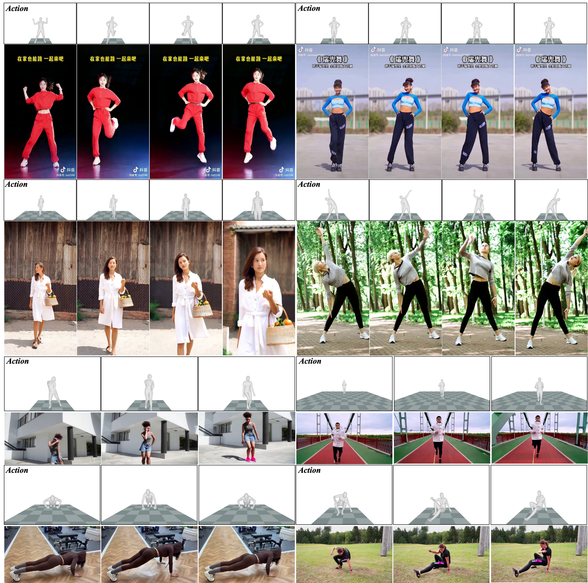
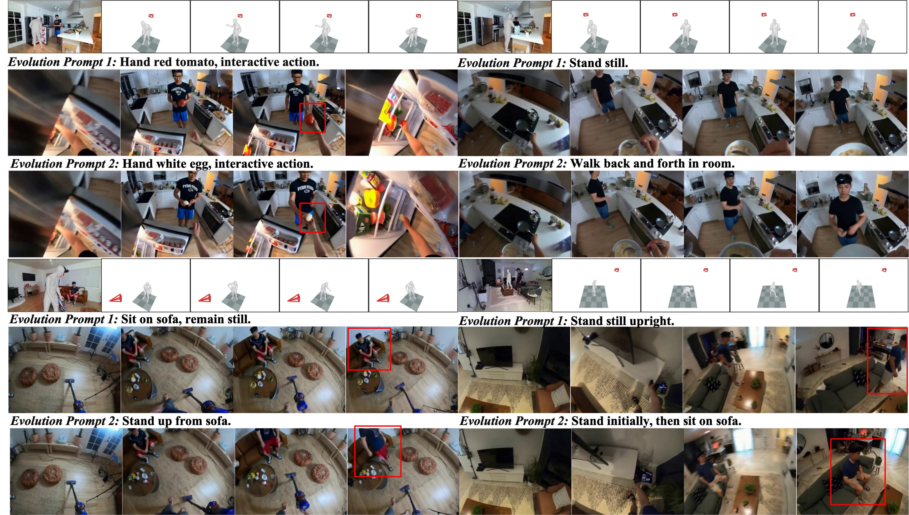
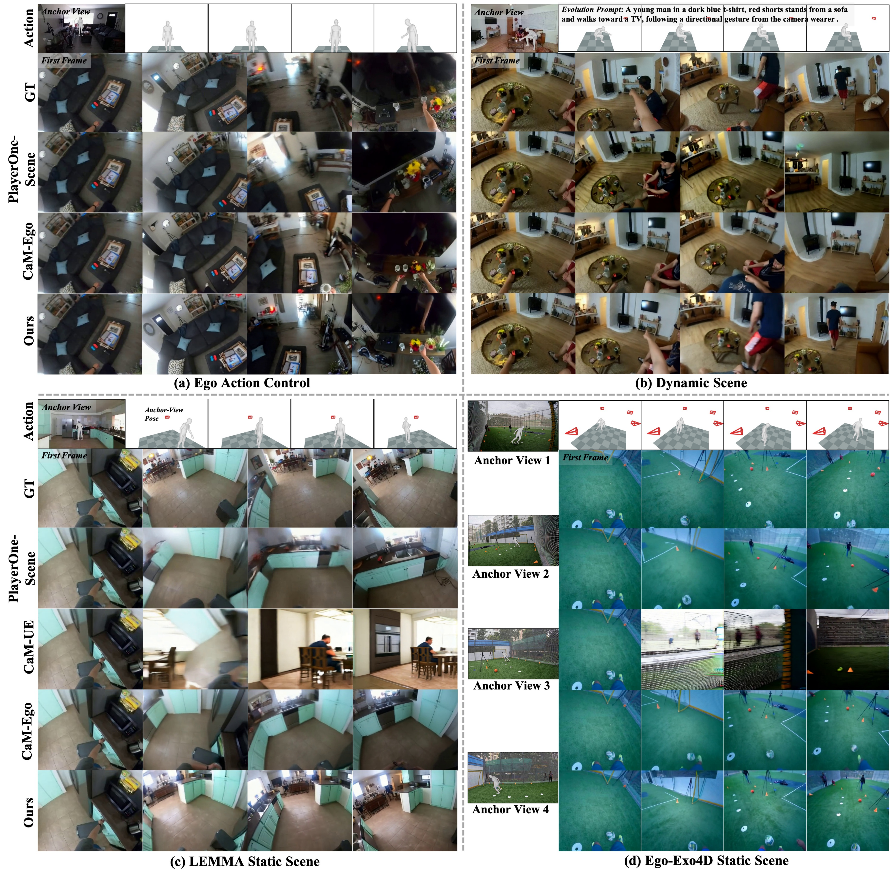
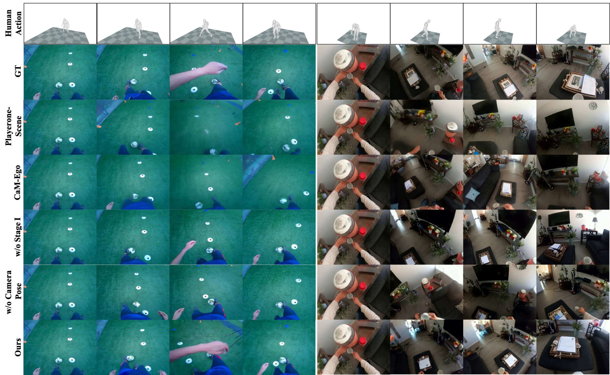

# AnchorWorld: Embodied Egocentric World Simulation with View-based Evolution Customization

#

# 基本信息

- arXiv: [2606.07326](http://arxiv.org/abs/2606.07326v1)
- Authors: Yu Li, Menghan Xia, Gongye Liu, Xintao Wang, Conglang Zhang, Lei Ke, Yuxuan Lin, Ruihang Chu, Pengfei Wan, Kun Gai, Yujiu Yang
- Categories: cs.CV

#

# 研究问题

基于锚点视图与混合视角的人体动作驱动的第一人称世界模拟框架

#

# 任务与挑战

现有交互式世界模型在实用场景的多样化可控性方面探索不足，尤其是在第一人称（egocentric）视角下，如何自然地进行身体动作交互并精确控制局部场景状态仍是一个开放问题。现有方法多依赖键盘、相机轨迹或文本等简化控制信号，无法反映真实的人类第一人称交互方式；同时，环境通常由初始帧或全局提示隐式定义，难以在特定三维位置指定物体存在性或控制局部场景的时序演化。本文针对这一空白，提出了“世界可定制的具身第一人称模拟”任务。

为此，作者提出 AnchorWorld 框架，基于 Wan2.1 流匹配视频生成模型，引入两种互补控制：一是“混合视角人体动作控制”，利用 SMPL-X 参数化人体模型表示动作，通过在第三人称（TPV）视频上进行投影式动作条件预训练，再迁移到第一人称（FPV）头戴视角，解决自视角下身体部位缺失导致的监督稀疏问题；二是“可演化锚点视图定制”，在统一世界坐标系中定义带有 6-DoF 位姿的锚点视图（RGB 图像 + 位姿 + 演化文本提示），通过上下文拼接、3D RoPE 位姿编码与掩码交叉注意力注入，实现对局部场景外观、空间 grounding 与时序演化的显式控制。训练采用四阶段渐进策略，依次建立动作控制、自视角适应、静态场景一致性与动态演化能力。

实验在 Ego-Exo4D、LEMMA、UE CineScene 及真实场景捕获数据上进行。定量结果表明，AnchorWorld 在场景一致性（GIM Mat. Pix.、CLIP-V、PSNR、SSIM、LPIPS）、相机轨迹精度（ATE、RTE、RRE）和动态文本对齐（VideoAlign TA）上均显著优于 PlayerOne、CaM 等基线。例如，在自视角静态测试集上，Mat. Pix. 达到 4493.4（对比 CaM-Ego 的 4379.4），RRE 降至 3.145；在动态场景下 TA 达到 0.717，远超基线。消融实验验证了 Stage I 第三人称预训练、投影式控制、锚点视图位姿与 RoPE、以及多阶段训练的必要性。定性结果展示了在锚点与初始视角无重叠、大视角变化及不可见区域动态演化等挑战性设定下的强泛化性。

该研究将世界模型从“被动视觉延续”推向“具身交互与局部状态可控演化”，为具身智能中的第一人称探索、人机交互及场景理解提供了高质量仿真基础。其混合视角训练范式与锚点视图机制为后续结合 VLA 模型、扩散策略及 sim-to-real 迁移提供了可扩展的世界模拟接口，具有重要的方法参考价值。

#

# 核心 Insight

这篇论文的核心价值需要结合原文继续复查。当前 fallback 笔记保留了日报分析、DeepResearch 草稿和已筛选图表，避免自动流程中断。

#

# 方法与公式

#

# 第一模块：一分钟核心速写

**论文领域：** World Model（具身第一人称交互式世界模拟）

**TL;DR:** 作者提出了一种基于**混合视角投影**与**位姿关联锚点视图**的 **AnchorWorld** 框架，以解决现有交互式世界模型缺乏**精细具身动作控制**与**局部世界状态显式定制**能力的问题，在静态/动态第一人称场景及合成 UE 场景的场景一致性、相机控制精度和动态演化对齐上实现了显著超越基线的表现。

**研究动机：** 现存方案存在两大痛点。第一，控制信号过度简化（键盘、文本或仅手部），无法反映自然人机交互；且第一人称视频中全身大部分区域不可见，导致**动作监督稀疏且弱对齐**。第二，世界状态由初始帧或全局文本隐式定义，用户无法在特定 3D 位置指定局部场景内容，更无法驱动其随时间演化。本文的切入点极为巧妙：它利用**第三人称视频**补充被遮挡的全身监督，并通过“投影”将外部视角与第一视角统一为同一条件空间；同时把世界状态显式编码为带有 **6DoF 位姿的锚点视图**加演化文本，实现了“指哪打哪”的时空一致世界定制。

**核心机制：** 剥离复杂的流匹配公式，其架构本质可概括为两点：一是将 **3D 人体动作序列与相机外参在投影空间统一为条件 token**，通过空间自注意力注入 DiT，让模型在第三人称视频上学会“动作-视觉后果”的映射，再迁移到第一人称；二是将局部世界状态编码为**带位姿的图像 token**作为上下文拼入视频序列，并用**掩码交叉注意力**将每条局部演化文本严格绑定到对应的锚点视图，从而在统一坐标系下实现多视角一致且可演化的场景生成。

**关键数据：**

- **最能证明有效性的核心数据：** 在 **Ego Static Scene** 上，AnchorWorld 的 Matched Pixels 达到 **4493.4K**（CaM-Ego 为 4379.4K，PlayerOne-Scene 为 4334.8K），CLIP-V 达到 **0.885**（CaM-Ego 为 0.872），绝对平移误差 ATE 降至 **0.112**（CaM-Ego 为 0.125）。这组数据同时覆盖了场景几何一致性、语义一致性和相机轨迹精度，证明混合视角动作控制与锚点视图机制带来了全面的性能提升。

- **存疑的试验结果：** 在 **Ego Dynamic Scene** 上，CaM-UE 的相对旋转误差 RRE 为 **1.230**，反而低于 AnchorWorld 的 **1.346**。然而，CaM-UE 的动态文本对齐（VideoAlign-TA）仅为 **0.115**，远低于 AnchorWorld 的 **0.717**，说明 CaM-UE 几乎不具备遵循演化指令的能力；其较低的旋转误差更可能源于 UE 慢速规律相机运动的先验偏置，而非真正的动态场景控制优势。此外，在视频质量（VBench）上，AnchorWorld（0.748）与 CaM-Ego（0.748）持平，表明该方法的核心增益在于**可控性与一致性**，而非单纯视觉质量的提升。

---

#

# 第二模块：核心架构解释

AnchorWorld 以 **Wan2.2 TI2V 5B**（基于 Flow Matching 的 DiT 视频生成模型）为基座，通过四阶段渐进训练，逐步获得混合视角动作控制与可演化锚点视图定制能力。

#

## 1. 混合视角人体动作控制（Hybrid-View Human Action Control）

人体动作采用 SMPL-X 参数化模型表示，包含 22 个主要关节，每关节由 3D 位置与 3D 轴角旋转向量组成，即 **M ∈ R^{f×k×6}**。相机轨迹（第三人称观察视角或第一人称头部视角）表示为外参序列 **C ∈ R^{f×3×4}**。

- **投影式条件编码**：Motion Encoder 将 M 映射为 **z_m ∈ R^{f'×k×d}**，Camera Encoder 将 C 映射为 **z_c ∈ R^{f'×1×d}**，其中 f' 为 VAE 编码后的时间分辨率。
- **Spatial Pose Attention**：在 DiT 的每一层，将视频 latent token **z_v^{(t)}** 与 **z_m**、**z_c** 沿**空间维度**拼接为统一序列 **T = [z_v^{(t)}; z_m; z_c]**，经过 Spatial Self-Attention 后，通过 **Truncate** 操作丢弃 pose token，仅保留更新后的视频特征。这使得模型显式感知帧级动作-视频对应关系，并弥合 pose 特征与 VAE latent 的分布差异。

#

## 2. 可演化锚点视图定制（Evolvable Anchor-View Customization）

世界状态由初始第一帧 I_0 和一组锚点视图 **S = {(I_i, c_i, t_i)}** 定义，其中 c_i 为 6DoF 位姿，t_i 为描述局部场景动态演化的文本。

- **In-Context 图像先验**：锚点视图图像经 VAE 编码为 **z_s**，与视频 token **z_v^{(t)}** 沿**帧维度**拼接（**T_total = [z_v^{(t)}; z_s]**）。为区分多个锚点，引入 **3D RoPE**，给锚点视图分配独立的帧轴位置编码。
- **View Pose 注入**：将视频帧与锚点视图的相机位姿统一编码为 **z_pose**，广播到空间分辨率后**残差相加**到视觉 token 上，使模型建立锚点视图在统一世界坐标系中的空间 grounding。
- **文本驱动的掩码交叉注意力**：每个锚点的演化文本 t_i 通过 Cross-Attention 注入。关键设计在于**注意力掩码**：文本 i 的 Key 仅对**视频 token** 和**第 i 个锚点视图的 token** 可见，对其他锚点掩码为 -∞。这严格保证了局部演化指令的局部性，避免不同锚点间的语义干扰。

#

## 3. 渐进式多阶段训练策略

训练分为四个阶段，逐步叠加能力：

- **Stage I（第三人称动作预训练）**：使用 200K 内部单人称视频 + 101K UE 合成 MultiCamVideo 数据。相机参数为外部观察视角，让模型学习完整的全身动作投影与交互先验。
- **Stage II（第一人称动作适配）**：使用 100K Ego-Exo4D / LEMMA 同步数据，将相机轨迹对齐到穿戴者头部姿态，适配 egocentric 分布。
- **Stage III（静态锚点视图定制）**：使用 25K 大视角变化样本，学习在静态场景下利用锚点视图保持多视角几何一致。
- **Stage IV（动态锚点视图演化）**：混合 25K 静态样本与 10K 动态样本（含人工标注的演化文本），学习文本驱动的局部状态演化。

#

## 4. 核心伪代码

```python
class AnchorWorld(nn.Module):
    def __init__(self, dit, motion_enc, camera_enc, pose_enc, text_enc):
        self.dit = dit
        self.motion_enc = motion_enc
        self.camera_enc = camera_enc
        self.pose_enc = pose_enc
        self.text_enc = text_enc

    def spatial_pose_attention(self, video_tokens, motion, camera):
        

# video_tokens: (B, f', h*w, d)

        

# motion: (B, f, k, 6), camera: (B, f, 3, 4)

        z_m = self.motion_enc(motion)      

# (B, f', k, d)

        z_c = self.camera_enc(camera)      

# (B, f', 1, d)

        T = torch.cat([video_tokens, z_m, z_c], dim=2)  

# spatial concat

        T = self.dit.spatial_self_attn(T)
        out = T[:, :video_tokens.size(2), :]  

# Truncate pose tokens

        return out

    def anchor_condition(self, video_tokens, anchor_imgs, anchor_poses, video_poses):
        

# Encode anchor images and concat along frame axis

        z_s = torch.cat([vae_encode(img) for img in anchor_imgs], dim=0)
        T_total = torch.cat([video_tokens, z_s], dim=0)  

# (f'+n, h*w, d)

        
        

# 3D RoPE with distinct frame ids for anchors

        frame_ids = list(range(video_tokens.size(0))) + \
                    [video_tokens.size(0) + i for i in range(len(anchor_imgs))]
        rope = compute_3d_rope(T_total, frame_ids)
        
        

# Pose injection: add pose embeddings to all visual tokens

        all_poses = torch.cat([video_poses, anchor_poses], dim=0)
        z_pose = self.pose_enc(all_poses).broadcast_to(T_total.shape)
        T_total = T_total + z_pose
        return T_total, rope

    def masked_evolution_cross_attn(self, visual_tokens, text_embs, video_len, anchor_indices):
        

# text_embs: list of (L_i, d) per anchor

        

# anchor_indices: global frame index of each anchor in visual_tokens

        out = visual_tokens
        for i, txt in enumerate(text_embs):
            mask = torch.full((visual_tokens.size(0),), float('-inf'))
            mask[:video_len] = 0               

# attend to video tokens

            mask[anchor_indices[i]] = 0        

# attend to own anchor token

            out = cross_attn_with_mask(out, txt, frame_mask=mask)
        return out

    def forward(self, I0, motion, camera, anchors, evolution_texts, t):
        z_v = vae_encode(I0)  

# video latent

        z_v = self.spatial_pose_attention(z_v, motion, camera)
        
        z_v, rope = self.anchor_condition(
            z_v, anchors['images'], anchors['poses'], camera
        )
        text_embs = [self.text_enc(txt) for txt in evolution_texts]
        z_v = self.masked_evolution_cross_attn(
            z_v, text_embs, video_len=z_v.size(0) - len(anchors['images']),
            anchor_indices=anchors['indices']
        )
        v_pred = self.dit(z_v, rope=rope, timestep=t)
        return v_pred

# Progressive Training Pipeline

def train_progressive(model, loaders):
    

# Stage I: Exocentric motion (TPV)

    train(model, loaders.tpv, iters=30000, lr=1e-4, batch=16)
    

# Stage II: Egocentric motion (FPV)

    train(model, loaders.fpv, iters=15000, lr=1e-4, batch=16)
    

# Stage III: Static anchor-view consistency

    train(model, loaders.static, iters=10000, lr=1e-4, batch=16)
    

# Stage IV: Dynamic anchor-view evolution

    train(model, loaders.dynamic, iters=10000, lr=1e-4, batch=16)
```

---

#

# 第三模块：核心学术问答

Q1: 这篇论文试图解决什么核心问题？

A1: 论文试图解决交互式世界模型在具身第一人称模拟中的两大核心缺陷。第一，**控制信号不够具身**：现有工作多依赖键盘、文本或手部动作，缺乏以全身 3D 人体动作为驱动的自然交互控制；且第一人称视频中大部分身体区域不可见，导致从 egocentric 视频学习动作-视觉映射时监督稀疏、空间 grounding 弱。第二，**世界状态定义过于隐式**：环境内容通常由初始帧或全局文本决定，用户无法在特定 3D 位置显式指定局部场景外观，更无法精确控制该区域随时间动态演化。论文将这两个需求形式化为“世界可定制的具身第一人称模拟”任务。

Q2: 作者提出的核心解决方案（创新点）是什么？

A2: 核心解决方案是 **AnchorWorld** 框架，包含三项关键创新：
- **混合视角投影式动作控制**：引入第三人称视频作为辅助训练数据，将 3D 人体动作与相机外参统一为投影式条件，通过 Spatial Pose Attention 注入 DiT。这使得模型先在第三人称视角下学习完整的动作-场景交互先验，再迁移到第一人称，显著缓解了 egocentric 监督缺失问题。
- **位姿关联的可演化锚点视图**：提出用锚点视图（RGB 图像 + 6DoF 位姿 + 演化文本）显式定义局部世界状态。通过 In-Context 帧拼接、3D RoPE 区分、位姿残差注入和掩码交叉注意力，实现了多锚点空间 grounding 与局部动态演化的解耦控制。
- **渐进式四阶段训练策略**：从第三人称动作 → 第一人称动作 → 静态锚点一致性 → 动态锚点演化，逐步叠加能力，保证每阶段在稳定基础上构建新技能。

Q3: 实验设计的关键支撑（或巧妙之处/数据集特点）是什么？

A3: 实验设计的关键支撑体现在以下方面：
- **数据集组合极具针对性**：第三人称阶段使用 200K 内部视频 + 101K UE 合成 MultiCamVideo，提供充足的全身体现与多视角数据；第一人称与锚点训练使用 **Ego-Exo4D** 和 **LEMMA**，利用其同步的第一/第三人称配对，天然提供了共享坐标系下的锚点视图与人体动作真值。
- **评估维度全面**：不仅评估视频质量（VBench），更针对任务特性设计了**场景一致性**（GIM Matched Pixels, CLIP-V, PSNR, SSIM, LPIPS）、**相机控制精度**（ATE, RTE, RRE 通过 MegaSaM 从生成视频中估计轨迹）和**动态演化对齐**（VideoAlign-TA），覆盖了几何、语义、动作、演化四个层面。
- **测试集分层验证**：包含域内静态/动态测试、域外 UE 合成测试（大视角变化且初始帧与锚点无重叠）、以及真实世界捕获场景（无 GT 的定性测试），系统验证了泛化性。

Q4: 这篇论文最显著的贡献点（Top 3）是什么？

A4:
- **贡献1：提出“世界可定制的具身第一人称模拟”任务及统一框架。** 将全身动作驱动的 egocentric 导航交互，与基于 3D 位姿的局部世界状态显式定制统一在同一生成框架下，填补了现有交互式世界模型在精细控制与局部演化方面的空白。
- **贡献2：混合视角投影式动作控制机制。** 通过第三人称视频补充监督，并以投影方式统一 TPV 与 FPV 的条件空间，有效解决了 egocentric 视频中身体缺失导致的弱监督问题，显著提升了动作控制精度与空间感知能力。
- **贡献3：位姿关联锚点视图与掩码演化注意力机制。** 实现了局部场景状态在统一世界坐标系下的空间 grounding 和时序演化控制，并展示了在锚点与初始视角无重叠、动态元素初始不可见等复杂 setting 下的强泛化性。

Q5: 这项工作在哪些相关研究的基础上做了推进？（列举1-2个最核心的前置工作即可）

A5:
- **前置工作1：PlayerOne (Tu et al., 2025)。** 该工作首次尝试用全身人体动作驱动第一人称世界模型，并引入部位解耦的动作注入。AnchorWorld 在此基础上推进：指出其仅依赖第一人称视频导致的监督稀疏问题，并通过混合视角投影机制显著提升了动作控制精度与空间一致性。
- **前置工作2：Context-as-Memory / CineScene (Yu et al., 2025; Huang et al., 2026)。** 这类工作通过历史帧检索或密集视角表示来维持场景一致性。AnchorWorld 推进了该范式：不再被动依赖历史上下文，而是允许用户通过带位姿的锚点视图**主动显式定义**局部世界状态，并进一步支持文本驱动的动态演化，从“记忆一致”走向“定制演化”。

Q6: 客观评价：这篇论文的局限性、漏洞或"未讲明的故事"是什么？对后续科研有何启发？

A6: 论文在附录中坦诚了若干局限，但仍存在值得深挖的“未讲明的故事”：
- **长期探索与实时交互的缺失：** 当前框架仅支持短片段（77 帧）生成，缺乏长时记忆与自回归实时交互能力。第一人称智能体在持续探索中需要实时更新自身动作引起的环境状态变化，这要求模型具备**长时记忆机制**与流式推理能力，这是后续关键方向。
- **动态控制的粒度不足：** 尽管框架支持每个锚点配一个演化文本，但受限于当前 egocentric 数据，实现中所有锚点共享**同一全局演化描述**（t_1 = ... = t_n），且动态场景主要局限于人类相关活动。真正的开放世界需要**锚点独立、细粒度、甚至物理一致的动态演化**（如一个锚点描述“树叶飘落”，另一个描述“水面结冰”）。
- **数据层面的隐含妥协：** 训练时锚点视图图像常包含第一人称玩家自身（Ego-Exo4D 的固有缺陷），作者未做修复，仅依赖模型“学会忽略”。虽然推理时可用干净锚点，但这本质上是一种数据噪声下的侥幸，未从根因上解决。
- **基础模型能力的天花板：** 失败案例显示，复杂纹理细节不一致与运动模糊问题部分源于 Wan VAE 16 倍下采样导致的信息损失。这提示后续工作：**世界模拟的上限不仅取决于条件控制架构，更取决于基础生成模型的保真度与时空分辨率**。未来应联合探索更高质量的视频 VAE 与更高效的细粒度控制接口。

#

# 贡献拆解

- 关键术语：Egocentric World Simulation, Anchor Views, Hybrid-View Training, 3D Human Motion Control, Text-Driven Scene Evolution
- 加权评分：3.7/5.0

#

# 关键图表解读



*对应论文核心创新之一：通过引入与智能体第一人称感知解耦的外生（第三人称）视角作为辅助训练监督，补充自我中心视图中截断或不可见的身体部位，从而建立更鲁棒的人体-环境交互空间 grounding*



*展示论文另一核心贡献——基于锚点视图（anchor views）与文本描述的世界自定义演化机制，直接解释如何在统一世界坐标系下实现局部场景的时序一致动态演化*



*主实验结果图，呈现 AnchorWorld 与现有 SOTA 基线在领域内的定量/定性对比，是支撑论文主要性能结论的关键图表*



*消融实验图，用于验证外生视角监督、动作条件等关键设计对模拟质量与交互完整性的实际贡献，支撑论文对方法有效性的论证*

#

# 实验与消融

请优先核对主结果表、消融实验和真实/仿真任务设置；若图表已选中，应结合上方图片逐项复查。

#

# 局限性

当前自动精读未能成功调用完整图文生成模型，因此局限性需要结合原文实验设置进一步人工确认。

#

# 个人研究判断

若该论文与 World Models assisting Embodied AI、VLA、robot policy 或 sim-to-real 强相关，建议进入人工精读队列。
