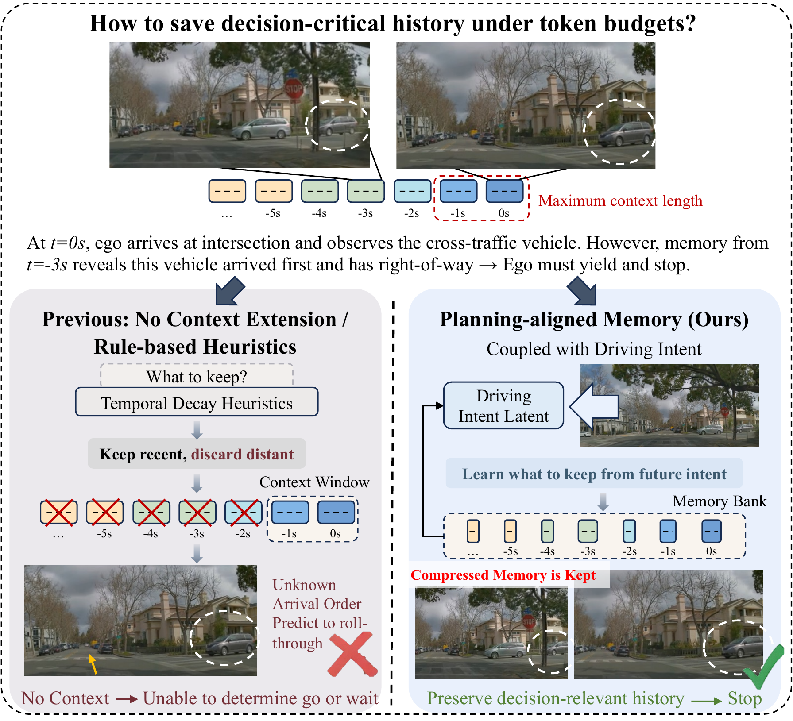
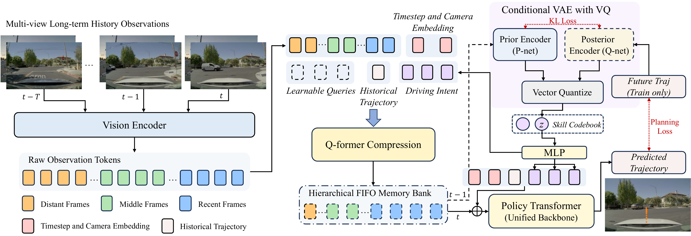
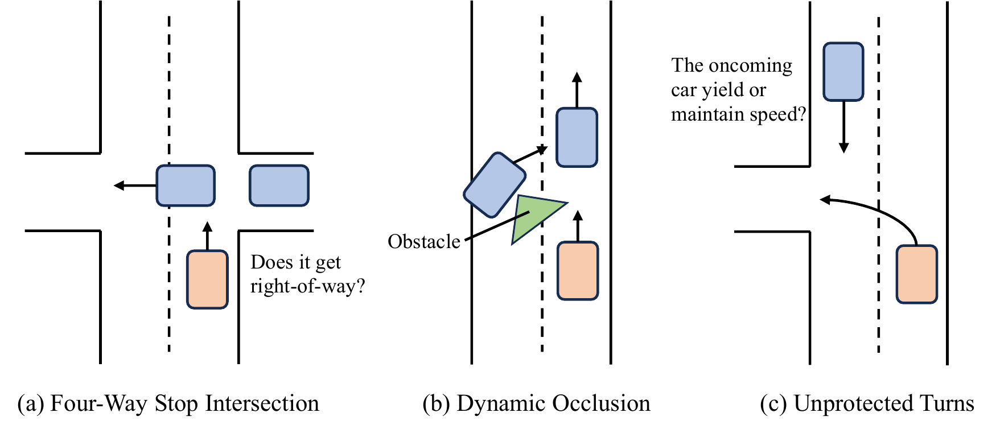
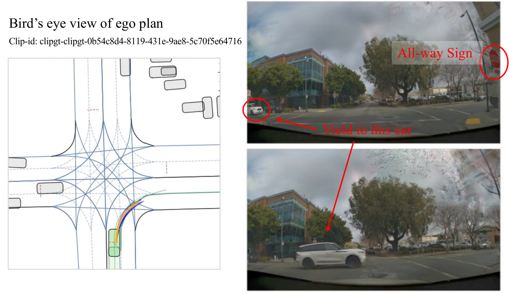

# Planning-aligned Token Compression for Long-Context Autonomous Driving

#

# 基本信息

- arXiv: [2606.07464](http://arxiv.org/abs/2606.07464v1)
- Authors: Zhixuan Liang, Yuxiao Chen, Yurong You, Peter Karkus, Wenhao Ding, Boyi Li, Alexander Popov, Yan Wang, Maximilian Igl, Yiming Li, Danfei Xu, Nikolai Smolyanskiy, Boris Ivanovic, Ping Luo, Marco Pavone
- Categories: cs.RO, cs.AI, cs.CV

#

# 研究问题

面向VLA策略的规划对齐记忆压缩方法

#

# 任务与挑战

单体式视觉-动作（VLA）模型正成为自动驾驶的新范式，但在编码扩展时间上下文以处理复杂交互时，视觉token序列长度迅速膨胀，超出实时计算预算。现有压缩方法多采用基于规则的时间衰减等启发式策略，与规划目标解耦，容易丢失对决策至关重要的历史信息（如四向停车让行中的到达顺序）。本文针对这一关键空白，提出了一种与规划对齐的压缩框架，使记忆保留由下游驾驶任务驱动。

本文提出COMPACT-VA，一种基于条件VQ-VAE的规划对齐工作记忆框架。该方法通过Q-former对多视角观测进行分层压缩，将历史上下文压缩为有限表示。压缩过程以历史轨迹和从未来轨迹蒸馏出的驾驶意图为条件：后验编码器在训练时从未来轨迹提取意图，先验编码器仅从压缩观测中预测该意图。压缩记忆与预测的离散技能嵌入拼接后输入策略网络，实现端到端优化。若压缩丢弃了决策关键信息，先验将无法准确预测意图，从而通过KL散度与轨迹损失联合驱动模型保留关键历史线索。

实验聚焦于高信号动态场景（四向停车、动态遮挡、无保护转弯），设计了行为正确性指标（停/走成功率、滑行通过率、停车位置/时长误差）。在同等token预算下（1424 tokens），COMPACT-VA的Go成功率达68.3%，较基线提升超过6%，较无规划对齐的压缩提升2.7%；停车成功率89.2%，滑行率降低22%。消融实验验证了分层压缩、历史条件与规划耦合各组件的有效性。闭环评估表明，该方法在保持一般驾驶能力的同时，实现3.3倍推理加速与2.7倍显存降低。

该工作首次将token压缩质量与规划性能通过变分目标显式耦合，为VLA策略提供了可学习的、有界的工作记忆机制。其意义在于：不仅解决了长上下文带来的计算瓶颈，更证明了任务感知的记忆压缩对物理智能体决策的关键作用。方法兼容现有VLA架构无需修改主干，具备良好的部署实用性，并对机器人、自动驾驶等需长时记忆与快速推理的具身智能领域具有重要借鉴价值。

#

# 核心 Insight

这篇论文的核心价值需要结合原文继续复查。当前 fallback 笔记保留了日报分析、DeepResearch 草稿和已筛选图表，避免自动流程中断。

#

# 方法与公式

DeepResearch 未生成；请回看论文正文中的方法章节与关键公式。

#

# 贡献拆解

- 关键术语：Token Compression, Vision-Action Models, Conditional VQ-VAE, Working Memory, Planning-Aligned Representation
- 加权评分：4.1/5.0

#

# 关键图表解读

*核心teaser图，直观展示了在token预算限制下保存决策关键历史的问题，以及本文Planning-aligned Memory与基于时间衰减启发式方法的对比，直接解释论文核心insight。*

*完整模型架构图，展示了从多视角长期历史观测到Vision Encoder、Q-former Compression、Conditional VAE with VQ、Skill Codebook、Policy Transformer的完整流程，是理解方法的核心。*

*定义了三种高信号动态场景（四向停车交叉口、动态遮挡、无保护转弯），说明历史上下文对行为正确性最关键的场景，支撑实验设计的关键结论。*

*展示了具体场景下的鸟瞰图规划结果与对应相机视角，包含All-way Sign和Yield to this car等决策相关标注，作为定性实验结果支撑方法有效性。*

#

# 实验与消融

请优先核对主结果表、消融实验和真实/仿真任务设置；若图表已选中，应结合上方图片逐项复查。

#

# 局限性

当前自动精读未能成功调用完整图文生成模型，因此局限性需要结合原文实验设置进一步人工确认。

#

# 个人研究判断

若该论文与 World Models assisting Embodied AI、VLA、robot policy 或 sim-to-real 强相关，建议进入人工精读队列。
