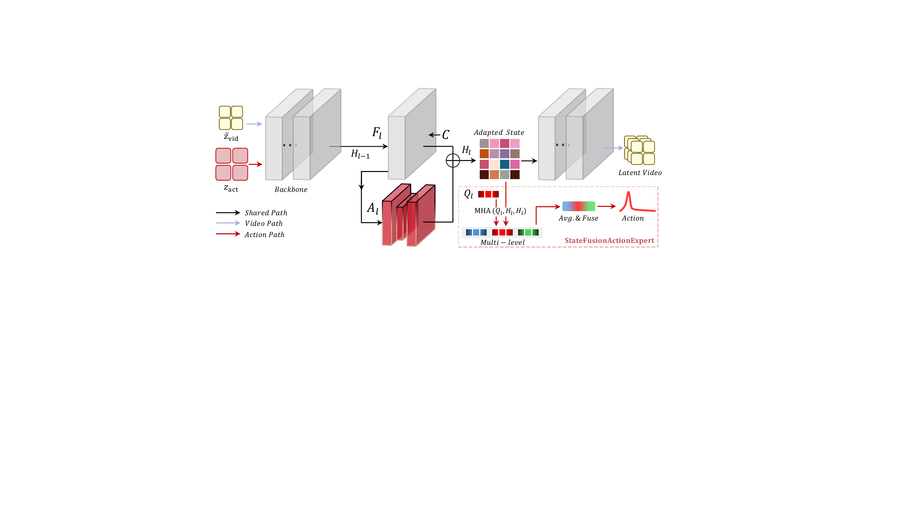
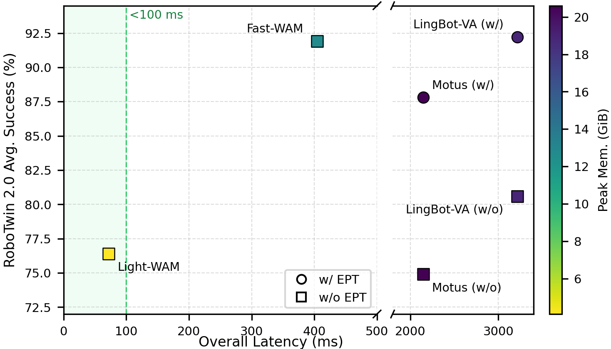
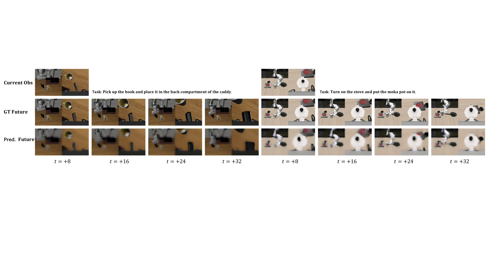
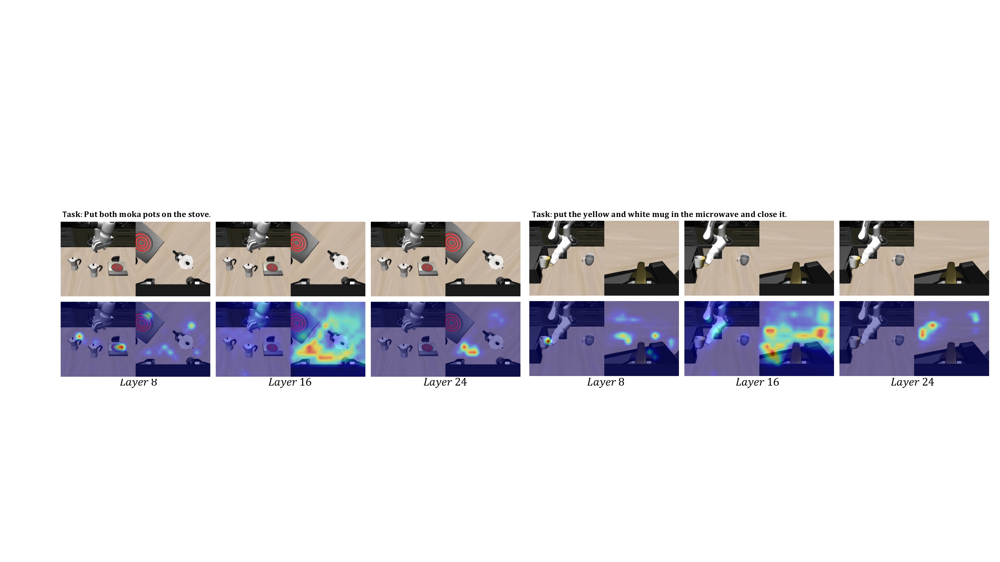

# Light-WAM: Efficient World Action Models with State-Fusion Action Decoding

#

# 基本信息

- **arXiv**: 2606.08242
- **Authors**: Ziang Li, Dongzhou Cheng, Yibin Wang, Shiyue Wang, Xiaoyang Xu, Lingxuan Weng, Juan Wang, Jiaqi Wang
- **Categories**: cs.CV
- **一句话结论**: Light-WAM 通过紧凑视频骨干、下采样潜在空间视频监督与 StateFusionActionExpert，将 WAM 的可训练参数量从 6.02B 降至 0.44B，推理延迟降至 72.03 ms，在 LIBERO 上取得 97.2% 平均成功率，为轻量闭环世界动作模型提供了高效可行的设计范式。

#

# 研究问题

当前 World Action Models (WAMs) 通过联合训练未来视频预测，为机器人策略引入了额外的时序监督信号，促使骨干网络编码物体运动、交互动态与任务进度等世界感知表征。然而，现有 WAM 大多依赖大规模生成式架构（如 DiT、扩散模型），导致训练成本高昂、推理延迟巨大，难以在资源受限的机器人平台上作为高效闭环策略部署。尽管 Fast-WAM 等近期工作已证明测试时无需生成未来视频，但其整体管线仍显笨重。本文核心问题是：能否在保留未来视频预测训练收益的前提下，将 WAM 的训练与推理开销压缩到极致，使其兼顾表征学习与部署效率？

#

# 任务与挑战

具体任务为基于视觉-语言指令的机器人操作，涵盖单臂与双臂设置。输入包括当前观测图像/视频 $o$、语言指令 $l$ 和本体感知状态 $p$；输出为动作块 $\hat{A}$。训练时采用视频-动作联合监督，推理时仅执行动作预测。评测在 LIBERO（4 个套件）与 RoboTwin 2.0（50 项多任务）上进行，并辅以真实双臂机器人验证。

已有方法面临三方面不足：

1. **大模型依赖**：Motus、LingBot-VA、Fast-WAM 等使用 3B–8B 可训练参数，推理延迟达数百毫秒甚至数秒。
2. **动作头冗余**：Fast-WAM 虽去除测试时视频生成，但仍使用重型生成式动作专家（如 DiT），动作解码开销大。
3. **轻量 VLA 的时序缺失**：SmolVLA、VLA-Adapter 等轻量策略仅依赖动作监督，缺乏未来视频预测带来的显式时序结构学习。

#

# 核心 Insight

Light-WAM 的核心洞察是：未来视频预测对机器人策略的主要价值在于**训练时的表征学习**，而非测试时的视频生成。因此，可以在训练阶段保留低成本的下采样潜在空间视频监督，而在推理阶段完全抛弃视频生成分支，仅通过一个轻量的单前向动作解码器直接输出动作块。

为实现这一目标，Light-WAM 采用三管齐下：

1. **紧凑骨干**：以 Wan2.1-T2V-1.3B 作为视频骨干并冻结权重，仅通过 LoRA 与稀疏 WAM Adapter 进行轻量微调，保留预训练视频先验。
2. **低成本时序监督**：将未来视频目标函数施加在 2× 空间下采样的潜在空间，显著降低视频协同训练的 token 成本。
3. **高效动作接口**：提出 StateFusionActionExpert，从骨干网络的多层（Layer 8/16/24）读取适配状态，利用可学习查询进行池化压缩，在单前向传播中直接预测动作块，彻底避免迭代去噪或生成式动作专家。



上图清晰展示了这一设计：视频分支（蓝色）与动作分支（红色）共享适配后的视频骨干；StateFusionActionExpert（红色虚线框）通过多层查询池化实现从视频表征到动作的高效映射。

#

# 方法与公式

**模型结构**。Light-WAM 以冻结的 Wan2.1-T2V-1.3B 为视频骨干。输入观测经 VAE 编码为潜在 $z$ 后，通过 PatchEmbed 得到初始视频 token 状态 $H_0 \in \mathbb{R}^{B \times N \times d}$。语言指令与投影后的本体感知状态拼接为交叉注意力上下文 $C$。骨干中的 Transformer 块 $F_{\ell}$ 更新隐藏状态，并在选定层 $\ell \in \mathcal{I}=\{8,16,24\}$ 插入轻量瓶颈 MLP 适配器 $A_{\ell}$：

```math
U_{\ell}=F_{\ell}(H_{\ell-1},C),
\qquad
H_{\ell}=
\begin{cases}
U_{\ell}+A_{\ell}(U_{\ell}), & \ell \in \mathcal{I},\\
U_{\ell}, & \mathrm{otherwise},
\end{cases}
\tag{1}
```

其中 $U_{\ell}$ 为第 $\ell$ 块输出，$\mathcal{I}$ 为暴露给动作解码器的稀疏层索引集合。动作分支读取这些多层级适配状态：

```math
\mathcal{H} = \{H_{\ell}\}_{\ell \in \mathcal{I}}.
\tag{2}
```

**高效潜在视频协同训练**。未来视频分支在 2× 空间下采样的潜在 $\bar{z}_{\mathrm{vid}}=D(z_{\mathrm{vid}})$ 上进行 flow-matching 监督：

```math
\mathcal{L}_{\mathrm{video}}
=
\left\lVert
G_{\theta}^{\mathrm{vid}}(\bar{z}_{t}, t, C) - u_t
\right\rVert_2^2,
\tag{3}
```

其中 $\bar{z}_{t}$ 为下采样潜在在 flow-matching 时间步 $t$ 的扰动版本，$u_t$ 为对应目标，$G_{\theta}^{\mathrm{vid}}$ 为视频预测头。动作分支则使用原始分辨率的当前观测潜在：

```math
z_{\mathrm{act}} = z_{\mathrm{vid}}^{(0)}.
\tag{4}
```

**StateFusionActionExpert**。该模块为每个选定层学习一组可查询 token $Q_{\ell} \in \mathbb{R}^{N_q \times d}$（默认 $N_q=16$），通过多头注意力池化对应层的视频 token：

```math
P_{\ell}=\mathrm{MHA}(Q_{\ell},H_{\ell},H_{\ell}),
\qquad
s_{\ell}=\mathrm{LN}\left(\frac{1}{N_q}\sum_{j=1}^{N_q}P_{\ell,j}\right).
\tag{5}
```

这里 $\mathrm{MHA}$ 与 $\mathrm{LN}$ 分别为多头注意力和层归一化，$s_{\ell}$ 为层级的压缩状态。多层状态经投影后融合为固定宽度的动作状态：

```math
h =
\phi_{\mathrm{trunk}}
\left(
\phi_{\mathrm{fuse}}
\left(
[M_{\ell}(s_{\ell})]_{\ell \in \mathcal{I}}
\right)
\right).
\tag{6}
```

动作解码采用步进嵌入 $\{e_k\}_{k=1}^{K}$（$K$ 为动作 horizon），投影后加至融合状态，经输出头预测每步动作：

```math
r_k = h + \psi(e_k),
\qquad
\hat{a}_k = \phi_{\mathrm{out}}\left(\mathrm{LN}(r_k)\right),
\qquad
\hat{A}=[\hat{a}_1,\ldots,\hat{a}_K]\in\mathbb{R}^{B\times K\times d_a}.
\tag{7}
```

**联合训练目标**。总损失为视频预测损失与动作回归损失的加权和：

```math
\mathcal{L}
=
\mathcal{L}_{\mathrm{video}}
+
\lambda
\mathcal{L}_{\mathrm{action}}(\hat{A}, A),
\tag{8}
```

其中 $A$ 为目标动作序列，$\lambda$ 为平衡系数。推理时仅执行动作分支：一次骨干前向传播 + StateFusionActionExpert 单前向，无需视频生成或迭代去噪。

#

# 贡献拆解

1. **轻量级 WAM 训练管线**。采用 Wan2.1-T2V-1.3B 紧凑骨干，并在 2× 下采样潜在空间执行未来视频监督，将视频协同训练的 token 成本与显存占用大幅降低。相比 Fast-WAM，可训练参数从 6.02B 降至 0.44B，训练吞吐量提升 4.25 倍，证明了保留时序表征学习收益的同时可实现极致效率。

2. **StateFusionActionExpert 直接动作解码器**。通过可学习查询池化从视频骨干多层读取并压缩适配状态，以单前向传播预测动作块。它避免了重型生成式动作专家（如 DiT）的迭代计算，将动作分支延迟压缩至 2.1 ms，整体推理延迟仅 72.03 ms，为视频表征到动作的高效接口提供了新范式。

3. **稀疏多层适配与状态融合**。仅通过 LoRA 与稀疏 WAM Adapter（层 8/16/24）对冻结骨干进行轻量微调，既保留预训练视频先验，又让动作解码器获取多粒度视觉信息。消融表明，增加 Adapter 层数至 5 层并未带来性能增益，验证了稀疏设计的有效性。

4. **全面的效率-性能权衡验证**。在 LIBERO（97.2% 平均成功率，无具身预训练第一）和 RoboTwin 2.0（50 任务 76.4%）上验证了可用性能，并在真实双臂机器人上完成初步实用验证，填补了轻量 WAM 在闭环部署研究中的空白。

#

# 关键图表解读

**图 1：Light-WAM 整体架构（figure-003-arch.png）**


该图展示了“共享骨干 + 双分支训练 + 单分支推理”的完整数据流。左侧为适配后的视频骨干，蓝色路径代表视频分支：输入下采样潜在 $\bar{z}_{\mathrm{vid}}$，在低成本潜在空间接受未来视频监督。红色路径代表动作分支：输入原始分辨率当前观测潜在 $z_{\mathrm{act}}$。骨干通过 LoRA（全层低秩更新）与稀疏 WAM Adapter（选定层瓶颈 MLP）进行轻量适配。右侧红色虚线框内的 StateFusionActionExpert 是理解本文的关键：它从 Layer 8、16、24 读取 Adapted State，利用层特定的可学习查询 $Q_l$ 执行多头注意力池化（MHA），再经平均、融合与输出头直接得到 Action。读图时应注意，视频路径与动作路径在训练时并行，但推理时仅保留红色动作路径，从而实现极低的测试开销。

**图 2：RoboTwin 2.0 效率-性能综合对比（figure-009-page-6-xref-372.png）**



该散点图以整体延迟（ms）为横轴、平均成功率（%）为纵轴、颜色编码峰值显存（GiB），直观呈现了各方法的部署代价。Light-WAM（黄色方块）位于最左下角区域，延迟仅 72 ms（<100 ms 绿色虚线），峰值显存 4.1 GiB，成功率约 76.4%。相比之下，Fast-WAM（青色方块）延迟约 400 ms、显存更高，但成功率提升至约 92%；Motus 与 LingBot-VA（圆形/方形，带/不带 EPT）则集中在右侧高延迟区（>2000 ms）。读图时需注意两点：其一，Light-WAM 在效率维度上具有压倒性优势，几乎比所有对比方法快一个数量级；其二，其在复杂多任务上的性能与重型 WAM 存在明显差距，说明性能-效率的权衡边界在此图中被清晰刻画。

**图 3：未来视频预测定性可视化（figure-004-q1.png）**



该图对比了 Current Obs、GT Future 与 Pred. Future 在 $t=+8,+16,+24,+32$ 四个时间步的帧。左侧任务为“将书放入 caddy 后隔间”，右侧为“打开炉灶并放上摩卡壶”。尽管视频分支在 2× 下采样潜在空间训练，预测结果较 GT 更为平滑，但仍准确捕捉了书本移动、机械臂轨迹、摩卡壶放置等主要运动与场景变化。读图时应注意，视频监督的价值并不在于像素级完美重建，而在于迫使骨干学习任务相关的时空动态与交互结构，这些表征通过共享骨干间接提升了动作预测性能。

**图 4：StateFusionActionExpert 注意力热力图（figure-002-q2.png）**



该图展示了 StateFusionActionExpert 在不同主干层的查询注意力空间分布。左侧任务为“将两个摩卡壶放到炉灶上”，右侧为“将黄白杯子放入微波炉并关门”。Layer 8 的热区偏向低层空间细节（如物体边缘、机械臂连杆），Layer 16 聚焦于交互区域与目标物体（摩卡壶、杯口），Layer 24 则覆盖更全局的任务相关区域（炉灶面板、微波炉整体）。读图时应注意，三层热力图呈现互补而非重叠的分布，这为“多层状态融合”的设计提供了可视化证据：若仅使用单层表征，动作解码器将丢失部分关键的空间或语义线索。

#

# 实验与消融

**数据集与设定**。LIBERO（Spatial、Object、Goal、Long 四个套件）用于评估单臂操作；RoboTwin 2.0（50 项双臂多任务，含 clean 与 randomized 设置）用于评估多任务泛化；此外在 IMETA Y1 真实双臂平台上验证了 3 项任务。

**基线与指标**。对比方法涵盖 VLA（OpenVLA、OpenVLA-OFT、VLA-Adapter、$\pi_0$、$\pi_{0.5}$、X-VLA）与 WAM（Motus、LingBot-VA、Fast-WAM）。指标包括任务成功率、可训练参数量、训练吞吐量（steps/s）、推理延迟（ms）与峰值 GPU 显存（GiB）。

**主结果**。

- **LIBERO**：Light-WAM 平均成功率 97.2%，在无具身预训练（w/o EPT）方法中排名第一，整体排名第三（次于 LingBot-VA 98.5% 与 Motus 97.7%）。分套件看，Spatial 98.2%、Object 99.6%、Goal 97.8%、Long 93.0%。Long 套件相对较弱，提示长程任务仍受益于更大模型容量。
- **RoboTwin 2.0**：平均成功率 76.4%（clean 76.4%，randomized 76.3%）。该成绩低于 Fast-WAM（91.9%）与具身预训练 WAMs，但优于 $\pi_0$（62.2%）与 X-VLA（72.9%），且与无 EPT 的 Motus（74.9%）相当，证明了轻量模型在复杂多任务上的可用性底线。

**效率结果**。

- **训练**：总参数量 1.99B，可训练参数 0.44B（Fast-WAM 为 6.73B / 6.02B）；峰值显存 43.1 GiB（Fast-WAM 70.7 GiB）；吞吐量 2.08 steps/s，相对 Fast-WAM 提升 4.25 倍。
- **推理**：整体延迟 72.03 ms（Fast-WAM 404.62 ms，$\pi_{0.5}$ 76 ms）；其中动作分支仅 2.1 ms；峰值显存 4.1 GiB（Fast-WAM 12.7 GiB，Motus 20.6 GiB）。

**消融实验**（LIBERO-Spatial）：

- **视频下采样**：1×（无下采样）成功率 99.0%，高于 2× 的 98.2%，但训练成本显著增加。2× 下采样是性能与效率的合理折中。
- **Adapter 层数**：从 3 层（8,16,24）增至 5 层，成功率从 98.2% 微降至 98.0%，表明稀疏 3 层已足够提供多层级表征。
- **查询数量**：从 16 减至 8，成功率显著降至 95.4%，说明查询瓶颈需要足够容量以保留操作相关的视觉细节。

**最强证据**：LIBERO 上 97.2% 的平均成功率证明轻量设计在简单-中等任务上不牺牲性能；训练与推理效率指标（4.25× 吞吐量、72 ms 延迟、4.1 GiB 显存）则强有力地支撑了其闭环部署可行性。

**最存疑证据**：RoboTwin 2.0 上 76.4% 与 Fast-WAM 91.9% 的差距表明，在复杂 50 任务多任务场景下，轻量模型的容量瓶颈客观存在；此外，论文未在 LIBERO-Plus 等专门测试泛化与鲁棒性的基准上评估，真实世界实验也仅包含 3 个任务，样本有限。

#

# 局限性

1. **复杂多任务性能天花板**。在 RoboTwin 2.0 等更具挑战性的多任务环境中，更大容量的 WAM（如 Fast-WAM、LingBot-VA）和具身预训练策略仍显著优于 Light-WAM。模型容量与大规模具身数据对复杂长程操作仍然关键，轻量设计在性能上付出了可感知的代价。
2. **泛化与鲁棒性验证不足**。论文未在 LIBERO-Plus 等专门评估策略泛化与鲁棒性的基准上进行系统测试；真实世界评估仅包含 3 个简单双臂任务，难以充分验证模型在开放环境、干扰物、光照变化下的表现。
3. **视频下采样的信息损失**。2× 潜在空间下采样虽显著降低训练成本，但导致预测视频帧较平滑，可能损失精细空间细节；消融实验显示无下采样可提升性能，说明当前效率收益以一定表征精度为代价。
4. **查询瓶颈的容量限制**。消融表明查询数从 16 降至 8 时性能显著下降，提示 StateFusionActionExpert 的压缩机制在更复杂场景下可能成为信息瓶颈，且当前查询数为全局固定，未根据任务动态调整。
5. **对预训练视频骨干的强依赖**。Light-WAM 冻结 Wan2.1-T2V-1.3B 权重，其预训练视频先验质量直接决定下游操作性能。若骨干与机器人操作领域差距较大，轻量的 LoRA 与稀疏 Adapter 可能难以有效弥补。

#

# 个人研究判断

面向“World Models assisting Embodied AI downstream tasks”的研究方向，**Light-WAM 值得继续追踪**。

理由如下：

1. **极致效率化的范式验证**。它验证了“未来视频预测仅作为训练时表征监督”这一思路的轻量极限，将 WAM 从“重型生成式管线”推向“轻量闭环策略”，对边缘机器人、双臂协作等延迟敏感场景具有直接工程价值。
2. **可迁移的高效动作接口**。StateFusionActionExpert 中“可学习查询池化 + 多层状态融合”的机制具有较强的架构通用性，可迁移至其他 VLA/WAM 框架，作为降低动作头复杂度的标准组件。
3. **真实机器人初步验证**。论文在真实双臂平台上的实验增强了实用可信度，表明该设计不仅停留在基准测试层面。

然而，其在 RoboTwin 2.0 上的性能差距也提示轻量 WAM 存在容量天花板。未来值得探索的方向包括：通过知识蒸馏将大 WAM 的时序表征迁移至 Light-WAM、引入动态查询分配机制以缓解信息瓶颈、在更高分辨率潜在空间进行稀疏视频监督，以及在 LIBERO-Plus 等泛化基准上进一步验证鲁棒性。总体而言，Light-WAM 为“如何用世界模型辅助具身智能下游任务”提供了一个重要的效率基准，是连接学术研究与工业部署的关键节点。
