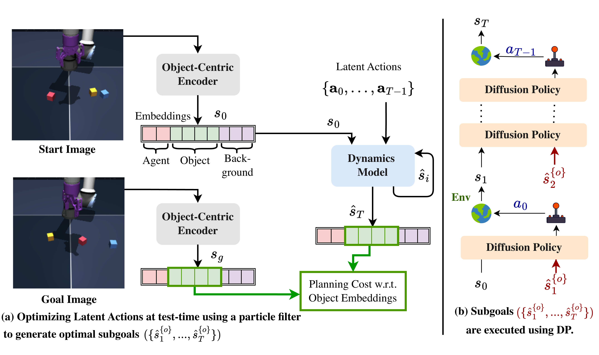
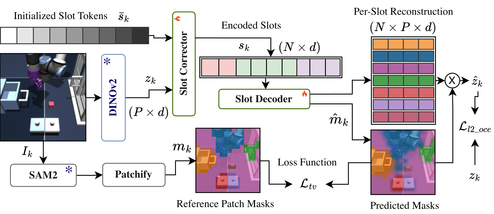
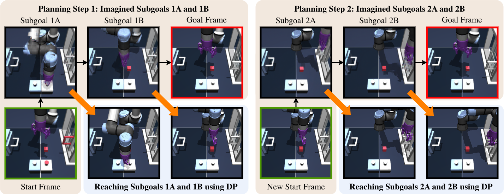
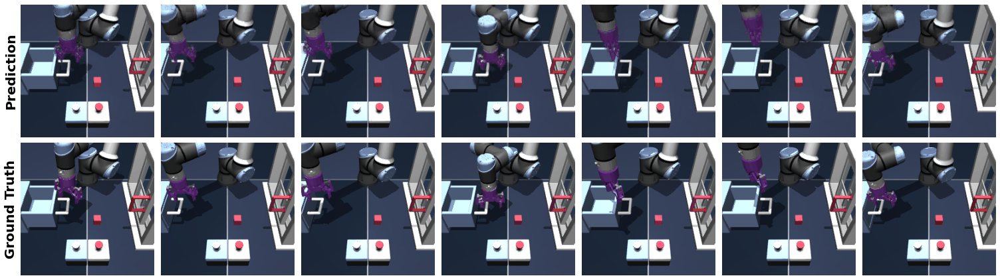

# Unifying Object-Centric World Models and Diffusion Policy: A Hierarchical Framework for Multi-Stage Robotic Tasks

#

# 基本信息

- arXiv: [2606.08775](http://arxiv.org/abs/2606.08775v1)
- Authors: Raktim Gautam Goswami, Prashanth Krishnamurthy, Yann LeCun, Farshad Khorrami
- Categories: cs.RO, cs.AI

#

# 研究问题

分层世界模型联合扩散策略实现多阶段机器人操作

#

# 任务与挑战

现有视觉世界模型在机器人控制中主要局限于单阶段任务（如抓取或到达），难以应对需要复杂时序规划的多阶段长程操作（如先解锁再开抽屉）。此外，基于块级（patch-level）视觉特征的状态表示容易丢失细粒度物理细节，不利于精确动力学建模与规划。本文提出WorldDP，一种分层框架。高层采用对象中心（object-centric）世界模型，在DINOv2块特征之上利用SAM2引导的Slot Attention提取实体级表征，并通过条件扩散Transformer（CDiT）建模动力学。在测试时，使用粒子滤波（Particle Filter）优化潜在动作序列以生成可行子目标，同时引入接触预测器（Contact Predictor）引导关键交互状态的生成。低层则由目标条件扩散策略（Diffusion Policy）依次跟踪并执行这些子目标，实现“高层规划、低层执行”的解耦。在OGBench的四个任务（Cube-Single、Cube-Triple、Scene-Single-Direct、Scene-Single-Composite）上，WorldDP显著优于DinoWM、LeWM、HECRL*及纯扩散策略基线。例如，在Cube-Triple三立方体全部放置成功率为30%，远超次优的12%；在需要因果依赖的Scene-Single-Composite完整任务上达到20%，而多数基线为0。消融实验验证了对象中心编码、粒子滤波、接触预测器以及分层扩散策略执行的必要性。该研究的重要意义在于首次将对象中心世界模型与扩散策略在分层MPC框架中统一，证明了世界模型的物理 grounded 长程规划能力与扩散策略的短程鲁棒执行能力相结合，可有效解决多阶段机器人操作问题。其对象中心规划和接触感知子目标生成策略为后续世界模型在更复杂具身智能任务中的扩展提供了新思路。

#

# 核心 Insight

这篇论文的核心价值需要结合原文继续复查。当前 fallback 笔记保留了日报分析、DeepResearch 草稿和已筛选图表，避免自动流程中断。

#

# 方法与公式

DeepResearch 未生成；请回看论文正文中的方法章节与关键公式。

#

# 贡献拆解

- 关键术语：Object-Centric World Models, Diffusion Policy, Hierarchical Planning, Particle Filter Optimization, Multi-Stage Manipulation
- 加权评分：4.35/5.0

#

# 关键图表解读

*该图是论文核心框架图，清晰展示了测试时利用粒子滤波优化潜在动作以生成子目标（a），以及通过扩散策略（DP）分层执行这些子目标（b）的完整流程，直接对应论文的 hierarchical framework 核心思想。*

*该图详细描绘了 Object-Centric Encoder 的网络架构，包括 DINOv2 特征提取、Slot Corrector、Slot Decoder 以及基于 slot 的重建与掩码预测损失，是理解对象中心表示如何解耦环境实体的关键。*

*该图以具体场景展示了多阶段规划过程：从起始帧出发，依次想象并到达子目标 A/B/C，最终抵达目标帧。直观解释了高层世界模型如何生成可行子目标序列，支撑多阶段任务的核心 claim。*

*该图展示了模型在场景单任务上的 rollout 预测结果与真值的逐帧对比，直接验证世界模型的动态预测准确性，是支撑实验结论的关键可视化证据。*

#

# 实验与消融

请优先核对主结果表、消融实验和真实/仿真任务设置；若图表已选中，应结合上方图片逐项复查。

#

# 局限性

当前自动精读未能成功调用完整图文生成模型，因此局限性需要结合原文实验设置进一步人工确认。

#

# 个人研究判断

若该论文与 World Models assisting Embodied AI、VLA、robot policy 或 sim-to-real 强相关，建议进入人工精读队列。
