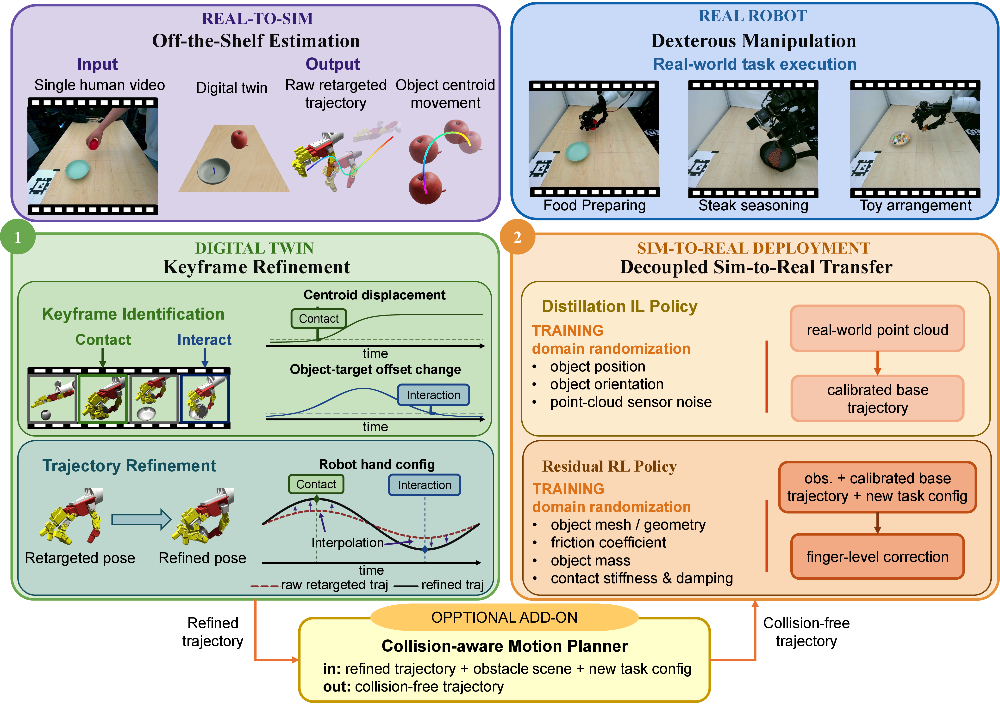
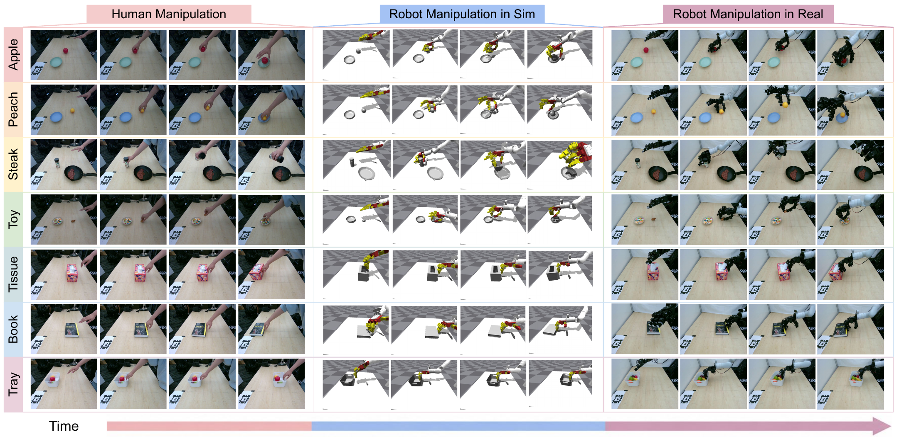
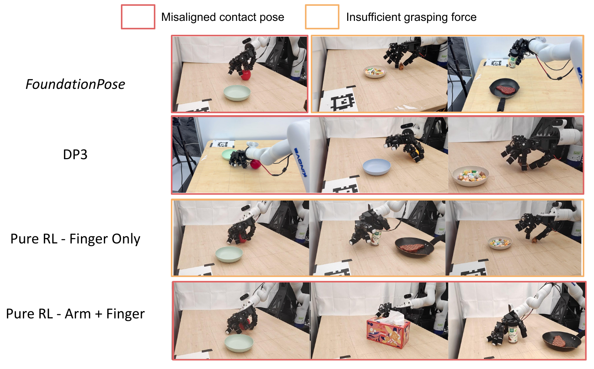
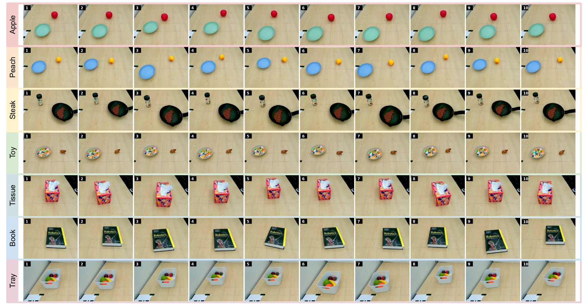

# Video2Sim2Real: Full-Stack Autonomous Dexterous Skill Acquisition from a Single Human Video

#

# 基本信息

- **arXiv:** 2606.08828
- **Authors:** Yunhai Han, Jianuo Qiu, Linhao Bai, Ziyu Xiao, Zihang Zeng, Yangcen Liu, Zhaodong Yang, Shalin Jain, Wenrui Ma, Jiaqi Fu, Yuqian Zheng, Manisha Natarajan, Muhammad Zubair Irshad, Kenneth Shaw, Matthew Gombolay, Zsolt Kira, Harish Ravichandar
- **Categories:** cs.RO
- **一句话结论:** Video2Sim2Real 提出了一个从单条人类视频自主重建数字孪生、基于物体关键帧优化轨迹并解耦学习 IL+RL 策略的完整框架，在七个日常灵巧操作任务的真实世界实验中取得了 95.7% 的平均成功率。

#

# 研究问题

本文要解决的核心问题是：在无需机器人示教、无需专家干预的前提下，如何从单条人类操作视频中自主获取可部署的机器人灵巧操作技能。该问题处于 Embodied AI、Sim-to-Real 与机器人学习的交叉点。现有方法要么受限于感知误差导致重定向轨迹质量低下，要么在接触丰富的操作任务中难以弥合仿真与现实之间的几何/物理差异。本文试图通过“数字孪生+关键帧优化+解耦策略学习”的全栈路径，将人类视频中的语义与物理信息转化为机器人可执行策略。

#

# 任务与挑战

**具体任务:** 涵盖七个日常桌面操作任务，包括水果准备（Apple/Peach）、牛排调味（Steak）、玩具整理（Toy）、纸巾盒传递（Tissue）、书本递送（Book）与托盘取回（Tray）。

**输入输出设定:** 输入为单视角 RGB-D 人类操作视频 $\mathcal{V}=\{(I_t,D_t)\}_{t=1}^T$、参考场景图像 $(I_s,D_s)$、相机内参与外参；输出为可在真实 7-DoF Kinova Gen3 + 16-DoF Leap Hand 上部署的关节级控制指令。

**核心挑战:**
1. **感知与本体差异（embodiment gap）:** 人手自遮挡与手-物遮挡导致 3D 姿态估计不准，直接重定向到机器人本体后往往无法复现相同交互。
2. **接触动力学敏感:** 在抓取、放置等接触丰富任务中，毫米级的几何误差或接触参数差异即可导致任务失败。
3. **高维探索困难:** 纯 RL 在 23-DoF（7 臂 + 16 指）关节空间上直接学习长时程策略，样本效率低且易产生不安全行为。
4. **Sim-to-Real 几何/物理双重间隙:** 重建的数字孪生与真实场景在物体网格、质量、摩擦、传感器噪声等方面均存在差异。

#

# 核心 Insight

本文的核心思想可以概括为“以物体为中心的稀疏锚点优化”与“几何-接触解耦的 Sim-to-Real 迁移”。首先，作者认为重定向的人类手部轨迹不应被当作全程可靠的参考，而应被视为一种“运动先验”；真正决定任务成败的是机器人在关键交互时刻对物体产生的物理影响。因此，论文提出在接触（Contact）、交互（Interaction）、分离（Detachment）三类稀疏关键帧上，利用仿真器中的物体几何与运动信息重新优化机器人构型，再以这些优化后的构型为锚点，通过平滑插值修正整条重定向轨迹。这种“物体中心”策略既保留了人类演示的时间连贯性，又确保了任务意图的物理可实现性。

其次，针对 Sim-to-Real 迁移，作者提出将误差来源显式解耦：全局的物体位姿/几何误差由模仿学习（IL）在部署前通过点云观测一次性校准；局部的接触动力学误差（如摩擦、刚度、抓取力）由残差强化学习（RL）在跟踪基轨迹时在线调整手指动作。这种分工避免了单一策略同时应对高维感知不确定性和高频接触变化的困境。



#

# 方法与公式

#

## 1. Real-to-Sim：数字孪生重建与运动先验提取

**数字孪生重建。** 利用 Gemini 进行语义场景解析（识别被操作物体、目标物体、任务类型），SAM3 进行开放词汇分割，SAM 3D Objects 从参考 RGB-D 帧重建带纹理的物体网格，最终导出 URDF 资产。输出为仿真就绪场景：

```math
\mathcal{S}=\big(\{(q_i, M_i, \mathcal{G}_i, \mathbf{T}_t^i, U_i)\}_{i=1}^{N},\; i_{\mathrm{manip}},\; i_{\mathrm{target}},\; \tau\big)
```

其中 $q_i$ 为语义描述，$M_i$ 为 2D 掩码，$\mathcal{G}_i$ 为规范化网格，$\mathbf{T}_t^i \in SE(3)$ 为桌面坐标系下的 6-DoF 位姿，$U_i$ 为 URDF。

**运动估计。** 使用 HaMeR 从视频中提取 21 个人手 3D 关键点，经坐标变换后通过可微 IK 求解器 Mink 重定向到机器人关节空间：

```math
\mathbf{q}^\ast = \arg\min_{\mathbf{q}}\; \lambda_p \sum_{k=1}^4 \left\lVert f_k^{\mathrm{pos}}(\mathbf{q}) - \mathbf{p}_{\mathrm{tip},k}^t \right\rVert_2^2 + \lambda_{wp} \left\lVert f_{\mathrm{wrist}}^{\mathrm{pos}}(\mathbf{q}) - \mathbf{p}_{\mathrm{wrist}}^t \right\rVert_2^2 + \lambda_{wR}\, d_R\!\big(f_{\mathrm{wrist}}^{\mathrm{rot}}(\mathbf{q}), \mathbf{R}_{\mathrm{wrist}}^t\big)
\tag{1}
```

式中 $\mathbf{q}$ 为机器人关节角，$f_k^{\mathrm{pos}}$ 与 $f_{\mathrm{wrist}}^{\mathrm{pos/rot}}$ 分别为指尖与腕部的正运动学映射，$d_R(\cdot,\cdot)$ 为 $\mathrm{SO}(3)$ 上的测地距离。物体运动则通过 CoTracker 跟踪 2D 流点并反投影到 3D 桌面坐标系获得。

#

## 2. 关键帧识别与优化

**关键帧识别。** 基于被操作物体的 2D 流点质心位移检测接触帧 $T_c$；基于被操作物体与目标物体相对质心偏移的连续变化检测交互帧 $T_i$；基于物体高度阈值检测分离帧 $T_d$。

**接触帧优化（抓取）。** 在仿真器中回放重定向轨迹，恢复原始手-物相对位姿 $\mathbf{T}_{h\rightarrow m}^{c}$，随后根据物体几何进行抓取类型判别（top/side grasp），使用 Lightning Grasp 生成候选抓取，并通过仿真中的稳定性测试（抬升-摇晃测试）筛选最终构型，得到修正后的相对位姿 $\hat{\mathbf{T}}_{h\rightarrow m}^{c}$。

**接触帧优化（推/拉）。** 根据 3D 流点估计物体运动方向 $\mathbf{d}_{m}^{w}$，选择物体表面接触点，并修正指尖法向使其与运动方向水平对齐，从而得到接触帧机器人基座标系位姿 $\hat{\mathbf{T}}_{h}^{c}$。

**交互帧优化。** 利用跨帧 3D 流点对应关系，通过 Kabsch 算法求解刚体变换：

```math
\hat{\mathbf{T}}_{m}^{t} = \arg\min_{\mathbf{T} \in SE(3)} \sum_{i=1}^{N} \left\lVert \mathbf{T}\,\mathbf{p}_i^{o} - \mathbf{p}_i^{t} \right\rVert_{2}^{2}
\tag{2}
```

其中 $\mathbf{p}_i^{o}$ 为源帧物体坐标系下的点，$\mathbf{p}_i^{t}$ 为目标帧世界坐标系下的点。该过程外包 RANSAC 以剔除跟踪外点。

#

## 3. 轨迹插值

将优化后的关键帧构型作为锚点，对原始重定向轨迹进行分段修正。为保证零速度起止，插值使用 quintic smoothstep：

```math
\alpha(s) = 6s^{5} - 15s^{4} + 10s^{3}, \qquad s\in[0,1]
\tag{3}
```

在臂部跟踪阶段采用阻尼最小二乘（DLS）进行任务空间修正；在关键帧处则求解精确 IK 以确保手掌精确到达目标位姿。

#

## 4. 解耦 Sim-to-Real 策略学习

**Distillation IL Policy（几何自适应）。** 在仿真中随机化物体位姿（平面 $\pm 5\,\mathrm{cm}$，偏航 $\pm 10^{\circ}$）与点云传感器噪声，生成大量“点云-关键帧位姿”配对数据。网络采用轻量级 mask-aware PointNet（约 $10^5$ 参数），输入部分观测点云，输出相对于物体质心的平移残差 $\Delta \hat{\mathbf{p}}$ 与 6D 旋转 $\hat{\mathbf{r}}_{6D}$。训练目标为：

```math
\mathcal{L} = \lambda_{\mathrm{pos}} \left\lVert \Delta \hat{\mathbf{p}}-\Delta \mathbf{p} \right\rVert_2^2 + \lambda_{\mathrm{rot}} \left\lVert R(\hat{\mathbf{r}}_{6D})-R(\mathbf{r}_{6D}) \right\rVert_F^2
\tag{4}
```

其中 $R(\cdot)$ 将 6D 表示转换为旋转矩阵，$\lambda_{\mathrm{pos}}=\lambda_{\mathrm{rot}}=1$。部署时，该策略在机器人进入工作空间前仅查询一次，避免了手-物遮挡带来的观测差异。

**Residual RL Policy（接触自适应）。** 基于 PPO 训练，仅输出手指关节残差（裁剪至 $[-0.06, 0.06]$），臂部严格跟踪优化后的基轨迹。观测包括当前/下一步参考关节角 $\bar{\mathbf{q}}^{\mathrm{cur}}_t, \bar{\mathbf{q}}_{t+1}$、3D 流质心 $\mathbf{c}_t$ 与物体运动增量 $(\Delta \mathbf{x}_t, \Delta \theta_t)$。奖励为 3D 流跟踪误差加动作惩罚。训练时随机化物理参数（网格尺度、质量、摩擦、接触刚度与阻尼）。

**几何间隙的概率视角。** 论文从概率角度论证几何随机化的必要性：策略应边际化几何参数 $g$ 的不确定性：

```math
p(a \mid o) = \int p(a \mid o, g)\, p(g \mid o)\, dg
\tag{5}
```

通过在训练时采样不同几何参数生成数据，策略隐式学习了对几何估计误差的鲁棒性。

#

## 5. 碰撞感知运动规划（可选）

对于大幅偏离演示位姿的新任务配置，使用 CuRobo 生成无碰撞轨迹。输入为优化后的关键帧位姿、重建的障碍物场景与新任务配置，输出无碰撞的机器人轨迹。对于推/拉任务，采用直线 Cartesian 插值配合连续 IK，避免旋转运动导致接触丢失。

#

# 贡献拆解

1. **以物体为中心的稀疏关键帧轨迹优化**
   - **做了什么：** 在接触、交互、分离三类关键帧上，利用仿真器中的物体几何与运动信息重新优化机器人构型，再以优化构型为锚点插值修正整条重定向轨迹。
   - **为什么有效：** 避开了对低质量重定向轨迹的全局依赖，用稀疏锚点保证任务意图的物理可实现性，同时保留人类演示的时间连贯性。
   - **与已有方法差别：** 不同于 Residual RL 或 Deep-mimic RL 直接在重定向轨迹上学习修正，也不同于 Object-only 方法完全丢弃人体运动先验。

2. **解耦的 Sim-to-Real 策略学习**
   - **做了什么：** 显式分离几何自适应（IL 从点云校准关键帧位姿）与接触自适应（残差 RL 调整手指动作）。
   - **为什么有效：** IL 在部署前一次性处理全局感知误差，避免在线遮挡；RL 只需在低维手指空间处理局部接触动力学，大幅降低探索难度。
   - **与已有方法差别：** 区别于纯 IL（如 DP3，易受 sim-to-real 观测差异影响）和纯 RL（如全关节残差策略，易产生不安全行为）。

3. **全栈自主技能获取系统**
   - **做了什么：** 实现了从单条人类视频到真实机器人部署的完整自动化 pipeline，包括数字孪生重建、轨迹优化、策略学习与可选的空间泛化。
   - **为什么有效：** 充分利用 Gemini、SAM3、HaMeR 等现成基础模型，无需任务特定的机器人示教或人工标注。
   - **与已有方法差别：** 相比需要多视角、多演示或动捕系统的方法，本文仅需单视角 RGB-D 视频。

4. **空间泛化与碰撞避免模块**
   - **做了什么：** 结合 CuRobo 生成面向新任务配置的无碰撞轨迹。
   - **为什么有效：** 在单视频演示的基础上支持障碍物场景中的大幅位姿变化。
   - **与已有方法差别：** 将数字孪生不仅用于策略训练，还直接作为运动规划的碰撞模型。

#

# 关键图表解读



**图 1：系统整体架构（figure-004-pipeline.png）**
该图是理解本文方法的总览蓝图。左上（Real-to-Sim）展示利用现成基础模型从单视频重建数字孪生并提取运动先验；左下（Keyframe Refinement）展示基于物体运动检测三类关键帧，并在仿真中优化机器人手配置，再通过插值得到细化轨迹；右下（Sim-to-Real Deployment）展示解耦策略：Distillation IL 从真实点云生成校准后的基轨迹，Residual RL 在此基础上执行手指级修正；底部可选模块利用碰撞感知运动规划生成无碰撞轨迹。读图时应注意 IL 与 RL 的调用时机差异：IL 在机器人进入工作空间前离线查询，RL 在每个控制周期在线运行。

**图 2：七任务并列对比（figure-005-tasks-results-1.png）**
该图从左到右分别展示人类演示、仿真机器人执行与真实机器人执行。其支撑论点在于：重建的数字孪生能够准确反映真实场景几何，且经过细化与解耦策略迁移后，真实机器人可复现人类演示的多样化操作。读图时应注意各任务中物体与机器人手的相对位姿一致性，尤其是在 Steak 与 Toy 等接触敏感任务中，机器人仍能保持正确的交互姿态。



**图 3：基线失败案例分析（figure-008-baseline-failure.png）**
该图以红色框标注“接触姿态错位”（Misaligned contact pose），以橙色框标注“抓取力不足”（Insufficient grasping force）。FoundationPose 基线因依赖预训练姿态估计模型，在接触丰富场景中产生系统性的位姿偏差；DP3（Pure-IL）与纯 RL 方法则分别因观测差异和高维探索困难而失败。该图构成对本文核心 insight 的强力反证：在接触丰富的灵巧操作中，必须将几何鲁棒性与接触动力学自适应解耦处理。



**图 4：真实世界任务范围（figure-011-task-range.png）**
该图展示七个任务在真实环境中各 10 个时间步的连续执行序列，每行对应一个任务，每列代表一个时间步。其支撑论点在于方法在多样化日常任务中的时间连贯性与端到端成功率。读图时应注意物体在被操作后的位姿变化（如 Apple 被移入碗中、Book 被推向目标位置），表明策略不仅完成了接触，还实现了正确的任务语义。

#

# 实验与消融

**实验设定。** 在 Isaac Gym 仿真器中进行轨迹细化与策略训练，真实硬件为 Kinova Gen3 + Leap Hand，使用 RealSense D455 采集 RGB-D 数据。共评估 7 个日常任务。

**仿真细化阶段基线与结果。** 对比五种 RL 细化基线：Residual RL、Deep-mimic RL、Pre-Contact Init、Opt-Pre-Contact Init、Object-only。评估指标包括多阶段成功率、安全率（无桌碰撞）、臂/手 RMS jerk（平滑度）与完成帧数。本文方法在平均成功率、安全率与轨迹平滑度上均显著优于所有基线，且无需耗时的策略学习即可完成仿真细化。RL 基线普遍存在不安全行为（撞桌）或高抖动问题。

**Sim-to-Real 仿真评估。** 在 50 组随机化几何/物理参数下测试，本文解耦策略在平均成功率、完成时间（最短）与轨迹平滑度上均优于 Pure-RL（finger/arm+finger）与 Pure-IL（DP3）。多阶段成功率显示，Pure-RL-finger 在小型物体（Toy）上表现尚可，但在需要手臂级适应的任务（Peach、Steak）中明显不足。

**真实世界评估。** 每个任务进行 10 次试验，物体位姿在局部范围内扰动。结果如下：

| Method | Apple | Peach | Steak | Toy | Tissue | Book | Tray | Avg. |
|---|---|---|---|---|---|---|---|---|
| FoundationPose | 0/10 | 0/10 | 1/10 | 0/10 | 0/10 | 0/10 | 10/10 | 15.7% |
| Ours | 10/10 | 9/10 | 10/10 | 8/10 | 10/10 | 10/10 | 10/10 | **95.7%** |

此外，Pure-IL（DP3）仅 5.7%，Pure-RL-finger 45.7%，Pure-RL-arm+finger 仅 3.0%。

**消融实验。** 单独使用 Distillation IL（仅校准关键帧）在 Peach/Toy 上失败率较高；单独使用 Residual RL（无基轨迹校准）在 Peach/Toy 上亦表现不佳；两者结合后平均成功率从 33.3%/60.0% 提升至 90.0%（5 次试验子集），验证了显式解耦的必要性。

**最强证据：** 真实世界 95.7% 的平均成功率，以及对 FoundationPose 基线近 80 个百分点的绝对提升，证明了部署时通过策略学习进行误差校正的必要性。

**最存疑证据：** 空间泛化模块在 Apple 与 Toy 任务中因 CuRobo 规划误差（约 2 cm）导致仿真回放失败，说明对于高精度灵巧任务，仅靠运动规划仍不足，仍需策略学习补偿；此外，Steak 任务在仿真内未达 100% 成功率，论文归因于 Isaac Gym 接触动力学的跨运行随机性。

#

# 局限性

1. **关键帧稀疏性：** 当前优化仅在离散的关键帧进行，对于需要复杂手中重定向或连续接触调整的长时程任务可能不足。
2. **启发式关键帧检测：** 依赖基于质心位移与偏移变化的固定阈值检测关键帧，对更复杂、更 subtle 的操作（如旋转、滑动）可能不够鲁棒，可替换为预训练的运动分析模型。
3. **物体类型受限：** 重建 pipeline 目前仅支持刚性（非关节）物体，无法直接处理抽屉、带铰链的盒子等关节物体。
4. **标定与传感器依赖：** 当前系统依赖 RGB-D 输入，且需要预放置 AprilTags 进行相机-桌子-机器人外参标定，尚未支持 RGB-only 或完全无标定的野外设置。
5. **仿真器动力学差异：** Isaac Gym 的接触求解存在跨运行差异，对精确抓取敏感，可能导致相同轨迹在不同运行中产生不同结果。

#

# 个人研究判断

面向“World Models assisting Embodied AI downstream tasks”的研究方向，本文**值得继续追踪**。

理由如下：本文提供了一个系统级范例，展示了如何将数字孪生（作为 World Model 的具体实例）用于连接人类视频语义与机器人物理执行。其“以物体为中心的关键帧优化”思想，将人类运动先验从“必须全程遵循的参考”降维为“提供时间结构的提示”，从而把物理正确性交还给仿真器中的物体几何与动力学，这对 VLA 和机器人学习领域具有方法论启发。此外，IL 负责几何自适应、RL 负责接触自适应的解耦设计，为接触丰富的具身任务提供了一种可扩展且安全的迁移范式，可直接融入更宏大的 World Model 框架中作为下游控制模块。

从未来研究角度，本文的局限也指明了清晰的方向：将关键帧优化扩展为连续优化、引入触觉感知以替代部分视觉观测、支持关节物体与 RGB-only 输入，以及结合生成式 World Model 进行更高效的域随机化，都是极具潜力的延伸。总体而言，Video2Sim2Real 为“视频→数字孪生→真实策略”提供了一条当前最为完整且可复现的技术路径。
