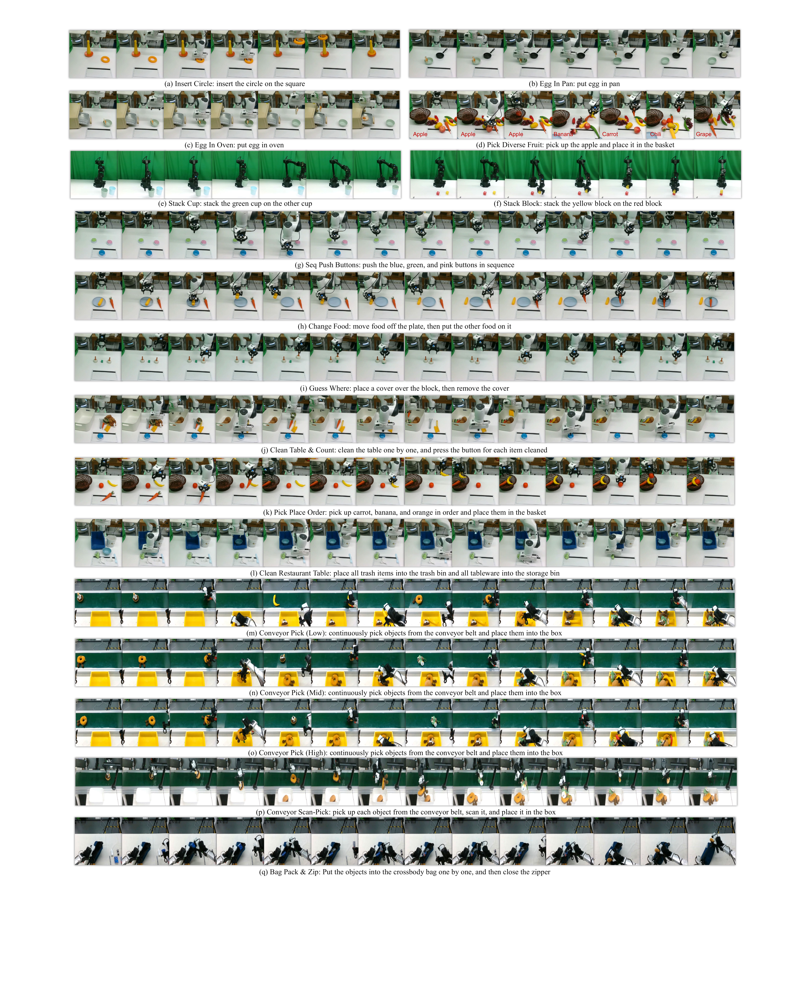
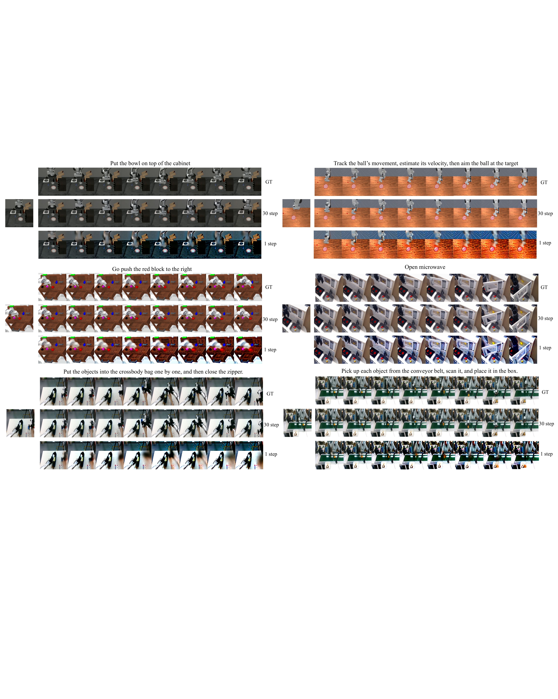
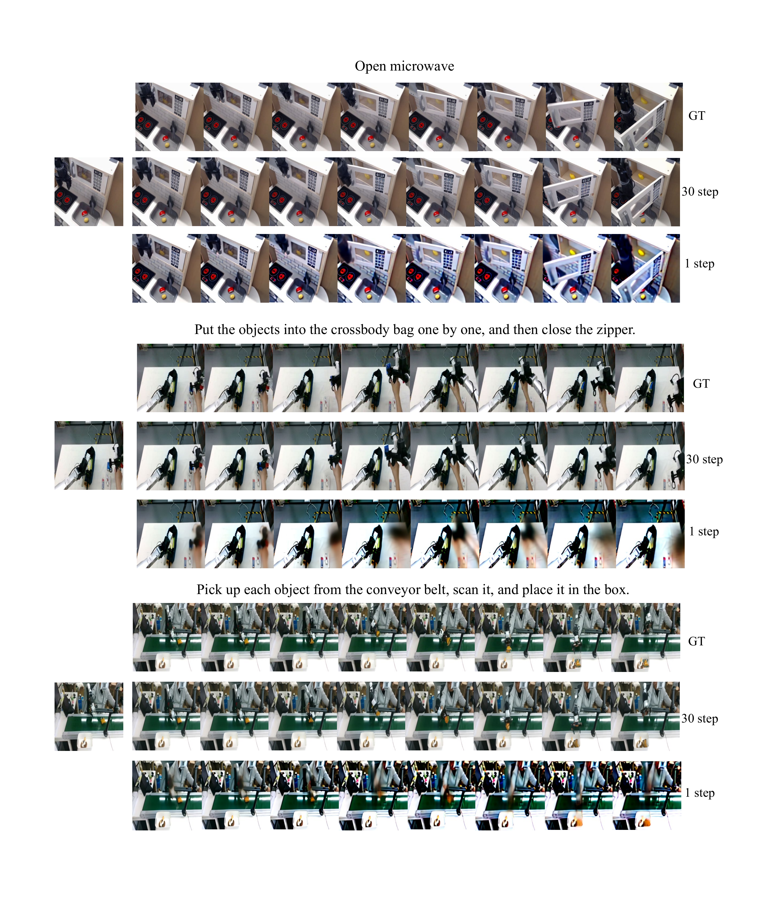
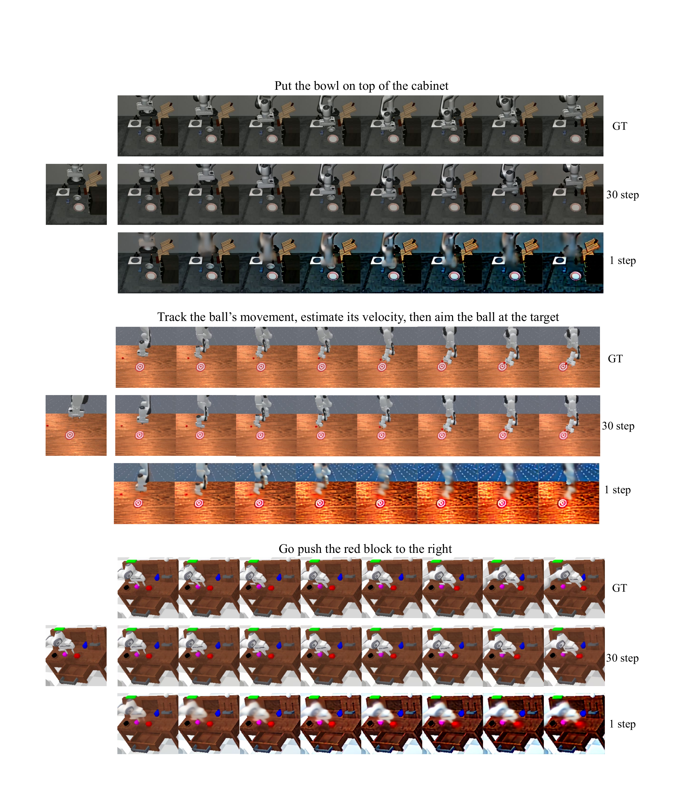

# MemoryVLA++: Temporal Modeling via Memory and Imagination in Vision-Language-Action Models

#

# 基本信息

- arXiv: [2606.09827](http://arxiv.org/abs/2606.09827v1)
- Authors: Hao Shi, Weiye Li, Bin Xie, Yulin Wang, Renping Zhou, Tiancai Wang, Xiangyu Zhang, Ping Luo, Gao Huang
- Categories: cs.RO, cs.CV

#

# 研究问题

为VLA模型引入记忆与想象机制实现完整时序建模

#

# 任务与挑战

现有Vision-Language-Action（VLA）模型大多仅依赖当前视觉观测进行动作预测，缺乏对历史交互的有效记忆和对未来状态变化的预判能力，因而在长程时序依赖的机器人操作任务中表现不佳。简单拼接历史帧或显式生成未来视频的方法存在计算冗余高、误差传播等问题，难以高效利用时序信息。

本文提出MemoryVLA++，一个受认知科学启发的全时序建模框架，通过“记忆+想象”增强VLA模型。该方法利用预训练VLM编码当前观测为感知token与认知token，形成工作记忆；通过感知-认知记忆库（PCMB）以交叉注意力检索历史上下文，并采用冗余感知合并机制压缩记忆；同时引入基于Stable Video Diffusion的世界模型，在潜空间通过部分去噪生成未来想象token，经记忆引导自适应融合后，最终由扩散动作专家（DiT）生成时序一致的动作序列。

实验覆盖5个仿真基准（Libero、SimplerEnv、Mikasa-Robo、Calvin、Libero-Plus）及3类真实机器人任务。MemoryVLA++在Libero上平均成功率达98.4%，在SimplerEnv上达73.9%（+16.6%），在Mikasa-Robo上达44.4%（+15.0%），在Calvin长程任务上平均完成4.29步（+1.04）。真实机器人上，通用操作、记忆依赖和想象依赖任务分别达85%、83%和77%，较基线提升9、26和28个百分点。

该工作将VLA时序建模从“仅记忆过去”推进到“过去-现在-未来”全时间轴统一建模，验证了世界模型与显式记忆机制协同提升机器人长程决策与泛化能力的有效性。其潜空间想象策略在可控计算开销下显著增强了对未来动态的利用，为构建具备时序推理能力的通用机器人策略提供了重要范式。

#

# 核心 Insight

这篇论文的核心价值需要结合原文继续复查。当前 fallback 笔记保留了日报分析、DeepResearch 草稿和已筛选图表，避免自动流程中断。

#

# 方法与公式

DeepResearch 未生成；请回看论文正文中的方法章节与关键公式。

#

# 贡献拆解

- 关键术语：Vision-Language-Action, World Model, Diffusion Policy, Memory Bank, Temporal Modeling
- 加权评分：4.25/5.0

#

# 关键图表解读

*Fallback selection because visual JSON selection failed.*

*Fallback selection because visual JSON selection failed.*

*Fallback selection because visual JSON selection failed.*

*Fallback selection because visual JSON selection failed.*

#

# 实验与消融

请优先核对主结果表、消融实验和真实/仿真任务设置；若图表已选中，应结合上方图片逐项复查。

#

# 局限性

当前自动精读未能成功调用完整图文生成模型，因此局限性需要结合原文实验设置进一步人工确认。

#

# 个人研究判断

若该论文与 World Models assisting Embodied AI、VLA、robot policy 或 sim-to-real 强相关，建议进入人工精读队列。
