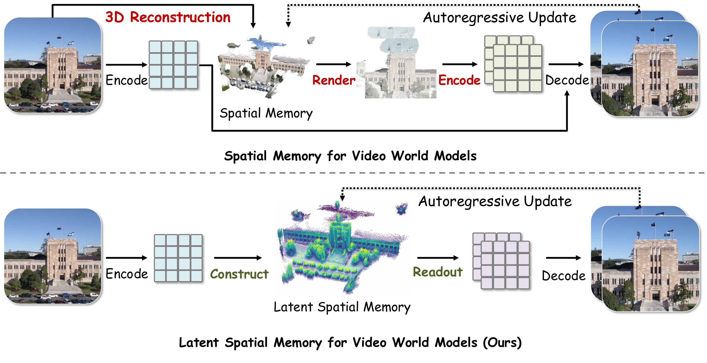
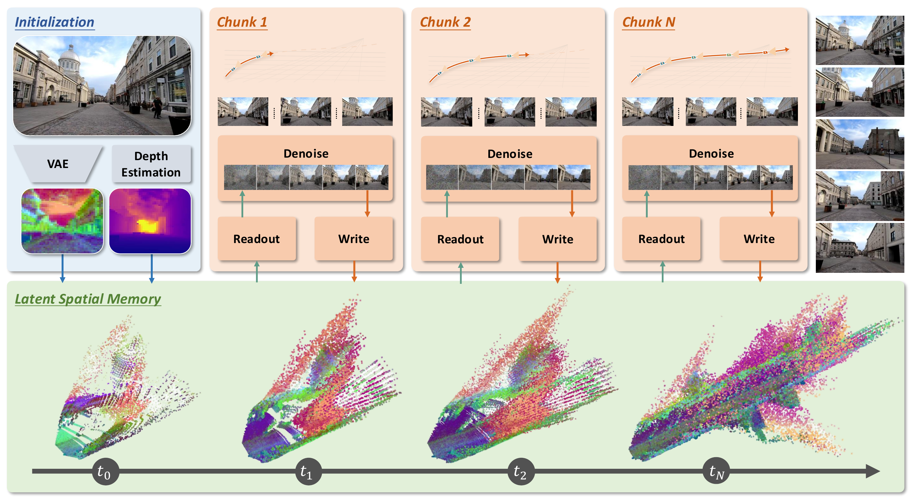
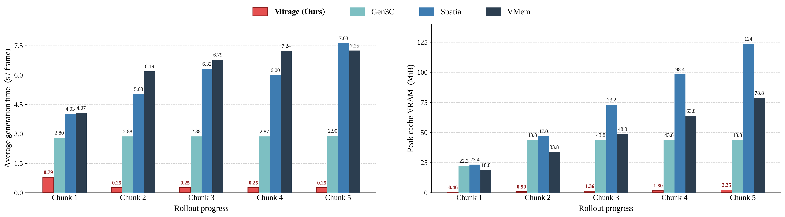
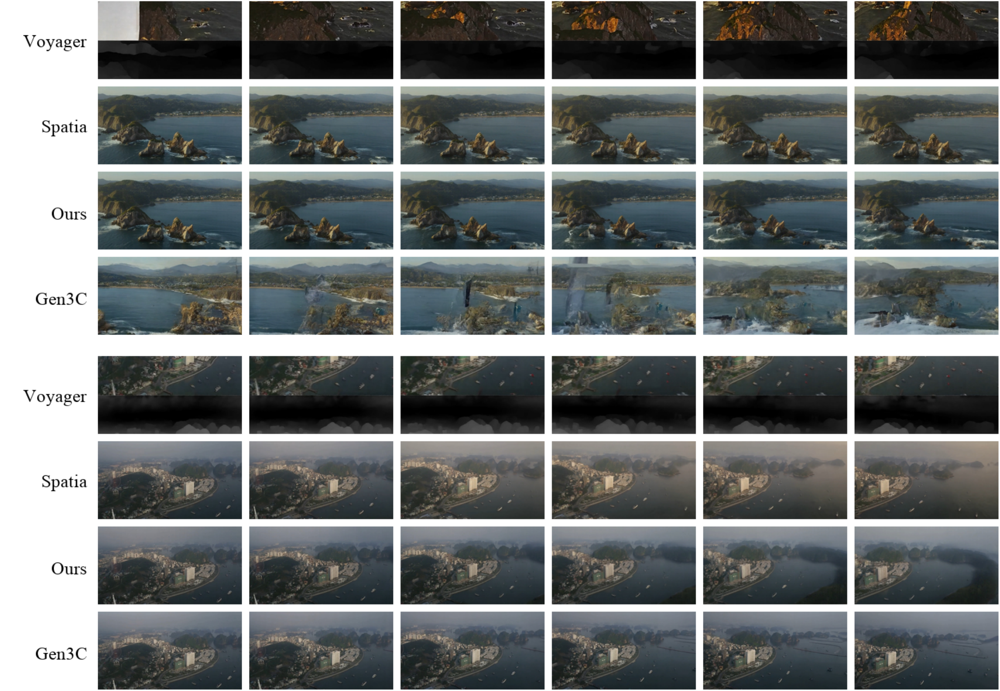

# Latent Spatial Memory for Video World Models

#

# 基本信息

- arXiv: [2606.09828](http://arxiv.org/abs/2606.09828v1)
- Authors: Weijie Wang, Haoyu Zhao, Yifan Yang, Feng Chen, Zeyu Zhang, Yefei He, Zicheng Duan, Donny Y. Chen, Yuqing Yang, Bohan Zhuang
- Categories: cs.CV

#

# 研究问题

提出潜空间三维记忆机制，实现高效长程视频世界模型

#

# 任务与挑战

现有视频世界模型为保持跨帧三维空间一致性，通常依赖RGB显式点云记忆，但每一步都需将点云渲染为像素图像再经VAE编码回潜空间，导致计算开销巨大且反复编解码造成信息损失与特征失真。本文针对这一瓶颈提出潜空间空间记忆（Latent Spatial Memory），直接将VAE编码后的高维潜特征通过深度引导反投影存入三维世界坐标缓存；读取时仅在潜空间分辨率下进行投影与遮挡处理，并通过ControlNet风格旁路注入视频扩散主干，避免了像素空间的往返。基于此构建的Mirage框架还包含动态物体与天空区域过滤、分块自回归生成，以及先冻结主干训练旁路再解锁LoRA适配器的两阶段微调策略。

实验表明，该方法在WorldScore基准上取得平均70.36分的SOTA表现，其中3D一致性（92.21）与照片一致性（93.95）均显著领先；在RealEstate10K的新视角合成与闭环重访测试中，SSIM与LPIPS亦为最优，闭环PSNR_C达20.05。效率方面，相比RGB点云基线，端到端视频生成速度提升最高10.57倍，三维缓存显存占用降低55倍，且随轨迹增长优势进一步扩大。

该工作首次将三维空间记忆完全构建在扩散潜空间内，消除了像素空间渲染-编码的瓶颈，兼顾了生成质量与长程rollout的可扩展性。其对高保真、长时程世界模型的推动，对具身智能中基于世界模型的策略学习、物理理解与sim-to-real研究均具有重要参考价值。

#

# 核心 Insight

这篇论文的核心价值需要结合原文继续复查。当前 fallback 笔记保留了日报分析、DeepResearch 草稿和已筛选图表，避免自动流程中断。

#

# 方法与公式

DeepResearch 未生成；请回看论文正文中的方法章节与关键公式。

#

# 贡献拆解

- 关键术语：latent spatial memory, video world models, 3D point cloud cache, diffusion latent space, view consistency
- 加权评分：4.2/5.0

#

# 关键图表解读

*直接对比传统显式3D空间记忆与本文提出的Latent Spatial Memory的核心差异，清晰阐释了避免像素空间往返的insight，是理解论文动机与贡献的关键图。*

*展示了Mirage方法的完整流程，包括初始化、Chunk级Denoise、Readout/Write机制以及Latent Spatial Memory随时间的演化，是理解方法架构的核心图。*

*以量化柱状图形式呈现了生成速度和显存占用随Chunk增加的变化，直接支撑论文中10.57×加速和55×显存降低的关键结论。*

*在室外大场景和城市场景上与Voyager、Spatia、Gen3C进行长序列定性对比，直观展示了Ours在时序一致性和视觉质量上的优势。*

#

# 实验与消融

请优先核对主结果表、消融实验和真实/仿真任务设置；若图表已选中，应结合上方图片逐项复查。

#

# 局限性

当前自动精读未能成功调用完整图文生成模型，因此局限性需要结合原文实验设置进一步人工确认。

#

# 个人研究判断

若该论文与 World Models assisting Embodied AI、VLA、robot policy 或 sim-to-real 强相关，建议进入人工精读队列。
