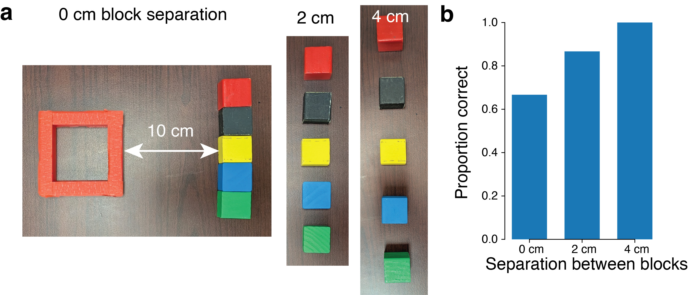
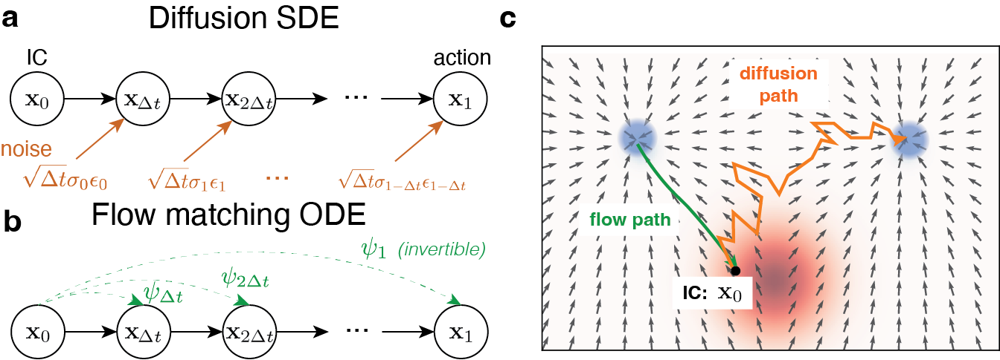

# Flow Control: Steering Vision-Language-Action Models with Simple Real-Time Inputs

#

# 基本信息

- arXiv: 2606.10180
- Authors: Jonathan C. Kao, Jason Chan, Andy Wang
- Categories: cs.RO, cs.AI, cs.HC
- 一句话结论：利用流匹配动作专家确定性 ODE 的微分同胚特性，通过修改初始条件实现零样本、低带宽、实时的 VLA 人机共享控制，并可用收集的轨迹自举提升策略性能。

#

# 研究问题

当前视觉-语言-动作（VLA）模型在机器人控制中表现先进，但仍存在语言跟随错误、对新物体与场景泛化不足，以及分布外（OOD）漂移导致难以恢复等可靠性问题。现有纠正手段——如语言修正、轨迹草图或目标图像——往往过于粗糙、带宽过高，或需要额外数据收集与模型微调。如何为普通用户提供一种低带宽、实时、直观且无需重训练的 VLA 操控接口，是具身智能领域亟待填补的空白。本文聚焦于：在不改变冻结 VLA 任何权重的前提下，仅通过极简输入（如键盘方向键）即可实时引导高自由度机械臂完成复杂操作任务。

#

# 任务与挑战

具体任务包括在 Franka Panda 机械臂上执行的四个桌面操作任务：双块拾取放置（Two-Block）、五块拾取放置（Five-Block）、Marker-in-Bowl 和 Cup-Stacking。系统输入为相机图像、语言指令、机器人本体状态，以及用户的键盘方向指令（上下左右前后）；输出为连续的动作块（action chunk），包含 7 个关节角度与夹爪宽度。训练与评测设定为完全冻结预训练的 $\pi_{0.5}$-DROID 模型，在不进行任何微调或梯度更新的情况下，通过程序化注入或真实用户输入评估策略的可控性与任务成功率。

已有方法存在明显不足：语言修正语义粗糙且间歇性；轨迹草图和目标图像需要高带宽输入；基于 diffusion policy 的共享自主方法（如 Yoneda et al.、Wang et al.）需要前向加噪与反向去噪，存在保真度-一致性权衡（$\gamma$ 超参数），且引入额外推理延迟；DSRL 则需要额外训练 RL 策略来学习初始噪声分布。本文挑战在于绕过这些权衡，实现真正的零样本、无超参数实时引导。

#

# 核心 Insight

本文的核心观察建立在 $\pi_{0.5}$ 等 SOTA VLA 所采用的 flow matching action expert 之上：与 diffusion model 通过随机微分方程（SDE）在反向过程中逐次注入噪声不同，flow matching 通过确定性常微分方程（ODE）将初始条件映射为动作样本。由于该映射在理论上构成微分同胚（diffeomorphism），初始条件中的信息可被完整保留至最终输出，不存在信息衰减。

基于此，作者提出将用户的低维键盘输入经逆运动学（IK）映射为关节空间动作，并直接将其作为 flow ODE 的初始条件注入，替代原本的高斯噪声。这一设计的精妙之处在于：确定性积分保证了生成动作既高保真（反映用户意图）又高质量（符合训练分布）。当动作分布为多模态时（如左右两个方块均可选择），初始条件像"吸引子"一样将轨迹导向用户意图的模式；当动作分布为单模态时（如放置方块入洞），即使初始条件与用户意图不一致，flow matching 专家也会将其"拉回"到 on-policy 轨迹上，不会破坏任务执行。



上图直观展示了这一本质差异：diffusion 反向过程每步注入独立噪声（橙色路径），初始条件信息被逐步洗掉，可能随机跳向另一模态；而 flow matching 的确定性绿色路径平滑直达目标模态，初始条件信息被完整保留，使其成为理想的实时控制接口。



#

# 方法与公式

#

## 模型结构与数据流

$\pi_{0.5}$ VLA 包含高层/低层视觉-语言感知模块和一个 300M 参数的 flow matching action expert（基于 Gemma Transformer）。该专家以相机观测、语言指令和机器人状态为条件，积分一个 flow matching ODE 生成动作块。Flow Control 仅修改该 action expert 的初始条件接口，不改变 VLA 内部任何权重或架构。

#

## Flow Matching 基础

Flow matching 模型由如下 ODE 定义：

```math
d\mathbf{x}_t = \mathbf{v}_t(\mathbf{x}_t)\,dt, \quad \mathbf{x}_0 \sim \mathcal{N}(\mathbf{0}, \mathbf{I})
\tag{1}
```

模型通过最小化平方误差学习神经网络速度场 $\mathbf{v}^\theta_t$：

```math
\mathcal{L}(\theta) = \left\lVert \mathbf{v}^\theta_t(\mathbf{x}_t) - \mathbf{v}^{\mathrm{target}}_t(\mathbf{x}_t) \right\rVert^2
\tag{2}
```

其中目标向量场通常取直线插值：

```math
\mathbf{v}^{\mathrm{target}}_t(\mathbf{x}_t) = \mathbf{x}_1 - \mathbf{x}_0
\tag{3}
```

推理时通过 Euler 方法将标准高斯噪声转化为机器人动作：

```math
\mathbf{x}_{t+\Delta t} = \mathbf{x}_t + \mathbf{v}^\theta_t(\mathbf{x}_t)\,\Delta t
\tag{4}
```

在 $\pi_{0.5}$ 中，$\Delta t = 0.1$，共积分 $K=10$ 步。

#

## Diffusion SDE 对比

Diffusion 模型由 SDE 定义：

```math
d\mathbf{x}_t = \mathbf{v}_t(\mathbf{x}_t)\,dt + \sigma_t\,d\mathbf{W}_t
\tag{5}
```

其 Euler-Maruyama 离散化在每步注入随机噪声：

```math
\mathbf{x}_{t+\Delta t} = \mathbf{x}_t + \mathbf{v}^\theta_t(\mathbf{x}_t)\,\Delta t + \sqrt{\Delta t}\,\sigma_t\,\boldsymbol{\epsilon}_t
\tag{6}
```

其中 $\boldsymbol{\epsilon}_t \sim \mathcal{N}(\mathbf{0}, \mathbf{I})$。

#

## 信息论分析

对于 diffusion，反向过程构成马尔可夫链，由于每步注入非退化噪声，根据数据加工不等式，条件互信息严格单调递增：

```math
I(\mathbf{x}_{k \Delta t}; \mathbf{x}_1 \mid \mathbf{c}) < I(\mathbf{x}_{(k+1) \Delta t}; \mathbf{x}_1 \mid \mathbf{c})
\tag{7}
```

这意味着初始条件 $\mathbf{x}_0$ 的信息在反向过程中被逐步洗掉。而对于 flow matching，在速度场 $\mathbf{v}^\theta_t$ 满足连续可微且 $L$-Lipschitz 的温和假设下，流映射 $\psi_t$ 是微分同胚，信息被完整保留：

```math
I(\mathbf{x}_{k \Delta t}; \mathbf{x}_1 \mid \mathbf{c}) = I(\mathbf{x}_{(k+1) \Delta t}; \mathbf{x}_1 \mid \mathbf{c})
\tag{8}
```

#

## 几何与位移界限

设用户输入归一化后为 $\mathbf{x}_{\mathrm{user}}$，积分后的动作为 $\psi_1(\mathbf{x}_{\mathrm{user}})$，其位移受速度场积分限制：

```math
\left\lVert \psi_1(\mathbf{x}_{\mathrm{user}}) - \mathbf{x}_{\mathrm{user}} \right\rVert \le \int_0^1 \left\lVert \mathbf{v}^\theta_t(\mathbf{x}_t \mid \mathbf{c}) \right\rVert dt = D(\mathbf{x}_{\mathrm{user}})
\tag{9}
```

若两个候选动作 $\mathbf{a}, \mathbf{a}'$ 满足：

```math
\left\lVert \mathbf{x}_{\mathrm{user}} - \mathbf{a}' \right\rVert - \left\lVert \mathbf{x}_{\mathrm{user}} - \mathbf{a} \right\rVert > 2\,D(\mathbf{x}_{\mathrm{user}})
\tag{10}
```

则生成动作 $\mathbf{x}_1$ 将更接近 $\mathbf{a}$。这解释了为何简单键盘输入能可靠地引导机器人朝向目标行为：只要位移上界 $D(\mathbf{x}_{\mathrm{user}})$ 相对于候选动作间距足够小，初始条件就能"锁定"正确模态。

#

## Flow Control 推理流程

1. 观测 $\mathbf{c}$（图像、语言、状态）；
2. 将键盘输入映射为 3D 笛卡尔末端执行器速度 $\mathbf{v}_{\mathrm{user}}$；
3. 通过 IK 转换为关节速度 $\mathbf{x}_{\mathrm{user}}$；
4. 归一化至 $\mathcal{N}(\mathbf{0}, \mathbf{I})$ 尺度；
5. 采样标准初始条件 $\mathbf{x}_0 \sim \mathcal{N}(\mathbf{0}, \mathbf{I})$，并将前 $\tau$ 步替换为 $\mathbf{x}_{\mathrm{user}}$；
6. 用冻结的速度场 $\mathbf{v}^\theta_t$ 进行确定性 Euler 积分，得到动作块 $\mathbf{x}_1$；
7. 执行前 8 步动作，随后重新规划。

#

# 贡献拆解

1. **零样本实时 VLA 引导接口**：提出 Flow Control，无需任何数据标注、重训练或超参数调优，直接修改 flow matching ODE 初始条件即可将低维键盘输入转化为高维机器人动作。与 diffusion-based 共享自主方法相比，避免了前向加噪-反向去噪的延迟和 $\gamma$ 超参数权衡。

2. **信息论与几何理论依据**：严格论证了 flow matching 的微分同胚性质使其能完整保留初始条件信息，而 diffusion 因马尔可夫链加噪导致信息衰减。为"初始条件即控制接口"提供了可量化的几何直觉（位移界限、吸引盆）。

3. **on-policy 数据闭环**：证明 Flow Control 生成的轨迹属于专家分布内的 on-policy 样本，可直接用于微调策略。仅用 60 条成功轨迹微调 $\pi_{0.5}$-DROID，即可将 Cup-Stacking 自主成功率从 $48\%$ 提升至 $100\%$，平均用时降至 22 秒。

4. **均衡人机技能差异**：16 人用户研究表明，Flow Control 能将不同技能水平用户的操作表现方差缩小 $2.8\sim 32$ 倍，使新手操作者速度接近专家遥操作水平，显著降低遥操作门槛。

#

# 关键图表解读

**图 1：Diffusion SDE 与 Flow Matching ODE 的本质差异（`figures/figure-002-fig5.png`）**

该图直观展示了两种生成式动作专家在数学机制上的根本不同。图 a 显示 diffusion 反向过程是马尔可夫链，每步注入噪声 $\sqrt{\Delta t}\sigma_t\epsilon_t$；图 b 显示 flow matching 是确定性可逆变换 $\psi_t$；图 c 的向量场中，绿色 flow path 平滑直达左模态，橙色 diffusion path 因随机扰动可能跳至右模态。它支撑了论文的核心论点：flow matching 的确定性使其初始条件成为高保真的控制接口，而 diffusion 的随机性会"洗掉"初始条件中的用户意图。读图时应注意两列向量场的密度差异——flow matching 在高密度区域形成稳定的"吸引盆"。

**图 2：$\pi_{0.5}$ VLA 系统架构与 Flow Control 集成（`figures/figure-005-fig2.png`）**

该图展示了高层/低层感知模块如何处理视觉和语言输入并生成条件 token；flow matching action expert（300M Gemma Transformer）在这些 token 条件下积分 ODE；用户的实时键盘输入经 IK 和归一化后作为初始条件注入 action expert。它支撑了 Flow Control"即插即用"的特性：仅修改 action expert 的输入接口，不改变 VLA 内部任何权重或架构。读图时注意用户控制信号（红色）仅在初始条件处注入，而非在 ODE 积分中间步骤或感知模块中干预。

**图 3：真实机器人实验与主结果（`figures/figure-000-fig8.png`）**

该图包含 Marker-in-Bowl 和 Cup-Stacking 实验场景、动作块扰动可视化（add vs set 策略）、不同扰动步数 $\tau$ 对行为偏好的影响曲线，以及任务成功率统计。它直接验证了在真实硬件上，简单键盘输入即可显著提升长程复杂任务的成功率（Cup-Stacking 从 $48\%$ 提升至 $87.7\%$），且不会破坏 pick/place 等子任务性能。读图时应特别关注图 e 的时间分布：Flow Control 不仅提高成功率，还将完成时间缩短约 $30\%$；微调后的 $\pi_{0.5}$-FC 进一步将时间压缩至 22 秒，展示了人机协同到策略自举的完整闭环。

**图 4：延迟扰动与流步扰动鲁棒性（`figures/figure-001-fig4.png`）**

该图展示了在 Two-Block 任务中，分别在 1s/2s/3s 后施加扰动，并改变扰动的流步数 $K$ 后的实验结果。曲线显示随着 $K$ 增加，策略更容易"改变主意"转向左方块。它支撑了 Flow Control 对扰动时机具有一定鲁棒性，同时也揭示了方法的边界：当 VLA 已深度"锁定"某一单模态决策时，仅靠初始条件不够，必须侵入 ODE 积分过程（增大 $K$）。读图时注意 3s 延迟时需要 $K=8$ 才能完全转向，暗示越晚干预所需"修正力"越大，且这些后期扰动可能导致 OOD 动作。

#

# 实验与消融

**实验设置**：所有实验在 Franka Panda 机械臂上进行，使用冻结的 $\pi_{0.5}$-DROID（基于 DROID 数据集微调）。观测包含场景相机（ZED）和腕部相机（ZED Mini）。动作空间为 8 维（7 关节 + 夹爪），生成 16 步动作块，执行前 8 步后重规划。推理在单张 NVIDIA GeForce RTX 5090 上完成。

**任务与基线**：
- **Two-Block**：验证单关节（joint 1）IC 修改的方向性。自主策略 85% 选择右侧方块；通过 set 方式将 joint 1 的 IC 设为 $-\sigma$，当 $\tau \ge 6$ 时，近 100% 引导至左侧方块。
- **Five-Block**：测试控制分辨率。0cm/2cm/4cm 间隔下，IC-only 成功率分别为 $67\%$/$87\%$/$100\%$。
- **用户研究（n=16）**：对比自主（Autonomous）、Flow Control（FC）、VR 遥操作（Meta Quest 2）。
- **策略微调**：收集 60 条 Flow Control 成功轨迹微调 $\pi_{0.5}$-DROID，得到 $\pi_{0.5}$-FC。

**主结果**：
- Marker-in-Bowl：自主成功率 $53.3\%$ $\to$ FC $99.4\%$；时间从 14.50s 降至 13.30s。
- Cup-Stacking：自主成功率 $48.0\%$ $\to$ FC $87.7\%$；时间从 50.33s 降至 35.21s（快 30%）。
- $\pi_{0.5}$-FC 微调后：Cup-Stacking 成功率 $100\%$，平均用时 22s。

**消融与关键发现**：
- **add vs set**：直接设置（set）初始条件比叠加（add）更有效。
- **扰动步数 $\tau$**：在 Two-Block 中，$\tau$ 从 2 增加到 8，左偏比例单调上升，说明初始条件覆盖的时间步越长，控制越强。
- **延迟扰动**：在附录实验中，1s/2s/3s 后施加扰动分别需要 $K=4/6/8$ 步流扰动才能完全改变决策，表明初始条件仅在多模态决策点有效；一旦策略进入单模态执行阶段，必须通过扰动 ODE 中间步骤才能强制转向，但这会牺牲 on-policy 性质。

**最强证据**：Cup-Stacking 任务中，Flow Control 将成功率从 $48\%$ 提升至 $87.7\%$，且完成时间缩短 30%；后续微调达到 $100\%$ 成功率和 22 秒平均用时。这同时证明了方法的实时辅助价值和生成 on-policy 数据以自举提升的能力。

**最存疑证据**：Five-Block 0cm 间隔任务中，单纯 IC 控制成功率仅 $67\%$，作者通过额外扰动 ODE 中间步骤（$K=7$）才达到 $100\%$。作者明确承认这些动作可能是 OOD 且概率较低。这表明在 VLA 已"锁定"某一模式的密集场景中，Flow Control 的纯 IC 机制难以"改变主意"，必须侵入 ODE 积分过程，此时动作的 on-policy 性质存疑。

#

# 局限性

1. **架构局限性**：方法仅适用于采用 flow matching action expert 的 VLA，无法直接用于 diffusion SDE 或自回归离散 token 的 VLA。Diffusion-based VLA 需借助共享自主文献中的前向-反向扩散调参方法。

2. **单模态锁定问题**：当 VLA 已生成单模态动作分布（如已靠近目标物体），仅靠修改 IC 难以"改变主意"。虽然可通过扰动 ODE 中间步骤（$K>0$）强制干预，但这会破坏动作的 on-policy 性质，导致 OOD 风险和低概率样本问题。

3. **跨机器人泛化**：用户输入需经逆运动学和归一化处理，对不同机器人 embodiment 需要重新设计映射，论文未讨论跨机器人泛化。

4. **任务复杂度边界**：实验局限于桌面操作任务，未涉及接触丰富的动态任务（如装配、柔性物体操作）或长程移动操作。

5. **安全与稳定性**：当用户输入与 VLA 意图长期冲突时，系统的稳定性与安全性缺乏理论保证；位移界限仅给出局部几何直觉，未考虑闭环交互中的累积误差。

#

# 个人研究判断

面向"World Models assisting Embodied AI downstream tasks"的研究方向，这篇论文**值得继续追踪**。

理由如下：
1. **方法论启发**：论文揭示了生成式动作专家中 ODE/SDE 的数学选择对可控性的深远影响——确定性流匹配不仅训练稳定，其微分同胚特性还天然提供了一个"信息无损"的控制接口。这一思想可延伸至 World Model 的初始状态控制或潜变量操控，为"通过初始条件干预世界模型 rollout"提供了可借鉴的范式。
2. **实用价值**：Flow Control 是极少数真正"零样本、即插即用"的 VLA 人机接口，降低了遥操作门槛，且生成的 on-policy 数据可直接用于策略自举提升（bootstrapping），形成了"人机协同纠正 $\to$ 数据收集 $\to$ 策略改进"的实用闭环。
3. **扩展潜力**：虽然当前局限于 flow matching，但其核心洞察（初始条件作为控制杠杆）可启发后续研究：例如将 RL 用于学习最优初始条件扰动策略，或将其扩展至 diffusion-based VLA 的噪声分布学习（如 DSRL 的改进）。对于辅助机器人（如脑机接口）等低维输入控制高维动作的场景，该方法具有直接的应用前景。

需注意的风险是：其有效性高度依赖于 flow matching 的微分同胚假设和速度场的 Lipschitz 条件，在更复杂、高维或接触丰富的动力学环境中，位移界限可能不再紧凑，导致控制精度下降。后续研究应关注如何在保持 on-policy 性质的同时，增强对单模态锁定状态的"强制转向"能力。
