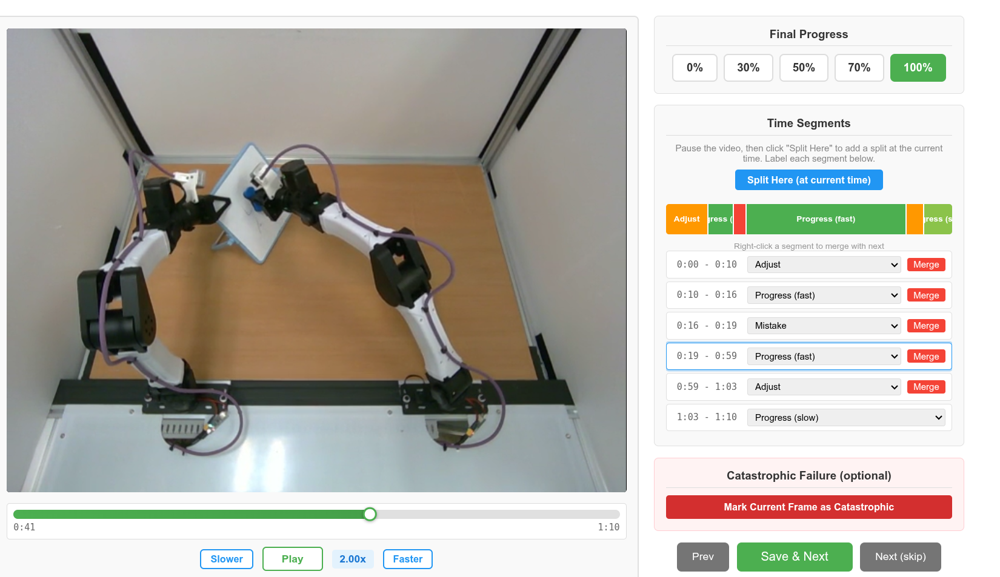
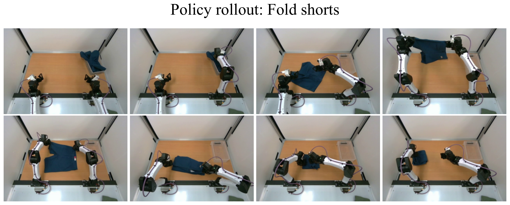
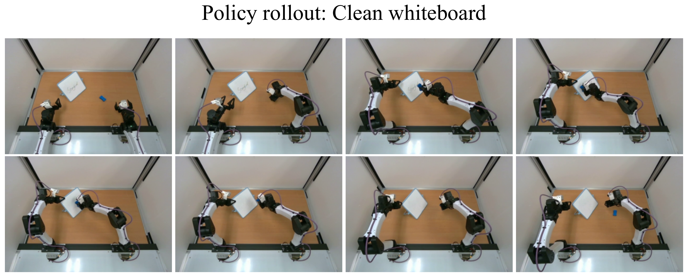

# SARM2: Multi-Task Stage Aware Reward Modeling for Self Improving Robotic Manipulation

#

# 基本信息

- arXiv: [2606.10305](http://arxiv.org/abs/2606.10305v1)
- Authors: Qianzhong Chen, Hau Zheng, Justin Yu, Suning Huang, Jiankai Sun, Ken Goldberg, Chuan Wen, Pieter Abbeel, Yide Shentu, Philipp Wu, Mac Schwager
- Categories: cs.RO

#

# 研究问题

多任务阶段感知奖励模型驱动机器人自提升

#

# 任务与挑战

针对长程机器人操作中VLA策略微调严重依赖行为克隆、需要大量高质量示教数据且难以泛化到分布外场景的问题，本文指出现有奖励模型的关键缺陷：任务特定的阶段感知模型虽准确但需逐任务标注，而通用VLM奖励模型又过于粗粒度，无法提供细粒度的长程稠密监督。

为此，作者提出SARM2（RM），一种多任务阶段感知奖励模型。其核心是将基于动作原语的通用阶段估计器与多门混合专家（MMoE）价值头紧密结合：阶段估计器在共享的22类动作原语词汇上进行时序分类，实现跨任务迁移；预测的原语类别直接选择MMoE的对应门控，激活最相关的专家群体，从而在不同操作阶段输出准确的稠密价值估计。在此基础上，作者进一步提出SPIRAL框架，采用残差RL与TD3+BC目标，利用RM的稠密奖励对VLA策略进行在线自提升，仅需一次人工标注适应奖励模型，即可通过自主rollout实现数据飞轮。

实验在包含10项任务的基准上验证：RM相比最强基线将价值估计MSE降低80%，且显著优于通用VLM奖励模型和单任务基线。在真实机器人任务中，SPIRAL将Folding Shorts成功率从58%提升至100%，Cleaning Whiteboard从50%提升至90%；消融实验表明阶段估计、多门路由和多样化任务训练均不可或缺，且MoE置于输出头显著优于置于FFN层。

该研究的重要意义在于证明了高质量稠密奖励是构建稳定机器人数据飞轮的关键负载因素。通过动作原语桥接了任务特定准确性与跨任务泛化性，为VLA模型的在线自提升提供了可扩展的奖励工程范式，对长程操作与策略自改进研究具有重要参考价值。

#

# 核心 Insight

这篇论文的核心价值需要结合原文继续复查。当前 fallback 笔记保留了日报分析、DeepResearch 草稿和已筛选图表，避免自动流程中断。

#

# 方法与公式

#

# 第一模块：一分钟核心速写

**论文领域：** VLA

**TL;DR:** 本文提出了一种基于**动作原语阶段估计器 + 多门混合专家（MMoE）价值头**的**多任务阶段感知奖励模型（SARM2 / RM）**，以解决现有机器人奖励模型无法同时满足**密集、准确、通用**三大要求的问题，并进一步提出**SPIRAL**框架利用该密集奖励实现VLA策略的自主on-policy自改进。在10任务基准上，RM将价值估计MSE相比VLM基线降低约**80%**；SPIRAL在真实机器人任务上将成功率从约**50%推升至近100%**（Folding Shorts Flat: 58%→100%；Cleaning Whiteboard: 50%→90%）。

**研究动机:** 现存方案分为两派：**任务特定模型**（如SARM）虽密集准确，但需每任务重新标注阶段，无法扩展；**通用VLM奖励模型**（如TOPReward、Robometer）虽跨任务通用，但预测粒度粗、步级噪声大，难以支撑长程操作的密集信用分配。本文的切入点极其务实——用跨任务复用的**动作原语（action primitives）**替代人工阶段标注，既保留阶段感知的密集监督优势，又通过MMoE在单模型内隔离不同原语组的视觉动力学差异，实现“一个模型管多任务”。

**核心机制:** 算法本质是一个**两阶段流水线**：
1. **阶段估计器**将当前观测分类到21个跨任务共享的动作原语之一，提供任务无关的阶段锚点；
2. **MMoE价值头**根据预测的原语组激活对应的门控，从共享专家池中动态路由top-2专家，输出该步的密集进度估计（归一化剩余步数）。SPIRAL则以此密集奖励为燃料，通过**残差TD3+BC**在廉价自主rollout上持续精炼VLA策略。

**关键数据:**
- **最能证明有效性的数据：** RM在10任务held-out demonstration上的整体MSE为**0.020**，相比通用VLM基线TOPReward（0.107）与Robometer（0.093）降低约**81%**与**78%**；在 hardest 的 Cleaning Whiteboard rollout 分类上，RM取得**ρ=0.667**，远超ReWiND（0.222）与微调后的Robometer-FT（0.000）。这直接证明“原语+MMoE”结构对细粒度进度估计的决定性作用。
- **存疑的试验结果：** 摘要强调SPIRAL将Folding Shorts从**58%提升至100%**，但这仅指**Flat**子任务；在更难的**Crumpled**子任务上，SPIRAL仅达到**8/12（66.7%）**，且离线RL-Dense基线已达4/12。此外，RM相比单任务基线ReWiND的overall MSE降低幅度实际为**44%**（0.036→0.020），摘要以VLM基线为参照宣称“80%”存在选择性报告之嫌。

---

#

# 第二模块：核心架构解释

#

## 1. SARM2（RM）奖励模型架构

**输入与编码：** 在每个时间步，系统接收三路相机图像（左腕、右腕、顶视）和本体状态。所有图像通过**冻结的SigLIP-2**编码器提取特征，并缓存最近 **N=6** 帧（stride Δ=30，约6秒上下文）。阶段估计器和价值解码器**共享这些缓存的视觉特征**，但使用各自独立的Transformer主干，避免重复计算。

**动作原语阶段估计器（Stage Estimator）：**
- 这是一个4层因果Transformer，接收6帧视觉token和本体状态投影，输出对 **K+1=22** 个类别的分类概率（21个动作原语 + 1个null类）。
- 该估计器在跨任务构建的**动作原语数据集**上单独训练：从200小时、100个任务的数据中提炼出覆盖>90%时长的21个原语，每个原语3小时数据，外加null类。
- 预测的原语类别 **ỹ_t** 直接决定下游MMoE激活哪个门控。

**MMoE价值解码器（Value Decoder）：**
- 使用6层因果Transformer主干，输入包括：首帧（视觉锚点）、最近6帧、最多3帧rewinding帧（防止模型退化为时间索引预测器）、本体状态、任务名称文本嵌入、以及阶段估计器输出的**预测原语嵌入**。
- **多门路由：** 22个原语被聚类为 **M+1=8** 个语义组（如Acquire、Release、Translate、Shape Clothes等）。每组拥有独立门控 **G_m**。在时刻 **t**，根据预测原语所属组 **m(ỹ_t)** 选择对应门控，生成top-2路由权重。
- **共享专家池：** 共 **E=10** 个专家，每个为3层MLP（宽256）。仅激活top-2专家，输出加权求和得到该步的密集价值估计。
- **训练目标：** 预测归一化剩余步数 **r* = -(T-t)/T ∈ [-1, 0]**。总损失为 **MSE + λ_bal·L_balance + λ_ent·L_entropy**，其中辅助损失防止路由崩溃。

#

## 2. SPIRAL 自改进框架

**核心流程（四阶段）：**
1. **BC微调：** 在人工演示上微调预训练VLA（π_0.5）得到 **π_1**。
2. **一次性RM适应（Stage 2a）：** 用 **π_1**（最弱策略）收集约100条rollout，由人工标注片段级标签（fast/slow/adjust/mistake）和最终进度，混合50%预训练数据，将 **RM_1 → RM_2**。此步骤仅需2-3小时人工。
3. **离线SPIRAL初始化（Stage 2b）：** 使用预训练 **RM_1** 为演示数据标注密集奖励，通过残差RL训练得到 **π_2**。
4. **自主飞轮（Stage 4）：** 循环执行：用当前策略收集rollout → **RM_2** 自动标注密集奖励 → SPIRAL残差更新策略 → 部署新策略收集下一轮数据，无需人工标注。

**残差RL细节（基于DICE-RL修改）：**
- **Critic：** 5个chunk-based Q函数ensemble（TD3），使用目标网络与目标策略平滑。
- **混合目标：** Critic同时优化 **TD目标**（密集步级奖励引导局部信用分配）和 **MC目标**（稀疏episode级奖励引导全局偏好与快速成功），即 **J_critic = J_TD + α·J_MC**。
- **Actor：** 残差策略 **s_θ(s,z)** 作用于预训练VLA输出 **π_pre(s,z)**，执行动作 **a = π_pre + s_θ**。训练目标为 **min -Q + β·||s_θ||²**，其中BC正则项（β=30）将残差约束在预训练分布附近。
- **多采样探索：** 每状态采样 **κ=4** 个潜在噪声，生成4个候选动作块；训练时平均critic目标与actor目标，部署时执行 **best-of-κ**（选Q值最高者）。

#

## 3. Python 风格伪代码

```python
# ========== SARM2 (RM) 推理 ==========

class SARM2RewardModel:
    def __init__(self):
        self.siglip = FrozenSigLIP2()          

# 冻结视觉编码器

        self.stage_estimator = CausalTransformer(layers=4, classes=22)
        self.value_transformer = CausalTransformer(layers=6)
        self.mmoe_gates = [Gate(dim=512) for _ in range(8)]   

# 8个语义组门控

        self.experts = [MLP(depth=3, width=256) for _ in range(10)]  

# 共享专家池

        
    def encode_visual(self, frames_6x3views):
        

# frames: [T, N=6, 3_views, C, H, W]

        return self.siglip(frames_6x3views)    

# 缓存帧嵌入

    
    def forward(self, frames, proprio, task_text_embed, rewinding_frames):
        

# 阶段估计

        stage_logits = self.stage_estimator(frames, proprio)  

# [B, 22]

        pred_primitive = argmax(stage_logits)                 

# e.g., "pick/grab"

        
        

# 价值解码器输入: 锚帧 + 6近帧 + 3rewinding帧 + 本体 + 任务文本 + 原语嵌入

        fused_tokens = self.value_transformer(
            anchor_frame, frames, rewinding_frames, 
            proprio, task_text_embed, primitive_embed(pred_primitive)
        )
        fused_vec = fused_tokens[:, -1, :]   

# 取最终融合表示

        
        

# MMoE 路由: 根据原语组选门控, top-2专家激活

        group_id = primitive_to_group[pred_primitive]          

# e.g., "Acquire" -> 0

        gate = self.mmoe_gates[group_id]
        routing_weights, topk_indices = topk_softmax(gate(fused_vec), k=2)
        
        value = sum(w * self.experts[idx](fused_vec) 
                    for w, idx in zip(routing_weights, topk_indices))
        return value  

# 预测归一化剩余步数 r_t

# ========== SPIRAL 训练循环 ==========

class SPIRAL:
    def __init__(self, vla_policy, rm_pretrained):
        self.pi_pre = vla_policy          

# 预训练VLA (BC后)

        self.rm = rm_pretrained           

# RM_1

        self.critics = [QNetwork() for _ in range(5)]  

# TD3 ensemble

        self.actor_residual = ResidualPolicy()
        
    def offline_init(self, demos):
        

# Stage 2b: 用RM_1标注demo, 离线残差RL

        labeled_demos = [self.rm.label(traj) for traj in demos]
        self.pi_2 = self.spiral_update(self.pi_pre, labeled_demos)
        
    def adapt_rm(self, rollouts_weak_policy, human_labels):
        

# Stage 2a: 一次性人工标注 + 微调RM

        mixed_data = rollouts_weak_policy + subsample(self.rm.pretrain_data, 0.5)
        self.rm = finetune(self.rm, mixed_data, human_labels)  

# -> RM_2

        
    def spiral_update(self, pi_current, labeled_rollouts):
        

# 残差RL训练 (TD3 + BC正则)

        for batch in dataloader(labeled_rollouts):
            s, a, r_dense, s_next, done = batch
            
            

# Critic 混合目标: TD(密集) + MC(稀疏终端)

            td_target = r_dense + gamma * min([Q_targ(s_next, pi_targ(s_next)) 
                                               for Q_targ in self.critics])
            mc_target = monte_carlo_return(batch)
            for Q in self.critics:
                loss_critic = mse(Q(s,a), td_target) + alpha * mse(Q(s,a), mc_target)
                update(Q, loss_critic)
            
            

# Actor: 多采样kappa潜在变量, best-of-kappa执行

            z_samples = [sample_z() for _ in range(kappa)]
            candidates = [pi_current(s, z) + self.actor_residual(s, z) 
                          for z in z_samples]
            avg_q = sum(Q(s, a_c) for a_c in candidates) / kappa
            loss_actor = -avg_q + beta * sum(norm(res) for res in residuals)
            update(self.actor_residual, loss_actor)
            
        return updated_policy
    
    def self_improvement_loop(self, max_rounds=3):
        pi = self.pi_2
        for round in range(max_rounds):
            rollouts = collect_rollouts(pi, n=100)      

# 自主收集

            labeled = [self.rm.label(r) for r in rollouts]  

# RM_2自动标注

            pi = self.spiral_update(pi, labeled)        

# 策略更新

        return pi
```

---

#

# 第三模块：核心学术问答

Q1: 这篇论文试图解决什么核心问题？

A1: 论文试图解决VLA策略在长程机器人操作任务中微调时面临的两大瓶颈：一是**行为克隆（BC）依赖昂贵的高质量人工演示**，且策略无法超越演示分布；二是**现有奖励模型无法同时满足密集（dense）、准确（accurate）、通用（general）**三大要求——任务特定的阶段感知模型需要逐任务重标注，而通用VLM奖励模型步级预测太粗糙，无法为长程操作提供可靠的密集监督信号。

Q2: 作者提出的核心解决方案（创新点）是什么？

A2: 核心解决方案分为两部分：
- **SARM2（RM）：** 一个多任务阶段感知奖励模型。它用跨任务共享的**动作原语（action primitives）**作为阶段表示，替代昂贵的任务特定阶段标注；并引入**多门混合专家（MMoE）价值头**，让不同动作原语组通过独立门控共享同一专家池，从而在单模型内实现跨任务、细粒度、密集的步级价值估计。
- **SPIRAL：** 一个基于密集奖励的on-policy自改进框架。它以RM的密集奖励为燃料，结合**TD3+BC残差RL**与**TD/MC混合critic目标**，在廉价自主rollout上形成“收集-标注-训练”的闭环飞轮，仅需一次性少量人工标注即可持续自改进。

Q3: 实验设计的关键支撑（或巧妙之处/数据集特点）是什么？

A3: 实验设计的关键支撑包括：
- **10任务基准的分层设计：** 将任务分为经典子集 **S1**（5个常规操作）和非常规子集 **S2**（5个需工具使用或多阶段组合的任务），强制验证跨任务泛化与正迁移。
- **Rollout分布适应策略：** SPIRAL刻意用最弱的BC策略 **π_1** 收集初始rollout进行人工标注，因为这些rollout包含最丰富的OOD失败模式，使RM适应后能覆盖策略改进过程中可能遇到的错误状态。
- **诊断性真实机器人任务：** 选择 **Folding Shorts**（可变形体长程操作）和 **Cleaning Whiteboard**（双手协调+工具使用）作为下游策略改进的试金石，并设置Flat/Crumpled双难度与五 tier 进度评分，精细度量奖励质量对策略学习的真实影响。

Q4: 这篇论文最显著的贡献点（Top 3）是什么？

A4:
- **贡献1：** 提出了首个多任务阶段感知机器人奖励模型，通过动作原语+MMoE在单模型内统一了“密集、准确、通用”三个此前互斥的属性，将10任务价值估计MSE压到0.020，显著优于任务特定和VLM基线。
- **贡献2：** 设计了SPIRAL自主数据飞轮，证明高质量的密集奖励模型是机器人自改进闭环的“承重墙”——在真实机器人上仅通过廉价自主rollout就将Folding Shorts Flat成功率从58%推至100%，Cleaning Whiteboard从50%推至90%。
- **贡献3：** 通过系统的消融与架构对比（MoE-Decoder vs. MoE-FFN），揭示了在机器人密集奖励建模中，**稀疏专家应放置在输出头而非Transformer FFN层**，为后续多模态奖励模型的架构设计提供了重要反直觉洞见。

Q5: 这项工作在哪些相关研究的基础上做了推进？（列举1-2个最核心的前置工作即可）

A5:
- **前置工作1：SARM**（Chen et al., 2025）。SARM首次验证了阶段感知层次结构对长程操作奖励建模的有效性，但它是单任务的且依赖密集逐帧阶段标注。本文将其实现为多任务版本，并用动作原语替代人工阶段定义，解决了可扩展性瓶颈。
- **前置工作2：DICE-RL**（Sun et al., 2026）。DICE-RL提供了基于多采样潜在变量的残差RL基板与分布收缩微调方案。SPIRAL直接采用其残差学习框架，但关键改进为引入密集步级奖励替代稀疏终端奖励，并叠加MC目标，使其适用于长程操作自改进。

Q6: 客观评价：这篇论文的局限性、漏洞或"未讲明的故事"是什么？对后续科研有何启发？

A6: 局限性与未讲明的故事包括：
- **动作原语的 embodiment 锁定：** 论文的21个原语全部从双手桌面操作数据中提炼，扩展到移动操作、人形机器人或其他末端执行器时，原语词汇和阶段估计器必须重建，通用性存在物理边界。
- **残差RL的天花板：** SPIRAL仅通过残差修正VLA的底层动作输出，无法修正高层意图错误或任务分解错误（如错误地选择先擦白板还是先拿板擦）。当失败源于VLA的语义/规划层而非动作层时，框架无能为力。
- **样本效率与人工重置：** 每轮仍需收集50-100条真实机器人rollout，且需要人工在episode间重置环境，所谓的“自主飞轮”尚未完全摆脱人力。
- **未充分解释的数据优势：** 论文提到Folding Shorts Crumpled仅达8/12，并归因于数据量少、演示质量参差。这暗示当前方法在**高方差、大状态空间的复杂变形体任务**上，奖励密度仍不足以替代大规模高质量演示，后续工作可能需要探索RM与大规模BC数据的协同，或引入物理/几何先验进一步压缩状态空间。对后续科研的启发是：**机器人自改进飞轮的瓶颈从来不是“有没有RL”，而是“奖励信号是否足够忠实”**——在投入大量算力扩展策略之前，先构建一个能精确区分“真进步、调整、灾难性失败”的密集奖励模型，可能比盲目增加rollout数量更有效。

#

# 贡献拆解

- 关键术语：Vision-Language-Action, Reward Modeling, Mixture-of-Experts, Residual Reinforcement Learning, Action Primitives
- 加权评分：4.25/5.0

#

# 关键图表解读



*展示了自主rollout的标注界面与阶段划分流程（含Progress、Mistake、Adjust等标签），直接支撑论文中stage-aware reward模型的数据构建与密集监督来源，是理解方法数据飞轮的关键。*



*对应摘要中SPIRAL框架在Folding Shorts任务上的关键提升（成功率从58%提升至100%），以策略推出序列直观展示长程折叠操作的完整执行过程，支撑主实验结论。*



*对应摘要中SPIRAL框架在Cleaning Whiteboard任务上的关键提升（成功率从50%提升至90%），以策略推出序列展示双臂协作清洁白板的过程，是验证密集奖励有效性的核心实验证据。*

#

# 实验与消融

请优先核对主结果表、消融实验和真实/仿真任务设置；若图表已选中，应结合上方图片逐项复查。

#

# 局限性

当前自动精读未能成功调用完整图文生成模型，因此局限性需要结合原文实验设置进一步人工确认。

#

# 个人研究判断

若该论文与 World Models assisting Embodied AI、VLA、robot policy 或 sim-to-real 强相关，建议进入人工精读队列。
