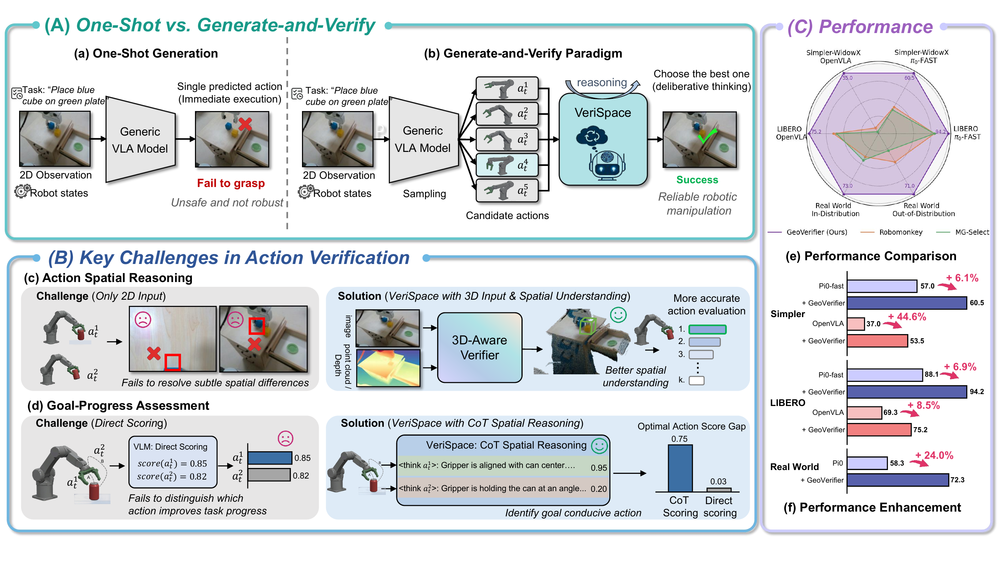
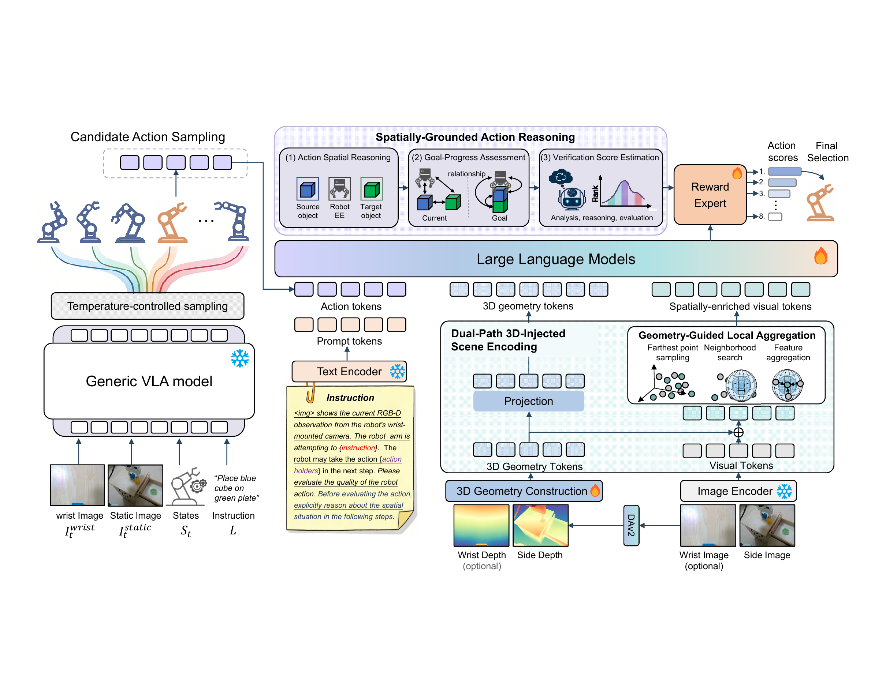
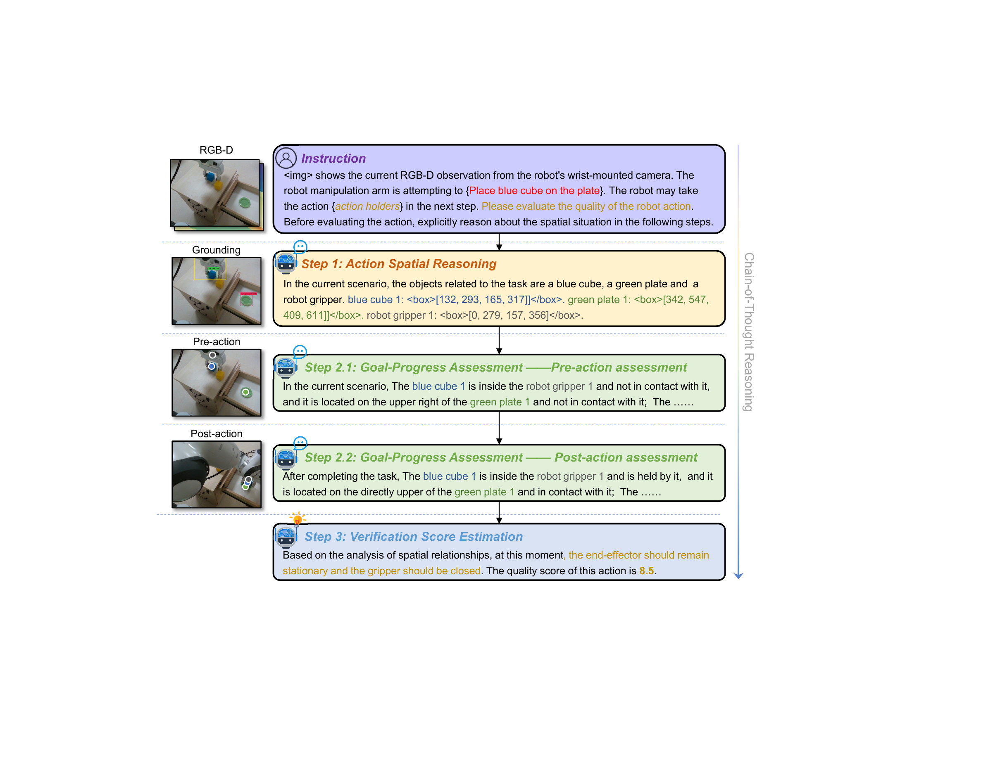
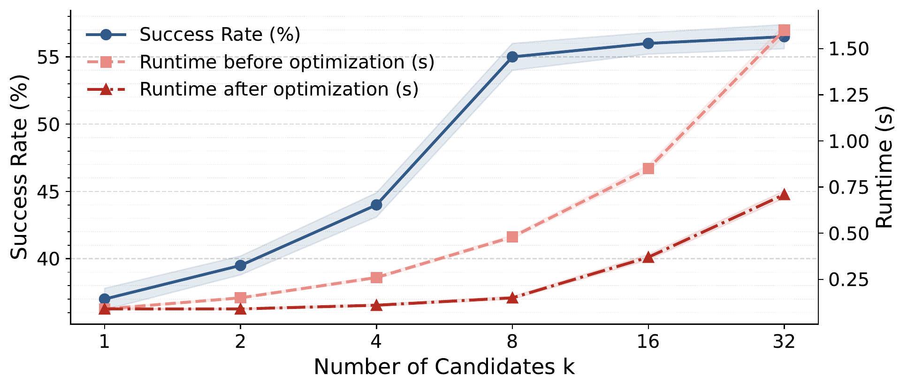

# VeriSpace: Spatially Grounded Action Verification for Vision-Language-Action Models

#

# 基本信息

- **arXiv**: 2606.10568
- **Authors**: Guiyu Zhao, Longteng Guo, Junyou Zhu, Jun Fu, Yanghong Mei, Bin Cao, Jie Jiang, Xingjian He, Jing Liu
- **Categories**: cs.RO
- **一句话结论**: 本文提出即插即用的3D感知动作验证器VeriSpace，通过双路径3D注入场景编码与链式空间推理，在test-time对VLA候选动作进行验证重排，在仿真与真实机器人任务中均显著提升决策可靠性。

#

# 研究问题

论文针对Vision-Language-Action (VLA) 模型在test-time的可靠性瓶颈：现有系统多采用one-shot动作预测，即使微小的位姿或方向误差也可能导致抓取失败、碰撞或任务进程错误。虽然generate-and-verify范式为提升可靠性提供了自然途径，但动作验证本身面临两大核心挑战——如何基于3D空间感知区分几何上极其相似但结果迥异的动作候选，以及如何评估动作对任务目标的实际推进程度。该工作属于Embodied AI与VLA交叉领域，聚焦于test-time scaling与动作验证，对构建可部署的机器人基础模型具有直接意义。

#

# 任务与挑战

具体任务为机器人操作中的test-time动作验证与选择。给定当前观测 $O_t = \{I_t^{\text{wrist}}, I_t^{\text{static}}\}$、机器人状态 $S_t$ 与语言指令 $L$，冻结的VLA策略 $\pi_\theta$ 先采样出 $k$ 个候选动作 $a_t^{(i)} \in \mathbb{R}^7$（6-DoF末端执行器运动与夹爪动作）；验证器 $\mathcal{F}_\phi$ 需为每个候选输出标量质量分数，并选择最高分动作执行。

已有验证方法（如Robomonkey、MG-Select）主要依赖2D图像与任务输入进行直接打分，缺乏对3D几何与空间关系的显式建模。这导致它们难以分辨仅在深度、间隙或接触面上存在细微差异的候选动作，也无法有效判断同一动作在不同任务阶段的目标贡献度，从而在精细操作场景中验证可靠性不足。

#

# 核心 Insight

本文的核心思想是：动作验证不应被简化为基于2D视觉的直接打分，而应转化为基于3D空间感知的结构化推理过程。作者提出VeriSpace，一个外挂于冻结VLA策略之上的即插即用验证器。它通过显式注入3D场景几何（双路径编码：独立的3D geometry tokens与注入3D位置的spatially-enriched visual tokens），并借助Geometry-Guided Local Aggregation捕获操作敏感的局部空间上下文；随后以链式思维（Chain-of-Thought, CoT）显式建模任务相关空间关系、几何有效性与预期目标进展，最终输出验证分数。这一范式将test-time scaling从"更多候选"推进到"更深度的空间推理"，使验证器能够区分几何上几乎相同但结果关键不同的动作。



#

# 方法与公式

VeriSpace的整体流程如上图所示：冻结VLA策略先通过temperature-controlled sampling生成 $k$ 个候选动作；随后VeriSpace对每个候选进行3D-aware验证并打分，最终选择最高分动作执行。

#

## Dual-Path 3D-Injected Scene Encoding

给定静态视角RGB图 $I^{\text{static}}$ 与深度图 $D$，首先利用相机内外参将深度反投影为稠密3D坐标图 $P \in \mathbb{R}^{H \times W \times 3}$。随后通过正弦位置编码 $\gamma(\cdot)$ 与可学习的两层MLP进行编码：

```math
P' = \mathrm{MLP}(\gamma(P))
```

其中 $P' \in \mathbb{R}^{H \times W \times d}$ 为几何嵌入。基于此，构建两条互补的token流：

**3D Geometry Tokens**：将几何嵌入投影到VLM token空间，显式保留场景几何结构：

```math
X^{\mathrm{geo}} = \mathrm{Projection}(P')
\tag{1}
```

**Spatially-Enriched Visual Tokens**：使用预训练CLIP编码器提取RGB视觉token $X$，并将几何嵌入逐元素注入：

```math
X^{\mathrm{vis}} = X + P'
\tag{2}
```

**Geometry-Guided Local Aggregation (GLA)**：为捕获操作敏感的局部3D结构，使用Farthest Point Sampling (FPS) 在3D空间中选取种子点 $\widehat{X}^{\mathrm{vis}}$，对每个种子点在半径 $r$ 的3D球内检索邻居token：

```math
\mathcal{N}^{(j)}
=
\left\{
x_{i}^{\mathrm{vis}} \in X^{\mathrm{vis}}
\;\middle|\;
\left\lVert p_{i} - \widehat{p}^{(j)} \right\rVert \le r
\right\}
```

并通过可学习的空间核 $g(\cdot)$ 对相对3D偏移加权聚合：

```math
\widetilde{x}^{\mathrm{vis},(j)}
=
\sum_{x_{i}^{\mathrm{vis}} \in \mathcal{N}^{(j)}}
g\!\left(p_{i} - \widehat{p}^{(j)}\right)\, W x_{i}^{\mathrm{vis}}
\tag{3}
```

其中 $W$ 为可学习的线性投影，$g(\cdot)$ 将相对3D偏移映射为聚合权重。该步骤将局部3D邻域结构注入视觉token，使验证器能够感知表面、边缘、间隙等细粒度几何线索。



#

## Spatially-Grounded Action Reasoning (SGAR)

将聚合后的视觉token $\widetilde{X}^{\mathrm{vis}}$、几何token $X^{\mathrm{geo}}$、指令token与候选动作token拼接后输入VLM（LLaVA-7B）。验证过程被显式结构化为三步链式推理：

1. **Action Spatial Reasoning**：分析任务相关实体（操作物、目标、机械臂末端执行器）的相对位姿、接触与间隙，判断几何有效性。
2. **Goal-Progress Assessment**：从pre-action（当前状态与目标的关系）与post-action（执行候选动作后的预期状态）两个视角评估任务推进程度。
3. **Verification Score Estimation**：将推理表征映射为标量质量分数，用于候选动作排序。



#

## 学习目标

训练采用双损失函数：

```math
\mathcal{L} = \lambda_{a}\mathcal{L}_{a} + \lambda_{\mathrm{CoT}} \mathcal{L}_{\mathrm{CoT}}
\tag{4}
```

其中 $\lambda_{a}$ 与 $\lambda_{\mathrm{CoT}}$ 为权重系数。

**Action Evaluation Loss**：采用Bradley-Terry偏好损失，对动作对 $\{a^{W}, a^{L}\}$（前者任务进展更优）进行排序学习：

```math
\mathcal{L}_{a} = - \log \sigma\left(
\mathcal{F}_\phi(a^{W} \mid I^{\mathrm{static}}, D, L)
-
\mathcal{F}_\phi(a^{L} \mid I^{\mathrm{static}}, D, L)
\right)
\tag{5}
```

其中 $\sigma(\cdot)$ 为sigmoid函数。

**CoT Supervision Loss**：对生成的空间推理链使用标准交叉熵监督：

```math
\mathcal{L}_{\mathrm{CoT}} = - \sum_{t=1}^{T} \log P_\phi(y_t \mid y_{<t}, L')
\tag{6}
```

其中 $L'$ 为指令prompt，$y = (y_1, \dots, y_T)$ 为完整CoT序列，$P_\phi$ 为模型参数化的概率分布。CoT数据通过Metric Depth Anything V2、Grounding DINO与SpatialRGPT自动合成。

#

# 贡献拆解

1. **3D-aware动作验证器**：提出首个面向VLA test-time verification的3D感知验证器VeriSpace。与现有2D-based verifier（Robomonkey、MG-Select）不同，它通过显式3D几何编码与结构化空间推理评估候选动作，突破了细粒度空间判别瓶颈。在SimplerEnv-OpenVLA上平均提升达+18.0 pp。
   
2. **双路径3D注入与局部聚合**：设计Dual-Path 3D-Injected Scene Encoding，并行构建3D geometry tokens与spatially-enriched visual tokens，兼顾显式几何与语义信息；并提出Geometry-Guided Local Aggregation，在3D球邻域内按可学习空间核加权聚合，捕获对操作至关重要的局部几何结构。消融显示移除3D输入导致-13.0 pp性能下降。

3. **结构化链式空间推理**：将动作验证从直接打分转化为三步CoT空间推理（Action Spatial Reasoning → Goal-Progress Assessment → Verification Score Estimation），显式建模几何有效性与任务目标推进。消融显示移除SGAR导致-6.5 pp下降，且CoT相比直接打分能将最优动作分数差距从0.03提升至0.75。

4. **即插即用与跨域泛化**：VeriSpace兼容OpenVLA、π0-FAST、Octo、SpatialVLA等多种VLA骨干，无需修改原策略训练或架构。在真实世界OOD任务中平均提升达+14.0 pp（最高+22.0 pp），展示了test-time verification在真实部署中的实用路径。

#

# 关键图表解读

**figure-010-intro-final.png（全文总览与性能对比）**
该图是理解全文贡献的第一入口。左侧对比了One-Shot Generation与Generate-and-Verify Paradigm：前者直接执行单一预测动作，易因微小误差失败；后者先采样多个候选，经VeriSpace推理后选择最优。中间部分揭示两大挑战——Action Spatial Reasoning（2D输入难以分辨细微空间差异）与Goal-Progress Assessment（直接打分难以区分目标贡献），并对应给出3D-Aware Verifier与CoT Spatial Reasoning的解决方案。右侧雷达图与柱状图显示，VeriSpace在SimplerEnv-WidowX、LIBERO及真实世界（ID/OOD）上均显著超越Robomonkey与MG-Select。读图时需特别注意：Stack Cubes任务提升最显著（OpenVLA上+34.0 pp），直接证明了3D空间推理对精细堆叠操作的关键作用；但π0-FAST在Stack Cubes上提升为0 pp，提示当基线策略采样质量不足时verifier可能面临天花板效应。

**figure-005-verispace-method.png（系统架构）**
该图清晰呈现了VeriSpace的完整数据流。左侧为冻结的Generic VLA model通过temperature-controlled sampling生成候选动作；中间下方为Dual-Path 3D-Injected Scene Encoding模块，包含3D Geometry Construction（深度反投影）、3D Geometry Tokens与Spatially-Enriched Visual Tokens的并行编码、以及Geometry-Guided Local Aggregation（FPS采样+3D球邻域搜索+特征聚合）；中间上方为基于LLM的Spatially-Grounded Action Reasoning（三步推理）；最终由Reward Expert输出动作分数并完成Final Selection。读图关键：3D几何token与视觉token是并行输入LLM的两条独立路径，而非简单串联，这使得VLM能够同时访问显式几何坐标与语义增强的空间感知。

**figure-004-cot-new.png（链式空间推理流程）**
该图直观展示了VeriSpace如何从RGB-D观测生成结构化推理链。流程依次为：Instruction（输入任务指令与观测）→ Step 1 Action Spatial Reasoning（输出任务相关物体定位框与空间描述）→ Step 2.1 Pre-action assessment（描述当前状态，如"blue cube在机械臂内但未接触"）→ Step 2.2 Post-action assessment（描述执行动作后的预期状态，如"blue cube被夹持并接触green plate"）→ Step 3 Verification Score Estimation（综合推理输出质量分数，如8.5）。读图时注意：pre-action与post-action的对比是Goal-Progress Assessment的核心，通过显式状态转换判断动作是否推进任务，而非简单地对单帧画面打分。

**figure-011-linechart.png（候选数量与运行时权衡）**
该图揭示了test-time scaling的关键权衡。横轴为候选动作数量 $k$，左纵轴为成功率（%），右纵轴为每步运行时（s）。蓝色实线显示，随着 $k$ 从1增至8，成功率从37.0%快速跃升至55.0%，$k=32$时趋于饱和（56.0%），说明适度增加候选即可带来显著收益。红色虚线与棕色点划线分别表示优化前后的运行时：未优化时随 $k$ 线性增长（$k=32$时约1.6s），而经KV-cache复用、SGLang与多GPU并行优化后，$k=32$时运行时可降至约0.7s。读图时注意 $k=8$ 是性价比拐点，此后边际收益递减；优化策略使test-time verification在实际部署中可行。



#

# 实验与消融

**数据集与设定**：实验覆盖SimplerEnv-WidowX（4个pick-and-place任务，训练于BridgeData V2）、LIBERO（4个任务套件各10个任务）及真实Franka机器人（4个in-distribution任务+2个out-of-distribution任务）。验证器以LLaVA-7B为骨干，采用LoRA ($r=512, \alpha=128$) 微调，输入分辨率 $224 \times 224$，在8×A800 GPU上训练12天。

**基线与指标**：对比V-GPS、Robomonkey、MG-Select等test-time方法；底层策略包括OpenVLA、π0-FAST、Octo、SpatialVLA。指标为任务成功率（%），候选数 $k=8$，采样温度 $\tau=1$。

**主结果**：
- **SimplerEnv + OpenVLA**：基线37.0%，+VeriSpace达55.0%（**+18.0 pp**），超越Robomonkey 14.5 pp。其中Stack Cubes提升**+34.0 pp**（28.0%→62.0%）。
- **SimplerEnv + π0-FAST**：基线57.0%，+VeriSpace达60.5%（+3.5 pp）。但Stack Cubes任务提升**0 pp**（28.0%→28.0%），为全文最存疑结果。
- **LIBERO**：OpenVLA从69.3%提升至75.2%（+5.9 pp）；π0-FAST从88.1%提升至94.2%（+6.1 pp）。
- **真实世界 + π0-FAST**：ID任务平均从58.3%提升至72.3%（**+14.0 pp**）；OOD任务中Cube in Drawer提升**+22.0 pp**，Banana on Plate提升+14.0 pp。
- **跨骨干兼容性**：Octo +10.0 pp，SpatialVLA +10.3 pp，证明即插即用性。

**消融实验**（Table Ablation）：
- **w/o 3D input**：SimplerEnv降至42.0%（-13.0 pp），真实世界降至63.6%，证明3D信息是空间推理的基础。
- **w/o D3SE**（双路径3D注入）：SimplerEnv降至46.5%（-8.5 pp），说明显式3D位置编码对视觉token的增强不可或缺。
- **替换GLA**：FPS聚合（52.0%）与Voxelization聚合（50.5%）均低于GLA（55.0%），差距约3-4.5 pp，证明3D球邻域内可学习空间核的局部聚合更有效。
- **w/o SGAR**（链式空间推理）：直接打分降至48.5%（-6.5 pp），且最优动作分数差距从CoT的0.75骤降至直接打分的0.03，说明显式推理对判别细微动作差异至关重要。

**最强证据**：SimplerEnv上OpenVLA+VeriSpace在Stack Cubes的+34.0 pp提升，直接证明了3D空间推理与局部聚合对精细操作的关键作用；真实世界OOD任务的+22.0 pp增益则强有力地证明了跨域泛化性。

**最存疑证据**：π0-FAST在SimplerEnv Stack Cubes上的0提升。论文未解释该任务上基线候选动作质量是否已覆盖成功区域，或verifier是否受限于候选集本身的质量。若候选动作均远离成功流形，verifier无从择优，但论文未深入分析该任务上π0-FAST的采样分布或失败模式。

#

# 局限性

1. **候选动作质量的天花板效应**：VeriSpace作为验证器只能对已有候选进行择优，若冻结VLA策略在特定任务上采样出的候选动作整体质量低下（如π0-FAST在Stack Cubes上），verifier增益可能被完全抵消。论文未对候选动作的成功流形覆盖率进行定量分析。
2. **深度估计的误差传播**：真实世界与SimplerEnv训练时均使用Metric Depth Anything V2估计深度，而非真实深度传感器输入。深度估计误差会直接扭曲3D反投影与Geometry-Guided Local Aggregation，论文未量化深度噪声对验证精度的敏感性。
3. **推理开销与实时性瓶颈**：虽然论文通过KV-cache复用与多GPU并行将8 GPU场景下的延迟控制在+0.07s（总0.28s），但单GPU场景下总延迟从0.21s增至0.62s，对高频控制场景仍构成挑战。此外，未与模型蒸馏或轻量化verifier方案进行对比。
4. **合成CoT数据的质量边界**：CoT监督数据依赖Metric Depth Anything V2、Grounding DINO与SpatialRGPT的自动合成管道，其准确性受限于这些辅助模型。在复杂遮挡、透明物体或罕见空间配置下，合成推理链可能引入噪声，论文未对此进行误差分析。

#

# 个人研究判断

面向"World Models assisting Embodied AI downstream tasks"的研究方向，本文**值得继续追踪**。

理由如下：
1. **方法论契合**：VeriSpace将test-time scaling从"直接打分"推进到"3D感知的结构化推理"，与World Model强调的显式空间理解、状态预测与反事实推理一脉相承。其即插即用特性使其可作为现有VLA系统的test-time增强模块，无需重新训练策略，实用性强。
2. **明确的结合点**：当前VeriSpace仅做单步pre/post-action推理，未来可自然扩展为结合World Model进行短程rollout验证——利用World Model生成候选动作执行后的未来状态序列，再输入VeriSpace进行多步验证，形成更可靠的闭环决策。
3. **局限指向的研究机会**：论文对深度估计依赖与推理延迟的局限，恰好可由World Model辅助缓解。例如，通过学习式深度估计或隐式3D表征（如NeRF/3DGS-based World Model）降低对单目深度网络的依赖；或通过World Model蒸馏压缩verifier，或利用World Model的预测能力提前筛选高潜力候选动作，减少验证器的计算负担。
4. **数据与复现**：训练依赖自动合成CoT数据，虽然降低了人工成本，但也限制了在更复杂长程任务中的扩展性。若结合World Model生成更丰富的反事实轨迹与偏好对，有望进一步提升验证器在长尾场景中的鲁棒性。
