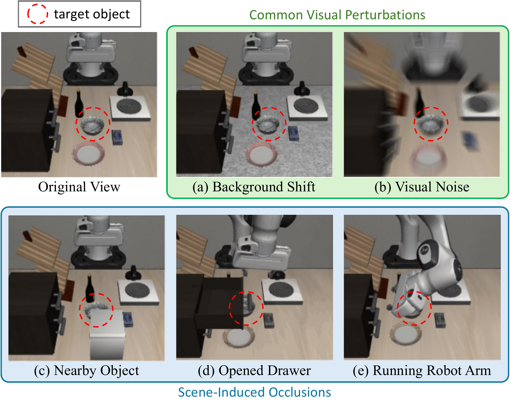
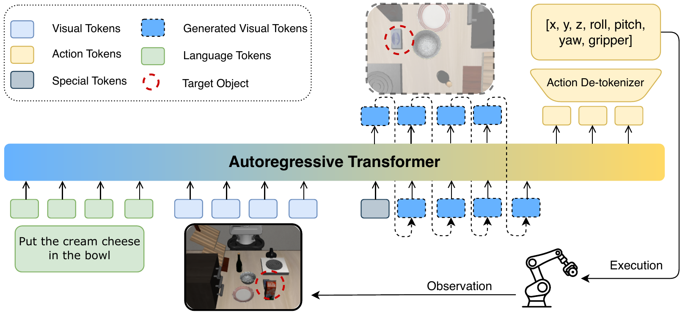
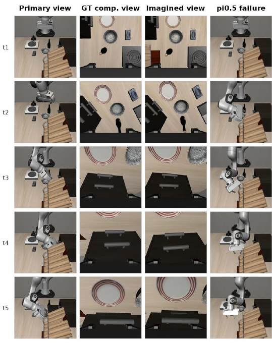
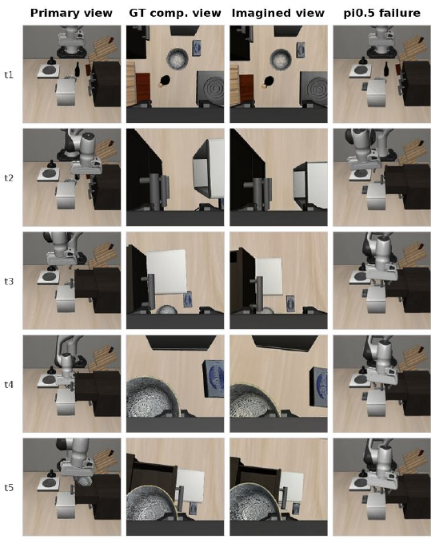

# LIBERO-Occ: Evaluating and Improving Vision-Language-Action Models under Scene-Induced Occlusion via Viewpoint Imagination

#

# 基本信息

- **arXiv**: 2606.10862
- **Authors**: Taishan Li, Jiwen Zhang, Siyuan Wang, Xuanjing Huang, Zhongyu Wei
- **Categories**: cs.CV, cs.AI
- **一句话结论**: 本文提出了 LIBERO-Occ 遮挡基准与视角想象框架 VIM，在不增加任何额外摄像头的条件下，利用统一自回归生成模型从被遮挡的主视角“想象”互补视角，显著提升了 VLA 模型在场景诱导遮挡下的鲁棒性。

#

# 研究问题

现有 Vision-Language-Action（VLA）模型在标准操作基准上表现优异，但其评估与训练均隐含假设任务相关物体在输入观测中完全可见。然而，在真实机器人操作环境中，**场景诱导遮挡（scene-induced occlusion）**是普遍存在的物理现象：目标物体可能被周围物体遮挡，也可能在操作过程中被机械臂自身或操纵物遮挡。这使得操作任务变为**部分可观测决策问题**，对模型的空间推理与状态推断能力提出了根本性挑战。

本文要解决的核心问题是：**如何在不修改硬件部署（不增加摄像头、不引入主动视角控制）的前提下，系统评估并有效提升 VLA 模型在场景诱导遮挡下的鲁棒性？** 该问题直接关联具身智能中的感知补全（perception completion）与 World Model 的生成先验利用，属于 Embodied AI 与 VLA 交叉领域的关键鲁棒性议题。

#

# 任务与挑战

**具体任务设定**：本文基于 LIBERO 基准构建 LIBERO-Occ，在保留原始任务语义与可执行性的前提下，通过物理合理的 3D 遮挡物放置，系统性地引入场景诱导遮挡。基准涵盖四种任务套件（Spatial、Object、Goal、LIBERO-10），并按遮挡目标类型与严重程度双轴划分，共 2,000 个任务实例。

**输入输出**：
- 输入：被遮挡的**主视角（primary view）**观测 $o_t$（第三人称固定相机）+ 语言指令 $l$
- 输出：机械臂动作序列 $a_t$（末端执行器位姿与夹爪状态）

**核心挑战**：
1. **信息缺失**：遮挡移除了任务相关的视觉证据（如被操作物体的形状、位置，或目标容器的开口），导致标准 VLA 策略难以推断合理动作。
2. **硬件成本**：引入额外摄像头或主动视角控制虽可缓解遮挡，但增加了标定、维护与部署成本。
3. **生成-策略对齐**：若将视角生成与动作预测分离，生成的互补视角可能包含视觉合理但对策略无用的信息，难以直接服务于下游控制。

#

# 核心 Insight

本文的核心思想是 **“生成即理解（generation as understanding）”**：如果模型能够从被遮挡的主视角想象出一个合理的互补视角（如腕部/夹爪视角），就能恢复隐藏的空间证据，从而将部分可观测问题转化为近似完全可观测问题进行决策。

VIM（Viewpoint Imagination）框架基于 UniVLA 的世界模型构建，采用 Emu3-MoE 作为统一自回归骨干，能够在一个 token 序列中同时生成视觉 token 与动作 token。其关键直觉在于：世界模型的生成先验不仅可以用于未来帧预测，更可以被重新定位为**感知补全（perception completion）**能力——从遮挡观测中“ hallucinate ”出缺失的互补视角，再将这些想象的视觉 token 与原始观测拼接，作为完整的视觉证据用于动作预测。



上图清晰区分了常见人工视觉扰动（背景偏移、视觉噪声）与本文关注的场景诱导遮挡（附近物体、打开抽屉、运行机械臂）。后者并非简单的外观变化，而是**从观测中移除了任务相关的视觉证据**，直接增加了任务难度。

#

# 方法与公式

#

## 问题形式化

标准 VLA 策略直接基于主视角观测预测动作：

```math
p_\theta(a_t \mid o_t, l)
\tag{1}
```

在场景诱导遮挡下，$o_t$ 中关键证据缺失。VIM 引入互补视角想象，将联合分布分解为两步：

```math
p_\theta(\hat{o}^{c}_t, a_t \mid o_t, l) = p_\theta(\hat{o}^{c}_t \mid o_t, l) \cdot p_\theta(a_t \mid o_t, \hat{o}^{c}_t, l)
\tag{2}
```

其中：
- $o_t$：主视角观测（第三人称视角）
- $\hat{o}^{c}_t$：生成的互补视角（如腕部/夹爪视角）的视觉 token 序列
- $l$：语言指令
- $a_t$：动作序列

#

## 模型架构与数据流



如图所示，VIM 采用统一的自回归 Transformer（Emu3-MoE 骨干）：

1. **输入编码**：语言指令 $l$ 编码为绿色 Language Tokens，被遮挡的主视角观测 $o_t$ 编码为浅蓝色 Visual Tokens。
2. **视角想象**：模型自回归地生成互补视角的视觉 token（深蓝色 Generated Visual Tokens），恢复被遮挡的空间证据（如目标物体的形状、位置或周围上下文）。
3. **动作预测**：将原始主视角 token 与生成的互补视角 token 拼接，再次输入模型，自回归生成 Action Tokens（黄色），经 Action De-tokenizer（FAST 动作分词器的逆过程）解码为连续动作 $[x, y, z, \mathrm{roll}, \mathrm{pitch}, \mathrm{yaw}, \mathrm{gripper}]$。
4. **执行与闭环**：动作在环境中执行后，获得下一时刻的主视角观测，循环往复。

#

## 两阶段训练目标

**Stage 1：视角想象预训练**

模型仅学习从被遮挡主视角和语言指令生成互补视角，建立跨视角空间对应关系。此阶段优化标准的 next-token prediction 损失：

```math
\mathcal{L}_{\mathrm{view}} = -\mathbb{E} \left[ \log p_\theta(o^{c}_t \mid o_t, l) \right]
\tag{3}
```

**Stage 2：联合优化**

同时优化动作预测与视角生成，总损失为：

```math
\mathcal{L} = \mathcal{L}_{\mathrm{action}} + \lambda \mathcal{L}_{\mathrm{view}}
\tag{4}
```

其中：
- $\mathcal{L}_{\mathrm{action}}$：动作 token 的 next-token prediction 损失
- $\mathcal{L}_{\mathrm{view}}$：互补视角生成的监督损失
- $\lambda = 0.5$：视觉生成损失的权重，用于平衡视觉与动作 token 序列长度差异

**关键设计**：Stage 2 中的 $\mathcal{L}_{\mathrm{view}}$ 不仅是辅助重建目标，更充当**结构正则化器（structural regularizer）**。消融实验表明，若移除该损失，生成的视觉 token 会与文本、特殊 token 交错，导致格式崩溃（format collapse），使后续动作预测完全失效。

#

## 推理流程

部署时仅需原始主视角摄像头。模型内部先自回归生成想象的互补视角 token，再基于拼接的视觉证据预测动作。若真实互补视角可用，可直接替换生成结果，形成统一的灵活接口。

#

# 贡献拆解

**贡献 1：识别并形式化场景诱导遮挡为 VLA 领域的基础性鲁棒性挑战**

- **做了什么**：突破现有基准对“完全可见”的隐含假设，指出场景诱导遮挡（由场景物理配置与动态引起）与人工视觉扰动（背景、噪声）的本质区别。
- **为什么有效**：明确了 VLA 从“标准基准高分”到“真实部署可用”之间的关键鸿沟，为后续研究指明了方向。
- **与已有方法差别**：现有鲁棒性研究（如 LIBERO-Plus、RobustVLA）多聚焦外观扰动，本文首次将遮挡作为独立、物理 grounded 的评估维度。

**贡献 2：构建 LIBERO-Occ 基准测试**

- **做了什么**：在 LIBERO 基础上开发自动流水线，通过 BDDL 解析确定遮挡目标，沿相机-目标射线在 3D 空间中插入遮挡物，并经过可见性、物理有效性、任务可执行性三重验证，生成 2,000 个物理合理的遮挡任务。
- **为什么有效**：双轴评估体系（遮挡类型：Manipulated object / Receptacle / Dual；严重程度：Light / Medium / Heavy）支持细粒度分析。
- **与已有方法差别**：不同于简单的图像空间掩码，LIBERO-Occ 的遮挡是场景内在的、物理合理的，且确保任务仍可完成。

**贡献 3：提出 VIM 框架，实现无需硬件的感知补全**

- **做了什么**：利用世界模型的生成先验，在统一自回归序列中联合建模视角想象与动作预测。
- **为什么有效**：两阶段训练确保生成的视觉证据既跨视角空间一致（Stage 1），又与下游策略需求对齐（Stage 2）；推理时无需额外摄像头。
- **与已有方法差别**：区别于多摄像头策略（增加硬件成本）或独立生成-策略流水线（生成与策略不对齐），VIM 将生成与决策统一在单一自回归接口中。

#

# 关键图表解读

#

## 图 1：场景诱导遮挡与常见视觉扰动对比


该图定义了本文的研究边界。绿色框内的 (a) Background Shift 与 (b) Visual Noise 属于常见人工扰动，虽然改变外观但保留任务相关证据；蓝色框内的 (c) Nearby Object、(d) Opened Drawer、(e) Running Robot Arm 则是**场景诱导遮挡**，它们直接移除或掩盖了目标物体的视觉信息，使任务变为部分可观测。读图时应注意：红色虚线圈标记的 target object 在不同子图中被遮挡的程度与方式，对应后文三种遮挡类型（物体、容器、双重遮挡）。

#

## 图 2：VIM 统一自回归架构


该图支撑“统一生成-决策接口”的核心论点。读图关键：
- 左侧输入：Language Tokens（指令）与 Visual Tokens（主视角观测）；
- 中间核心：Autoregressive Transformer 统一处理所有模态；
- 上方生成：虚线框内的 Generated Visual Tokens 代表想象的互补视角；
- 右侧输出：Action Tokens 经 De-tokenizer 解码为机械臂动作。
注意图中 token 颜色的图例：浅蓝（观测视觉）、深蓝（生成视觉）、黄色（动作）、绿色（语言）、灰色（特殊）。该架构图表明 VIM 并非独立的两阶段流水线，而是在同一模型内完成“感知补全 → 策略决策”。

#

## 图 3：定性结果（中间抽屉任务）



该图直接验证 VIM 的视角想象质量与动作恢复能力。四列分别为：
- Primary view：被遮挡的主视角（抽屉被遮挡）
- GT comp. view：真实互补视角（腕部相机看到的场景）
- Imagined view：VIM 生成的互补视角
- π0.5 failure：基线在主视角下的失败案例

读图时注意 t1 到 t5 的时间演化：VIM 生成的想象视角与 GT 互补视角高度一致，成功恢复了抽屉把手与周围空间关系；而 π0.5 因缺乏这些证据导致动作失败。该图支撑了“生成视角可恢复空间证据”的实验结论。

#

## 图 4：定性结果（顶部抽屉与碗放置任务）



该图展示更复杂的动态遮挡场景（抽屉、遮挡物、机械臂共同遮挡目标碗）。读图关键：
- 在 t3-t4，主视角中碗几乎完全不可见；
- VIM 的想象视角仍能有效暴露碗与抽屉内部的空间关系；
- 基线 π0.5 在同一主视角下无法准确定位目标，导致任务失败。
此图进一步证明 VIM 在不同遮挡类型（尤其是涉及容器交互的遮挡）下的泛化性。

#

# 实验与消融

#

## 数据集与设定

- **基准**：原始 LIBERO（Spatial、Object、Goal、LIBERO-10）与 LIBERO-Occ（遮挡扩展版）。
- **基线**：UniVLA、OpenVLA、OpenVLA-OFT、$\pi$-0、$\pi$-0.5，涵盖自回归与扩散 VLA 策略。
- **指标**：任务成功率（%），每个套件 500 次 rollout（消融实验为 100 次）。
- **实现**：基于 UniVLA 世界模型，Emu3-MoE 骨干，FAST 动作分词器；8 张 H100，全局 batch size 192；Stage 1 训练 4,000 步（峰值学习率 $8 \times 10^{-5}$），Stage 2 训练 6,000 步（峰值学习率 $4 \times 10^{-5}$），$\lambda = 0.5$。

#

## 主结果

| 方法 | Original LIBERO Avg. | LIBERO-Occ Avg. | Avg. Drop |
|------|---------------------|-----------------|-----------|
| UniVLA | 88.25 | 57.10 | 31.15 |
| OpenVLA | 92.65 | 40.65 | 52.00 |
| OpenVLA-OFT | 95.75 | 47.95 | 47.80 |
| $\pi$-0 | 89.25 | 49.30 | 39.95 |
| $\pi$-0.5 | 90.00 | 40.55 | 49.45 |
| **Ours (VIM)** | **90.75** | **65.05** | **25.70** |
| Ours w/ GT Comp. | 93.00 | 74.00 | 19.00 |

**最强证据**：VIM 在 LIBERO-Occ 上平均成功率达 **65.05%**，较最强基线 OpenVLA-OFT（47.95%）提升 **17.1** 个百分点；且从原始 LIBERO 到 LIBERO-Occ 的平均性能降幅仅 **25.70** 个百分点，远低于 OpenVLA 的 52.00 个百分点。这直接量化了 VIM 在遮挡下的鲁棒性优势，且证明了无需额外硬件即可显著缓解性能衰退。

**最存疑证据**：LIBERO-10 长程任务中所有方法表现普遍较差（VIM 仅 **25.00%**），遮挡与长程难度的耦合可能掩盖了方法在单步任务上的真实增益；此外，VIM 在原始 LIBERO 上的平均成功率（90.75%）略低于 OpenVLA-OFT（95.75%），说明视角想象机制在完全可观测场景下并非总是最优，可能存在轻微的归纳偏置代价。

#

## 按遮挡严重程度分析

随着遮挡严重程度从 Light 升至 Heavy，现有基线普遍出现显著性能下降，尤其在 Object 与 Goal 套件中。VIM 在各严重程度下均保持最强或接近最强的表现，尤其在 Heavy 遮挡下仍能保持较高成功率，说明其能有效恢复缺失信息。

#

## 按遮挡目标类型分析

| 方法 | Manipulated | Receptacle | Dual | Overall |
|------|-------------|------------|------|---------|
| VIM | **54.67** | **91.33** | **35.43** | **65.05** |

VIM 在所有三种遮挡类型下均最优。值得注意的是，Receptacle 遮挡相对容易（所有方法表现较好），因为放置动作对目标区域的空间不确定性容忍度较高；而 Dual 遮挡（物体与容器同时被遮挡）最具挑战性，所有方法均大幅下降，但 VIM 仍显著领先。

#

## 消融实验

**两阶段训练消融**：

| 变体 | Avg. | Spatial | Goal | Object | 10 |
|------|------|---------|------|--------|-----|
| w/o S2 view loss | 0.00 | 0.00 | 0.00 | 0.00 | 0.00 |
| w/o S1 view train. | 36.25 | 42.00 | 39.00 | 61.00 | 3.00 |
| Full model | **65.00** | **78.00** | **73.00** | **84.00** | **25.00** |

- **移除 Stage 1**：跨视角对应能力不足，性能大幅下降。
- **移除 Stage 2 view loss**：所有套件成功率均为 **0.00%**。该结果过于极端，表明在统一自回归视觉-动作序列生成中，若无显式的视角生成监督，会发生严重的**格式崩溃**（生成 token 与文本/特殊 token 交错），导致策略完全失效。但论文将其简单归因于“格式崩溃”，缺乏对正则化损失数学机理的更深入分析。

**统一生成 vs 分离流水线**：

| 方法 | Avg. |
|------|------|
| Ours $\rightarrow$ UniVLA | 62.00 |
| Ours (unified) | **65.00** |

分离流水线（先由 VIM 生成视角，再由独立 UniVLA 策略执行）已能取得不错效果，但统一自回归接口额外带来 3 个百分点的增益，说明联合优化有助于策略更好地利用想象的视觉 token。

#

# 局限性

1. **仿真到现实的差距**：LIBERO-Occ 完全基于仿真构建，缺乏真实机器人上的传感器噪声、物体多样性和动力学验证，结果应视为控制实验而非真实部署保证。
2. **想象视角的可靠性瓶颈**：VIM 的互补视角生成受限于主视角中可用的视觉证据，在严重双重遮挡（Dual Heavy）下想象可能不准确；且目前仅探索了腕部/夹爪视角，未验证俯视、侧视等其他视角的泛化性。
3. **训练数据依赖**：方法需要成对的互补视角数据进行训练，在仅有无结构视频或单视角数据的真实场景中可能难以获取。
4. **机制分析不足**：Stage-2 view loss 防止格式崩溃的现象（0% vs 65%）虽被验证，但论文未深入探讨自回归视觉-动作交错生成中模式崩溃的数学机理，也未提供更细粒度的超参消融（如不同 $\lambda$ 值的影响）。
5. **长程任务表现有限**：在 LIBERO-10 上所有方法成功率均较低，VIM 的绝对提升空间有限，遮挡与长程规划难度的耦合使得该设定下的优势不够突出。

#

# 个人研究判断

面向 **“World Models assisting Embodied AI downstream tasks”** 的研究方向，本文**值得继续追踪**。

**理由**：
- **问题定义清晰且重要**：场景诱导遮挡是 VLA 从实验室走向真实部署的必经之路，本文首次将其系统化为可评估、可量化的基准问题，填补了领域空白。
- **方法路径具有启发性**：VIM 展示了世界模型的生成先验不仅可以用于“预测未来”，更可以用于“补全当下”——将生成能力转化为感知补全能力。这种“生成即理解”的范式为 World Model 如何辅助下游具身任务提供了具体范例。
- **技术方案务实**：在不增加硬件成本的前提下，通过内部视角想象缓解部分可观测性，对实际机器人部署极具吸引力。

**后续值得关注的方向**：
1. **无配对多视角数据的视角想象**：降低对成对互补视角数据的依赖，探索从单视角视频或无标定多机位视频中学习跨视角对应关系。
2. **不确定性建模与主动感知结合**：在严重遮挡下，想象的视角本身应附带不确定性估计，并可与主动探索策略结合，决定何时依赖想象、何时移动相机。
3. **真实机器人验证与 Sim2Real**：将 LIBERO-Occ 的评估协议迁移到真实场景，验证 VIM 在真实传感器噪声与遮挡下的表现。
4. **统一生成模型的稳定性理论**：深入研究自回归 VLA 中视觉 token 与动作 token 的交互机制，理解并预防格式崩溃，提升训练稳定性。
