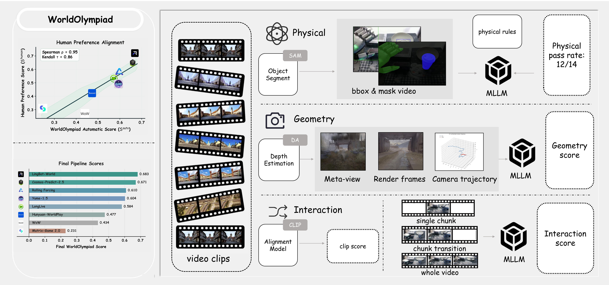
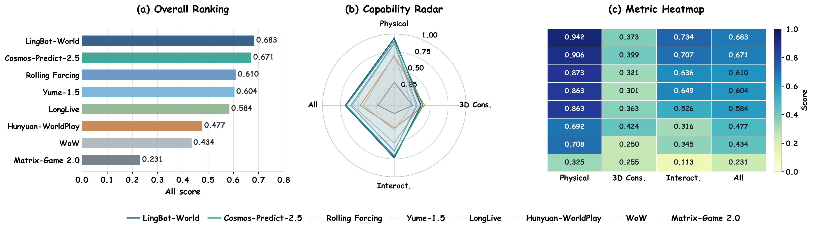
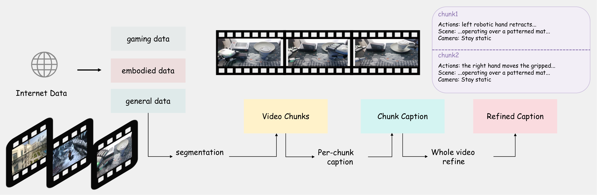
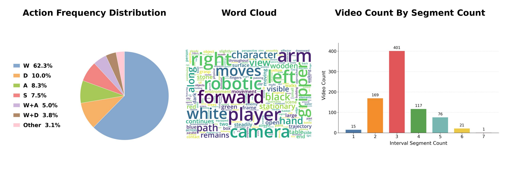

# WorldOlympiad: Can Your World Model Survive a Triathlon?

#

# 基本信息

- **arXiv**: 2606.11129
- **Authors**: Yuke Zhao, Wangbo Zhao, Weijie Wang, Zeyu Zhang, Dakai An, Akide Liu, Yinghao Yu, Jiasheng Tang, Fan Wang, Wei Wang, Bohan Zhuang
- **Categories**: cs.CV
- **一句话结论**: 提出了首个在统一协议下同时覆盖游戏、机器人与真实世界三大场景，从物理真实性、几何一致性与交互保真度三个正交维度系统诊断视频世界模型能力缺口的基准测试 WorldOlympiad，并揭示了当前模型在 3D 几何一致性上的显著瓶颈。

#

# 研究问题

现有视频生成评测基准（如 VBench、VBench++ 等）主要聚焦于视觉质量、美学评分与短期时序连贯性，缺乏对物理规律遵循、三维结构一致性与长程交互可控性的系统评估，且多为单领域评测，难以在统一框架下横向比较游戏、机器人与真实世界场景中的世界模型能力。本文旨在解决的核心问题是：如何建立一个可扩展、可解释且跨领域的评估协议，直接探测视频世界模型的“世界模拟能力”（world simulation capability），而非仅仅衡量其“视觉合成能力”（visual synthesis capability）。这与 Embodied AI 和 VLA 领域密切相关，因为可靠的世界模型是未来策略学习、sim-to-real 迁移与交互式仿真的前提。

#

# 任务与挑战

WorldOlympiad 的具体任务是对长视频生成模型进行三维度自动评测。输入为生成的长视频、参考视频及细粒度文本提示；输出为物理真实性（Physical Faithfulness）、几何一致性（Geometric Consistency）与交互保真度（Interaction Fidelity）三个正交维度的细粒度评分及综合排名。

评测设定覆盖 1000 条高质量长视频，包括 400 条机器人操作（RoboCOIN）、400 条游戏（GameGen-X）与 200 条真实世界（LVD-2M）视频，并采用 Gemini-3-Pro-Preview 进行三阶段 chunk-caption-refine 标注。已有方法之所以不够好，是因为它们要么只测“视频看起来是否好看/流畅”（如 VBench 系列），要么仅针对单一领域（如 MIND 测游戏、WorldArena 测机器人），无法定位“规则违反、结构崩塌、状态重置”等细粒度失效模式。

#

# 核心 Insight

本文最核心的思想是将世界模型评估从模糊的“感知质量”拆解为三条互补且可独立诊断的 track：物理真实性、几何一致性与交互保真度。物理 track 通过“相关性筛选 + 合规性判定”两级机制，直接对力学、热力学与材料属性进行规则化评判；几何 track 引入 Depth Anything 3 重建与 3D Gaussian Splatting 渲染，将“3D 一致性”从黑盒感知转化为可重建、可渲染、可量化的显式诊断；交互 track 则针对 chunk-by-chunk 长视频生成范式，设计 CLIP 轻量语义锚点与 MLLM chunk/transition/global 三级评委，同时检测局部指令跟随与长程状态漂移。



上图展示了 WorldOlympiad 的整体架构：左侧为自动评分与人类偏好的对齐验证，右侧为物理、几何、交互三条评估管线。物理管线通过 SAM3 分割与 MLLM 规则判定输出 pass rate；几何管线通过 Depth Anything 3 重建高斯场景并渲染诊断视图；交互管线则在分块生成设定下融合 CLIP 语义相似度与 MLLM 分级裁判。

#

# 方法与公式

WorldOlympiad 的评估管线分为三条独立 track，最终等权聚合为总体得分。

#

## 物理真实性（Physical Faithfulness）

物理评估覆盖 mechanics、thermodynamics 与 material properties 三个子集。流程首先使用 MLLM 从参考视频中识别最多 3 个主要动态/变形物体，再通过 SAM3 生成 mask 与轨迹可视化。随后，相关性判定（Relevance Judge）筛选出参考视频中真正包含的物理现象，合规性判定（Compliance Judge）则对生成视频逐条规则输出是否合规、置信度与解释。最终物理得分为各子集内平均后再跨子集平均：

```math
S_{\mathrm{phys}} = \frac{1}{3} \left( S_{\mathrm{mech}} + S_{\mathrm{thermo}} + S_{\mathrm{mat}} \right)
\tag{1}
```

其中 $S_{\mathrm{mech}}$、$S_{\mathrm{thermo}}$、$S_{\mathrm{mat}}$ 分别表示力学、热力学与材料属性的平均合规率。

#

## 几何一致性（Geometric Consistency）

几何评估通过 3D 重建探针探测生成视频的跨视角结构稳定性。给定生成视频 $V=\{I_t\}_{t=1}^{T}$，均匀采样 $\bar V=\{I_i\}_{i=1}^{N}$（实现中 $N\leq 32$）。若存在动态物体 mask，先移除前景并视频修复，使 3D 评估聚焦静态场景。Depth Anything 3 估计高斯场景表示 $\mathcal{G}$ 与相机参数：

```math
\mathcal{F}_{\mathrm{DA3}}(\bar V)\rightarrow
\left(\mathcal{G},\{E_i,K_i\}_{i=1}^{N}\right)
\tag{2}
```

其中 $\mathcal{G}$ 为重建的高斯表示，$E_i$ 与 $K_i$ 分别为恢复的外参与内参。随后渲染两个诊断视图：

```math
\hat V_{\mathrm{GS}}=\mathcal{R}(\mathcal{G},\{E_i,K_i\}_{i=1}^{N}),\quad
\hat I_{\mathrm{meta}}=\mathcal{R}(\mathcal{G},E_{i^\star},K_{i^\star})
\tag{3}
```

$\hat V_{\mathrm{GS}}$ 为按原始相机轨迹渲染的重建视频，$\hat I_{\mathrm{meta}}$ 为从距离重建原点最远的相机姿态 $i^\star$ 渲染的元视图。MLLM 评委对二者打分并截断至 $[0,1]$：

```math
S_{\mathrm{recon}}=\operatorname{clamp}\!\left(J_{\mathrm{vid}}(\hat V_{\mathrm{GS}},p),0,1\right),
\qquad
S_{\mathrm{meta}}=\operatorname{clamp}\!\left(J_{\mathrm{img}}(\hat I_{\mathrm{meta}},p),0,1\right)
\tag{4}
```

相机轨迹评分 $S_{\mathrm{traj}}$ 通过将预测与参考相机轨迹对齐到同一坐标系，计算平移路径相似度 $S_t$ 与旋转测地误差 $S_r$，再根据运动类型（近静态/平移主导/旋转主导/混合）自适应聚合。最终几何得分为：

```math
S_{3D}=\frac{1}{3}\left(S_{\mathrm{recon}}+S_{\mathrm{meta}}+S_{\mathrm{traj}}\right)
\tag{5}
```

#

## 交互保真度（Interaction Fidelity）

交互评估针对 chunk-by-chunk 生成设定。给定 $T$ 个视频块 $\{v_i\}_{i=1}^{T}$ 及其对应 caption $\{p_i\}_{i=1}^{T}$，第一组件为 CLIP 语义对齐。对每个 chunk 均匀采样 $m_i=8$ 帧，计算帧与 caption 的 CLIP 余弦相似度：

```math
s_i^{\mathrm{clip}} = \frac{1}{m_i}\sum_{j=1}^{m_i}
\mathrm{sim}\bigl(\mathrm{CLIP}_{v}(f_{i,j}), \mathrm{CLIP}_{t}(p_i)\bigr)
\tag{6}
```

视频级语义得分为所有采样帧的加权平均：

```math
S_{\mathrm{clip}} =
\frac{\sum_{i=1}^{T}\sum_{j=1}^{m_i}
\mathrm{sim}\bigl(\mathrm{CLIP}_{v}(f_{i,j}), \mathrm{CLIP}_{t}(p_i)\bigr)}
{\sum_{i=1}^{T}m_i}
\tag{7}
```

通过固定阈值 $\tau_{\min}=0.20$、$\tau_{\max}=0.40$ 校准为 $[0,1]$ 的辅助信号：

```math
\widetilde{S}_{\mathrm{clip}} =
\operatorname{clip}\left(
\frac{S_{\mathrm{clip}}-\tau_{\min}}{\tau_{\max}-\tau_{\min}},
0, 1
\right)
\tag{8}
```

第二组件为 MLLM 结构化三级评委。Chunk 级评分 $a_i \in [0,5]$，Transition 级评分 $b_i \in [0,5]$，Global 级评分 $g \in [0,5]$。归一化后聚合为：

```math
S_{\mathrm{chunk}} = \frac{1}{5T}\sum_{i=1}^{T} a_i,\quad
S_{\mathrm{trans}} = \frac{1}{5(T-1)}\sum_{i=1}^{T-1} b_i,\quad
S_{\mathrm{global}} = \frac{g}{5}
\tag{9}
```

```math
S_{\mathrm{mllm}} =
\frac{1}{3}\left(S_{\mathrm{chunk}} + S_{\mathrm{trans}} +
S_{\mathrm{global}}\right)
\tag{10}
```

最终交互分以 MLLM 评委为主，CLIP 为辅：

```math
S_{\mathrm{interact}} =
(1-\lambda)S_{\mathrm{mllm}} + \lambda\widetilde{S}_{\mathrm{clip}},
\quad \lambda=0.1
\tag{11}
```

#

## 总体得分

三条 track 等权聚合：

```math
S_{\mathrm{all}} =
\frac{1}{3}\left(S_{\mathrm{phys}} + S_{3D} + S_{\mathrm{interact}}\right)
\tag{12}
```

#

# 贡献拆解

1. **首个跨领域、多维度的世界模型综合基准**。WorldOlympiad 首次在统一框架下同时覆盖游戏、机器人与真实世界三大下游场景，并联合评估物理真实性、几何一致性与交互保真度，填补了现有基准的功能盲区。与 VBench 系列仅测视觉质量、MIND 仅测游戏、WorldArena 仅测机器人不同，它让不同架构的 pipeline 可在同一协议下横向比较。

2. **可解释、可定位的混合诊断协议**。通过“规则化 MLLM 评委 + 3D 重建探针 + 分块连续性检测”的三明治设计，WorldOlympiad 能将模型失效定位到具体物理规则违反（如重力方向错误）、相机轨迹漂移或 chunk 边界状态重置等细粒度模式，而非仅输出一个模糊的“质量分”。

3. **量化当前世界模型的关键瓶颈**。对 8 个 SOTA 模型的系统评测表明：物理规律开始被部分模型“死记硬背”（LingBot-World 物理分达 0.942），但 **3D 几何一致性仍是全行业瓶颈**（8 个模型中最高分 Hunyuan-WorldPlay 仅 0.424，多数在 0.25–0.40 区间挣扎）；同时，长程交互保真度随 horizon 显著衰减，分块边界处易出现场景重置与物体身份丢失。

4. **人类对齐的自动评估验证**。通过 20 prompt × 28 对模型 × 5 标注者的偏好研究，自动评分与人工排序的 Spearman 相关系数达 0.95，为大规模自动评估的合理性提供了人类偏好背书（尽管样本量存在局限）。

#

# 关键图表解读



**图 (a) Overall Ranking**：柱状图展示了 8 个模型的最终综合得分（$S_{\mathrm{all}}$）。LingBot-World 以 0.683 居首，Cosmos-Predict-2.5（0.671）紧随其后。值得注意的是，Cosmos-Predict-2.5 仅以 2B 参数逼近 14B 的 LingBot-World，说明针对性的物理世界训练可在一定程度上弥补规模差距。

**图 (b) Capability Radar**：雷达图直观呈现了各模型在 Physical、3D Cons.、Interact. 与 All 四个轴上的能力轮廓。所有模型在 3D Cons. 轴上均严重内缩，而 Physical 轴上头部模型（LingBot-World、Cosmos-Predict-2.5）明显外扩。这支撑了论文核心论点：物理真实性正在部分涌现，但几何一致性仍是普遍短板。

**图 (c) Metric Heatmap**：热力图以颜色深浅展示各模型在四个指标上的绝对得分。物理维度（Physical）普遍较高（深蓝），3D Cons. 普遍较低（浅绿/黄），交互维度（Interact.）分化明显。读图时应注意：Hunyuan-WorldPlay 在 3D Cons. 上得分最高（0.424），但其交互分仅 0.316，说明“视角控制型”模型虽有利于保持空间布局，却未必支持复杂的开放域交互。



上图展示了数据构建的三阶段 pipeline：Stage I 将原始视频分割为最多 6 个连续 chunk；Stage II 对每个 chunk 生成包含 WASD 风格相机动作标签的 action 与 caption 字段；Stage III 以完整视频为上下文精炼 caption，消除幻觉并统一术语。该流程确保了交互评估所需的细粒度、时序一致的文本标注质量。



左图（Action Frequency Distribution）显示 WASD 动作标签中 "W"（前进）占比高达 62.3%，反映了数据集中相机运动的分布偏置。中图（Word Cloud）的词云显示 "robotic"、"forward"、"player"、"camera" 等高频词，说明数据集覆盖了具身操作、游戏角色与真实世界相机动态。右图（Video Count By Segment Count）显示 3 个 chunk 的视频数量最多（401 条），而 7 个 chunk 的视频仅 1 条，说明评测数据以中短时长为主，超长 horizon（>6 chunks）覆盖不足。

#

# 实验与消融

**数据集**：1000 条长视频，涵盖 Robotics（RoboCOIN，400 条）、Gaming（GameGen-X，400 条）与 Real-world（LVD-2M，200 条）。通过 OpenWorldLib 统一接口测试 8 个模型，动态映射 chunk 时长到各模型原生配置，保留官方记忆策略或退化为续写策略。

**主结果**：如表所示，LingBot-World（0.683）> Cosmos-Predict-2.5（0.671）> Rolling Forcing（0.610）> Yume-1.5（0.604）> LongLive（0.584）> Hunyuan-WorldPlay（0.477）> WoW（0.434）> Matrix-Game 2.0（0.231）。

**最强证据**：
- 物理维度头部模型已展现一定内化能力：LingBot-World 物理分达 0.942，Cosmos-Predict-2.5 达 0.906，Rolling Forcing 达 0.873。
- 但 3D 一致性是全行业瓶颈：8 个模型中 3D Cons. 最高分 Hunyuan-WorldPlay 仅 0.424，多数模型在 0.25–0.40 区间。这说明当前世界模型在跨视角结构保持上仍远未可靠。
- Cosmos-Predict-2.5 以 2B 参数达到 0.671 的综合分，逼近 14B 的 LingBot-World，暗示物理真实性的提升可能更多来自领域训练数据与架构设计，而非单纯规模扩张。

**最存疑证据**：
- 人类偏好对齐研究声称 Spearman $\rho = 0.95$，但该研究仅基于 **20 个 prompt**、**5 名标注者**、**8 个模型** 的排名计算。在 8 个样本点上的秩相关对相邻模型互换极度敏感（实际已出现 LongLive/Yume-1.5 和 Matrix-Game 2.0/WoW 两对互换），如此高的 $\rho$ 可能夸大了自动评估与人类主观感受的一致性稳健性。
- 附录细粒度物理结果显示，Robotics 域的 thermodynamics 规则几乎全部为 0.000 或缺失（--），说明物理规则在跨域分布上极不均衡，机器人操作视频中极少出现熔化、升华等热力学现象，导致该维度在 robotics 域的评测效力有限。

#

# 局限性

1. **评估器本身的误差未被量化**。几何 track 依赖 Depth Anything 3 进行重建，重建误差会不可避免地混入 $S_{3D}$；物理 track 依赖 MLLM 的物理常识，而 MLLM 可能对罕见物理现象产生系统性偏见。论文未报告重建失败率或评委间一致性（inter-rater reliability），难以区分“生成视频差”与“评估器测不准”。

2. **动态物体的 3D 一致性被主动忽略**。几何评估在重建前移除动态前景并修复背景，这意味着论文**不评估**运动物体自身的 3D 结构稳定性（如一个滚动的小球是否在多视角下保持形状），仅评估静态背景。这对机器人操作与游戏场景是重大遗漏。

3. **数据覆盖与统计稳健性存疑**。Robotics 域的 thermodynamics 规则几乎全缺失；人类偏好研究仅 20 prompt 和 8 个模型点，$\rho=0.95$ 的统计稳健性有限。此外，1000 条视频以中短时长为主，对超长 horizon（>6 chunks）的覆盖不足。

4. **未解释物理真实性的来源**。论文观察到 Cosmos-Predict-2.5（2B）与 LingBot-World（14B）在物理分上接近（0.906 vs 0.942），但未做任何消融或机制分析来回答“物理真实性的提升究竟来自模型规模、领域训练数据还是架构设计”。这一问题的答案对社区设计下一代世界模型至关重要。

#

# 个人研究判断

面向“World Models assisting Embodied AI downstream tasks”的研究方向，这篇论文**非常值得继续追踪**。

理由如下：WorldOlympiad 超越了传统感知质量指标，首次在统一框架下系统量化了世界模型作为“可靠世界模拟器”的核心能力缺口。对于从事基于世界模型的策略学习、VLA 架构与 sim-to-real 迁移的研究者而言，它提供了可扩展、可解释且细粒度诊断的评测工具，能够暴露现有生成模型在物理推理、几何稳定与长程交互中的系统性失效模式。特别是其交互 track 的 chunk/transition/global 三级评分机制，可直接用于评估世界模型是否适合作为机器人策略学习的仿真器或数据增强来源。

然而，在直接用于具身智能下游任务时需注意其局限：几何 track 忽略动态物体 3D 一致性，而机器人操作中的动态物体（如被抓取、抛掷的物体）恰恰是物理交互的核心。未来若能在 WorldOlympiad 基础上补充**显式动态物体 3D 一致性**评估子集，并开发**连续型物理误差度量**（如速度场偏差、碰撞冲量估计），将更有助于缩小视频世界模型与真实机器人部署之间的鸿沟。总体而言，WorldOlympiad 为领域指明了优化方向——优先攻克 3D 几何一致性，是提升世界模型可靠性的关键路径。
