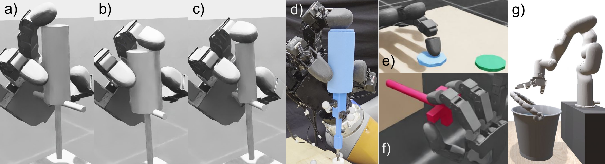
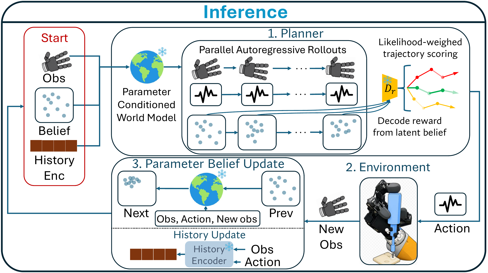
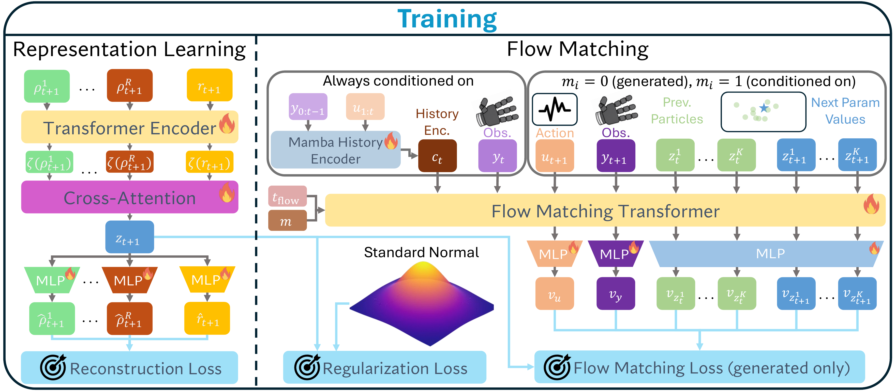
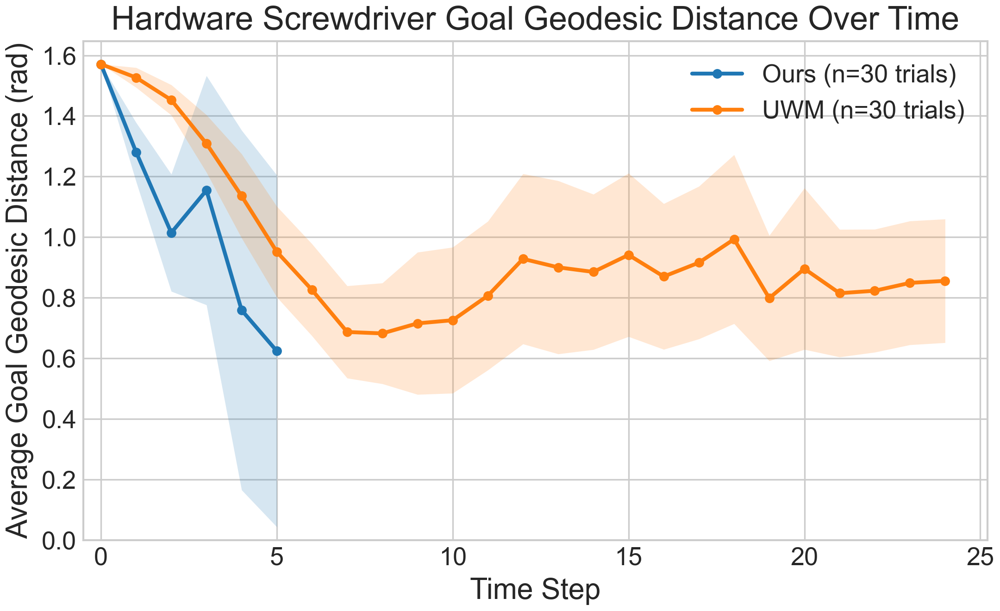

# PLUME: Probabilistic Latent Unified World Modeling and Parameter Estimation for Multi-Finger Manipulation

#

# 基本信息

- arXiv: 2606.11396
- Authors: Abhinav Kumar, Soshi Iba, Rana Soltani Zarrin, Dmitry Berenson
- Categories: cs.RO
- 一句话结论：PLUME 通过概率隐统一世界建模与在线参数估计，在仿真与真实多指灵巧操作任务中实现了对未知物理动力学的自适应规划与零样本迁移。

#

# 研究问题

本文解决的核心问题是**多指灵巧机器人在部署时因隐藏物理参数未知而导致的动力学不匹配**。这些参数包括物体形状、姿态、摩擦系数等，在仿真中已知且可控，但在真实环境中未知且部分可观测。传统域随机化（Domain Randomization）试图学习参数无关策略，然而对于拧螺丝等需要精确接触交互的任务，操作策略必须随具体参数值改变；而现有世界模型方法（如 UWM）仅依赖固定长度历史隐式编码动力学变化，无法显式推理物理参数，导致部署时难以适应真实动力学。此外，多指操作数据收集困难，离线数据集往往包含次优甚至失败轨迹，需要能从异质数据中学习有效动力学与策略的方法。

#

# 任务与挑战

本文评估涵盖四类仿真任务与一项真实硬件任务：

- **拧螺丝（Screwdriver Turning）**：用拇指、食指、中指旋转精密螺丝刀，需处理形状、摩擦、姿态随机化；
- **转阀门（Valve Turning）**：旋转阀门至目标角度，摩擦参数随机；
- **弹磁盘（Disk Flicking）**：食指弹击磁盘至随机目标位置，动态接触后失去控制；
- **提桶（DexArt Bucket）**：6 自由度手臂搭载 Allegro 手抓取并提起带关节手柄的水桶，涉及高维观测与部分可观测状态；
- **硬件拧螺丝**：仿真训练后直接零样本迁移至真实 Allegro 手与 Xela 触觉传感器平台。



核心挑战在于：1）物理参数未知导致动力学不确定；2）数据集异质，包含失败轨迹（如螺丝刀掉落）；3）接触丰富任务对模型误差敏感，易产生灾难性失败。

#

# 核心 Insight

PLUME 的核心思想是将**系统辨识**与**世界模型学习**统一到一个端到端的流匹配（Flow Matching）框架中。与其让策略隐式地从历史观测中“猜测”当前动力学，不如显式地维护一组对隐藏物理参数的**概率信念粒子**，并在每一步利用新的观测在线更新该信念。这样，世界模型始终基于对当前真实动力学的最佳估计进行条件推演，而非依赖固定长度的历史窗口。

具体而言，PLUME 在隐空间中联合表示摩擦系数、形状描述符和奖励等异质变量，通过一个统一的流匹配 Transformer 同时学习三种条件分布：参数估计、前向 Rollout 和逆动力学。在部署时，规划器自回归采样候选轨迹，不仅用解码的奖励评分，还利用**逆动力学对数似然**惩罚那些动力学不一致的乐观轨迹，从而避免模型幻觉导致的灾难性失败。整个框架无需在真实环境上重新训练或微调，仅通过在线信念更新即可实现世界模型与真实动力学的对齐。



#

# 方法与公式

PLUME 的架构由四个耦合模块组成：**参数隐空间学习**、**历史压缩**、**联合流匹配世界模型**与**在线信念更新及规划**。

#

## 1. 参数与奖励的隐空间学习（WAE）

作者使用 Wasserstein Auto-Encoder（WAE）将仿真提供的物理参数 $\tilde{\rho}_t = \rho_t \cup \{r_t\}$（含摩擦系数、形状描述符及奖励）编码为统一隐变量 $z_t = E(\tilde{\rho}_t)$。编码器 $E$ 为 Transformer，通过交叉注意力池化（cross-attention pooling）将多模态参数 token 压缩为单一向量；解码器 $D$ 由多个独立 MLP 组成，分别重构各物理参数与奖励。WAE 施加标准正态先验，使部署时可从 $\mathcal{N}(0, I)$ 初始化信念。

#

## 2. 历史压缩（Mamba-2）

为避免标准粒子滤波的马尔可夫信息丢失，PLUME 使用 Mamba-2 编码器 $C$ 将历史动作与观测 $(u_{1:t}, y_{0:t-1})$ 压缩为历史上下文向量 $c_t$（$c_0 = 0$）。$c_t$ 与当前观测 $y_t$ 解耦，后者直接输入流匹配模型。

#

## 3. 联合流匹配世界模型（DiT + Masked Conditioning）

核心是基于 DiT（Diffusion Transformer）的流匹配模型 $M$。在轨迹时间步 $t$，模型输入包括当前观测 $y_t$、历史上下文 $c_t$、当前信念粒子集 $Z_t = \{z_t^k\}_{k=1}^K$、下一时刻变量 $u_{t+1}, y_{t+1}, Z_{t+1}$、流匹配时间步 $t_{\mathrm{flow}}$ 以及条件掩码 $m$。掩码 $m_i=1$ 表示该变量已知（输入干净值），$m_i=0$ 表示需生成（输入噪声）。

通过切换 $m$，$M$ 在一个统一架构下学习多个条件分布：

- **参数估计**：$p(Z_{t+1} \mid Z_t, y_t, u_{t+1}, y_{t+1}, c_t)$
- **Rollout**：$p(u_{t+1}, y_{t+1}, Z_{t+1} \mid Z_t, y_t, c_t)$
- **逆动力学**：$p(u_{t+1} \mid Z_t, y_t, Z_{t+1}, y_{t+1}, c_t)$

训练时，对 $Z_t, Z_{t+1}, u_{t+1}, y_{t+1}$ 以伯努利分布（$p=0.5$）随机掩码，仅对生成变量计算流匹配损失。为防止流匹配优化破坏编码器表示能力，**来自 $Z$ 相关流匹配损失的梯度不反向传播到 WAE 编码器 $E$**。



#

## 4. 训练目标

总损失包含重构损失、MMD 正则化与流匹配损失：

```math
\mathcal{L}
= \left\lVert \hat{\tilde{\rho}}_{t} - \tilde{\rho}_{t} \right\rVert_{2}^{2}
+ \beta \cdot \mathrm{MMD}(z_{t})
+ \mathcal{L}_{\mathrm{FM}}
\tag{1}
```

其中 $\hat{\tilde{\rho}}_{t}$ 为解码后的参数与奖励，$\tilde{\rho}_{t}$ 为真值，$\beta$ 为权重系数。$\mathrm{MMD}(z_{t})$ 为最大均值差异正则化，用于促使隐变量分布逼近标准正态先验（原文信息不足以完整复原其具体核函数形式）。$\mathcal{L}_{\mathrm{FM}}$ 为流匹配损失，原文信息不足以完整复原其显式公式，但其本质是对生成变量预测速度场与目标速度场的均方误差。

#

## 5. 在线规划与执行

部署时，PLUME 维护粒子信念 $Z_t$。每一步执行：

1. **规划**：从 Rollout 分布自回归采样 $B$ 条长度为 $H$ 的轨迹。对每条轨迹，用信念解码奖励，并计算逆动力学对数似然 $\ell_t$。
2. **评分**：轨迹得分 $s$ 融合奖励与似然：

```math
s
= \sum_{t=1}^{H}
\gamma^{t} \, \hat{r}_{t} \, e^{\ell_{t} / \lambda}
\tag{2}
```

其中 $\gamma$ 为折扣因子，$\lambda$ 为温度系数，$\hat{r}_{t}$ 为解码奖励：

```math
\hat{r}_{t}
= \frac{1}{K} \sum_{k=1}^{K} D_{r}(z_{t}^{k})
\tag{3}
```

3. **信念更新**：执行动作并观测后，用参数估计分布更新 $Z_{t+1}$。
4. **OOD 检测**：若轨迹平均对数似然低于阈值 $\ell_{\mathrm{min}}$，触发早期停止，避免灾难性失败。

#

# 贡献拆解

1. **统一流匹配世界模型与显式参数估计**：将参数信念更新与条件动力学预测集成到单个 DiT 流匹配模型中，通过掩码条件切换实现多任务学习。与传统世界模型仅隐式编码历史不同，PLUME 显式维护概率信念，使部署时无需重训练即可对齐真实动力学。
2. **端到端异构参数隐空间**：使用 WAE 将物理参数与奖励映射到统一隐空间，并端到端训练使该表示最有利于下游动力学学习。通过梯度隔离（流匹配损失不回传至编码器），防止表示能力退化。
3. **基于逆动力学似然的规划器**：在轨迹评分中引入逆动力学对数似然，惩罚动力学不一致的高奖励轨迹，配合 OOD 早期停止机制，显著降低模型乐观错误导致的灾难性失败。

#

# 关键图表解读

**图 1（推理框图，figure-004-block-diagram-v3.png）**：该图展示了 PLUME 的闭环推理流程。左侧为当前观测、信念粒子与历史编码组成的“状态”；上方 Planner 模块基于参数条件世界模型并行展开多条自回归轨迹，右侧通过似然加权进行轨迹评分；下方执行动作后，利用新观测通过参数估计更新信念，再更新历史编码。此图清晰说明了“在线信念更新→条件规划→执行→再更新”的核心机制。

**图 2（训练架构，figure-003-dit.png）**：左半部分为表示学习：Transformer Encoder 将各参数 token 与奖励编码为隐变量 $z$，经独立 MLP 解码重构，施加重构损失与 MMD 正则。右半部分为流匹配：Mamba History Encoder 压缩历史为 $c_t$，与观测、动作、粒子等 token 一同输入 Flow Matching Transformer；通过掩码 $m$ 控制已知/生成变量，输出各模态速度场 $v$。图中 Standard Normal 与 Regularization Loss 对应 WAE 先验约束，而 Flow Matching Loss 仅作用于生成变量。

**图 3（硬件测地距离曲线，figure-002-ours-vs-uwm-goal-geodesic-over-time.png）**：在真实硬件拧螺丝任务中，PLUME（蓝线）在前 5 个时间步内迅速将平均目标测地距离降至约 0.6 rad，而 UWM（橙线）下降缓慢且后期出现反弹。阴影区域为 95% 置信区间，PLUME 的区间更窄且最终趋近于零，说明其不仅能更快接近目标，还能通过早期停止避免后期发散。

**图 4（任务环境汇总，figure-001-sim-envs-all.png）**：一图汇总所有评估场景，包括仿真拧螺丝的三种随机变体、真实硬件拧螺丝、弹磁盘、转阀门与 DexArt 提桶。直观展示了方法在接触类型（持续接触/瞬时接触/关节操作）和系统自由度（纯灵巧手/臂手协同）上的广度。

#

# 实验与消融

**数据集与设定**：仿真数据在 Isaac Lab（螺丝刀、阀门、磁盘）与 SAPIEN（提桶）中生成，刻意保留失败轨迹（如螺丝刀掉落率 11.9%），利用奖励标签区分优劣。硬件使用 Allegro v4 手与 Xela 触觉传感器，Vicon 捕捉姿态，完全零样本迁移。

**主结果**：

- **仿真拧螺丝**：PLUME 有效性率（Validity）达 **81.3%**，较最佳基线 UWM（70.7%）提升 10.6 个百分点；目标距离降低 31%。
- **硬件拧螺丝**：零样本有效性率 **93.3%**（30 次试验仅 2 次失败），目标距离比 UWM 低 10%。
- **转阀门与弹磁盘**：PLUME 显著优于 FQL、Decision Diffuser 和 UWM，阀门目标距离降低 54%。
- **DexArt 提桶**：PLUME 成功率 **71.3%**，而 UWM 与 DD 均为 **0%**，是唯一有效的算法，证明其对高维系统与部分可观测变量的推理能力。

**消融实验**：

- **No Likelihood**：移除逆动力学似然评分后，仿真螺丝刀有效性率暴跌至 46.7%，证明似然评分对避免乐观错误至关重要。
- **No Early Stop**：移除 OOD 早期停止后，仿真螺丝刀有效性降至 76.0%，说明该机制对防止灾难性失败有实质帮助。
- **Detached**：隐空间与流匹配分离训练，在仿真螺丝刀上取得 85.3% 有效性，略高于完整 PLUME（81.3%）。
- **Single Particle**：仅用单粒子（$K=1$）取得 82.7% 有效性，亦略高于完整版。

**最强证据**：硬件零样本迁移中 93.3% 的有效性率与 DexArt 任务上 71.3% 的成功率，直接证明显式参数估计与在线信念更新对接触丰富且物理敏感的多指操作具有决定性作用。

**最存疑证据**：消融实验中 Detached 与 Single Particle 在仿真螺丝刀上反而略优于完整 PLUME，这与“端到端流匹配梯度塑造隐空间”及“多粒子信念捕捉不确定性”的核心叙事存在张力。作者仅以“综合考虑所有任务 PLUME 更优”回应，未充分解释该任务特异性现象，可能暗示端到端联合优化在特定任务上存在过拟合或优化难度。



#

# 局限性

1. **训练依赖仿真真实参数标签**：WAE 编码器需要仿真提供的精确 $\rho_t$ 与 $r_t$ 作为监督，无法直接利用无标签的真实机器人数据。虽然作者提及可“仿真预训练+真实微调”，但未在实验中验证。
2. **Transformer 二次复杂度限制信念精度**：粒子数 $K$ 受限于 Transformer 的 token 二次复杂度，可能无法充分表达复杂后验；作者提到可用线性注意力改进，但未在本文实现。
3. **消融结果与核心叙事的张力**：在最关键的仿真螺丝刀任务上，非端到端与单粒子变体略优于完整 PLUME，削弱了端到端与多粒子必要性的普适性论证。
4. **规划开销**：虽然单次规划时间为 0.26–0.68 秒，但在需要高频控制的接触任务中，基于采样的规划仍可能成为瓶颈。

#

# 个人研究判断

面向“World Models assisting Embodied AI downstream tasks”的研究方向，**PLUME 非常值得继续追踪**。理由如下：

1. **问题定义精准**：它抓住了多指灵巧操作中最痛的“物理参数不确定”与“异质数据”两大现实约束，将显式参数估计引入世界模型规划，突破了传统方法将参数变化隐式编码于历史中的局限。
2. **方法论可扩展**：流匹配+掩码条件的统一框架不仅适用于机器人操作，其“联合推断+条件生成”的范式可迁移至其他需要在线适应的具身任务（如地形适应、工具使用）。
3. **Sim-to-Real 验证扎实**：在硬件上实现零样本迁移并显著优于基线，证明了世界模型辅助策略不仅是仿真层面的概念，而是可落地到真实接触丰富场景的技术路径。

后续可重点关注：如何解除对仿真参数标签的依赖（半监督/自监督参数对齐）、如何将线性注意力或状态空间模型引入流匹配 Transformer 以支持更大规模粒子集、以及如何更严谨地分析显式参数估计相对于隐式历史编码的边界条件与收益阈值。
