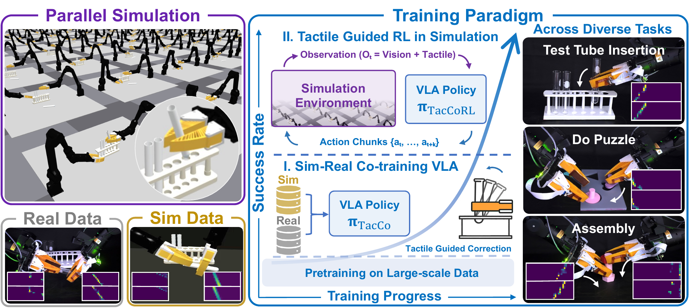
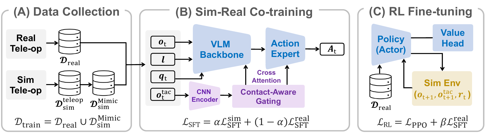
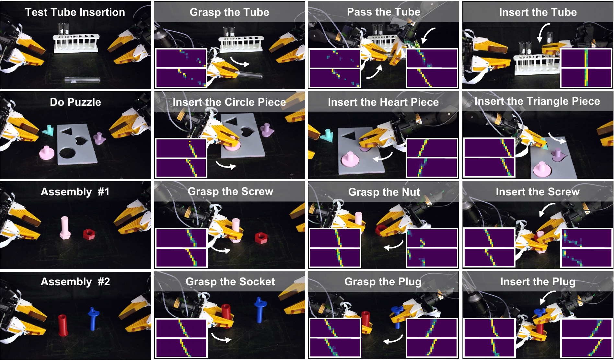
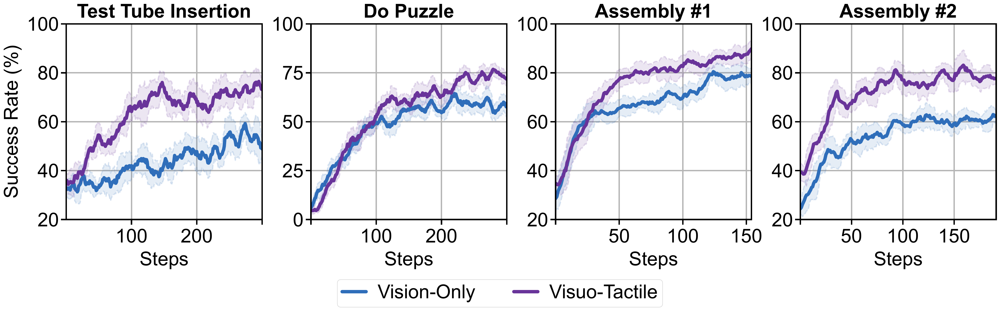

# TacCoRL: Integrating Tactile Feedback into VLA via Simulation

#

# 基本信息

- **arXiv**: 2606.11743
- **Authors**: Siyu Ma, Yuqi Liang, Chang Yu, Yunuo Chen, Hao Su, Yixin Zhu, Yin Yang, Chenfanfu Jiang
- **Categories**: cs.RO, cs.GR, cs.LG
- **一句话结论**: 本文提出 TacCoRL，通过仿真-真实协同训练与基于仿真的稀疏奖励 RL 后训练，将触觉反馈注入预训练 VLA 模型，在四个双手接触丰富任务上实现 72.5% 的平均真实成功率，较纯视觉基线提升 22.5%。

#

# 研究问题

论文解决的核心问题是：**预训练 Vision-Language-Action (VLA) 模型在接触丰富（contact-rich）的精细操作任务中缺乏局部接触状态感知能力**。现有 VLA 依赖视觉、语言和本体感知先验，但视觉无法可靠观测接触面的细微错位、压力分布以及被遮挡区域的接触事件。这导致策略在插入、装配等需要闭环接触修正的任务中表现不佳。此外，真实演示数据稀缺且高度偏向成功轨迹，而近失败状态（near-failure states）的采集成本高、有硬件损坏风险，使得模仿学习难以学会有效的接触恢复策略。

#

# 任务与挑战

**具体任务**：论文在四个双手（bimanual）接触丰富任务上验证方法：
- Test Tube Insertion（试管插入）
- Do Puzzle（形状拼图）
- Assembly #1（螺钉-螺母装配）
- Assembly #2（插头-插座装配）

**输入输出**：
- 输入：语言指令 $\boldsymbol{\ell}$、视觉图像 $\mathbf{o}^v_t$、本体感知 $\mathbf{q}_t$、触觉历史窗口 $\mathbf{o}^\tau_t$（含 $L=10$ 帧、$K=1536$ 个 taxel）。
- 输出：$H=10$ 步的动作块 $\mathbf{A}_t \in \mathbb{R}^{H \times d_a}$（$d_a=14$ 维双臂动作）。

**核心挑战**：
1. **模态融合**：如何将高维时序触觉信号有效注入预训练 VLA 的 vision-language backbone，而不破坏其预训练先验。
2. **仿真对齐**：需将仿真器的控制器响应、触觉统计量与相机外参对齐到真实机器人，使闭环接触学习有效。
3. **分布外学习**：演示数据缺乏近失败接触状态，需通过仿真 RL 安全地探索并学习接触修正。
4. **Sim-to-Real 迁移**：防止仿真 RL 导致的策略漂移，确保零样本真实部署。

#

# 核心 Insight

TacCoRL 的核心思想是：**触觉反馈不应仅作为额外输入通道，而应成为调节近失败状态下动作响应的闭环信号**。作者指出，仅在模仿学习层面引入触觉不足以教会策略如何利用接触信息进行错误恢复，因为演示数据本身就缺乏这类交互。因此，他们利用一个与真实轻度对齐的仿真器作为"安全沙盒"，通过稀疏任务奖励的 PPO 强化学习，让策略在大量闭环接触交互中学会"如何根据触觉读数修正动作"。

同时，为避免仿真漂移，框架采用**真实数据锚定（real-data anchor）**：在 RL 阶段联合优化真实演示上的流匹配损失，将策略"拴"在真实分布上。这种"仿真探索 + 真实锚定"的范式，使得最终策略可直接丢弃 Critic 与特权状态，零样本迁移至真实机器人。



#

# 方法与公式

TacCoRL 基于 $\pi_{0.5}$-style VLA 骨干，整体分为**触觉条件接口设计**与**两阶段后训练**。

#

## 1. 触觉条件接口

策略在时刻 $t$ 的观测接口定义为：

```math
\mathbf{x}_t=(\boldsymbol{\ell},\mathbf{o}^v_t,\mathbf{q}_t,\mathbf{o}^\tau_t),
\qquad
\mathbf{A}_t \sim \pi_{\boldsymbol{\theta}}(\cdot \mid \mathbf{x}_t).
\tag{1}
```

其中 $\boldsymbol{\ell}$ 为语言指令，$\mathbf{o}^v_t$ 为视觉图像，$\mathbf{q}_t$ 为本体感知，$\mathbf{o}^\tau_t$ 为触觉读数，$\mathbf{A}_t$ 为预测的动作块。

VLM Backbone 将语言、图像和本体感知编码为基础 token：

```math
\mathbf{Z}^{\mathrm{base}}_t=[\mathbf{Z}^\ell,\mathbf{Z}^v_t,\mathbf{Z}^q_t].
\tag{2}
```

触觉编码器 $E_\tau$ 与投影矩阵 $\mathbf{W}_\tau$ 将最近 $L$ 帧的触觉窗口 $\mathbf{h}^\tau_t=\mathbf{o}^\tau_{t-L+1:t}\in\mathbb{R}^{L\times K}$ 编码为 $M=16$ 个触觉 token：

```math
\mathbf{Z}^\tau_t = \mathbf{W}_\tau E_\tau(\mathbf{h}^\tau_t) \in \mathbb{R}^{M\times d}.
\tag{3}
```

为抑制无接触时的背景噪声，引入**二值接触门控**。设 $f_{r,k}$ 为第 $r$ 时刻第 $k$ 个 taxel 的读数，激活阈值 $\lambda_f=0.4$，最小激活数 $m=1$：

```math
c_t =
I\left[
\max_{r\in[t-L+1,t]}
\sum_{k=1}^{K}
I(|f_{r,k}|>\lambda_f)
\ge m
\right],
\qquad
\widetilde{\mathbf{Z}}^\tau_t=\operatorname{Gate}(\mathbf{Z}^\tau_t,c_t).
\tag{4}
```

当窗口内无有效接触时，$\operatorname{Gate}$ 将触觉 token 置零，保持预训练 VLA 的原始行为。

门控后的触觉 token 通过**双路径融合**进入模型：

```math
\bar{\mathbf{Z}}^{\mathrm{base}}_t
=
\mathrm{CrossAttn}(\mathbf{Z}^{\mathrm{base}}_t,\widetilde{\mathbf{Z}}^\tau_t),
\qquad
\mathbf{Z}_t=[\bar{\mathbf{Z}}^{\mathrm{base}}_t,\widetilde{\mathbf{Z}}^\tau_t].
\tag{5}
```

- **路径一**：Cross-Attention 让触觉历史更新 vision-language-proprioception 的上下文表征；
- **路径二**：将更新后的 base token 与门控触觉 token 拼接，直接作为 Action Expert（Flow Policy）的条件输入，在接触发生时重塑动作块。

#

## 2. 两阶段后训练

**阶段一：Sim-Real Co-training**

混合真实演示 $\mathcal{D}_{\mathrm{real}}$（每任务 50 条）与仿真演示 $\mathcal{D}_{\mathrm{sim}}$（20 条仿真遥操作经 MimicGen 扩展至 200 条并过滤成功轨迹），通过流匹配损失进行协同训练：

```math
\mathcal{L}_{\mathrm{co}}(\boldsymbol{\theta})
=
\alpha
\mathrm{E}_{(\mathbf{x},\mathbf{A}^*)\sim\mathcal{D}_{\mathrm{sim}}}
[\ell_{\mathrm{flow}}(\boldsymbol{\theta};\mathbf{x},\mathbf{A}^*)]
+
(1-\alpha)
\mathrm{E}_{(\mathbf{x},\mathbf{A}^*)\sim\mathcal{D}_{\mathrm{real}}}
[\ell_{\mathrm{flow}}(\boldsymbol{\theta};\mathbf{x},\mathbf{A}^*)].
\tag{6}
```

这里 $\ell_{\mathrm{flow}}$ 为条件流匹配损失，$\alpha=0.5$ 控制仿真与真实数据的贡献比例。此阶段为策略建立触觉条件的动作先验。

**阶段二：RL Post-training with Real-Data Anchor**

在 128 个并行仿真环境中收集 on-policy rollout（chunk 长度 36 步），使用稀疏任务级成功/失败谓词作为奖励，通过 PPO 优化策略。为防止仿真漂移，联合优化真实数据上的流匹配损失作为锚点：

```math
\min_{\boldsymbol{\theta},\boldsymbol{\omega}}
\mathcal{L}_{\mathrm{RL}}(\boldsymbol{\theta},\boldsymbol{\omega})
=
\mathcal{L}_{\mathrm{PPO}}(\boldsymbol{\theta},\boldsymbol{\omega};E_{\mathrm{sim}}(\boldsymbol{\psi}))
+
\beta
\mathrm{E}_{(\mathbf{x},\mathbf{A}^*)\sim\mathcal{D}_{\mathrm{real}}}
[\ell_{\mathrm{flow}}(\boldsymbol{\theta};\mathbf{x},\mathbf{A}^*)].
\tag{7}
```

其中 $\boldsymbol{\omega}$ 为 Critic 参数，$\mathcal{L}_{\mathrm{PPO}}$ 为裁剪 PPO 损失，$\beta=1.0$ 为锚定权重。训练完成后丢弃 Critic、奖励函数与特权仿真状态，策略直接部署到真实机器人。



#

## 3. 仿真环境对齐

为使仿真闭环训练有效，作者对三个接口进行了对齐：
- **控制器 SysID**：通过 SPSA 优化各关节的 $K_p, K_d, T_{\mathrm{ref}}$，最小化真实与仿真的跟踪误差。
- **触觉标定**：基于弹簧-阻尼模型 $f^{\mathrm{sim}}_{t,k}=[k_n \delta_{t,k} + k_d \dot{\delta}_{t,k}]_+$ 对齐归一化触觉统计量。
- **相机外参微调**：优化相机位姿偏移，确保视觉上下文一致。

#

# 贡献拆解

**贡献 1：即插即用的触觉条件接口**
- **做了什么**：在预训练 $\pi_{0.5}$ VLA 上增加 CNN 触觉编码器与二值接触门控，通过双路径 Cross-Attention 与拼接融合触觉 token。
- **为什么有效**：接触门控抑制了非接触噪声，双路径既更新了高层语义上下文，又为 Flow Action Expert 提供了低层接触条件，且无需大规模触觉预训练。
- **与已有方法差别**：不同于 TLA、VTac 等从头训练触觉-语言-动作模型，TacCoRL 直接增强现有 VLA 骨干，数据门槛更低。

**贡献 2：Sim-Real Co-training + 仿真 RL 后训练范式**
- **做了什么**：先用混合仿真-真实演示建立触觉动作先验，再在仿真中用稀疏奖励 PPO 进行闭环接触修正，同时用真实数据流匹配损失锚定分布。
- **为什么有效**：Co-training 将问题从"从零探索"转化为"策略精炼"；真实数据锚定防止了仿真特有的接触策略过拟合。
- **与已有方法差别**：相比仅使用仿真数据扩展或仅使用真实 RL 的方法，TacCoRL 在仿真中安全探索接触修正，同时通过锚定保持真实可部署性。

**贡献 3：系统性的 Sim-to-Real 对齐与真实机器人验证**
- **做了什么**：通过控制器 SysID、触觉信号标定与相机外参优化，构建了与真实对齐的闭环仿真环境，并在四个双手任务上完成零样本真实部署。
- **为什么有效**：严格的接口对齐确保了仿真中学习的闭环接触行为在真实硬件上具有物理一致性。
- **与已有方法差别**：许多仿真 RL 工作依赖密集奖励或特权状态，TacCoRL 使用稀疏任务奖励并丢弃特权状态部署。

#

# 关键图表解读

**图 1（figure-005-teaser）：整体训练范式与任务概览**
- **展示内容**：左侧为大规模并行仿真环境与虚实数据采集；中间为两阶段训练范式（Sim-Real Co-training → Tactile Guided RL）；右侧为四个真实机器人任务及触觉热图。
- **支撑论点**：直观呈现了"仿真作为安全沙盒、真实数据作为分布锚点"的核心范式，以及方法在多样化接触任务上的泛化性。
- **读图注意**：注意虚实数据流如何汇入同一个 VLA Policy，以及 RL 阶段如何利用仿真环境闭环优化接触修正。

**图 2（figure-010-pipeline）：三阶段技术 Pipeline**
- **展示内容**：(A) 真实与仿真遥操作数据采集（含 MimicGen 扩展）；(B) Sim-Real Co-training 网络结构，突出 CNN Encoder、Contact-Aware Gating、Cross Attention 与 Action Expert；(C) RL 微调阶段，Policy 与 Value Head 在 Sim Env 中交互，并用真实数据锚定。
- **支撑论点**：清晰刻画了触觉信息如何注入 VLM Backbone 与 Action Expert，以及两阶段损失设计（$\mathcal{L}_{\mathrm{co}}$ 与 $\mathcal{L}_{\mathrm{RL}}$）。
- **读图注意**：关注触觉 token 的双路径流向（Cross-Attn 更新 base context + 拼接输入 Action Expert），这是模态融合的关键。

**图 3（figure-008-rl）：真实机器人执行示例与触觉可视化**
- **展示内容**：四个任务的真实机器人执行序列，每个子图包含操作步骤与对应的触觉热图（taxel 激活情况）。
- **支撑论点**：定性证明策略在遮挡严重的接触阶段（如试管插入、拼图对准）确实利用了触觉反馈进行局部修正。
- **读图注意**：观察触觉热图在"接触-加载-释放"过程中的动态变化，以及策略如何在视觉被遮挡时依赖触觉完成精细对准。

**图 4（figure-000-result）：Vision-Only vs. Visuo-Tactile 成功率曲线**
- **展示内容**：四个任务上，纯视觉基线（蓝）与视触觉策略（紫）在仿真 RL 训练过程中的成功率变化。
- **支撑论点**：视触觉策略在所有任务上均显著优于纯视觉基线，证明触觉反馈在闭环接触修正中的持续价值。
- **读图注意**：Do Puzzle 任务绝对成功率较低（约 45%），且两条曲线差距相对较小，说明长时程多步接触任务仍是瓶颈；Assembly #1 的视触觉曲线最终可达约 90%，表明方法在刚性装配任务上优势最大。



#

# 实验与消融

**数据集与设定**：
- 真实数据：每任务 50 条人类演示。
- 仿真数据：20 条仿真遥操作经 MimicGen 扩展至 200 条。
- 平台：双臂 AgileX PiPER + FlexiTac-V2 触觉垫（$32\times12$ taxel）+ RealSense 相机。

**主结果**：
- 经过 RL 后训练的视触觉策略在真实机器人上平均成功率达 **72.5%**，而同等流程的纯视觉基线仅 **50.0%**。
- 单任务表现：Test Tube Insertion（70% vs 35%）、Do Puzzle（45% vs 25%）、Assembly #1（95% vs 80%）、Assembly #2（80% vs 60%）。

**关键消融**：
1. **Co-training 的必要性**：直接从基础 VLA 进行仿真 RL 的成功率为 **0%**（所有任务），说明 co-training 提供的触觉动作先验是 RL 有效的前提。
2. **真实数据锚定（$\beta$）**：在 Assembly #2 上的消融显示，$\beta=1.0$ 将真实部署成功率从 45%（无锚定）提升至 **80%**；但过强的锚定（$\beta=5.0$）会抑制 RL 探索，导致成功率下降。
3. **Co-training 比例（$\alpha$）**：$\alpha=0.5$ 时效果最佳，纯真实数据（$\alpha=0$）在仿真 RL 中表现差（14.1%），说明仿真数据对初始化至关重要。

**最强证据**：真实部署中视触觉相比纯视觉提升 22.5%，且两者经历完全相同的 sim-real co-training 与仿真 RL 流程，排除了仿真训练本身的混淆因素，直接量化了触觉闭环价值。

**最存疑证据**：Do Puzzle 任务绝对成功率仅 45%，显著低于其他任务；且关键超参数 $\alpha$ 与 $\beta$ 的消融仅在 Assembly #2 单一任务上进行，未验证跨任务泛化性。此外，真实数据锚定虽然有效，但仍依赖 50 条真实演示，未完全消除真实触觉数据采集需求。

#

# 局限性

1. **真实触觉数据依赖**：方法虽减少了大规模触觉预训练需求，但仍需少量真实触觉演示作为 RL 锚点，未实现完全无真实触觉数据的迁移。
2. **仿真搭建成本高**：控制器 SysID、触觉标定与相机对齐仍需手动操作，自动化程度不足，难以快速迁移到新任务。
3. **接触动力学局限**：实验局限于刚性或近刚性接触，未覆盖可变形体、流体等复杂接触动力学。
4. **长时程任务稳定性**：Do Puzzle 等长程任务成功率偏低，说明当前方法在多步、长时程接触任务中的稳定性仍有瓶颈。
5. **消融泛化性不足**：关键超参数消融仅在 Assembly #2 上进行，最优参数组合的外推可靠性存疑。

#

# 个人研究判断

面向"World Models assisting Embodied AI downstream tasks"方向，**TacCoRL 值得继续追踪**。

**理由**：
1. **问题定义精准**：它抓住了 VLA 在接触丰富任务中的真实痛点——视觉盲区与近失败恢复，且提出的"仿真闭环 RL + 真实分布锚定"范式具有通用性。
2. **技术路径务实**：不追求颠覆 VLA 预训练流程，而是通过即插即用的后训练接口注入触觉能力，这对工业界和学术界都更具落地价值。
3. **与 World Model 的衔接潜力**：当前工作使用传统仿真器作为训练环境，未来若将其与可学习的 World Model（尤其是触觉-视觉联合世界模型）结合，有望进一步降低仿真对齐成本，并提升长程任务规划能力。
4. **可扩展性**：触觉门控与双路径融合的设计思想可迁移到其他模态（如力/力矩、声音），为构建多模态 VLA 提供了参考。

后续可重点关注：自动化数字孪生构建、无真实触觉数据的自监督触觉表征、以及将仿真 RL 后训练与模型预测控制（MPC）或 World Model 规划相结合的方向。

## 关键图表解读



*RL 训练过程与真实部署消融：仿真 RL 成功率、真实数据锚定损失及真实部署成功率对比。*
