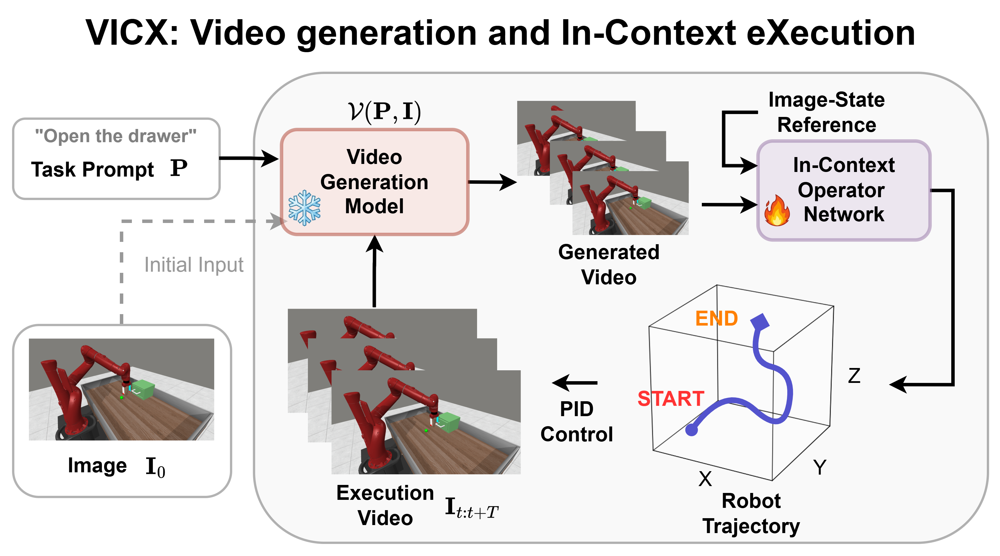
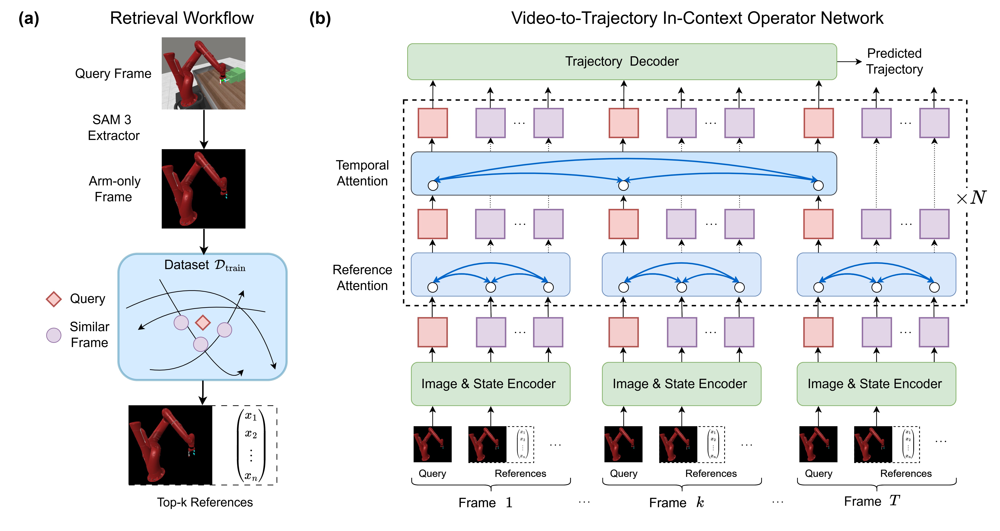
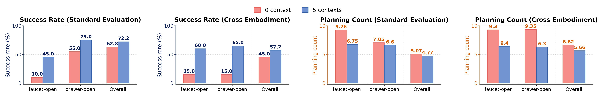
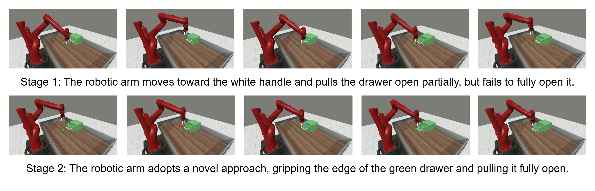

# VICX: Generalizable Robot Manipulation via Video Generation and In-Context Operator Network

#

# 基本信息

- **arXiv**: 2606.12028
- **Authors**: Song Chen, Linyan Xiang, Ying Zhou, Liu Yang
- **Categories**: cs.RO
- **一句话结论**: 通过解耦冻结视频生成模型与上下文轨迹翻译网络，在不依赖大规模机器人数据的情况下，实现跨任务语义与跨机器人本体的双重泛化闭环操控。

#

# 研究问题

论文针对**通用视频生成模型的视觉计划如何可靠 grounded 到具体机器人执行**这一核心问题，提出了一种新的解耦范式。现有端到端 Vision-Language-Action（VLA）模型将高层任务推理与低层物理控制耦合在同一参数空间中，导致必须依赖海量本体数据且难以跨具身泛化。另一方面，通用视频生成模型（如 Wan 2.7）虽具备丰富的物理世界先验，可用于高层视觉规划，但生成的像素计划如何映射到可执行的机器人状态轨迹仍缺乏可靠接口。现有方法多通过逆动力学或光流从相邻帧提取动作，难以应对视角变化、外观差异与视频生成伪影带来的域偏移。VICX 试图填补这一"视觉-执行鸿沟"。

#

# 任务与挑战

**任务设定**：在 Meta-World 仿真环境中完成多种机器人操控任务（如 drawer-open、faucet-open、button-press 等）。

**输入输出**：
- 输入：自然语言任务提示 $P$（如 "Open the drawer"）与当前视觉观测 $I_0$。
- 输出：可执行的机器人状态轨迹 $\hat{X}$，经 PID 控制器跟踪后作用于环境。

**训练/评测设定**：
- V2T-ICON 仅在 3 个任务（reach、drawer-open、basketball）共 1,350 条演示、79,046 帧上训练。
- 在 9 个测试任务上评估闭环成功率，其中 6 个为训练时未见的任务。
- 额外进行跨本体迁移测试（将红色 Sawyer 臂替换为橙色工业臂并改变环境外观）以及自定义 DIY sweep-soccer 任务的零样本压力测试。

**已有方法的不足**：
- $\pi_{0.5}$-Finetune 虽经 Meta-World MT50 微调，整体成功率仅 26.1%，且对未见任务泛化差。
- AVDC 在 11 个任务上训练，整体成功率 55.0%，但其基于视频预测直接生成动作，缺乏对生成伪影的鲁棒 grounding 机制，在部分任务（如 drawer-open）上成功率仅 20.0%。

#

# 核心 Insight

VICX 的核心思想是**完全解耦高层视觉规划与低层执行接地**。冻结的通用视频生成模型（Wan 2.7）作为"现成"的世界模型，负责根据当前观测和语言指令零样本生成未来视觉计划；轻量的 Video-to-Trajectory In-Context Operator Network（V2T-ICON）则作为任务无关的执行接口，将这些视觉计划翻译为机器人状态轨迹。两者参数互不干扰，视频模型无需接触机器人数据，执行网络也无需接触任务语义。

为实现跨域泛化，V2T-ICON 摒弃了全局像素到状态的刚性回归，转而采用**检索增强的上下文校准**机制：在推理时，通过 DINOv2 视觉特征从训练池中检索相近的 image-state 对作为 in-context prompt，先经逐帧 Reference Attention 做局部视觉-状态匹配，再通过 Temporal Attention 迭代精修，最终解码出平滑轨迹。此外，通过 SAM3 分割提取每帧的 arm-only 图像，剔除任务物体与背景，迫使模型专注于机器人几何与运动学，从而实现任务无关的映射。



上图展示了 VICX 的闭环流程：任务提示 $P$ 与初始图像 $I_0$ 输入冻结的视频生成模型 $\mathcal{V}$，产生 Generated Video；V2T-ICON 结合检索到的 Image-State Reference 将其映射为 Robot Trajectory；经 PID 控制执行后，新的观测反馈给视频模型进行重规划。

#

# 方法与公式

#

## 1. VICX 闭环操作协议

VICX 是一个解耦的闭环框架，包含两个协同模块：

- **冻结视频生成模型** $\mathcal{V}$：给定当前观测 $I$ 和语言指令 $P$，生成短程未来视频 $Q = \mathcal{V}(P, I)$。
- **V2T-ICON** $\mathcal{G}_{\theta}$：将计划视频转换为可执行的机器人状态轨迹 $\hat{X}$。
- **闭环重规划**：执行后，最新观测被反馈给视频模型，在最多 $C=10$ 个规划周期内重新生成视频并执行，直到任务成功或预算耗尽。

关键预处理：使用 SAM3 分割提取每帧的 arm-only 图像 $\bar{I} = \mathcal{S}(I)$，剔除任务物体与背景，迫使 V2T-ICON 专注于机器人几何与运动学。

#

## 2. V2T-ICON 网络架构

V2T-ICON 的输入为查询视频窗口 $Q=\{I_t^q\}_{t=1}^{T}$ 及每帧检索到的 $N=5$ 个参考 image-state 对 $R_t=\{(I_{t,j}^r, x_{t,j}^r)\}_{j=1}^{N}$。输出为状态轨迹 $\hat{X}=\{\hat{x}_t\}_{t=1}^{T}$。

**编码阶段**：
查询图像与参考图像均通过冻结 DINOv2 编码为 patch 特征 $P$ 与全局特征 $c$。参考中的机器人状态通过可学习的线性编码器 $\psi_x$ 投影到共享隐空间。

查询 token：

```math
e_t^q = \eta_q(P_t^q, c_t^q)
```

参考 token：

```math
e_{t,j}^r = \eta_r(P_{t,j}^r, c_{t,j}^r, \psi_x(x_{t,j}^r))
```

其中 $\eta_q$ 和 $\eta_r$ 为可学习的投影层，将视觉与状态特征对齐到 Transformer 隐空间。

**迭代精修（$K=3$ 轮）**：

第一轮以编码后的查询图像作为初始查询 token：

```math
q_t^{(1)} = e_t^q
```

后续轮次将原始图像先验与上一轮时序输出融合：

```math
q_t^{(k)} = f_{\mathrm{fuse}}(e_t^q, z_t^{(k-1)}) = W_{\mathrm{fuse}}[e_t^q; z_t^{(k-1)}] + b_{\mathrm{fuse}}
\tag{1}
```

**Reference Attention**：每帧独立执行，将查询 token 与同一帧的 $N$ 个参考 token 做 cross-attention，生成帧级隐变量：

```math
h_t^{(k)} = f_{\mathrm{ref}}\left(q_t^{(k)}, \{e_{t,j}^r\}_{j=1}^{N}\right)
\tag{2}
```

**Temporal Attention**：将 $T$ 帧隐变量堆叠为非因果时序序列，通过 Transformer 传播信息，得到时序一致的表示：

```math
Z^{(k)} = f_{\mathrm{temp}}\left([h_1^{(k)}, \ldots, h_T^{(k)}]\right) \triangleq \{z_t^{(k)}\}_{t=1}^{T}
\tag{3}
```

**解码**：最终轮次的时序表示 $Z^{(K)}$ 经线性解码器映射为状态轨迹：

```math
\hat{X} = f_{\mathrm{dec}}(Z^{(K)})
\tag{4}
```



上图左侧展示了基于 SAM3 的检索工作流：对 arm-only 查询帧用 DINOv2 特征在训练池 $\mathcal{D}_{\mathrm{train}}$ 中检索 Top-$N$ 相似的 image-state 对。右侧展示了网络结构：查询与参考经 Image & State Encoder 编码后，先通过 Reference Attention 做逐帧匹配，再通过 Temporal Attention 进行时序聚合，最后由 Trajectory Decoder 输出预测轨迹。

#

## 3. 训练目标

V2T-ICON 在 arm-only 视频-状态对上训练，使用加权多目标损失：

```math
\mathcal{L}_{\mathrm{V2T}} = \lambda_{\mathrm{state}}\mathcal{L}_{\mathrm{state}} + \lambda_{\mathrm{smooth}}\mathcal{L}_{\mathrm{smooth}} + \lambda_{\mathrm{vel}}\mathcal{L}_{\mathrm{vel}}
\tag{5}
```

各项具体定义为：

状态回归损失（逐帧 MSE）：

```math
\mathcal{L}_{\mathrm{state}} = \frac{1}{T}\sum_{t=1}^{T} \left\lVert \hat{x}_t - x_t \right\rVert_2^2
\tag{6}
```

平滑性损失（惩罚 xyz 轨迹的二阶差分）：

```math
\mathcal{L}_{\mathrm{smooth}} = \frac{1}{T-2}\sum_{t=2}^{T-1} \left\lVert \hat{p}_{t+1} - 2\hat{p}_{t} + \hat{p}_{t-1} \right\rVert_2^2
\tag{7}
```

速度一致性损失（匹配 xyz 速度）：

```math
\mathcal{L}_{\mathrm{vel}} = \frac{1}{T-1}\sum_{t=1}^{T-1} \left\lVert (\hat{p}_{t+1} - \hat{p}_t) - (p_{t+1} - p_t) \right\rVert_2^2
\tag{8}
```

其中 $p_t$ 和 $\hat{p}_t$ 分别表示真实与预测的 xyz 位置分量。权重设置为 $\lambda_{\mathrm{state}}=1.0$，$\lambda_{\mathrm{smooth}}=0.05$，$\lambda_{\mathrm{vel}}=0.05$。

#

## 4. 评估指标

**成功率（Success Rate）**：

```math
\mathrm{SR} = \frac{1}{M}\sum_{m=1}^{M} y_m
\tag{9}
```

其中 $y_m \in \{0,1\}$ 表示第 $m$ 次运行是否在预算 $C=10$ 内成功。

**惩罚规划次数（Penalized Planning Count）**：

```math
\tilde{c}_m = \begin{cases} c_m, & \text{if } y_m = 1, \\ C, & \text{if } y_m = 0, \end{cases}
```

```math
\mathrm{PPC} = \frac{1}{M}\sum_{m=1}^{M} \tilde{c}_m
\tag{10}
```

该指标同时反映成功运行的早期终止效率与失败运行的预算消耗。

#

# 贡献拆解

1. **解耦闭环框架 VICX**：将冻结通用视频生成模型作为高层规划器，将执行问题形式化为视频到轨迹的 grounding 问题，摆脱了对端到端 VLA 大数据的依赖。视频模型提供零样本任务推理能力，V2T-ICON 提供轻量执行接口，两者通过闭环重规划协同工作。
   
   *有效性原因*：视频模型的世界先验与执行网络的局部校准解耦，避免了在单一模型中同时学习物理推理与精确控制的负担。
   
   *与已有方法差别*：不同于 AVDC 等层次化方法将视频预测与动作生成耦合，VICX 明确分离规划与执行，且使用状态轨迹而非动作作为中间接口，更具控制器无关性。

2. **V2T-ICON 上下文操作网络**：提出基于检索上下文（in-context）的视频-轨迹翻译网络，通过推理时检索 image-state 对实现无需微调的跨任务与跨具身状态估计。
   
   *有效性原因*：Reference Attention 利用局部视觉对应关系而非全局回归，Temporal Attention 保证时序一致性；arm-only 分割消除了任务语义干扰。
   
   *与已有方法差别*：区别于直接训练像素到状态的刚性回归器（如 RoboKeyGen），V2T-ICON 在测试时动态适应视觉域，通过 $K=3$ 轮迭代精修逐步消除单帧歧义。

3. **双重泛化的强实证**：在 Meta-World 上仅用 3 个任务训练，即在新任务上达到 72.2% 闭环成功率；跨本体迁移（橙色工业臂）保持 57.2% 成功率；并展示 emergent self-correction（如 drawer-open 失败后自动调整抓取策略）。
   
   *有效性原因*：任务无关的 arm-only 映射使模型专注于运动学结构；检索上下文在推理时提供物理校准锚点。
   
   *与已有方法差别*：$\pi_{0.5}$-Finetune 在更多数据上微调后整体仅 26.1%；AVDC 在 11 个任务上训练后整体 55.0%，且跨任务表现不稳定。

#

# 关键图表解读

#

## 图 1：VICX 系统总览


该图展示 VICX 的完整数据流：从语言任务提示 $P$ 和初始观测 $I_0$ 出发，冻结视频生成模型 $\mathcal{V}(P, I)$ 输出未来视觉计划；V2T-ICON 接收 Generated Video 与检索到的 Image-State Reference，将其映射为三维空间中的 Robot Trajectory；经 PID Control 执行后，Execution Video 被反馈回视频模型进行下一轮规划。读图时应注意两个关键解耦：一是视频模型（雪花图标，冻结）与执行网络（火焰图标，可训练）的解耦；二是视觉计划空间与状态轨迹空间的分离。

#

## 图 2：V2T-ICON 架构与检索工作流


左半部分（Retrieval Workflow）说明：对查询帧使用 SAM3 提取 arm-only 图像，通过 DINOv2 特征在训练集 $\mathcal{D}_{\mathrm{train}}$ 中检索 Top-$k$ 相似的 image-state 对。右半部分（Video-to-Trajectory In-Context Operator Network）展示了逐帧处理流程：每帧的 Query 与 References 经 Image & State Encoder 编码后，先进入 Reference Attention（逐帧局部匹配），再进入 Temporal Attention（全局时序聚合），重复 $N$ 轮（图中 $\times N$）后由 Trajectory Decoder 输出。读图时应注意红色方块（Query）与紫色方块（References）在注意力机制中的交互方式，以及迭代精修如何逐步提升轨迹质量。

#

## 图 3：上下文数量对性能的影响



该图包含四个子图，分别展示标准评估与跨本体评估下的成功率（Success Rate）与惩罚规划次数（Planning Count）。红色柱（0 context）与蓝色柱（5 contexts）的对比表明：引入 5 个上下文参考后，标准评估整体成功率从 62.8% 提升至 72.2%，跨本体评估从 45.0% 提升至 57.2%；同时规划次数显著下降，说明上下文不仅提高成功率，还增强了规划效率。读图时需特别关注 faucet-open 任务：0 上下文时成功率仅 10.0%~15.0%，而 5 上下文时跃升至 45.0%~60.0%，证明在接触敏感任务中上下文校准尤为关键。

#

## 图 4：闭环自修正执行序列



该图通过两阶段图像序列直观展示 emergent self-correction。Stage 1 中机械臂尝试拉动白色把手但未能完全打开抽屉；Stage 2 中系统并未重复失败动作，而是生成新的视觉策略——直接抓取绿色抽屉边缘并将其完全拉开。读图时应注意：这一修正策略并未出现在训练演示中，而是冻结视频模型根据失败后的视觉反馈"发明"的，验证了闭环重规划结合世界先验可以产生零样本的错误恢复能力。

#

# 实验与消融

**数据集与基线**：
- 训练数据：V2T-ICON 仅在 reach、drawer-open、basketball 三个任务的 1,350 条演示（79,046 帧）上训练。
- 测试任务：9 个 Meta-World 任务，其中 6 个为训练时未见任务。
- 基线：$\pi_{0.5}$-Scratch、$\pi_{0.5}$-Finetune（在 Meta-World MT50 上微调）、AVDC（在 11 个任务上训练）。

**主结果**（表 1）：
- VICX（5 上下文）整体成功率 **72.2%**，显著优于 AVDC（55.0%）和 $\pi_{0.5}$-Finetune（26.1%）。
- 在未见任务上表现突出：coffee-button（100.0%）、door-close（100.0%）、button-press-topdown（85.0%）。
- 在训练任务 drawer-open 上达到 75.0%，而 AVDC 仅 20.0%。

**消融实验**：
- **上下文数量的影响**（图 3 与表 4）：0 上下文 vs 5 上下文。5 上下文在标准评估中将整体成功率从 62.8% 提升至 72.2%，PPC 从 5.07 降至 4.77；在跨本体评估中成功率从 45.0% 提升至 57.2%，PPC 从 6.62 降至 5.66。
- **跨本体迁移**：在不重新训练的情况下，将模型从红色 Sawyer 臂迁移到外观、纹理、光照全变的橙色工业臂。5 上下文设置下整体成功率 57.2%，而无上下文版本仅 45.0%。faucet-open 在跨本体下从 15.0%（0 上下文）提升至 60.0%（5 上下文），提升幅度最大。

**最强证据**：
- VICX 仅用 3 个任务的少量数据训练，就在 9 个任务上超越在 11 个任务上训练的 AVDC，直接证明了"解耦规划-执行 + 上下文接地"架构在跨任务泛化上的数据效率优势。
- 跨本体实验中，模型仅通过检索红色机械臂的参考即可理解橙色工业臂的视频计划，证明其学习的是结构对应而非表面纹理。

**最存疑证据**：
- **精细接触任务的系统性失败**：button-press 在标准评估下仅 20.0%（远低于 AVDC 的 60.0%），在跨本体设置下甚至降至 0.0%。faucet-close 也表现不佳（25.0% vs AVDC 50.0%）。这表明当任务依赖毫米级接触几何或力敏感操作时，基于 arm-only 检索与单视角状态回归的接口存在明显短板。
- **DIY 任务成功率偏低**：自定义 sweep-soccer 任务上 5 上下文成功率仅 20.0%，说明在完全脱离 Meta-World 分布的场景中，当前方法的零样本迁移能力仍然有限。

#

# 局限性

1. **精细接触与力敏感任务的性能瓶颈**：在 button-press、faucet-close 等需要精确接触或力控制的精细任务上，VICX 显著落后于 AVDC。Arm-only 分割与单视角状态回归丢失了接触几何与力信息，这是架构层面的固有盲区。
2. **延迟与实时性限制**：视频生成（Wan 2.7）是整个 pipeline 的主要延迟来源，导致系统更适合短程重规划而非高频实时控制。虽然 V2T-ICON 本身可通过量化加速，但生成模型的推理延迟仍是瓶颈。
3. **检索机制的隐性假设**：论文声称检索基于"臂部姿态对齐"，但未定量分析在剧烈外观变化（跨本体）下 DINOv2 视觉相似度与真实状态相似度的相关性。检索质量的上限取决于视觉编码器的几何感知能力，而 DINOv2 并非专为机器人姿态估计设计。
4. **视频模型幻觉与安全**：若视频模型生成物理不可行的计划（如穿透物体），V2T-ICON 仍可能输出危险轨迹。论文未讨论安全约束或失败检测机制，闭环重规划的纠错能力也有其边界。
5. **单视角 grounding 的精度天花板**：单视角视觉在毫米级插入或力敏感接触任务中缺乏足够的几何精度， minor 的视觉误差即可导致执行失败。

#

# 个人研究判断

面向"World Models assisting Embodied AI downstream tasks"的研究方向，**这篇论文值得继续追踪**。

理由如下：
- **范式价值**：VICX 展示了"冻结世界模型 + 任务无关上下文接地"这一新范式，为视频生成模型在具身智能中的落地提供了关键的执行层接口。它证明了状态空间作为中间接口比直接预测动作更具跨具身泛化潜力。
- **数据效率**：在机器人数据稀缺的现实下，该工作通过解耦大幅降低了执行模块对数据规模的依赖，这对社区具有重要启发。
- **可扩展性**：框架本身是模型无关的（model-agnostic），未来可无缝接入更轻量、更快速的视频生成模型（如流式或因果视频模型），也可探索将力/扭矩状态纳入 grounding 空间。

不过，后续研究需要重点关注：
- 如何为 V2T-ICON 引入**多视角输入**或**深度信息**，以突破单视角在精细接触任务上的精度限制；
- 开发**机器人专用的视觉基础模型**替代通用 DINOv2，提升检索的拓扑与几何一致性；
- 设计**安全屏障**与**幻觉检测**机制，防止视频模型生成物理不可行计划时导致危险执行。
