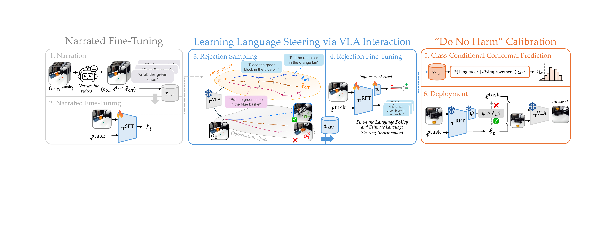
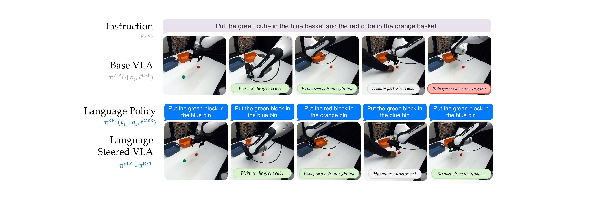
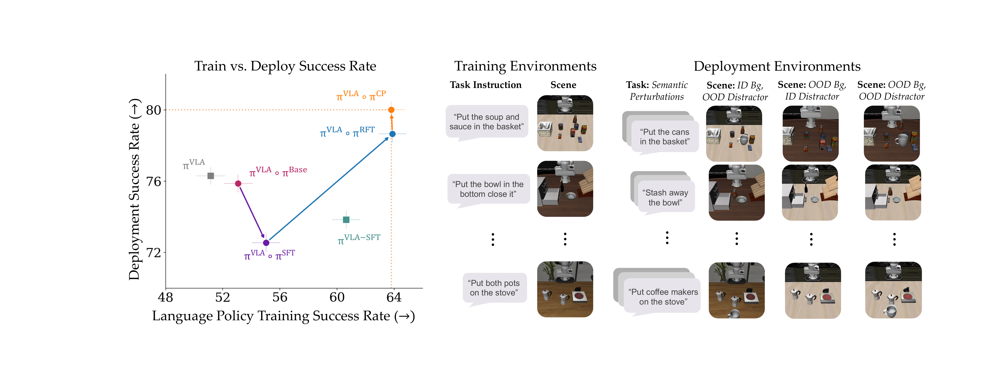
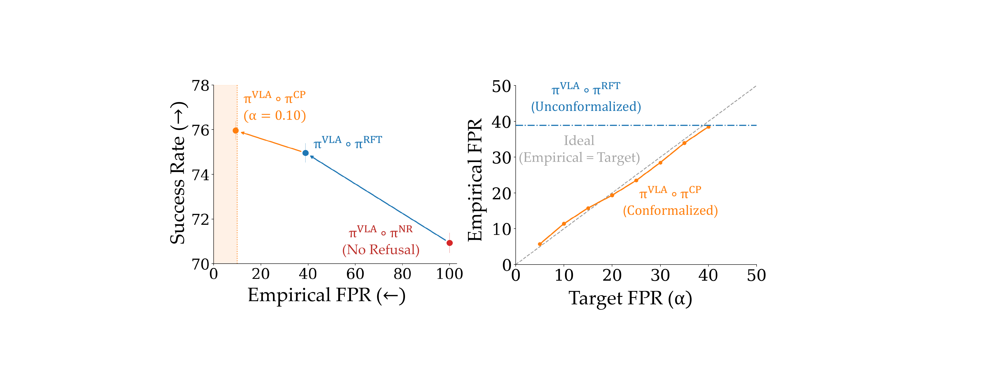

# Learning What to Say to Your VLA: Mostly Harmless Vision Language Action Model Steering

#

# 基本信息

- arXiv: 2606.12299
- Authors: Hyun Joe Jeong, Gokul Swamy, Andrea Bajcsy
- Categories: cs.RO, cs.LG
- 一句话结论：本文提出了一种面向冻结预训练VLA的闭环语言反馈策略（LFP），通过交互式语言搜索与类条件保形预测拒绝机制，在无需访问原始训练数据或微调VLA参数的前提下，以高层语言接口显著提升ID/OOD任务成功率，并提供可证明的有害干预率上限。

#

# 研究问题

论文解决的核心问题是：冻结预训练Vision-Language-Action (VLA)模型的语言-行为映射脆弱且不可预测。具体表现为：(1) 语义相近的指令可能引发截然不同的行为；(2) 某些能力无法通过简单提示激发；(3) 在视觉与语义分布外（OOD）场景中，语言引导可能产生有害干预，反而降低任务成功率。本文旨在仅通过优化输入给VLA的自然语言（完全不修改VLA权重），实现安全、可靠、样本高效的闭环机器人控制。

#

# 任务与挑战

具体任务为长程机器人操作（如LIBERO-OOD中的物体分拣、放置、开关抽屉等）。输入为RGB观测与任务指令，输出为自然语言字符串（作为VLA的输入），VLA再生成低层动作块。训练阶段需利用VLM对机器人视频进行叙述以构建语言先验，通过LLM生成轨迹级语义扰动，并在闭环VLA rollout上评估改进量。评测设定涵盖：训练环境（Visual-Viewpoint）、视觉扰动（Visual-Scene, Visual-Scene-Viewpoint）、语义扰动（同义改写）以及未见行为组合任务。

已有方法的不足：

- 直接微调VLA（如 $\pi^{\mathrm{VLA-SFT}}$）在OOD场景下易退化，且需要动作标签与训练分布访问，样本效率低。
- 开环提示重写（open-loop prompting）无法适应任务执行过程中的场景动态变化（如人类扰动）。
- 零样本语言模型或人类指令难以可靠地引导VLA完成复杂长程任务。

#

# 核心 Insight

本文的核心思想是将VLA控制问题转化为对冻结模型的"输入语言优化"：与其修改VLA内部参数，不如学习一个轻量级的闭环语言反馈策略（LFP），在每一步根据当前观测生成最适合VLA理解的语言指令。为了应对开放词表语言空间的组合爆炸，作者首先利用VLM（Molmo2-8B）将机器人执行视频叙述为结构化语言先验，从而将搜索空间压缩到任务相关的局部语言流形上。

更重要的是，作者发现"预测语言干预是否有益"比"知道精确的最优语言序列"更容易。因此，在蒸馏出LFP后，训练一个改进头（improvement head）来估计语言引导相对于原始指令的收益，并采用类条件保形预测（Class-Conditional Conformal Prediction）对其校准。这确保了系统在部署时仅在统计上确信有益时才执行steering，否则回退到原始任务指令，从而严格将OOD有害干预的误报率（FPR）控制在预设水平 $\alpha$ 以下，实现"Mostly Harmless" steering。



#

# 方法与公式

#

## 1. 语言改进的形式化定义

作者将语言引导形式化为一个MDP：状态为观测与任务指令，动作为自然语言字符串，环境动态由冻结VLA与真实世界组合而成。对于候选语言序列 $\ell_{0:T}$，其相对于原始指令 $\ell^{\mathrm{task}}$ 的语言改进 $\Delta$ 定义为：

```math
\begin{aligned}
\Delta(\ell^{\mathrm{task}},c,\ell_{0:T})
=
&\;
\mathbb{E}_{o_0\sim p(o_0\mid \ell^{\mathrm{task}},c)}
\mathbb{E}_{\xi\sim(\pi^{\mathrm{VLA}}\circ \ell_{0:T})(o_0)}
\left[
r(\xi;\ell^{\mathrm{task}})
\right] \\
&-
\mathbb{E}_{o_0\sim p(o_0\mid \ell^{\mathrm{task}},c)}
\mathbb{E}_{\xi\sim\pi^{\mathrm{VLA}}(o_0,\ell^{\mathrm{task}})}
\left[
r(\xi;\ell^{\mathrm{task}})
\right].
\end{aligned}
\tag{1}
```

其中 $c$ 表示环境上下文，$o_0$ 为初始观测，$\pi^{\mathrm{VLA}}\circ \ell_{0:T}$ 表示以候选语言序列作为条件执行闭环rollout的复合策略，第二项为基线VLA仅使用原始指令的期望回报。目标是寻找使 $\Delta$ 最大化的语言序列。

#

## 2. 叙述微调（Narrated Fine-Tuning）

为压缩搜索空间，首先利用VLM对机器人视频进行任务分解与逐帧叙述，生成数据集 $\mathcal{D}_{\mathrm{nar}}=\{(o,\ell^{\mathrm{task}},\ell)\}$。随后通过标准交叉熵损失对基础VLM（Qwen3-VL-4B-Instruct）进行LoRA监督微调，得到叙述策略 $\pi^{\mathrm{SFT}}$：

```math
\pi^{\mathrm{SFT}}
=
\arg\max_{\pi\in\Pi}
\mathbb{E}_{(o,\ell^{\mathrm{task}},\ell)\sim\mathcal{D}_{\mathrm{nar}}}
\left[
\log \pi(\ell\mid o,\ell^{\mathrm{task}})
\right].
\tag{2}
```

#

## 3. 交互式语言搜索与拒绝微调

$\pi^{\mathrm{SFT}}$ 与冻结VLA交互生成种子序列 $\bar{\ell}_{0:T}$。利用LLM（GPT-5.4）生成 $N=16$ 个轨迹级语义扰动（改写动词、名词及组合结构但保持任务语义），构成局部语言集合 $\mathcal{L}_{\mathrm{local}}$。通过蒙特卡洛闭环rollout估计各候选序列的改进量 $\widehat{\Delta}$，并选择最优序列：

```math
\ell^\star_{0:T}(\ell^{\mathrm{task}},c)
=
\arg\max_{\ell^{(n)}_{0:T}\in\mathcal{L}_{\mathrm{local}}(\bar{\ell}_{0:T})}
\widehat{\Delta}(\ell^{\mathrm{task}},c,\ell^{(n)}_{0:T}).
\tag{3}
```

收集高改进序列构建拒绝微调数据集 $\mathcal{D}_{\mathrm{RFT}}$，通过专家迭代（Expert Iteration）蒸馏为轻量级闭环语言反馈策略 $\pi^{\mathrm{RFT}}$：

```math
\pi^{\mathrm{RFT}}
=
\arg\max_{\pi\in\Pi}
\mathbb{E}_{(o,\ell^{\mathrm{task}},\ell^\star)\sim\mathcal{D}_{\mathrm{RFT}}}
\left[
\log \pi(\ell^\star \mid o,\ell^{\mathrm{task}})
\right].
\tag{4}
```

#

## 4. 改进头训练

同步利用搜索日志 $(o_0,\ell^{\mathrm{task}},\widehat{\Delta})$ 训练MLP改进头 $\psi$（结构为 $d\rightarrow 64\rightarrow 1$，ReLU，dropout=0.1），以均方误差回归预测语言引导收益：

```math
\psi
=
\arg\min_{\psi\in\Psi}
\mathbb{E}_{(o_0,\ell^{\mathrm{task}},c,\widehat{\Delta})\sim\mathcal{D}_{\Delta}}
\left[
\left(
\psi(o_0,\ell^{\mathrm{task}})-\widehat{\Delta}
\right)^2
\right].
\tag{5}
```

#

## 5. 类条件保形预测校准（Do No Harm Calibration）

在held-out视觉与语义扰动上收集 $N_{\mathrm{cal}}=20$ 个校准样本。定义 $Y=\mathbb{I}\{\widehat{\Delta}\geq 0\}$，其中 $Y=0$ 表示该样本上steering有害。令 $s=\psi(X)$ 为改进头分数，取有害子集上分数的 $(1-\alpha)$ 分位数作为阈值 $\hat{q}_\alpha$。这保证了在有害条件下错误允许干预的概率不超过 $\alpha$：

```math
\mathbb{P}\left(
\psi(X) \ge \hat{q}_{\alpha}
\mid Y=0
\right)
\le \alpha.
\tag{6}
```

部署时，若 $\psi(o_t,\ell^{\mathrm{task}})\geq\hat{q}_\alpha$，则用 $\pi^{\mathrm{RFT}}$ 生成的语言动作 $\ell_t$ 替换原始指令输入冻结VLA；否则拒绝干预，回退到原始任务描述。

#

# 贡献拆解

**贡献1：面向冻结VLA的闭环语言反馈策略（LFP）**

- **做了什么**：提出首个无需微调底层VLA、无需原始训练数据的闭环语言steering框架。通过VLM叙述建立结构化语言先验，经LLM局部扰动与闭环rollout评估，蒸馏出每步重规划的语言策略。
- **为什么有效**：将开放词表的语言空间压缩为任务相关的局部流形，使搜索可解；闭环反馈使语言能随场景动态调整，产生开环静态提示无法实现的中途扰动恢复行为。
- **和已有方法差别**：不同于直接微调VLA动作头或潜在空间，本文仅优化VLA的输入语言接口，样本效率更高（10条on-policy轨迹即可匹配50条数据微调VLA的效果）。

**贡献2：基于保形预测的可证明无害性保证**

- **做了什么**：训练轻量改进头预测steering收益，并首次将类条件保形预测引入VLA语言引导，校准拒绝阈值。
- **为什么有效**：利用"预测改进是否可能"比"生成最优语言"更容易的不对称性，以极轻量的校准数据集（每类20条）实现严格的FPR控制。
- **和已有方法差别**：传统安全方法多依赖动作层guardrails或潜在空间编辑，本文从语言层提供统计保证，仿真中有害干预FPR从38.92%降至9.31%，硬件从61.11%降至2.22%。

**贡献3：系统性的OOD泛化与样本效率验证**

- **做了什么**：在LIBERO-OOD（200种视觉-语义组合）与Franka硬件（含未见任务）上全面评估。
- **为什么有效**：语言抽象层的干预对视觉和语义扰动具有天然解耦优势，避免了动作层微调对训练分布的过拟合。
- **和已有方法差别**：相比SAY等同期工作，本文明确量化了语言steering的"可引导性"差异（如Microwave任务难以通过语言改善），并提供了拒绝机制而非盲目干预。

#

# 关键图表解读



**图：闭环语言引导 vs. 基线VLA**

该图直观展示了本文核心优势。在人类将已放置好的绿色方块移回桌面后，基线VLA（$\pi^{\mathrm{VLA}}$）继续执行原始指令，将绿方块错误放入橙色篮子；而Language Steered VLA（$\pi^{\mathrm{VLA}}\circ\pi^{\mathrm{RFT}}$）通过闭环观测更新，生成纠正性语言指令"Put the green block in the blue bin"，引导冻结VLA从扰动中恢复。这证明了闭环语言反馈不仅是"更好的提示"，而是具备动态纠错能力的控制策略。



**图：训练 vs. 部署成功率及环境示例**

左图散点图横轴为语言策略训练成功率，纵轴为部署成功率。关键发现：

- $\pi^{\mathrm{VLA}}\circ\pi^{\mathrm{SFT}}$（紫色点）虽然训练成功率提升，但部署成功率显著下降（约72%），说明单纯叙述微调在OOD下会过拟合。
- $\pi^{\mathrm{VLA}}\circ\pi^{\mathrm{RFT}}$（蓝色点）将部署成功率提升至约78%，证明交互式搜索有效。
- $\pi^{\mathrm{VLA}}\circ\pi^{\mathrm{CP}}$（橙色点）在保持高部署成功率（约80%）的同时，通过保形化拒绝有害干预，进一步缩小了训练-部署差距。

右图展示了训练环境与部署环境的视觉差异（ID背景+OOD干扰物、OOD背景+ID干扰物等），说明评测涵盖了严格的视觉-语义复合扰动。



**图：拒绝与保形化效果**

左图展示了成功率与经验FPR的权衡。无拒绝机制（$\pi^{\mathrm{NR}}$，红色点）成功率最低（约71%）；未校准拒绝（$\pi^{\mathrm{RFT}}$，蓝色点）提升至约75%；保形化后（$\pi^{\mathrm{CP}}$，橙色点）在 $\alpha=0.10$ 时达到约76%成功率，同时将FPR控制在低水平。右图为可靠性图（reliability diagram），显示 $\pi^{\mathrm{VLA}}\circ\pi^{\mathrm{CP}}$ 的经验FPR紧密跟踪目标 $\alpha$（对角线），而未校准的 $\pi^{\mathrm{VLA}}\circ\pi^{\mathrm{RFT}}$（蓝色虚线）FPR恒定于约40%，无法根据风险自适应调整。这直接验证了保形预测校准的有效性。

#

# 实验与消融

**数据集与设定**：仿真使用LIBERO-OOD（10个训练任务+13个未见行为组合任务，共200种视觉-语义评估组合）；硬件使用Franka机械臂，4个训练任务（CubeSort, CubeMug, Microwave, MarkerBlock）+2个未见任务（MarkerBowl, ChipsCup），底层冻结VLA为 $\pi^{0.5}$（Pi0）。

**基线**：基线VLA（$\pi^{\mathrm{VLA}}$）、直接VLA微调（$\pi^{\mathrm{VLA-SFT}}$，使用相同成功rollout但含动作标签）、基础VLM（$\pi^{\mathrm{Base}}$）、叙述SFT策略（$\pi^{\mathrm{SFT}}$）。

**主结果**：

- **仿真**：保形化LFP在已知环境中将基线VLA成功率提升24.7%；在OOD视觉-语义扰动下，$\pi^{\mathrm{VLA}}\circ\pi^{\mathrm{CP}}$ 在所有四种视觉条件中均取得最高成功率。
- **硬件**：CubeSort任务中基线VLA仅56.7%，LFP提升至93.3%；在未见任务MarkerBowl和ChipsCup上，LFP分别从30.0%/33.3%提升至80.0%/73.3%，证明语言steering可迁移。

**消融实验**：

- **样本效率**：LFP仅需10条成功on-policy轨迹即可匹配使用50条数据直接微调VLA的效果，且在所有数据规模下均优于VLA微调。
- **开环 vs. 闭环**：轨迹级闭环搜索（75.0%）显著优于开环静态重写（71.3%）和短语级闭环搜索（70.4%），证明语言需随场景演化且序列级扰动更优。
- **保形化混淆矩阵**：仿真中FPR从38.92%降至9.31%，硬件中从61.11%降至2.22%，准确率分别提升至77.74%和99.17%。

**最强证据**：保形化在硬件上将有害干预FPR从61.11%压至2.22%（$\alpha=0.1$），同时TPR仅下降0.37%，几乎无损地实现了安全性。

**最存疑证据**：Microwave任务在语义扰动下，未校准LFP反而将成功率从66.7%降至46.7%，说明该任务本身语言可引导性极差；虽然保形化通过拒绝干预恢复至70.0%，但这并非真正的"提升"，而是"不伤害"策略的体现。此外，LFP推理延迟达204ms，使系统重规划频率从14.7Hz骤降至3.6Hz，实时性瓶颈显著。

#

# 局限性

1. **语言搜索局限**：当前搜索局限于对叙述先验的局部改写（paraphrasing），未覆盖更大范围的语言抽象（如高层策略规划、错误恢复策略或跨任务迁移）。
2. **实时性瓶颈**：LFP自回归语言生成延迟高达204ms，重规划频率降至3.6Hz，对于需要高频控制的高速操作可能成为瓶颈。
3. **任务可引导性差异**：某些任务（如Microwave）本身语言可引导性极差，此时LFP即使经过搜索也难以提升，共形化只能退化为拒绝干预而非真正改善。论文未深入分析这种差异的根本原因（是VLA语言条件化机制失效，还是任务需要超越语言抽象能力的底层控制精度？）。
4. **机器语言可解释性**：LFP发现的"机器语言"可能不具备人类可解释性，论文未探讨这些非自然表述能否被人类理解或复用。
5. **校准分布假设**：保形预测的有效性依赖于校准集与测试集的交换性（exchangeability），在极端OOD场景下该假设可能不成立。

#

# 个人研究判断

面向"World Models assisting Embodied AI downstream tasks"的研究方向，这篇论文**值得继续追踪**。

理由如下：

- **范式价值**：本文提出的"冻结VLA + 轻量语言层干预"范式，与World Model辅助下游任务的思路高度契合。未来可将LFP与World Model结合：在World Model中进行语言搜索与保形校准的虚拟推演，进一步减少真实环境交互成本。
- **安全接口**：保形预测为VLA提供了可证明的安全语言接口，这是将VLA从实验室推向真实世界的关键一步。对于需要人机协作的具身智能系统，这种"知道何时说不"的能力至关重要。
- **待解问题**：论文揭示的"语言可引导性"差异（steerability gap）是一个深刻的科学问题，直接关联到VLA内部语言-动作对齐机制。后续研究可结合Mechanistic Interpretability分析VLA对语言条件的响应模式，或探索语言steering与潜在空间steering/动作编辑的互补机制。
- **工程优化空间**：LFP的延迟问题可通过异步更新、缓存或蒸馏更小模型缓解；语言搜索可从局部改写扩展到基于World Model的长程规划，这些都是明确的下一步工作。

总体而言，本文在VLA安全部署与样本高效适配方面做出了扎实贡献，其方法论（交互式搜索+统计校准）具有较强的跨任务迁移潜力。
