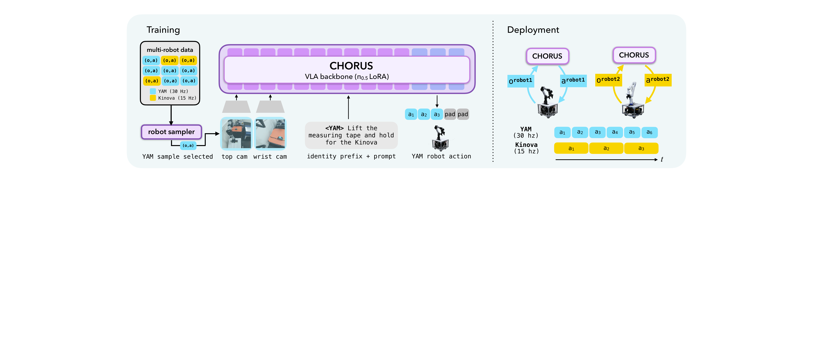
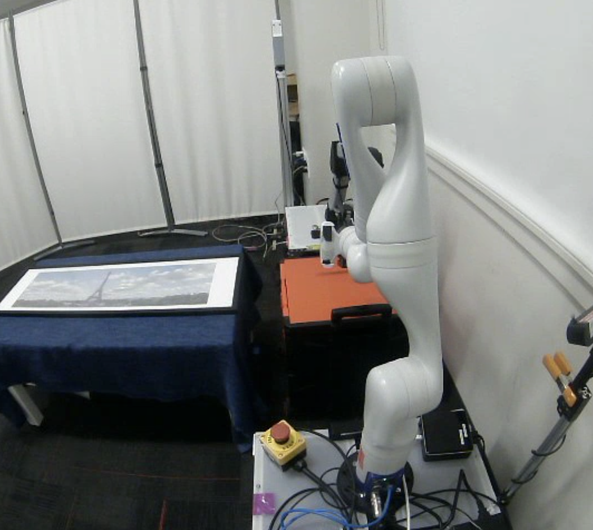
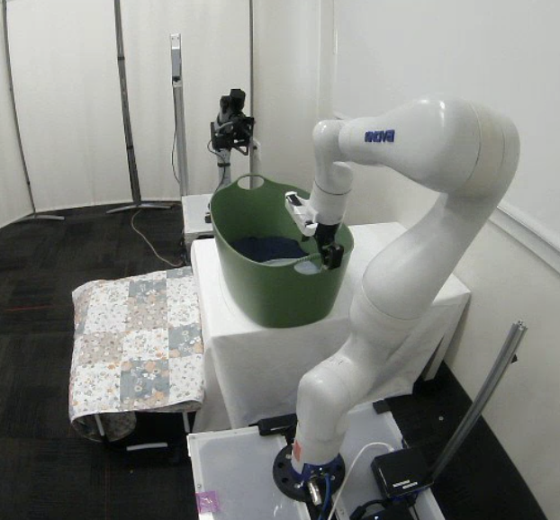

# CHORUS: Decentralized Multi-Embodiment Collaboration with One VLA Policy

#

# 基本信息

- **arXiv:** 2606.12352
- **Authors:** Ria Doshi, Tian Gao, Annie Chen, Chelsea Finn, Jeannette Bohg
- **Categories:** cs.RO, cs.AI
- **一句话结论:** 基于预训练 VLA 骨干网络，通过共享权重与机器人身份提示，在零通信、纯局部观测条件下实现去中心化异构多机器人协作，并在真实世界任务中显著优于从零训练的扩散策略与中心化基线。

#

# 研究问题

本文聚焦于移动多机器人场景中的去中心化协作问题：如何在**不依赖推理时通信、不对齐、不训练每机器人独立策略**的前提下，让异构机器人团队仅基于局部视觉观测实现高效、反应灵敏的协作。现有中心化方法的观测与动作空间随机器人数线性膨胀，且推理时必须聚合全队信息；传统去中心化方法则通常为每个机器人训练独立策略，并依赖显式对齐程序或队友状态共享来缓解局部可观测性。本文的核心科学问题是：预训练视觉-语言-动作（VLA）模型中蕴含的强大视觉运动先验，是否足以让单个机器人在仅见局部观测的情况下“隐式”理解队友行为，从而彻底移除推理时的通信与对齐需求。

#

# 任务与挑战

**具体任务**包括移动卷尺测量（mobile tape measurement）、图书交接（book handover）、洗衣篮抬升（laundry basket lifting）以及三机器人门廊运输（3-robot transport）。在这些任务中，机器人需要协调抓取、搬运与交接物体，且部分任务要求机器人根据队友的动态调整自身行为。

**输入输出与部署设定：** 每个机器人独立运行一份 CHORUS 策略副本。输入仅为该机器人自身的局部观测 $o_r^t$（多视角图像与本体感知）以及一个机器人身份提示 $c_r$；输出为长度 $H$ 的动作块 $A_r^t$。推理时各机器人之间**无任何信息交换**，支持异步执行与异构控制频率。

**已有方法的不足：** 中心化 VLA 基线虽然拥有全局观测，但其输入维度随团队规模增长，且将不同机器人的视角拼接进预训练固定的相机槽位会打破预训练阶段的语义对应关系，导致分布偏移；去中心化扩散策略（Diffusion Policy）缺乏预训练的视觉运动先验，在协作场景中频繁出现视觉混淆与动作不匹配；为每机器人单独微调独立 VLA 策略（w/o Weight Sharing）则无法从交互数据中学习队友行为模型，导致对动态队友的反应性显著下降。

#

# 核心 Insight

本文的核心洞察在于：预训练 VLA 模型在单机器人、跨具身数据上习得的视觉运动先验，可以直接迁移到分布外的多机器人协作场景。通过将多机器人同步演示拆分为单机器人训练元组，并用一个共享 VLA 策略学习所有机器人的局部观测到动作映射，coordination 完全从训练数据中内隐习得，无需任何推理时通信。

更进一步，**共享权重训练**使策略在优化过程中被迫同时拟合所有机器人的观测-动作映射，这相当于在表示空间中内建了一个关于队友行为的隐式模型。因此，当队友行为偏离常规轨迹（如受外力扰动）时，共享策略能够更准确地预测队友的下一步运动并做出反应；而独立训练的策略由于缺乏队友视角的数据约束，往往陷入“早期抓取”等局部最优，无法适应动态变化。



#

# 方法与公式

#

## 1. 多机器人数据收集与去中心化训练结构

CHORUS 的数据来源于人类遥操作（TidyBot++ 接口）。对于每个多机器人 episode，系统同步记录所有机器人的轨迹：

```math
\xi = \left\{ \left(o_r^t,\, a_r^t \right) \right\}_{r \in [N],\, t \in [T]}
\tag{1}
```

其中 $N$ 为机器人数，$T$ 为轨迹长度，$o_r^t$ 与 $a_r^t$ 分别为机器人 $r$ 在时刻 $t$ 的观测与动作。

关键操作在于**数据拆分**：从该联合轨迹中，提取每个机器人独立的训练元组 $(o_r^t, A_r^t, c_r)$，其中 $A_r^t = (a_r^t, \ldots, a_r^{t+H-1})$ 是长度为 $H$ 的动作块，$c_r$ 是机器人身份提示。所有机器人的元组被**池化**到同一个数据集 $\mathcal{D}$ 中。**模型在训练和推理时均从未见过跨机器人的联合观测**，这保证了策略学习的完全是局部观测到局部动作的映射。

数据收集时还人为设计了协作策略：确保在每一时刻，每个机器人至少有一个视角能看到队友或关键工作空间，从而使去中心化执行在物理上可行。

#

## 2. 策略架构与训练目标

**骨干网络：** 基于预训练的 $\pi_{0.5}$ VLA 模型。

**跨具身输入格式：** 继承 $\pi_{0.5}$ 的跨具身设计——动作向量统一填充至 32 维，观测图像编码为可变长度的图像 token。这使得同一网络无需结构修改即可处理不同自由度、不同相机配置的机器人。

**机器人身份提示：** 在每个时间步，将文本提示 $c_r$ 前置到模型输入中。提示包含具身名称（如 `<YAM>`、`<Kinova>`）及其角色描述。这允许策略显式知晓当前控制的是哪台机器人，而无需从视觉中推断。

**机器人采样器（Robot Sampler）：** 由于异构机器人控制频率不同（例如 YAM 30 Hz，Kinova 15 Hz），均匀采样会导致低频机器人数据不足。因此采样器按频率加权：在三机器人设置中，Kinova 的采样权重被提升 2 倍，以平衡训练。

**训练目标：** 使用 $\pi_{0.5}$ 继承的流匹配（flow-matching）损失：

```math
\mathcal{L}(\theta) = \mathbb{E}_{(o_r, A_r, c_r) \sim \mathcal{D},\, \tau \sim U(0,1),\, \epsilon \sim \mathcal{N}(0, I)} \left[ \left\lVert v_\theta(A_r^\tau,\, \tau \mid o_r, c_r) - (\epsilon - A_r) \right\rVert_2^2 \right]
\tag{2}
```

其中 $A_r^\tau = \tau A_r + (1-\tau)\epsilon$ 为加噪动作块，$v_\theta$ 为模型预测的速度场，$\epsilon$ 为标准高斯噪声。注意损失仅在**单机器人元组**上计算，期望遍历池化后的单机器人数据集。

**优化配置：** 对 VLM 部分使用 LoRA rank=16，对 action expert 使用 LoRA rank=32；优化器为 AdamW，余弦学习率调度，峰值学习率 $2.5\times10^{-5}$，共训练 20,000 步。

#

## 3. 去中心化部署与异步执行

推理时，每个机器人运行一份独立的 CHORUS 副本：

```math
A_r^t \sim \pi_\theta(\,\cdot \mid o_r^t,\, c_r)
\tag{3}
```

**无任何信息交换**。每个机器人仅基于自身观测和身份提示采样动作块。

由于各机器人独立运行，CHORUS 天然支持**异步执行**：不同机器人可以处于不同的动作块执行阶段。对于控制频率不同的机器人，通过调整动作块大小来保持规划的时间 horizon 一致（例如 YAM 30 Hz 使用 chunk size 40，Kinova 15 Hz 使用 chunk size 20）。

#

# 贡献拆解

1. **单共享 VLA 策略实现去中心化异构多机协作。** 通过机器人身份提示区分不同具身，CHORUS 使用单一策略网络控制整个团队，避免了每机器人独立策略的高昂训练成本。参数量与上下文窗口不随团队规模变化，具备良好的可扩展性。

2. **共享权重显著提升对队友行为的反应性。** 训练时接触所有机器人视角的数据，使共享骨干网络隐式习得队友行为模型。在队友受脚本化扰动的图书交接实验中，共享权重的 CHORUS 恢复成功率达到 85%（17/20），显著优于非权重共享版本的 45%（9/20）， teammate reactivity 提升约 40 个百分点。

3. **验证了预训练 VLA 在分布外多机器人协作中的直接可用性。** 相比从零训练的去中心化扩散策略，CHORUS 平均成功率提升 64 个百分点；且尽管中心化 VLA 基线拥有全局观测，CHORUS 在平均成功率上仍优于该基线，证明局部观测条件更贴合预训练分布，反而能更好地保留先验知识。

4. **成功扩展至三机器人异构团队。** 在未修改任何架构的情况下，CHORUS 在三机器人门廊运输任务中达到 90% 的成功率，展示了该范式向更大规模团队延展的可行性。

#

# 关键图表解读


**图 1（CHORUS 整体架构）：** 该图清晰划分了训练与部署两个阶段。左侧 Training 部分展示了多机器人数据经过 robot sampler 拆分为单机器人元组，输入 VLA backbone（基于 $\pi_{0.5}$ 加 LoRA）时，除了 top cam 与 wrist cam 的图像 token，还前置了包含机器人身份与任务描述的文本提示（identity prefix + prompt），最终输出统一填充至 32 维的动作向量。右侧 Deployment 部分展示了两个机器人各自独立运行 CHORUS 副本，根据各自频率输出不同长度的动作块（YAM 输出 6 步，Kinova 输出 3 步），实现零通信的异步协作。读图时需特别注意：训练时的“去中心化”体现在数据层面，即模型从未接收过多机联合观测；而部署时的去中心化体现在推理层面，即各机器人完全独立前向传播。


**图 2（队友反应性扰动实验）：** 该图展示了图书交接任务中的扰动测试设置。左侧 YAM 机器人被施加脚本化横向扰动（scripted perturbation），右侧 Kinova 必须根据视觉观测实时调整抓取位置以完成交接。图中粉色虚线标注了 CHORUS 的推理轨迹。该实验直接支撑论文关于 reactivity 提升 40% 的核心结论，是证明“共享权重隐式习得队友模型”的最直观证据。读图时应注意，该扰动是固定脚本而非随机动态交互，这是评估其泛化稳健性时的重要前提。



**图 3（移动卷尺测量任务）：** 该图从顶部视角展示了 Kinova 与 YAM 协作完成移动卷尺测量的真实场景。该任务要求一个机器人持握卷尺一端，另一个机器人拉出卷尺并读取测量结果，涉及精确的视觉-动作协调与物体交接。此图说明 CHORUS 能够处理需要双手/双机配合的精细操作任务，而非仅简单的协同搬运。



**图 4（洗衣篮搬运任务）：** 该图展示了 Kinova 执行洗衣篮抬升任务的实验场景。此任务需要两个机器人分别抓取篮子的两侧手柄并同步抬升，对抓取时机与抬升轨迹的协调性要求较高。该图体现了 CHORUS 在不同协作任务上的泛化能力，证明其不仅限于单一任务，而是具备一定通用性的协作策略。

#

# 实验与消融

**数据集与平台：** 实验在真实世界异构平台上进行，包括 Kinova（11 DoF，15 Hz）、ARX（10 DoF，10 Hz）和 YAM（10 DoF，30 Hz）。每个任务收集 25–45 条人类遥操作演示，评估时进行 10–18 次 rollout，部分场景加入训练未见的干扰物（如额外书籍、衣物）。

**基线方法：**
- **Decentralized Diffusion Policy：** 从零训练的去中心化扩散策略，每机器人独立策略。
- **CHORUS (w/o Weight Sharing)：** 每机器人独立微调的 VLA 策略，用于消融共享权重的作用。
- **VLA Centralized：** 中心化 VLA 基线，输入为全队观测拼接，联合输出所有机器人动作。

**主结果：**
- **Q1（预训练骨干的价值）：** CHORUS 相比去中心化扩散策略在平均成功率上提升 **64 个百分点**。扩散策略的常见失败模式包括：视觉混淆（将干扰物误认为目标）以及动作不匹配（一个机器人在队友未就绪时提前执行）。
- **Q2（共享权重的反应性）：** 在队友扰动实验中，CHORUS 以 **17/20** 对比 CHORUS w/o WS 的 **9/20** 胜出，共享权重使 teammate reactivity 提升约 **40 个百分点**。非共享策略的主要失败模式是“早期抓取”，即 Kinova 直接在训练分布内的最可能位置抓取，而不跟踪 YAM 的实际位置。
- **Q3（与中心化基线对比）：** 尽管中心化基线拥有严格更多的信息，CHORUS 在平均成功率上仍优于该基线。作者归因于中心化输入打破了预训练 $\pi_{0.5}$ 的相机视角语义对应关系，且输入维度增加引入了分布偏移与因果混淆。
- **Q4（三机器人扩展）：** 在三机器人门廊运输任务中，CHORUS 在未修改架构的情况下达到 **90%** 成功率（10 次 rollout）。

**最强证据：** 与去中心化扩散策略的 64 个百分点差距，直接证明预训练 VLA 先验在协作这一分布外场景中仍具有压倒性的视觉理解与动作协调优势。

**最存疑证据：** 队友反应性扰动实验仅 **20 次 trial**（左右各 10 次），且扰动轨迹为脚本化固定模式，缺乏在更复杂、非脚本动态交互中的统计验证；三机器人任务的 90% 成功率仅基于 **10 次 rollout**，泛化稳健性的证据仍较薄弱。

#

# 局限性

1. **无法处理严格同步任务：** 作者明确承认，对于需要精确同时执行的动作（如两个夹爪必须在同一控制步打开），纯去中心化局部观测方法存在根本局限，此类任务仍需集中式控制。
2. **反应性实验的统计稳健性不足：** 队友扰动实验样本量仅 20 次，且为脚本化固定轨迹扰动；三机器人任务的成功率也仅基于 10 次 rollout，证据强度有限。
3. **中心化基线劣势的来源未完全消融：** 中心化 VLA 表现不如 CHORUS，作者归因于输入维度增加和与预训练的分布偏移，但论文未设计实验分离这两个因素的各自贡献。
4. **数据收集的人为约束：** 去中心化可行性依赖于数据收集时确保队友在视野内，这限制了可学习任务的类别；对于遮挡严重或需要背对队友的任务，该方法是否有效未经验证。
5. **多机器人协作数据稀缺：** 现有大规模操作数据集以单机器人为主，限制了进一步扩展的潜力。

#

# 个人研究判断

面向“World Models assisting Embodied AI downstream tasks”的研究方向，**本文值得继续追踪**。理由如下：

CHORUS 首次系统验证了预训练 VLA 模型在分布外多机器人协作任务上的有效迁移，证明了单一共享骨干网络在去中心化异构多机器人系统中的可行性与优势。它提供了一条将单机器人基础模型扩展至多智能体协作的直接路径：无需复杂通信协议或在线对齐，仅通过“共享权重 + 机器人身份提示 + 单机器人元组训练”即可实现可扩展的零通信协作。这一范式对构建可扩展、免通信的具身智能协作系统具有重要启发意义。

后续研究可沿以下方向深入：在**大规模多机器人协作数据上直接预训练 VLA**，而非仅在单机器人数据上预训练后微调；在 CHORUS 框架上引入**极轻量的异步通信机制**（如稀疏事件触发通信），以在保持去中心化优势的同时处理严格同步需求；以及系统性研究**机器人身份提示的设计空间**（如提示内容、长度、角色描述的粒度）对跨具身迁移的影响。此外，如何将该框架与显式 World Model 结合，以提升对队友长期行为的预测精度与对遮挡场景的鲁棒性，也是一个值得探索的交叉方向。
